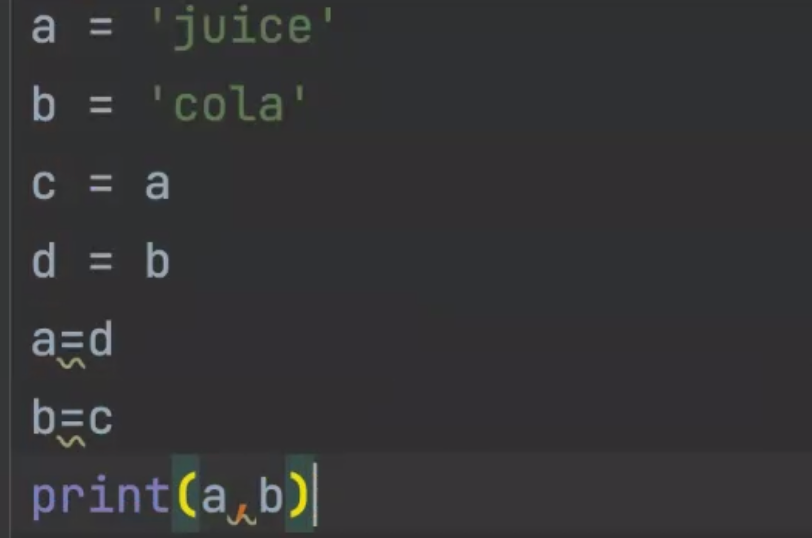
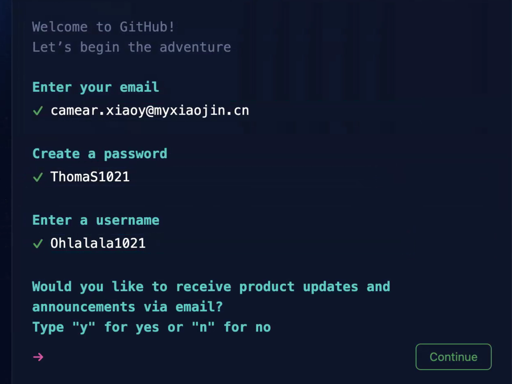

## 0. 讲解作业

1. 考点：变量

### 输出特定格式

```python
a = 1
b = 2
c = 3
```

问题1答案：

```python
print(a, b, c)
```

问题2答案：

```python
print(a)
print(b)
print(c)
```

### 交换果汁

两个杯子实现：



那能否一个杯子实现呢？

```python
a = "果汁"
b = "可乐"
empty_cup = a
a = b
b = empty_cup
print("a:", a)
print("b:", b)
```


## 1. 安装向日葵

下载地址：[https://sunlogin.oray.com/download?categ=personal](https://sunlogin.oray.com/download?categ=personal)


## 2. 安装谷歌浏览器 Chrom

下载地址：[https://www.google.com/intl/zh-CN/chrome/](https://www.google.com/intl/zh-CN/chrome/)

搜索引擎设置为：百度


## 3. 更好用的命令行工具

[https://iterm2.com/](https://iterm2.com/)


## 4. 安装 brew

官方网站：[https://brew.sh/](https://brew.sh/)

官方源安装命令：

```cmd
/bin/bash -c "$(curl -fsSL https://raw.githubusercontent.com/Homebrew/install/HEAD/install.sh)"
```

国内安装命令：[https://bornforthis.cn/blog/2022/02.html](https://bornforthis.cn/blog/2022/02.html)


## 5. 安装 git

```cmd
brew install git
```


## 6. 访问 Github


## 7. 注册 GitHub



## 课后反馈

1. 字符串编写时，双引号没有习惯性的打出来；
2. 思维敏捷、主动思考


欢迎关注我公众号：AI悦创，有更多更好玩的等你发现！

::: details 公众号：AI悦创【二维码】


:::

::: info AI悦创·编程一对一

AI悦创·推出辅导班啦，包括「Python 语言辅导班、C++ 辅导班、java 辅导班、算法/数据结构辅导班、少儿编程、pygame 游戏开发」，全部都是一对一教学：一对一辅导 + 一对一答疑 + 布置作业 + 项目实践等。当然，还有线下线上摄影课程、Photoshop、Premiere 一对一教学、QQ、微信在线，随时响应！微信：Jiabcdefh

C++ 信息奥赛题解，长期更新！长期招收一对一中小学信息奥赛集训，莆田、厦门地区有机会线下上门，其他地区线上。微信：Jiabcdefh

方法一：[QQ](http://wpa.qq.com/msgrd?v=3&uin=1432803776&site=qq&menu=yes)

方法二：微信：Jiabcdefh

:::


