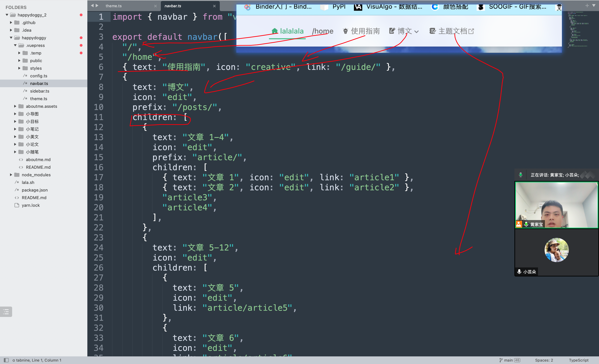
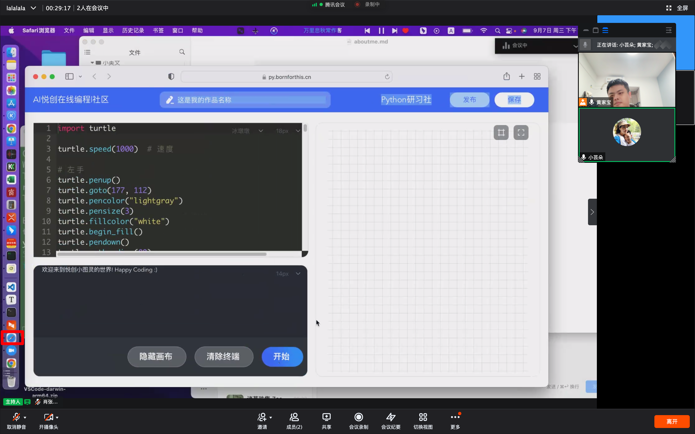

## 1. 文章加密解决

解决方法有两种：

**themes.ts**

1. 文件名称、文件夹全部用英文才可以出现锁；
2. `[encodeURI("/column/TensorFlow/零基础实战机器学习/")]: "123123a",`

```typescript
[encodeURI("链接")]: "123123a",
```

```typescript
[encodeURI("/小随笔/")]: "111021",
```

## 2. 修改菜单栏

- 体验在线 Python：[https://py.bornforthis.cn/#/](https://py.bornforthis.cn/#/)
- 体验猜数字：[https://bornforthis.cn/tool/works/game/GuessNumber.html](https://bornforthis.cn/tool/works/game/GuessNumber.html)

你想怎么存放呢？

| 主页 | 文章 | 日记 | 复习 | 规划 |
| ---- | ---- | ---- | ---- | ---- |
|      |      |      |      |      |

- text：标题
- icon：图标
- link：链接
- children：子菜单
- 逗号隔开

语法：

```typescript
{text: "使命必达", link: "/小目标/5thgradeterm1"},
```

link 指向文件名称。

### 2.1 修改的文件

`.vuepress/navbar.ts`




## 作业

1. 复习加密出现明文显示，解决的方法，并把自己的网站；
1. 把自己的顶栏全部设置好；
1. 复习查看部署进度；


## 课后反馈

1. 要记得保持哦；



2. 要静下心思考和观察，这节课分享不认真观察和从已有的事务中寻找规律。

欢迎关注我公众号：AI悦创，有更多更好玩的等你发现！

::: details 公众号：AI悦创【二维码】


:::

::: info AI悦创·编程一对一

AI悦创·推出辅导班啦，包括「Python 语言辅导班、C++ 辅导班、java 辅导班、算法/数据结构辅导班、少儿编程、pygame 游戏开发」，全部都是一对一教学：一对一辅导 + 一对一答疑 + 布置作业 + 项目实践等。当然，还有线下线上摄影课程、Photoshop、Premiere 一对一教学、QQ、微信在线，随时响应！微信：Jiabcdefh

C++ 信息奥赛题解，长期更新！长期招收一对一中小学信息奥赛集训，莆田、厦门地区有机会线下上门，其他地区线上。微信：Jiabcdefh

方法一：[QQ](http://wpa.qq.com/msgrd?v=3&uin=1432803776&site=qq&menu=yes)

方法二：微信：Jiabcdefh

:::


