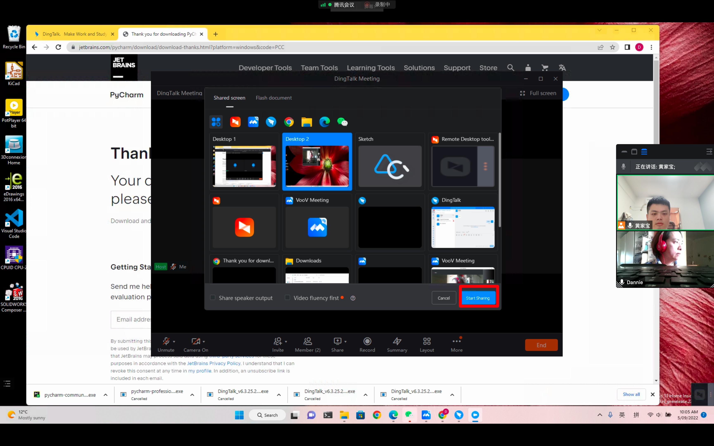
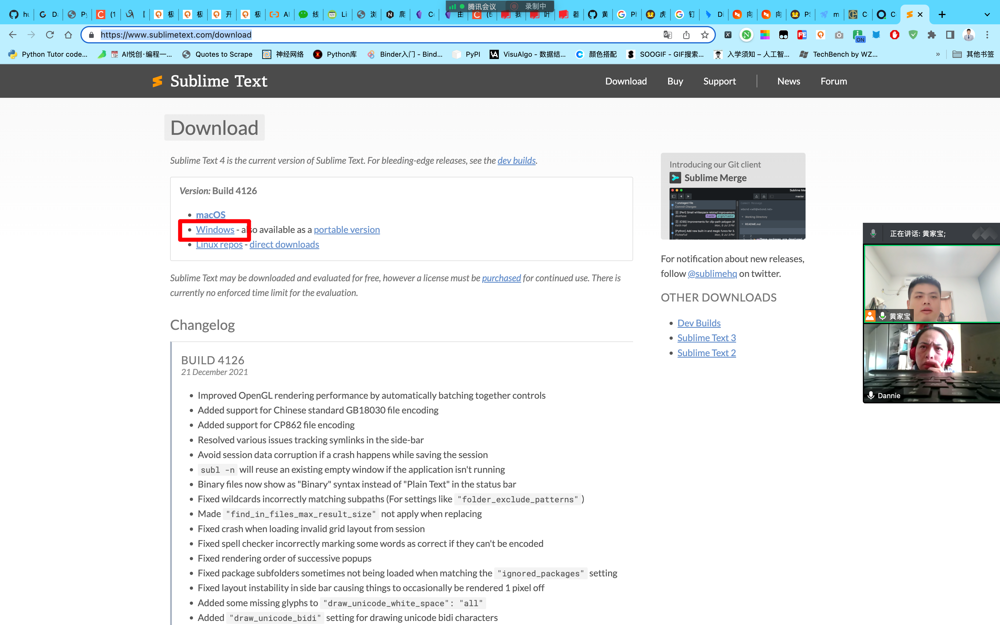

## 1. Python 环境检验

成功！！！

## 2. 钉钉直播教学

---

## 3. 安装程序「all」

- [x] Pycharm
- [x] 钉钉
- [x] Python
- [x] Snipast：[https://www.snipaste.com/](https://www.snipaste.com/)

- [x] ConEmu：[https://www.fosshub.com/ConEmu.html](https://www.fosshub.com/ConEmu.html)

- [ ] SublimeText：[https://www.sublimetext.com/download](https://www.sublimetext.com/download)

## 4. YouTube 录课+B站

欢迎关注我公众号：AI悦创，有更多更好玩的等你发现！

::: details 公众号：AI悦创【二维码】

:::

::: info AI悦创·编程一对一

AI悦创·推出辅导班啦，包括「Python 语言辅导班、C++ 辅导班、java 辅导班、算法/数据结构辅导班、少儿编程、pygame 游戏开发」，全部都是一对一教学：一对一辅导 + 一对一答疑 + 布置作业 + 项目实践等。当然，还有线下线上摄影课程、Photoshop、Premiere 一对一教学、QQ、微信在线，随时响应！微信：Jiabcdefh

C++ 信息奥赛题解，长期更新！长期招收一对一中小学信息奥赛集训，莆田、厦门地区有机会线下上门，其他地区线上。微信：Jiabcdefh

方法一：[QQ](http://wpa.qq.com/msgrd?v=3&uin=1432803776&site=qq&menu=yes)

方法二：微信：Jiabcdefh

:::

