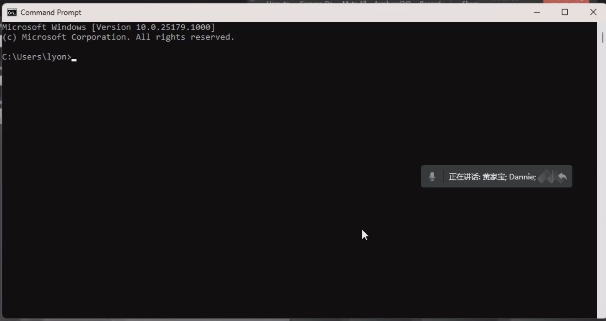
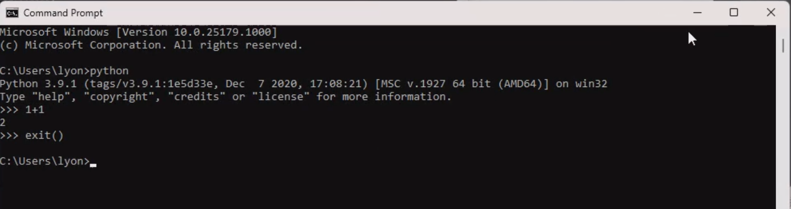

## 1. 软件介绍

1. Pycharm：用来编写 Python 代码
2. 钉钉：用来你上课直播给 AI悦创「你在哪个屏幕编写代码，你就共享哪个屏幕」；
3. 腾讯会议：用来听我上课，看我屏幕。「一般来说放在另一屏幕来观看」
4. ConEmu：命令行，用来替代微软自带的 cmd，更好用、功能更强大。
    1. 微软图标 + R
    2. 输入：cmd

我们把它称为命令行：

可以输入：`python` try，输入：1 + 1，exit() 退出。

5. Snipaste：更强大的截图软件，退出 esc。Alt + 1：截图、`Alt + ·`：贴图。

欢迎关注我公众号：AI悦创，有更多更好玩的等你发现！

::: details 公众号：AI悦创【二维码】

:::

::: info AI悦创·编程一对一

AI悦创·推出辅导班啦，包括「Python 语言辅导班、C++ 辅导班、java 辅导班、算法/数据结构辅导班、少儿编程、pygame 游戏开发」，全部都是一对一教学：一对一辅导 + 一对一答疑 + 布置作业 + 项目实践等。当然，还有线下线上摄影课程、Photoshop、Premiere 一对一教学、QQ、微信在线，随时响应！微信：Jiabcdefh

C++ 信息奥赛题解，长期更新！长期招收一对一中小学信息奥赛集训，莆田、厦门地区有机会线下上门，其他地区线上。微信：Jiabcdefh

方法一：[QQ](http://wpa.qq.com/msgrd?v=3&uin=1432803776&site=qq&menu=yes)

方法二：微信：Jiabcdefh

:::

