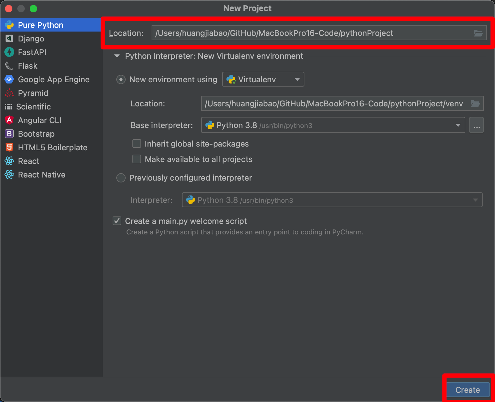
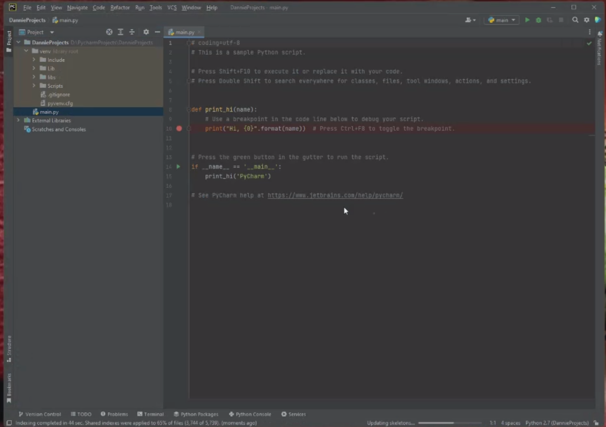
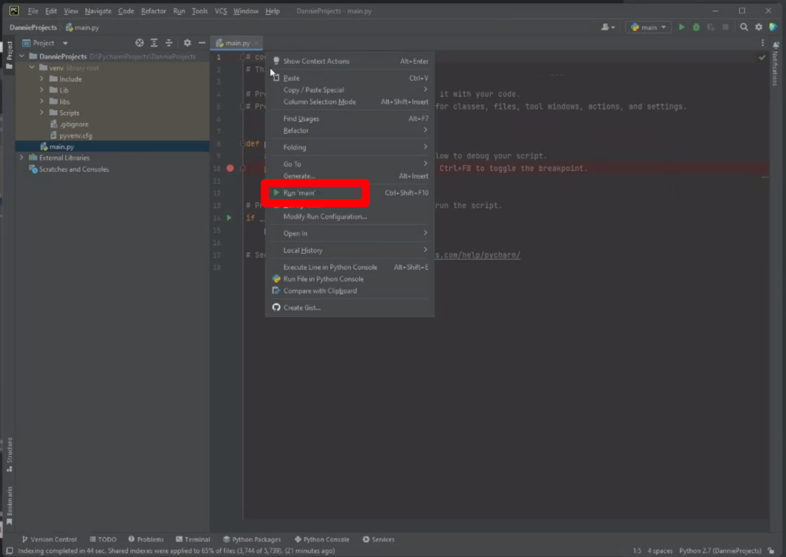
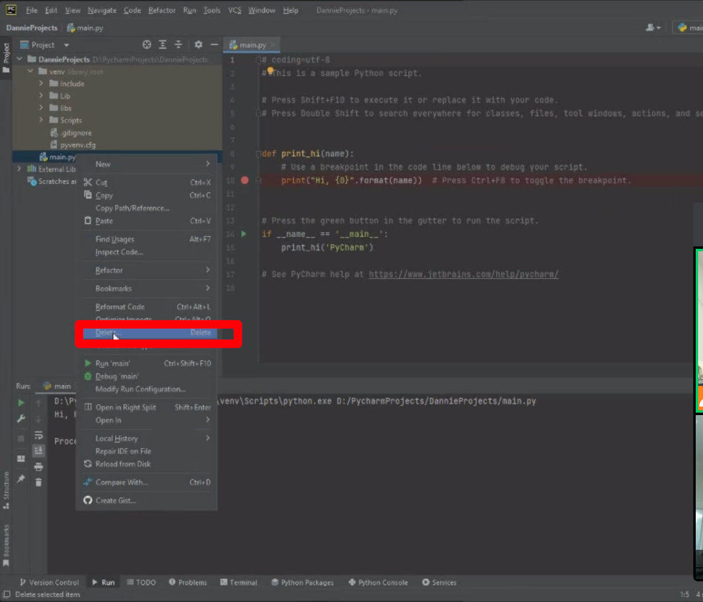
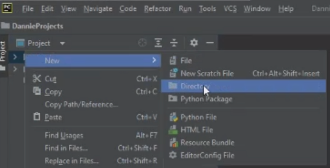
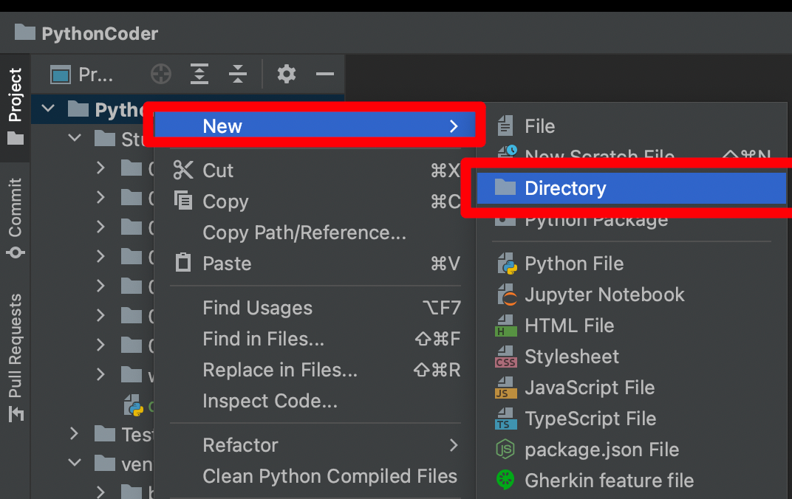
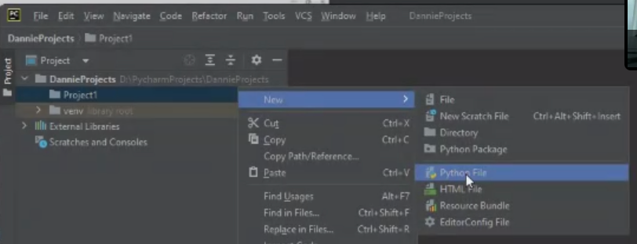
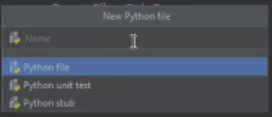
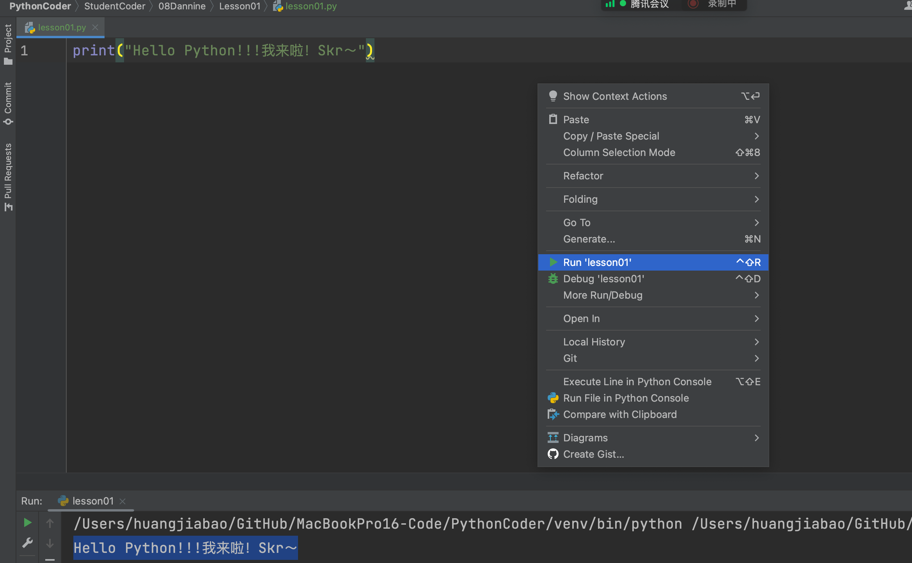

## 1. 新建 Pycharm 项目

1. 设置路径和文件夹名称「不要中文、空格」
2. 其他不用改变，直接 create



## 2. Pycharm 为何自动生成 main.py？



为了方便我们「开发者」快速测试 Pycharm 环境，能否正常调用 Python。「测试 Python 环境，是否正常」

## 3. run main.py

在代码编辑器中任意位置，鼠标右键，运行代码。



## 4. 删除 main.py and create new Python file

### 4.1 删除 main.py

1. 删除：鼠标放在 `main.py` 代码文件上面，右键 deleat。



> 注意⚠️：Pycharm 中有 venv 文件夹，注意！！！注意！！！注意！！！不要去动它，收起来即可，以后带你了解——Python 虚拟环境

### 4.2 为什么需要虚拟环境呢？

- 我们每台电脑不可能就只有一个 Project，会有很多 Python 的 Project。
- 每个 Project 的项目依赖不同，有可能多个项目会有依赖的版本不同。
- 例如：
    - A 项目：requests、pandas、numpy==1.23.2、tkinter
    - B 项目：requests、numpy==1.01.1、pyecharts
- 防止项目依赖冲突。
- 库都会下载在对应的虚拟环境里面。A_venv、B_venv
- 举个例子：你电脑安装了一个 Chrome 浏览器，你还能再同时安装另一个版本的 Chrome 吗？

### 4.3 新建 Python 文件

你把代码放在哪个文件夹，就在哪个文件夹上右键





在新建的文件夹上：右键>>>New Python file





输入测试代码：

```python
print("Hello Python!!!我来啦！Skr～")
```




## 5. 变量

### 5.1 理解变量

从生活中去理解变量：

- 变：变化
- 量：有大小

> **变量就在计算机的内存中，开辟空间！**

变量 Value 会被覆盖。

### 5.2 如何创建变量——赋值语句

代码运行顺序：从上到下，从右到左。

PS：最后一步才是赋值

代码实操：

```python
print("Hello Python!!!我来啦！Skr～")

# x = 1
# x = x + 10
# print(x)

# name1 = "lilei"
# name2 = name1
# print(name2)


name1 = "lilei"
name1 = "hanmeimei"
print(name1)
```

- 代码格式化快捷键：Control + Alt + L

- `#` 是注释，快捷键：control + /

## 作业

1. 注册 GitHub 账号，注册地址：[https://github.com/](https://github.com/)，把账号密码发给我来操作；
2. 实操如下变量与值的创建并输出：
    1. name、Austin
    2. age、19
    3. Dream、Teacher
3. 购买域名：[https://domains.google.com/](https://domains.google.com/)
4. 文档编写软件：[https://typora.io/](https://typora.io/)
5. Nodejs、npm、yarn、git

欢迎关注我公众号：AI悦创，有更多更好玩的等你发现！

::: info AI悦创·编程一对一

AI悦创·推出辅导班啦，包括「Python 语言辅导班、C++ 辅导班、java 辅导班、算法/数据结构辅导班、少儿编程、pygame 游戏开发」，全部都是一对一教学：一对一辅导 + 一对一答疑 + 布置作业 + 项目实践等。当然，还有线下线上摄影课程、Photoshop、Premiere 一对一教学、QQ、微信在线，随时响应！微信：Jiabcdefh

C++ 信息奥赛题解，长期更新！长期招收一对一中小学信息奥赛集训，莆田、厦门地区有机会线下上门，其他地区线上。微信：Jiabcdefh

方法一：[QQ](http://wpa.qq.com/msgrd?v=3&uin=1432803776&site=qq&menu=yes)

方法二：微信：Jiabcdefh

:::
