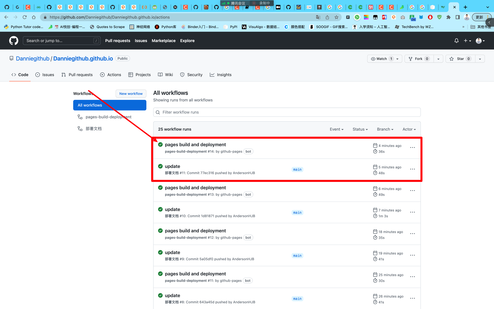
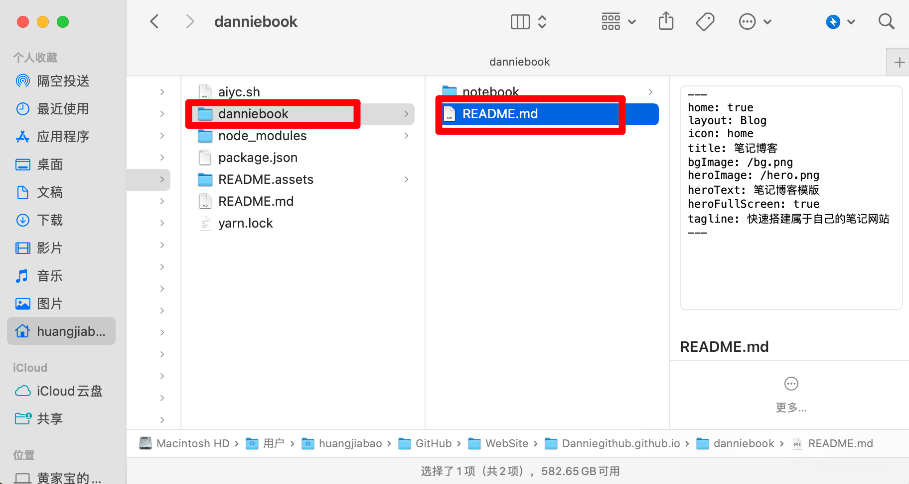

## 1. 查看网页部署是否成功




查看最新的，只要是绿色，那就是部署成功。如果没有显示那就是缓存，过段时间就会 update。

## 2. 设置 git 密钥 SSH

## 3. 写文章与部署





先三个减号回车即可。


文章编写头部内容：

```python
title: 03-文章编写「Dannie」
icon: network
time: 2022-09-12 07:34:03
author: AI悦创
isOriginal: true
category: 
    - Python 1v1
tag:
    - Python 1v1
sticky: false
star: false
password: false
article: true
timeline: true
image: false
navbar: true
sidebarIcon: true
headerDepth: 5
comment: true
lastUpdated: true
editLink: true
backToTop: true
toc: true
```

## 文章日期生成

- [https://bornforthis.cn/python/index.html#/](https://bornforthis.cn/python/index.html#/)

欢迎关注我公众号：AI悦创，有更多更好玩的等你发现！

::: info AI悦创·编程一对一

AI悦创·推出辅导班啦，包括「Python 语言辅导班、C++ 辅导班、java 辅导班、算法/数据结构辅导班、少儿编程、pygame 游戏开发」，全部都是一对一教学：一对一辅导 + 一对一答疑 + 布置作业 + 项目实践等。当然，还有线下线上摄影课程、Photoshop、Premiere 一对一教学、QQ、微信在线，随时响应！微信：Jiabcdefh

C++ 信息奥赛题解，长期更新！长期招收一对一中小学信息奥赛集训，莆田、厦门地区有机会线下上门，其他地区线上。微信：Jiabcdefh

方法一：[QQ](http://wpa.qq.com/msgrd?v=3&uin=1432803776&site=qq&menu=yes)

方法二：微信：Jiabcdefh

:::
