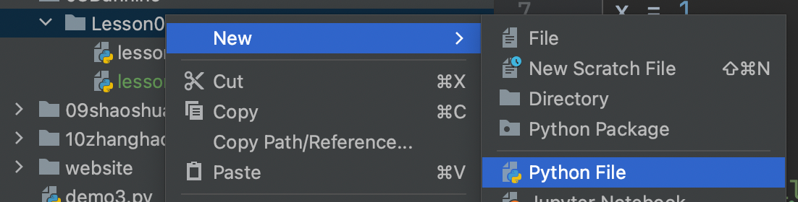

## 1. Pycharm 文件创建



## 2. 变量代码

```python
print("Hello Python!!!我来啦！Skr～")

# x = 1
# x = x + 10
# print(x)

# name1 = "lilei"
# name2 = name1
# print(name2)


name1 = "lilei"
print(name1)
name1 = "hanmeimei"
print(name1)  # 覆盖
```

## 3. 注释使用 `#`

注释的意思就是，你看得见，但是计算机看不见。

## 4. 进阶变量赋值的方法

### 4.1 多个变量赋值相同的值

#### 4.1.1 正常情况下，的多个变量赋值相同值

```python
a = 1
b = 1
c = 1
print(a)
print(b)
print(c)
```

输出：

```python
1
1
1
```


#### 4.1.2 一个 print 可以同时输出三个变量？

```python
a = 1
b = 1
c = 1
print(a, b, c)
# print(a)
# print(b)
# print(c)
```

输出：

```python
1 1 1
```

**语法：**

```python
print(a1, a2, a3,........, an)
```

**特点：**

> 多个变量同时输出，print 会默认以空格间隔。

**试一试其它代码吧～**

```python
a = "lilei"
b = "hanmeimei"
c = "Jaden"
print(a, b, c)
```

输出：

```python
lilei hanmeimei Jaden
```

#### 4.1.3 Question

1. 我能不能偷个懒？多个变量同时赋值一行解决？

```python
a = b = c = 1
print(a, b, c)
# 输出：1 1 1
```

2. 使用一个 print 同时输出多个变量，默认空格，我能否改变其他间隔模式？

```python
a = b = c = 1
print(a, b, c, sep="*****")  # 是字符串哦，几个加上引号
```

输出：

```python
1*****1*****1
```


欢迎关注我公众号：AI悦创，有更多更好玩的等你发现！

::: info AI悦创·编程一对一

AI悦创·推出辅导班啦，包括「Python 语言辅导班、C++ 辅导班、java 辅导班、算法/数据结构辅导班、少儿编程、pygame 游戏开发」，全部都是一对一教学：一对一辅导 + 一对一答疑 + 布置作业 + 项目实践等。当然，还有线下线上摄影课程、Photoshop、Premiere 一对一教学、QQ、微信在线，随时响应！微信：Jiabcdefh

C++ 信息奥赛题解，长期更新！长期招收一对一中小学信息奥赛集训，莆田、厦门地区有机会线下上门，其他地区线上。微信：Jiabcdefh

方法一：[QQ](http://wpa.qq.com/msgrd?v=3&uin=1432803776&site=qq&menu=yes)

方法二：微信：Jiabcdefh

:::
