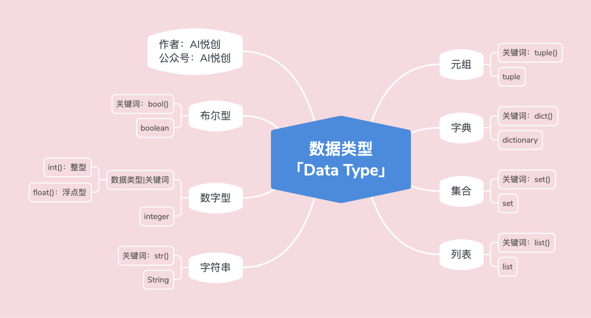

## 1. Python 有哪些数据类型



## 2. type() 检测数据类型

### 2.1 int

```python
a = 1
print(type(a))

t = type(a)
print(t)
```

输出：

```python
<class 'int'>
<class 'int'>
```


### 2.2 float

```python
a = 2.1
print(type(a))

t = type(a)
print(t)
```

输出：

```python
<class 'float'>
<class 'float'>
```


## 3. 各个数据类型的特点

### 3.1 字符串「str」

```python
s = "aiyuechuang"
print(s)
print(type(s))

s_t = type(s)
print(s_t)
```

输出：

```python
aiyuechuang
<class 'str'>
<class 'str'>
```

**字符串特点**

1. **有序性** ：从左到右是 0 开始，从右到左是 -1 开始
2. **不可变性** ：字符串在被创建出来之后，在 **运行当中，字符串是不可以被改变的。** 非要改变，只能是覆盖「也就是重新赋值」
3. **任意数据类型** ：字符串中可以存放任意的数据类型，int、float、tuple……「你键盘能打入的所有字符，都可以存进去」

### 3.2 列表「list」

```python
lst = ["name", 12, 11.1, "adede", (2, 3, 4), {2, 3, 4}, {"name": "AIYC", "age": 12}, True, False]

lst_t = type(lst)
print(lst_t)
```

输出：

```python
<class 'list'>
```


**列表的特点：**

1. **有序性** ：从左到右是 0 开始，从右到左是 -1 开始


2. **任意数据类型** ：你放进去是什么类型，它还是原本的类型。
3. **可变性** ：列表的内容是可以被修改的「update、修改、查询、、、」

### 3.3 元组「tuple」

```python
tup = (1, 2, "aiyc", [1, 2, 3, 4])

print(type(tup))
```

输出：

```python
<class 'tuple'>
```

**元组的特点：**

1. **有序性** ：从左到右是 0 开始，从右到左是 -1 开始
2. **任意数据类型**
3. **不可变性**


欢迎关注我公众号：AI悦创，有更多更好玩的等你发现！

::: info AI悦创·编程一对一

AI悦创·推出辅导班啦，包括「Python 语言辅导班、C++ 辅导班、java 辅导班、算法/数据结构辅导班、少儿编程、pygame 游戏开发」，全部都是一对一教学：一对一辅导 + 一对一答疑 + 布置作业 + 项目实践等。当然，还有线下线上摄影课程、Photoshop、Premiere 一对一教学、QQ、微信在线，随时响应！微信：Jiabcdefh

C++ 信息奥赛题解，长期更新！长期招收一对一中小学信息奥赛集训，莆田、厦门地区有机会线下上门，其他地区线上。微信：Jiabcdefh

方法一：[QQ](http://wpa.qq.com/msgrd?v=3&uin=1432803776&site=qq&menu=yes)

方法二：微信：Jiabcdefh

:::
