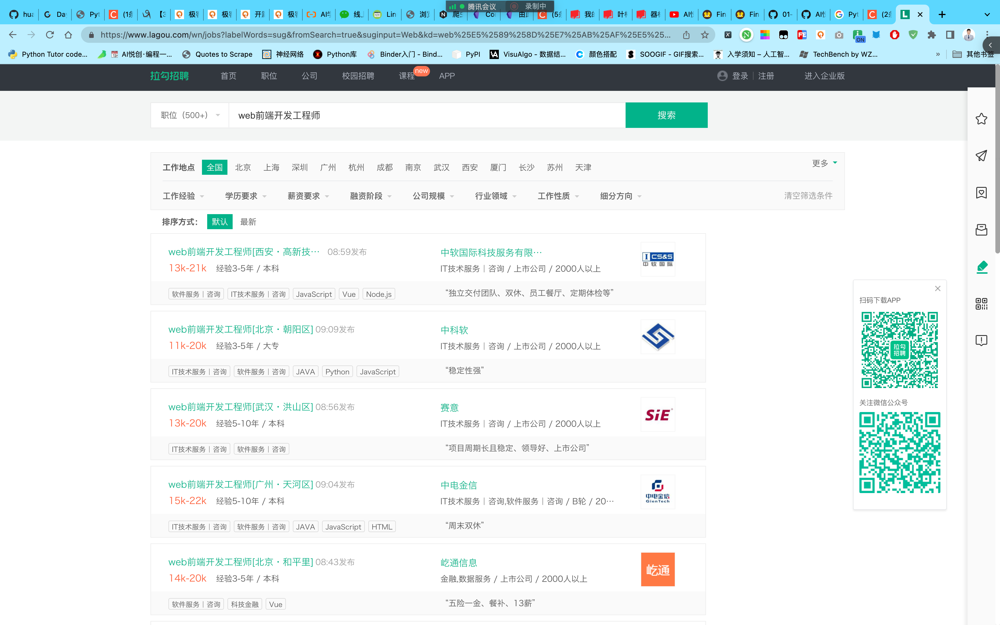
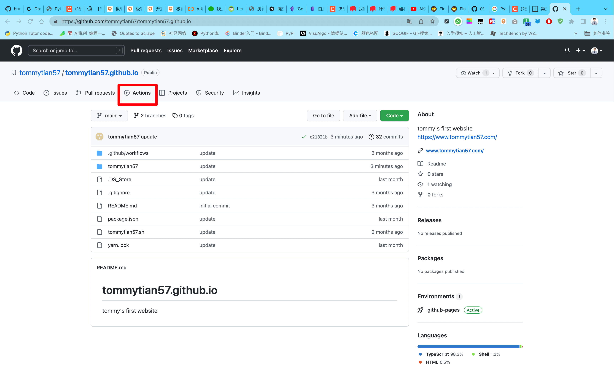

## 1. Web 前端就业前景

- [https://www.lagou.com/wn/jobs?labelWords=sug&fromSearch=true&suginput=Web&kd=web%25E5%2589%258D%25E7%25AB%25AF%25E5%25BC%2580%25E5%258F%2591%25E5%25B7%25A5%25E7%25A8%258B%25E5%25B8%2588](https://www.lagou.com/wn/jobs?labelWords=sug&fromSearch=true&suginput=Web&kd=web%25E5%2589%258D%25E7%25AB%25AF%25E5%25BC%2580%25E5%258F%2591%25E5%25B7%25A5%25E7%25A8%258B%25E5%25B8%2588)



## 2. 文章编写

- 日期生成：[https://bornforthis.cn/python/index.html#/](https://bornforthis.cn/python/index.html#/)
- 文章头部：

```markdown
title: 01-为什么要学习 web 知识
icon: network
time: 2022-09-05 09:19:42
author: AI悦创
isOriginal: true
category: 
    - Python 1v1
tag:
    - Python 1v1
sticky: false
star: false
password: false
article: true
timeline: true
image: false
navbar: true
sidebarIcon: true
headerDepth: 5
comment: true
lastUpdated: true
editLink: true
backToTop: true
toc: true
```

## 3. 网站命令行操作

1. 运行

```yarn
yarn run docs:dev
```

2. 退出运行

control + c

3. 部署网站

```sh
sh tommytian57.sh
```

**以后每节课，部署完成之后，发送笔记链接给我。**

## 4. 检查部署是否成果 or 失败

1. 访问：[https://github.com/tommytian57/tommytian57.github.io](https://github.com/tommytian57/tommytian57.github.io)

PS：Markdown 链接编写方式：

```markdown
[https://github.com/tommytian57/tommytian57.github.io](https://github.com/tommytian57/tommytian57.github.io)
```

- 语法：	`[链接名称](链接)`

2. 点击：Actions：[https://github.com/tommytian57/tommytian57.github.io/actions](https://github.com/tommytian57/tommytian57.github.io/actions)
3. https://github.com/tommytian57/tommytian57.github.io/actions



```cmd

```

- **./**

- **TommyTian 笔记**：[https://www.tommytian57.com/Web_Notebook/web_01.html](https://www.tommytian57.com/Web_Notebook/web_01.html)

欢迎关注我公众号：AI悦创，有更多更好玩的等你发现！

::: details 公众号：AI悦创【二维码】


:::

::: info AI悦创·编程一对一

AI悦创·推出辅导班啦，包括「Python 语言辅导班、C++ 辅导班、java 辅导班、算法/数据结构辅导班、少儿编程、pygame 游戏开发」，全部都是一对一教学：一对一辅导 + 一对一答疑 + 布置作业 + 项目实践等。当然，还有线下线上摄影课程、Photoshop、Premiere 一对一教学、QQ、微信在线，随时响应！微信：Jiabcdefh

C++ 信息奥赛题解，长期更新！长期招收一对一中小学信息奥赛集训，莆田、厦门地区有机会线下上门，其他地区线上。微信：Jiabcdefh

方法一：[QQ](http://wpa.qq.com/msgrd?v=3&uin=1432803776&site=qq&menu=yes)

方法二：微信：Jiabcdefh

:::


