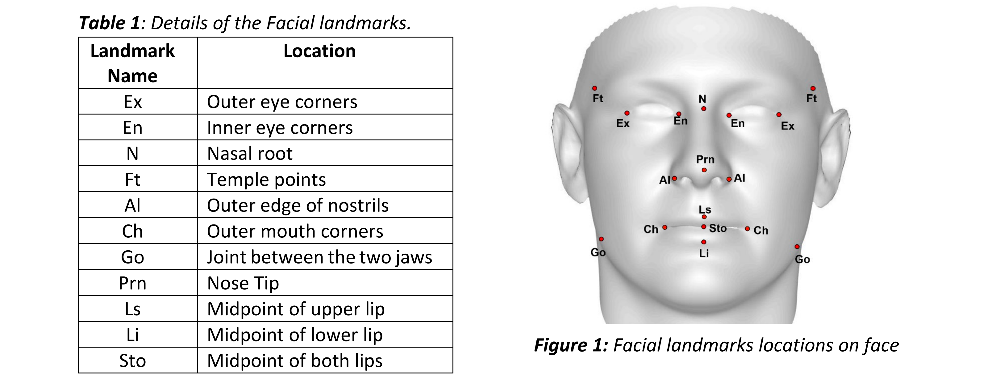
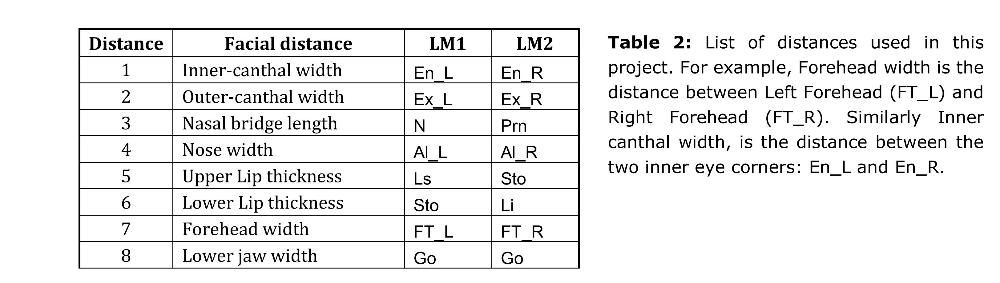
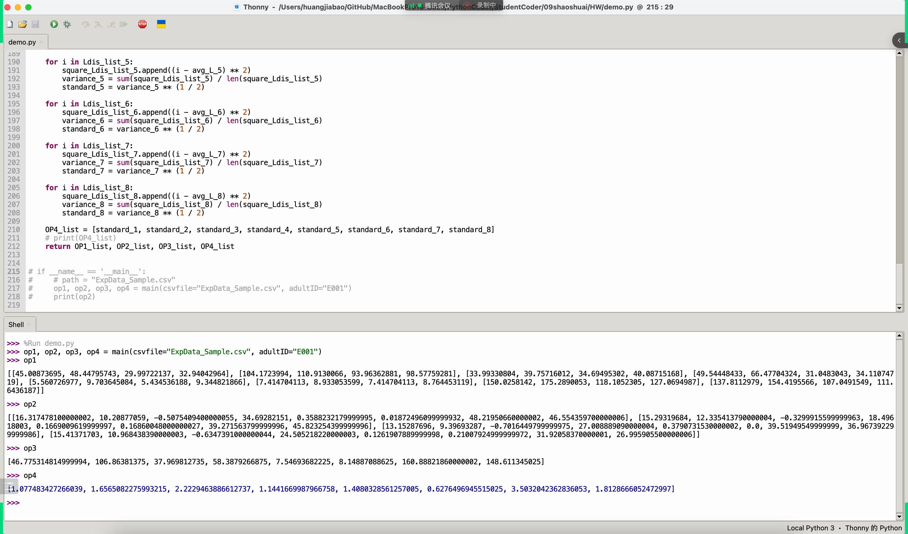
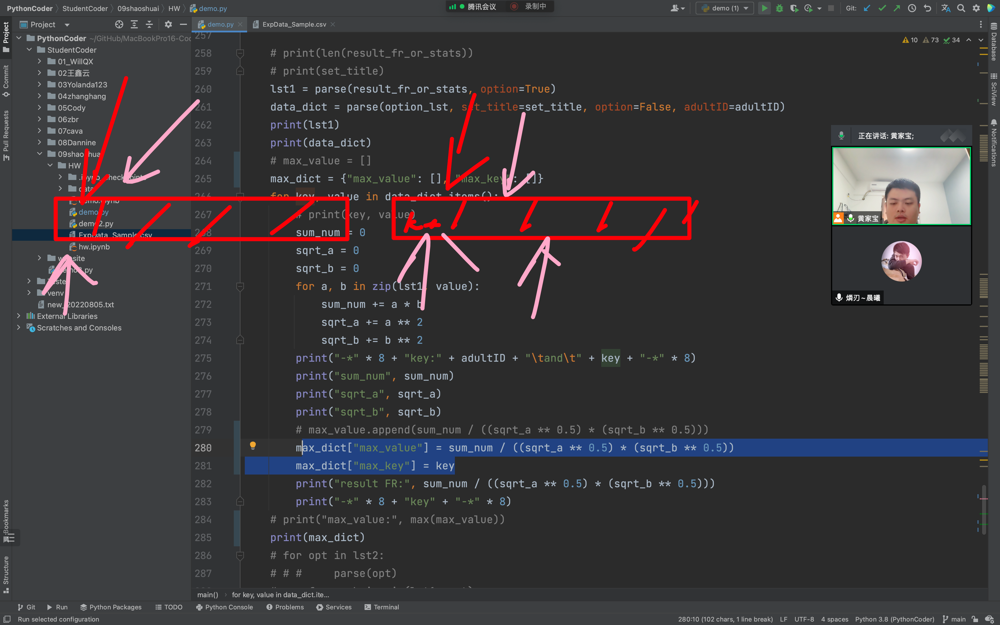
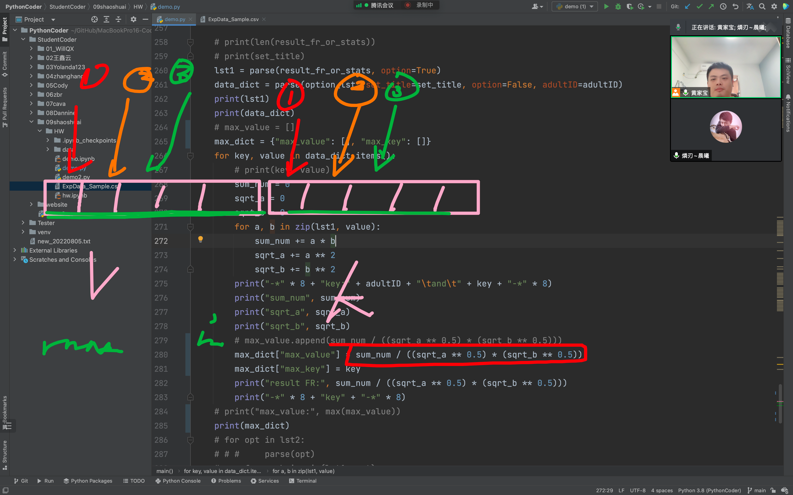
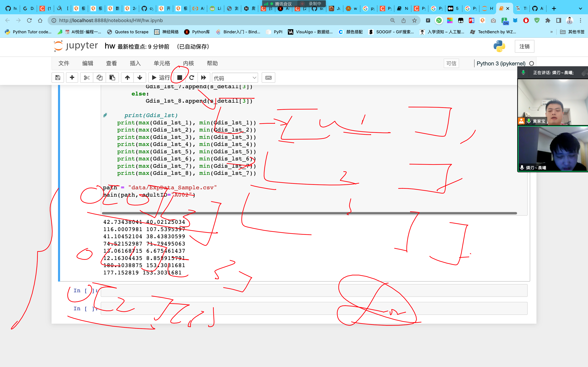

# Project 1 Semester 2 2022

## Project 1: 

## Submission deadlines: 

**5:00 pm, Friday 16th September, 2022**

Value: **15%** of CITS1401.

*To be completed individually.*

You should construct a Python 3 program containing your solution to the following problem and submit 

your program electronically on Moodle. The name of the file containing your code should be your student 

ID e.g. 12345678.py. No other method of submission is allowed. Your program will be automatically run on 

Moodle for sample test cases provided in the project sheet if you click the “check” link. However, your 

submission will be tested thoroughly for grading purposes after the due date. Remember you need to

submit the program as a single file and copy-paste the same program in the provided text box. You have 

only one attempt to submit so don’t submit if you are not satisfied with your attempt. All open submissions 

at the time of the deadline will be automatically submitted. There is no way in the system to open the 

closed submission and reverse your submission.

You are expected to have read and understood the University's guidelines on academic conduct. In 

accordance with this policy, you may discuss with other students the general principles required to

understand this project, but the work you submit must be the result of your own effort. Plagiarism

detection, and other systems for detecting potential malpractice, will therefore be used. Besides, if what 

you submit is not your own work then you will have learnt little and will therefore, likely, fail the finalexam.

You must submit your project before the deadline listed above. Following UWA policy, a late penalty of 5% 

will be deducted for each day (or part day), after the deadline, that the assignment is submitted. No 

submissions will be allowed after 7 days following the deadline except approved special consideration 

cases.

---

**Overview**

Face recognition (FR) is one the most widely known and used non-intrusive biometric which helps in 

identifying people. Given the identity of a known person, the goal of an FR system is to recognize the same 

person in a different scenario, for example while displaying a different expression. You can read this paper 

to understand more about FR under different expressions

Your task is to help the researchers in analysing eight geodesic (surface) and eight 3D Euclidian distances 

between a few facial landmarks across four expressions **'Neutral', 'Angry', 'Disgust', 'Happy'**. These 

distances on one face (in Neutral expression) can then be used to calculate similarity with the same face in 

different expressions or with other faces in the data set to see which faces are closer to (or look like) the 

reference face. Table 1 provides the details of each landmark while Figure 1 shows their location on the 

face. Table-2 gives you the details of the distances which will be used. 

The attached csv (comma separated values) file has the eight geodesic and 3D Euclidian distances for the 

four expressions mentioned above for each person. For the sake of simplicity, the **Distance** numbers are 

given instead of their names. For example, *Inner-canthal width* is distance number 1 and Lower jaw width

is distance number 8. Yourtask istowrite a programwhich fulfills the following requirements. 

**Table 1** : Details of the Facial landmarks





**Requirements (i.e. what your program should do)**

**Input:**

Your program must define the function **main** with the following syntax:

def main(csvfile, adultID, Option):

The input arguments to this function are:

- csvfile: The name oftheCSVfilecontaining the data of individuals which needs to be analysed.

| Adult ID | Expression | Distance | GDis        | LDis        |
| -------- | ---------- | -------- | ----------- | ----------- |
| E001     | Neutral    | 1        | 48.44795743 | 32.13047933 |

The first row of the CSV file contains the headers “Adult ID”, “Expression”, “Distance”, “GDis” and 

“LDis”. From the second row, the first value of each row contains the de-identified adult ID, the 

expression displayed by the face, distance number (refer to Table-2), the geodesic distance and 

the 3D Euclidean distance. We do not have prior knowledge about the number of subjects we 

have to analyse (i.e. the number of rows) that the CSV file contains. Adult ID and Expression are 

strings, Distance is an integer while the remaining values are floats.

- adultID: The ID number of the adult we have to analyse. Remember that the ID is a string and 

    is case sensitive.

- Option: The input argument that decides the type of analysis required. It can take only one of

    the two string inputs: “stats” or “FR”. Ifthe third input argument is “stats”, then the objective

    of the program is to carry out some statistical analysis of the adult whose ID is given in the second 

    argument. Otherwise, if the third input argument is “FR” then the objective is to perform face 

    recognition by calculating the cosine similarity between the reference ID and other subjects.

**Output:**

The function is required to return the following outputs in the order provided below:

When the third input argument is *“stats”* then for the adult given in the input argument “adultID”

1. **OP1**- A list of lists containing the minimum (non-zero) and maximum GDis and LDis of each distance 

    across the four expressions. For example, the minimum (non-zero) intercanthal width (geodesic and 3D 

    Euclidean) in Neutral, Angry, Disgust and Happy expressions. There will be 8 lists inside the main list 

    and each list will have four elements in the following order : [minimum GDis, maximum GDis, minimum 

    LDis, maximum LDis]. The distances must be in the same order as given in Table-2.

2. **OP2**- A list of lists containing the difference between the geodesic and 3D Euclidean distances for each 

    expression. There will be 4 lists inside the main list and each list will have eight elements.

3. **OP3**- A list containing the **average** geodesic distance of the eight distances across the four expressions. 

    This list will have 8 elements.

4. **OP4**- A list containing the **standard deviation** of the 3D Euclidean distance of the eight distances across 

    the four expressions. This list will have 8 elements. The formula to calculate standard deviation is 

    provided at the end of this project sheet.

When the third input argument is “FR”:

You will calculate the cosine similarity between the geodesic distances of the neutral expression of 

reference adultID and the geodesic distances of the remaining expressions of the same ID as well as the 

neutral expressions of the remaining subjects in the dataset. Your output will be:

1. The ID of the person with which the reference face has the maximum cosine similarity, and
2. The maximum cosine similarity value. The formula to calculate cosine similarity is provided at the end of this project sheet.

All returned lists should have the values in order. For example, for OP2, the main list has 4 sub-lists which 

should be ordered according to the expressions **'Neutral', 'Angry', 'Disgust', 'Happy'.** Inside each sub-list 

are 8 elements for the distances which must be ordered as per Table-2. All returned numeric outputs (both in lists and individual) must contain values rounded to four decimal places (if required to be rounded off). 

Do not round the values during calculations. Instead round them only at the time when you save them into the final output variables.

## Examples:

Download the **ExpData_Sample.csv** file from the folder of Project 1 on LMS or Moodle. Some examples of how you can call your program from the Python shell (and examine the results it returns) are:

```python
>>> OP1,OP2,OP3,OP4 = main('ExpData_Sample.csv','E001','stats')
>>> OP1 
[[45.0087, 48.448, 29.9972, 32.9404], [104.1724, 110.913, 93.9636, 98.5776], [33.9933, 39.7572, 34.695, 40.0872], [49.5445, 66.477,31.0483, 34.1107], [5.5607, 9.7036, 5.4345, 9.3448], [7.4147, 8.9331, 7.4147, 8.7645], [150.0258, 175.289, 118.1052, 127.0695], [137.8113, 154.4196, 107.0492, 111.6436]]
```

```python
>>> OP2
[[16.3175, 10.2088, -0.5075, 34.6928, 0.3588, 0.0187, 48.2195, 46.5544], 
[15.2932, 12.3354, -0.33, 18.4962, 0.1669, 0.1686, 39.2716, 45.8233], 
[13.1529, 9.3969, -0.7016, 27.0089, 0.3791, 0.0, 39.5195, 36.9674], 
[15.4137, 10.9684, -0.6347, 24.5052, 0.1262, 0.2101, 31.9206, 26.9959]]
```

```python
>>> OP3
[46.7753, 106.8638, 37.9698, 58.3879, 7.5469, 8.1489,160.8882, 148.6113]
```

```python
>>> OP4
[1.0775, 1.6565, 2.2229, 1.1442, 1.408, 0.6276, 3.5032, 1.8129]
```

```python
>>> ID,cossim = main('ExpData_Sample.csv','E001','FR')
```

```python
>>> ID
'A004'
```

```python
>>> cossim
0.9992
```

## 第一阶段答案

### 读取

首先要解决文件读取：

```python
path = "data/ExpData_Sample.csv"
f = open(path, "r")
content = f.read()
# print(content)
content_lst = content.split("\n")
```

接下来，把每列的数据处理出来，以便后续操作：

```python
# for text in content_lst[1:]:
for text in content_lst:
#     print(text.split(","))
    list_text = text.split(",")
    if len(list_text) == 5:
        ID, Expression, Distance, Gdis, Ldis = list_text
        if Distance.replace(".", "").isdigit():
            ID, Expression, Distance, Gdis, Ldis = ID, Expression, float(Distance), float(Gdis), float(Ldis)
```

> 上面为了去除第一行的 head 使用的方法为：判断是否为纯数字。我更推荐下面编写成函数所用的代码方法，切片提取。`content_lst[1:]`。

写代码建议：先实现基本的然后再改写成函数。

```python
def main(csvfile, adultID="", Option=""):
    """
        csvfile: 文件路径
        adultID: 用户 ID
        Option：用户操作
        data_lst: 初步读取数据且处理的结果
    """
    data_lst = []
    f = open(csvfile, "r")
    content_lst = f.read().split("\n")
    f.close()
    for text in content_lst[1:]:
        list_text = text.split(",")
        if len(list_text) == 5:
#             ID, Expression, Distance, Gdis, Ldis = list_text[0], list_text[1], float(list_text[2]), float(list_text[3]), float(list_text[4])
            data_lst.append([list_text[0], list_text[1], float(list_text[2]), float(list_text[3]), float(list_text[4])])
    return data_lst
#     return opt1, "", "", "" 
    
            
path = "data/ExpData_Sample.csv"
main(path)
```

这里处理的数据的逻辑是把每个数据按原本的数据来进行修改。「列表嵌套」

```python
def main(csvfile, adultID="", Option=""):
    """
        csvfile: 文件路径
        adultID: 用户 ID
        Option：用户操作
        data_lst: 初步读取数据且处理的结果
    """
    data_lst = []
    f = open(csvfile, "r")
    content_lst = f.read().split("\n")
    f.close()
    for text in content_lst[1:]:
        list_text = text.split(",")
        if len(list_text) == 5:
            data_lst.append([list_text[0], list_text[1], int(list_text[2]), float(list_text[3]), float(list_text[4])])
    # 筛选出所需要处理的数据，并存入 select_list 列表
    select_list = []
    for text_lst in data_lst:
        # if adultID == text_lst[0]:
        if adultID in text_lst:
            select_list.append(text_lst)
#     print(select_list)
    # 寻找 min_Gdis, max_Gdis, min_Ldis, max_Ldis 共有两两种方法
    # 方法一：使用判断 if
#     min_Gdis, max_Gdis, min_Ldis, max_Ldis = select_list[0][3], select_list[0][3], select_list[0][4], select_list[0][4]
    # 最简单、容易理解的是使用 list
    Gdis_lst_1 = []
    Gdis_lst_2 = []
    Gdis_lst_3 = []
    Gdis_lst_4 = []
    Gdis_lst_5 = []
    Gdis_lst_6 = []
    Gdis_lst_7 = []
    Gdis_lst_8 = []
    for s_detail in select_list:
        if 1 in s_detail:
            Gdis_lst_1.append(s_detail[3])
#             Gdis_lst.append(s_detail) # 快速验证代码是否实现
        elif 2 in s_detail:
            Gdis_lst_2.append(s_detail[3])
        elif 3 in s_detail:
            Gdis_lst_3.append(s_detail[3])
        elif 4 in s_detail:
            Gdis_lst_4.append(s_detail[3])
        elif 5 in s_detail:
            Gdis_lst_5.append(s_detail[3])
        elif 6 in s_detail:
            Gdis_lst_6.append(s_detail[3])
        elif 7 in s_detail:
            Gdis_lst_7.append(s_detail[3])
        else:
            Gdis_lst_8.append(s_detail[3])
            
#     print(Gdis_lst)
    print(max(Gdis_lst_1), min(Gdis_lst_1))
    print(max(Gdis_lst_2), min(Gdis_lst_2))
    print(max(Gdis_lst_3), min(Gdis_lst_3))
    print(max(Gdis_lst_4), min(Gdis_lst_4))
    print(max(Gdis_lst_5), min(Gdis_lst_5))
    print(max(Gdis_lst_6), min(Gdis_lst_6))
    print(max(Gdis_lst_7), min(Gdis_lst_7))
    print(max(Gdis_lst_8), min(Gdis_lst_7))
            
path = "data/ExpData_Sample.csv"
main(path, adultID="A002")
```


## over op1、op2、op3、op4

```python
def main(csvfile, adultID="", Option=""):
    data_list = []
    f = open(csvfile, "r")
    content = f.read()
    content_list = content.split("\n")
    f.close()
    for text in content_list[1:]:
        text = text.split(",")
        if len(text) == 5:
            data_list.append([text[0], text[1], int(text[2]), float(text[3]), float(text[4])])
    # return data_list
    select_list = []
    for text_list in data_list:
        if adultID == text_list[0]:
            select_list.append(text_list)
    # print(data_list)

    Gdis_list_1 = []
    Gdis_list_2 = []
    Gdis_list_3 = []
    Gdis_list_4 = []
    Gdis_list_5 = []
    Gdis_list_6 = []
    Gdis_list_7 = []
    Gdis_list_8 = []
    Ldis_list_1 = []
    Ldis_list_2 = []
    Ldis_list_3 = []
    Ldis_list_4 = []
    Ldis_list_5 = []
    Ldis_list_6 = []
    Ldis_list_7 = []
    Ldis_list_8 = []

    for Distance_list in select_list:
        if 1 in Distance_list:
            Gdis_list_1.append(Distance_list[3])
        elif 2 in Distance_list:
            Gdis_list_2.append(Distance_list[3])
        elif 3 in Distance_list:
            Gdis_list_3.append(Distance_list[3])
        elif 4 in Distance_list:
            Gdis_list_4.append(Distance_list[3])
        elif 5 in Distance_list:
            Gdis_list_5.append(Distance_list[3])
        elif 6 in Distance_list:
            Gdis_list_6.append(Distance_list[3])
        elif 7 in Distance_list:
            Gdis_list_7.append(Distance_list[3])
        else:
            Gdis_list_8.append(Distance_list[3])

    '''
    print(min(Gdis_list_1),max(Gdis_list_1))
    print(min(Gdis_list_2),max(Gdis_list_2))
    print(min(Gdis_list_3),max(Gdis_list_3))
    print(min(Gdis_list_4),max(Gdis_list_4))
    print(min(Gdis_list_5),max(Gdis_list_5))
    print(min(Gdis_list_6),max(Gdis_list_6))
    print(min(Gdis_list_7),max(Gdis_list_7))
    print(min(Gdis_list_8),max(Gdis_list_8))
    '''

    for Distance_list in select_list:
        if 1 in Distance_list:
            Ldis_list_1.append(Distance_list[4])
        elif 2 in Distance_list:
            Ldis_list_2.append(Distance_list[4])
        elif 3 in Distance_list:
            Ldis_list_3.append(Distance_list[4])
        elif 4 in Distance_list:
            Ldis_list_4.append(Distance_list[4])
        elif 5 in Distance_list:
            Ldis_list_5.append(Distance_list[4])
        elif 6 in Distance_list:
            Ldis_list_6.append(Distance_list[4])
        elif 7 in Distance_list:
            Ldis_list_7.append(Distance_list[4])
        else:
            Ldis_list_8.append(Distance_list[4])
    # print(Ldis_list_1)
    '''        
    print(min(Ldis_list_1),max(Ldis_list_1))
    print(min(Ldis_list_2),max(Ldis_list_2))
    print(min(Ldis_list_3),max(Ldis_list_3))
    print(min(Ldis_list_4),max(Ldis_list_4))
    print(min(Ldis_list_5),max(Ldis_list_5))
    print(min(Ldis_list_6),max(Ldis_list_6))
    print(min(Ldis_list_7),max(Ldis_list_7))
    print(min(Ldis_list_8),max(Ldis_list_8))
    '''
    dis_list_1 = [min(Gdis_list_1), max(Gdis_list_1), min(Ldis_list_1), max(Ldis_list_1)]
    dis_list_2 = [min(Gdis_list_2), max(Gdis_list_2), min(Ldis_list_2), max(Ldis_list_2)]
    dis_list_3 = [min(Gdis_list_3), max(Gdis_list_3), min(Ldis_list_3), max(Ldis_list_3)]
    dis_list_4 = [min(Gdis_list_4), max(Gdis_list_4), min(Ldis_list_4), max(Ldis_list_4)]
    dis_list_5 = [min(Gdis_list_5), max(Gdis_list_5), min(Ldis_list_5), max(Ldis_list_5)]
    dis_list_6 = [min(Gdis_list_6), max(Gdis_list_6), min(Ldis_list_6), max(Ldis_list_6)]
    dis_list_7 = [min(Gdis_list_7), max(Gdis_list_7), min(Ldis_list_7), max(Ldis_list_7)]
    dis_list_8 = [min(Gdis_list_8), max(Gdis_list_8), min(Ldis_list_8), max(Ldis_list_8)]
    OP1_list = [dis_list_1, dis_list_2, dis_list_3, dis_list_4, dis_list_5, dis_list_6, dis_list_7, dis_list_8]
    # print(OP1_list)

    Gdis_Neutral_list = []
    Ldis_Neutral_list = []
    sub_Neutral_list = []
    Gdis_Angry_list = []
    Ldis_Angry_list = []
    sub_Angry_list = []
    Gdis_Disgust_list = []
    Ldis_Disgust_list = []
    sub_Disgust_list = []
    Gdis_Happy_list = []
    Ldis_Happy_list = []
    sub_Happy_list = []
    for Exp_list in select_list:
        if 'Neutral' in Exp_list:
            Gdis_Neutral_list.append(Exp_list[3])
            Ldis_Neutral_list.append(Exp_list[4])
            sub_Neutral_list = [Gdis_Neutral_list[i] - Ldis_Neutral_list[i] for i in range(len(Gdis_Neutral_list))]

    for Exp_list in select_list:
        if 'Angry' in Exp_list:
            Gdis_Angry_list.append(Exp_list[3])
            Ldis_Angry_list.append(Exp_list[4])
            sub_Angry_list = [Gdis_Angry_list[i] - Ldis_Angry_list[i] for i in range(len(Gdis_Angry_list))]

    for Exp_list in select_list:
        if 'Disgust' in Exp_list:
            Gdis_Disgust_list.append(Exp_list[3])
            Ldis_Disgust_list.append(Exp_list[4])
            sub_Disgust_list = [Gdis_Disgust_list[i] - Ldis_Disgust_list[i] for i in range(len(Gdis_Disgust_list))]

    for Exp_list in select_list:
        if 'Happy' in Exp_list:
            Gdis_Happy_list.append(Exp_list[3])
            Ldis_Happy_list.append(Exp_list[4])
            sub_Happy_list = [Gdis_Happy_list[i] - Ldis_Happy_list[i] for i in range(len(Gdis_Happy_list))]

    OP2_list = [sub_Neutral_list, sub_Angry_list, sub_Disgust_list, sub_Happy_list]
    # print(OP2_list)

    avg_G_1 = sum(Gdis_list_1) / len(Gdis_list_1)
    avg_G_2 = sum(Gdis_list_2) / len(Gdis_list_2)
    avg_G_3 = sum(Gdis_list_3) / len(Gdis_list_3)
    avg_G_4 = sum(Gdis_list_4) / len(Gdis_list_4)
    avg_G_5 = sum(Gdis_list_5) / len(Gdis_list_5)
    avg_G_6 = sum(Gdis_list_6) / len(Gdis_list_6)
    avg_G_7 = sum(Gdis_list_7) / len(Gdis_list_7)
    avg_G_8 = sum(Gdis_list_8) / len(Gdis_list_8)
    OP3_list = [avg_G_1, avg_G_2, avg_G_3, avg_G_4, avg_G_5, avg_G_6, avg_G_7, avg_G_8]
    # print(OP3_list)

    avg_L_1 = sum(Ldis_list_1) / len(Ldis_list_1)
    avg_L_2 = sum(Ldis_list_2) / len(Ldis_list_2)
    avg_L_3 = sum(Ldis_list_3) / len(Ldis_list_3)
    avg_L_4 = sum(Ldis_list_4) / len(Ldis_list_4)
    avg_L_5 = sum(Ldis_list_5) / len(Ldis_list_5)
    avg_L_6 = sum(Ldis_list_6) / len(Ldis_list_6)
    avg_L_7 = sum(Ldis_list_7) / len(Ldis_list_7)
    avg_L_8 = sum(Ldis_list_8) / len(Ldis_list_8)

    square_Ldis_list_1 = []
    square_Ldis_list_2 = []
    square_Ldis_list_3 = []
    square_Ldis_list_4 = []
    square_Ldis_list_5 = []
    square_Ldis_list_6 = []
    square_Ldis_list_7 = []
    square_Ldis_list_8 = []
    for i in Ldis_list_1:
        square_Ldis_list_1.append((i - avg_L_1) ** 2)
        variance_1 = sum(square_Ldis_list_1) / len(square_Ldis_list_1)
        standard_1 = variance_1 ** (1 / 2)

    for i in Ldis_list_2:
        square_Ldis_list_2.append((i - avg_L_2) ** 2)
        variance_2 = sum(square_Ldis_list_2) / len(square_Ldis_list_2)
        standard_2 = variance_2 ** (1 / 2)

    for i in Ldis_list_3:
        square_Ldis_list_3.append((i - avg_L_3) ** 2)
        variance_3 = sum(square_Ldis_list_3) / len(square_Ldis_list_3)
        standard_3 = variance_3 ** (1 / 2)

    for i in Ldis_list_4:
        square_Ldis_list_4.append((i - avg_L_4) ** 2)
        variance_4 = sum(square_Ldis_list_4) / len(square_Ldis_list_4)
        standard_4 = variance_4 ** (1 / 2)

    for i in Ldis_list_5:
        square_Ldis_list_5.append((i - avg_L_5) ** 2)
        variance_5 = sum(square_Ldis_list_5) / len(square_Ldis_list_5)
        standard_5 = variance_5 ** (1 / 2)

    for i in Ldis_list_6:
        square_Ldis_list_6.append((i - avg_L_6) ** 2)
        variance_6 = sum(square_Ldis_list_6) / len(square_Ldis_list_6)
        standard_6 = variance_6 ** (1 / 2)

    for i in Ldis_list_7:
        square_Ldis_list_7.append((i - avg_L_7) ** 2)
        variance_7 = sum(square_Ldis_list_7) / len(square_Ldis_list_7)
        standard_7 = variance_7 ** (1 / 2)

    for i in Ldis_list_8:
        square_Ldis_list_8.append((i - avg_L_8) ** 2)
        variance_8 = sum(square_Ldis_list_8) / len(square_Ldis_list_8)
        standard_8 = variance_8 ** (1 / 2)

    OP4_list = [standard_1, standard_2, standard_3, standard_4, standard_5, standard_6, standard_7, standard_8]
    # print(OP4_list)
    return OP1_list, OP2_list, OP3_list, OP4_list


if __name__ == '__main__':
    path = "ExpData_Sample.csv"
    main(csvfile=path, adultID="E001")
```



## 添加 Stats/FR

目前已经完成 stats 的结果，还差一个 FR 的结果。

添加一个 if 判断即可：

```python
    if Option.upper() == "STATS":
        return OP1_list, OP2_list, OP3_list, OP4_list
    elif Option.upper() == "FR":
        return ID, cossim
```

```python
def main(csvfile, adultID="", Option="STATS"):
    data_list = []
    f = open(csvfile, "r")
    content = f.read()
    content_list = content.split("\n")
    f.close()
    for text in content_list[1:]:
        text = text.split(",")
        if len(text) == 5:
            data_list.append([text[0], text[1], int(text[2]), float(text[3]), float(text[4])])
    # return data_list
    select_list = []
    for text_list in data_list:
        if adultID == text_list[0]:
            select_list.append(text_list)
    # print(data_list)

    Gdis_list_1 = []
    Gdis_list_2 = []
    Gdis_list_3 = []
    Gdis_list_4 = []
    Gdis_list_5 = []
    Gdis_list_6 = []
    Gdis_list_7 = []
    Gdis_list_8 = []
    Ldis_list_1 = []
    Ldis_list_2 = []
    Ldis_list_3 = []
    Ldis_list_4 = []
    Ldis_list_5 = []
    Ldis_list_6 = []
    Ldis_list_7 = []
    Ldis_list_8 = []

    for Distance_list in select_list:
        if 1 in Distance_list:
            Gdis_list_1.append(Distance_list[3])
        elif 2 in Distance_list:
            Gdis_list_2.append(Distance_list[3])
        elif 3 in Distance_list:
            Gdis_list_3.append(Distance_list[3])
        elif 4 in Distance_list:
            Gdis_list_4.append(Distance_list[3])
        elif 5 in Distance_list:
            Gdis_list_5.append(Distance_list[3])
        elif 6 in Distance_list:
            Gdis_list_6.append(Distance_list[3])
        elif 7 in Distance_list:
            Gdis_list_7.append(Distance_list[3])
        else:
            Gdis_list_8.append(Distance_list[3])

    '''
    print(min(Gdis_list_1),max(Gdis_list_1))
    print(min(Gdis_list_2),max(Gdis_list_2))
    print(min(Gdis_list_3),max(Gdis_list_3))
    print(min(Gdis_list_4),max(Gdis_list_4))
    print(min(Gdis_list_5),max(Gdis_list_5))
    print(min(Gdis_list_6),max(Gdis_list_6))
    print(min(Gdis_list_7),max(Gdis_list_7))
    print(min(Gdis_list_8),max(Gdis_list_8))
    '''

    for Distance_list in select_list:
        if 1 in Distance_list:
            Ldis_list_1.append(Distance_list[4])
        elif 2 in Distance_list:
            Ldis_list_2.append(Distance_list[4])
        elif 3 in Distance_list:
            Ldis_list_3.append(Distance_list[4])
        elif 4 in Distance_list:
            Ldis_list_4.append(Distance_list[4])
        elif 5 in Distance_list:
            Ldis_list_5.append(Distance_list[4])
        elif 6 in Distance_list:
            Ldis_list_6.append(Distance_list[4])
        elif 7 in Distance_list:
            Ldis_list_7.append(Distance_list[4])
        else:
            Ldis_list_8.append(Distance_list[4])
    # print(Ldis_list_1)
    '''        
    print(min(Ldis_list_1),max(Ldis_list_1))
    print(min(Ldis_list_2),max(Ldis_list_2))
    print(min(Ldis_list_3),max(Ldis_list_3))
    print(min(Ldis_list_4),max(Ldis_list_4))
    print(min(Ldis_list_5),max(Ldis_list_5))
    print(min(Ldis_list_6),max(Ldis_list_6))
    print(min(Ldis_list_7),max(Ldis_list_7))
    print(min(Ldis_list_8),max(Ldis_list_8))
    '''
    dis_list_1 = [min(Gdis_list_1), max(Gdis_list_1), min(Ldis_list_1), max(Ldis_list_1)]
    dis_list_2 = [min(Gdis_list_2), max(Gdis_list_2), min(Ldis_list_2), max(Ldis_list_2)]
    dis_list_3 = [min(Gdis_list_3), max(Gdis_list_3), min(Ldis_list_3), max(Ldis_list_3)]
    dis_list_4 = [min(Gdis_list_4), max(Gdis_list_4), min(Ldis_list_4), max(Ldis_list_4)]
    dis_list_5 = [min(Gdis_list_5), max(Gdis_list_5), min(Ldis_list_5), max(Ldis_list_5)]
    dis_list_6 = [min(Gdis_list_6), max(Gdis_list_6), min(Ldis_list_6), max(Ldis_list_6)]
    dis_list_7 = [min(Gdis_list_7), max(Gdis_list_7), min(Ldis_list_7), max(Ldis_list_7)]
    dis_list_8 = [min(Gdis_list_8), max(Gdis_list_8), min(Ldis_list_8), max(Ldis_list_8)]
    OP1_list = [dis_list_1, dis_list_2, dis_list_3, dis_list_4, dis_list_5, dis_list_6, dis_list_7, dis_list_8]
    # print(OP1_list)

    Gdis_Neutral_list = []
    Ldis_Neutral_list = []
    sub_Neutral_list = []
    Gdis_Angry_list = []
    Ldis_Angry_list = []
    sub_Angry_list = []
    Gdis_Disgust_list = []
    Ldis_Disgust_list = []
    sub_Disgust_list = []
    Gdis_Happy_list = []
    Ldis_Happy_list = []
    sub_Happy_list = []
    for Exp_list in select_list:
        if 'Neutral' in Exp_list:
            Gdis_Neutral_list.append(Exp_list[3])
            Ldis_Neutral_list.append(Exp_list[4])
            sub_Neutral_list = [Gdis_Neutral_list[i] - Ldis_Neutral_list[i] for i in range(len(Gdis_Neutral_list))]

    for Exp_list in select_list:
        if 'Angry' in Exp_list:
            Gdis_Angry_list.append(Exp_list[3])
            Ldis_Angry_list.append(Exp_list[4])
            sub_Angry_list = [Gdis_Angry_list[i] - Ldis_Angry_list[i] for i in range(len(Gdis_Angry_list))]

    for Exp_list in select_list:
        if 'Disgust' in Exp_list:
            Gdis_Disgust_list.append(Exp_list[3])
            Ldis_Disgust_list.append(Exp_list[4])
            sub_Disgust_list = [Gdis_Disgust_list[i] - Ldis_Disgust_list[i] for i in range(len(Gdis_Disgust_list))]

    for Exp_list in select_list:
        if 'Happy' in Exp_list:
            Gdis_Happy_list.append(Exp_list[3])
            Ldis_Happy_list.append(Exp_list[4])
            sub_Happy_list = [Gdis_Happy_list[i] - Ldis_Happy_list[i] for i in range(len(Gdis_Happy_list))]

    OP2_list = [sub_Neutral_list, sub_Angry_list, sub_Disgust_list, sub_Happy_list]
    # print(OP2_list)

    avg_G_1 = sum(Gdis_list_1) / len(Gdis_list_1)
    avg_G_2 = sum(Gdis_list_2) / len(Gdis_list_2)
    avg_G_3 = sum(Gdis_list_3) / len(Gdis_list_3)
    avg_G_4 = sum(Gdis_list_4) / len(Gdis_list_4)
    avg_G_5 = sum(Gdis_list_5) / len(Gdis_list_5)
    avg_G_6 = sum(Gdis_list_6) / len(Gdis_list_6)
    avg_G_7 = sum(Gdis_list_7) / len(Gdis_list_7)
    avg_G_8 = sum(Gdis_list_8) / len(Gdis_list_8)
    OP3_list = [avg_G_1, avg_G_2, avg_G_3, avg_G_4, avg_G_5, avg_G_6, avg_G_7, avg_G_8]
    # print(OP3_list)

    avg_L_1 = sum(Ldis_list_1) / len(Ldis_list_1)
    avg_L_2 = sum(Ldis_list_2) / len(Ldis_list_2)
    avg_L_3 = sum(Ldis_list_3) / len(Ldis_list_3)
    avg_L_4 = sum(Ldis_list_4) / len(Ldis_list_4)
    avg_L_5 = sum(Ldis_list_5) / len(Ldis_list_5)
    avg_L_6 = sum(Ldis_list_6) / len(Ldis_list_6)
    avg_L_7 = sum(Ldis_list_7) / len(Ldis_list_7)
    avg_L_8 = sum(Ldis_list_8) / len(Ldis_list_8)

    square_Ldis_list_1 = []
    square_Ldis_list_2 = []
    square_Ldis_list_3 = []
    square_Ldis_list_4 = []
    square_Ldis_list_5 = []
    square_Ldis_list_6 = []
    square_Ldis_list_7 = []
    square_Ldis_list_8 = []
    for i in Ldis_list_1:
        square_Ldis_list_1.append((i - avg_L_1) ** 2)
        variance_1 = sum(square_Ldis_list_1) / len(square_Ldis_list_1)
        standard_1 = variance_1 ** (1 / 2)

    for i in Ldis_list_2:
        square_Ldis_list_2.append((i - avg_L_2) ** 2)
        variance_2 = sum(square_Ldis_list_2) / len(square_Ldis_list_2)
        standard_2 = variance_2 ** (1 / 2)

    for i in Ldis_list_3:
        square_Ldis_list_3.append((i - avg_L_3) ** 2)
        variance_3 = sum(square_Ldis_list_3) / len(square_Ldis_list_3)
        standard_3 = variance_3 ** (1 / 2)

    for i in Ldis_list_4:
        square_Ldis_list_4.append((i - avg_L_4) ** 2)
        variance_4 = sum(square_Ldis_list_4) / len(square_Ldis_list_4)
        standard_4 = variance_4 ** (1 / 2)

    for i in Ldis_list_5:
        square_Ldis_list_5.append((i - avg_L_5) ** 2)
        variance_5 = sum(square_Ldis_list_5) / len(square_Ldis_list_5)
        standard_5 = variance_5 ** (1 / 2)

    for i in Ldis_list_6:
        square_Ldis_list_6.append((i - avg_L_6) ** 2)
        variance_6 = sum(square_Ldis_list_6) / len(square_Ldis_list_6)
        standard_6 = variance_6 ** (1 / 2)

    for i in Ldis_list_7:
        square_Ldis_list_7.append((i - avg_L_7) ** 2)
        variance_7 = sum(square_Ldis_list_7) / len(square_Ldis_list_7)
        standard_7 = variance_7 ** (1 / 2)

    for i in Ldis_list_8:
        square_Ldis_list_8.append((i - avg_L_8) ** 2)
        variance_8 = sum(square_Ldis_list_8) / len(square_Ldis_list_8)
        standard_8 = variance_8 ** (1 / 2)

    OP4_list = [standard_1, standard_2, standard_3, standard_4, standard_5, standard_6, standard_7, standard_8]
    # print(OP4_list)
    result = []
    option_lst = []
    r_n = 0

    for lst in data_list:
        # print(lst)
        if adultID in lst:
            # print(lst)
            result.append(lst)
        else:
            option_lst.append(lst)
    for Gdis_lst in result:
        # print(Gdis_lst[3])
        for details_gdis in option_lst:
            # print(details_gdis[3])
            r_n = (Gdis_lst[3] * details_gdis[3]) + r_n  # 思考
    # for 循环同时遍历两个列表
    print(r_n)
    # ** 0.5
    # if Option.upper() == "STATS":
    #     return OP1_list, OP2_list, OP3_list, OP4_list
    # elif Option.upper() == "FR":
    #     return ID, cossim


if __name__ == '__main__':
    # path = "ExpData_Sample.csv"
    # op1, op2, op3, op4 = main(csvfile="ExpData_Sample.csv", adultID="E001")
    # print(op2)
    main(csvfile="ExpData_Sample.csv", adultID="A002")
```

```python
from pprint import pprint


def parse(lst: list, set_title=set(), option=True, adultID=""):
    r_lst = []
    # pprint(lst)
    if option:
        for details_list in lst:
            # print(details_list)
            r_lst.append(details_list[3])
        return r_lst
    else:
        data_dict = {}
        temporary_list = []
        for title in set_title:
            data_dict[title] = []
        # print(data_dict)
        # for title in set_title:
        #     for details_list in lst:
        #         if title in details_list:
        #             pass
        for detail_lst in lst:
            if detail_lst[0] in data_dict:
                data_dict[detail_lst[0]].append(detail_lst[3])
        del data_dict[adultID]
        # return list(data_dict.values())
        # print(data_dict)
        return data_dict

def main(csvfile, adultID="", Option="STATS"):
    data_list = []
    set_title = set()
    f = open(csvfile, "r")
    content = f.read()
    content_list = content.split("\n")
    f.close()
    for text in content_list[1:]:
        text = text.split(",")
        if len(text) == 5:
            data_list.append([text[0], text[1], int(text[2]), float(text[3]), float(text[4])])
            set_title.add(text[0])
    # return data_list
    select_list = []
    for text_list in data_list:
        if adultID == text_list[0]:
            select_list.append(text_list)
    # print(data_list)

    Gdis_list_1 = []
    Gdis_list_2 = []
    Gdis_list_3 = []
    Gdis_list_4 = []
    Gdis_list_5 = []
    Gdis_list_6 = []
    Gdis_list_7 = []
    Gdis_list_8 = []
    Ldis_list_1 = []
    Ldis_list_2 = []
    Ldis_list_3 = []
    Ldis_list_4 = []
    Ldis_list_5 = []
    Ldis_list_6 = []
    Ldis_list_7 = []
    Ldis_list_8 = []

    for Distance_list in select_list:
        if 1 in Distance_list:
            Gdis_list_1.append(Distance_list[3])
        elif 2 in Distance_list:
            Gdis_list_2.append(Distance_list[3])
        elif 3 in Distance_list:
            Gdis_list_3.append(Distance_list[3])
        elif 4 in Distance_list:
            Gdis_list_4.append(Distance_list[3])
        elif 5 in Distance_list:
            Gdis_list_5.append(Distance_list[3])
        elif 6 in Distance_list:
            Gdis_list_6.append(Distance_list[3])
        elif 7 in Distance_list:
            Gdis_list_7.append(Distance_list[3])
        else:
            Gdis_list_8.append(Distance_list[3])

    '''
    print(min(Gdis_list_1),max(Gdis_list_1))
    print(min(Gdis_list_2),max(Gdis_list_2))
    print(min(Gdis_list_3),max(Gdis_list_3))
    print(min(Gdis_list_4),max(Gdis_list_4))
    print(min(Gdis_list_5),max(Gdis_list_5))
    print(min(Gdis_list_6),max(Gdis_list_6))
    print(min(Gdis_list_7),max(Gdis_list_7))
    print(min(Gdis_list_8),max(Gdis_list_8))
    '''

    for Distance_list in select_list:
        if 1 in Distance_list:
            Ldis_list_1.append(Distance_list[4])
        elif 2 in Distance_list:
            Ldis_list_2.append(Distance_list[4])
        elif 3 in Distance_list:
            Ldis_list_3.append(Distance_list[4])
        elif 4 in Distance_list:
            Ldis_list_4.append(Distance_list[4])
        elif 5 in Distance_list:
            Ldis_list_5.append(Distance_list[4])
        elif 6 in Distance_list:
            Ldis_list_6.append(Distance_list[4])
        elif 7 in Distance_list:
            Ldis_list_7.append(Distance_list[4])
        else:
            Ldis_list_8.append(Distance_list[4])
    # print(Ldis_list_1)
    '''        
    print(min(Ldis_list_1),max(Ldis_list_1))
    print(min(Ldis_list_2),max(Ldis_list_2))
    print(min(Ldis_list_3),max(Ldis_list_3))
    print(min(Ldis_list_4),max(Ldis_list_4))
    print(min(Ldis_list_5),max(Ldis_list_5))
    print(min(Ldis_list_6),max(Ldis_list_6))
    print(min(Ldis_list_7),max(Ldis_list_7))
    print(min(Ldis_list_8),max(Ldis_list_8))
    '''
    dis_list_1 = [min(Gdis_list_1), max(Gdis_list_1), min(Ldis_list_1), max(Ldis_list_1)]
    dis_list_2 = [min(Gdis_list_2), max(Gdis_list_2), min(Ldis_list_2), max(Ldis_list_2)]
    dis_list_3 = [min(Gdis_list_3), max(Gdis_list_3), min(Ldis_list_3), max(Ldis_list_3)]
    dis_list_4 = [min(Gdis_list_4), max(Gdis_list_4), min(Ldis_list_4), max(Ldis_list_4)]
    dis_list_5 = [min(Gdis_list_5), max(Gdis_list_5), min(Ldis_list_5), max(Ldis_list_5)]
    dis_list_6 = [min(Gdis_list_6), max(Gdis_list_6), min(Ldis_list_6), max(Ldis_list_6)]
    dis_list_7 = [min(Gdis_list_7), max(Gdis_list_7), min(Ldis_list_7), max(Ldis_list_7)]
    dis_list_8 = [min(Gdis_list_8), max(Gdis_list_8), min(Ldis_list_8), max(Ldis_list_8)]
    OP1_list = [dis_list_1, dis_list_2, dis_list_3, dis_list_4, dis_list_5, dis_list_6, dis_list_7, dis_list_8]
    # print(OP1_list)

    Gdis_Neutral_list = []
    Ldis_Neutral_list = []
    sub_Neutral_list = []
    Gdis_Angry_list = []
    Ldis_Angry_list = []
    sub_Angry_list = []
    Gdis_Disgust_list = []
    Ldis_Disgust_list = []
    sub_Disgust_list = []
    Gdis_Happy_list = []
    Ldis_Happy_list = []
    sub_Happy_list = []
    for Exp_list in select_list:
        if 'Neutral' in Exp_list:
            Gdis_Neutral_list.append(Exp_list[3])
            Ldis_Neutral_list.append(Exp_list[4])
            sub_Neutral_list = [Gdis_Neutral_list[i] - Ldis_Neutral_list[i] for i in range(len(Gdis_Neutral_list))]

    for Exp_list in select_list:
        if 'Angry' in Exp_list:
            Gdis_Angry_list.append(Exp_list[3])
            Ldis_Angry_list.append(Exp_list[4])
            sub_Angry_list = [Gdis_Angry_list[i] - Ldis_Angry_list[i] for i in range(len(Gdis_Angry_list))]

    for Exp_list in select_list:
        if 'Disgust' in Exp_list:
            Gdis_Disgust_list.append(Exp_list[3])
            Ldis_Disgust_list.append(Exp_list[4])
            sub_Disgust_list = [Gdis_Disgust_list[i] - Ldis_Disgust_list[i] for i in range(len(Gdis_Disgust_list))]

    for Exp_list in select_list:
        if 'Happy' in Exp_list:
            Gdis_Happy_list.append(Exp_list[3])
            Ldis_Happy_list.append(Exp_list[4])
            sub_Happy_list = [Gdis_Happy_list[i] - Ldis_Happy_list[i] for i in range(len(Gdis_Happy_list))]

    OP2_list = [sub_Neutral_list, sub_Angry_list, sub_Disgust_list, sub_Happy_list]
    # print(OP2_list)

    avg_G_1 = sum(Gdis_list_1) / len(Gdis_list_1)
    avg_G_2 = sum(Gdis_list_2) / len(Gdis_list_2)
    avg_G_3 = sum(Gdis_list_3) / len(Gdis_list_3)
    avg_G_4 = sum(Gdis_list_4) / len(Gdis_list_4)
    avg_G_5 = sum(Gdis_list_5) / len(Gdis_list_5)
    avg_G_6 = sum(Gdis_list_6) / len(Gdis_list_6)
    avg_G_7 = sum(Gdis_list_7) / len(Gdis_list_7)
    avg_G_8 = sum(Gdis_list_8) / len(Gdis_list_8)
    OP3_list = [avg_G_1, avg_G_2, avg_G_3, avg_G_4, avg_G_5, avg_G_6, avg_G_7, avg_G_8]
    # print(OP3_list)

    avg_L_1 = sum(Ldis_list_1) / len(Ldis_list_1)
    avg_L_2 = sum(Ldis_list_2) / len(Ldis_list_2)
    avg_L_3 = sum(Ldis_list_3) / len(Ldis_list_3)
    avg_L_4 = sum(Ldis_list_4) / len(Ldis_list_4)
    avg_L_5 = sum(Ldis_list_5) / len(Ldis_list_5)
    avg_L_6 = sum(Ldis_list_6) / len(Ldis_list_6)
    avg_L_7 = sum(Ldis_list_7) / len(Ldis_list_7)
    avg_L_8 = sum(Ldis_list_8) / len(Ldis_list_8)

    square_Ldis_list_1 = []
    square_Ldis_list_2 = []
    square_Ldis_list_3 = []
    square_Ldis_list_4 = []
    square_Ldis_list_5 = []
    square_Ldis_list_6 = []
    square_Ldis_list_7 = []
    square_Ldis_list_8 = []
    for i in Ldis_list_1:
        square_Ldis_list_1.append((i - avg_L_1) ** 2)
        variance_1 = sum(square_Ldis_list_1) / len(square_Ldis_list_1)
        standard_1 = variance_1 ** (1 / 2)

    for i in Ldis_list_2:
        square_Ldis_list_2.append((i - avg_L_2) ** 2)
        variance_2 = sum(square_Ldis_list_2) / len(square_Ldis_list_2)
        standard_2 = variance_2 ** (1 / 2)

    for i in Ldis_list_3:
        square_Ldis_list_3.append((i - avg_L_3) ** 2)
        variance_3 = sum(square_Ldis_list_3) / len(square_Ldis_list_3)
        standard_3 = variance_3 ** (1 / 2)

    for i in Ldis_list_4:
        square_Ldis_list_4.append((i - avg_L_4) ** 2)
        variance_4 = sum(square_Ldis_list_4) / len(square_Ldis_list_4)
        standard_4 = variance_4 ** (1 / 2)

    for i in Ldis_list_5:
        square_Ldis_list_5.append((i - avg_L_5) ** 2)
        variance_5 = sum(square_Ldis_list_5) / len(square_Ldis_list_5)
        standard_5 = variance_5 ** (1 / 2)

    for i in Ldis_list_6:
        square_Ldis_list_6.append((i - avg_L_6) ** 2)
        variance_6 = sum(square_Ldis_list_6) / len(square_Ldis_list_6)
        standard_6 = variance_6 ** (1 / 2)

    for i in Ldis_list_7:
        square_Ldis_list_7.append((i - avg_L_7) ** 2)
        variance_7 = sum(square_Ldis_list_7) / len(square_Ldis_list_7)
        standard_7 = variance_7 ** (1 / 2)

    for i in Ldis_list_8:
        square_Ldis_list_8.append((i - avg_L_8) ** 2)
        variance_8 = sum(square_Ldis_list_8) / len(square_Ldis_list_8)
        standard_8 = variance_8 ** (1 / 2)

    OP4_list = [standard_1, standard_2, standard_3, standard_4, standard_5, standard_6, standard_7, standard_8]
    # print(OP4_list)
    result_fr_or_stats = []
    option_lst = []
    r_n = 0

    # 区分目标列表
    for lst in data_list:
        # print(lst)
        if adultID in lst:
            # print(lst)
            result_fr_or_stats.append(lst)
        else:
            option_lst.append(lst)

    # print(len(result_fr_or_stats))
    # print(set_title)
    lst1 = parse(result_fr_or_stats, option=True)
    data_dict = parse(option_lst, set_title=set_title, option=False, adultID=adultID)
    print(lst1)
    print(data_dict)
    for key, value in data_dict.items():
        # print(key, value)
        sum_num = 0
        sqrt_a = 0
        sqrt_b = 0
        for a, b in zip(lst1, value):
            sum_num += a * b
            sqrt_a += a ** 2
            sqrt_b += b ** 2
        print("-*" * 8 + "key:" + adultID + "\tand\t" + key + "-*" * 8)
        print("sum_num", sum_num)
        print("sqrt_a", sqrt_a)
        print("sqrt_b", sqrt_b)
        print("result FR:", sum_num / ((sqrt_a ** 0.5) * (sqrt_b ** 0.5)))
        print("-*" * 8 + "key" + "-*" * 8)
    # for opt in lst2:
    # # #     parse(opt)
    #     for a, b in zip(lst1, opt):
    #         sum_num += a * b
    #         sqrt_a += a ** 2
    #         sqrt_b += b ** 2
    #         print("sum_num", sum_num, "sqrt_a", sqrt_a, "sqrt_b", sqrt_b)

    # for Gdis_lst in result:
    #     # print(Gdis_lst[3])
    #     for details_gdis in option_lst:
    #         # print(details_gdis[3])
    #         r_n = (Gdis_lst[3] * details_gdis[3]) + r_n  # 思考
    # # for 循环同时遍历两个列表
    # print(r_n)
    # ** 0.5
    # if Option.upper() == "STATS":
    #     return OP1_list, OP2_list, OP3_list, OP4_list
    # elif Option.upper() == "FR":
    #     return ID, cossim


if __name__ == '__main__':
    # path = "ExpData_Sample.csv"
    # op1, op2, op3, op4 = main(csvfile="ExpData_Sample.csv", adultID="E001")
    # print(op2)
    main(csvfile="ExpData_Sample.csv", adultID="E001")
```

---

::: details 稍微修改的版本

```python
from pprint import pprint


def parse(lst: list, set_title=set(), option=True, adultID=""):
    r_lst = []
    # pprint(lst)
    if option:
        for details_list in lst:
            # print(details_list)
            r_lst.append(details_list[3])
        return r_lst
    else:
        data_dict = {}
        temporary_list = []
        for title in set_title:
            data_dict[title] = []
        # print(data_dict)
        # for title in set_title:
        #     for details_list in lst:
        #         if title in details_list:
        #             pass
        for detail_lst in lst:
            if detail_lst[0] in data_dict:
                data_dict[detail_lst[0]].append(detail_lst[3])
        del data_dict[adultID]
        # return list(data_dict.values())
        # print(data_dict)
        return data_dict

def main(csvfile, adultID="", Option="STATS"):
    data_list = []
    set_title = set()
    f = open(csvfile, "r")
    content = f.read()
    content_list = content.split("\n")
    f.close()
    for text in content_list[1:]:
        text = text.split(",")
        if len(text) == 5:
            data_list.append([text[0], text[1], int(text[2]), float(text[3]), float(text[4])])
            set_title.add(text[0])
    # return data_list
    select_list = []
    for text_list in data_list:
        if adultID == text_list[0]:
            select_list.append(text_list)
    # print(data_list)

    Gdis_list_1 = []
    Gdis_list_2 = []
    Gdis_list_3 = []
    Gdis_list_4 = []
    Gdis_list_5 = []
    Gdis_list_6 = []
    Gdis_list_7 = []
    Gdis_list_8 = []
    Ldis_list_1 = []
    Ldis_list_2 = []
    Ldis_list_3 = []
    Ldis_list_4 = []
    Ldis_list_5 = []
    Ldis_list_6 = []
    Ldis_list_7 = []
    Ldis_list_8 = []

    for Distance_list in select_list:
        if 1 in Distance_list:
            Gdis_list_1.append(Distance_list[3])
        elif 2 in Distance_list:
            Gdis_list_2.append(Distance_list[3])
        elif 3 in Distance_list:
            Gdis_list_3.append(Distance_list[3])
        elif 4 in Distance_list:
            Gdis_list_4.append(Distance_list[3])
        elif 5 in Distance_list:
            Gdis_list_5.append(Distance_list[3])
        elif 6 in Distance_list:
            Gdis_list_6.append(Distance_list[3])
        elif 7 in Distance_list:
            Gdis_list_7.append(Distance_list[3])
        else:
            Gdis_list_8.append(Distance_list[3])

    '''
    print(min(Gdis_list_1),max(Gdis_list_1))
    print(min(Gdis_list_2),max(Gdis_list_2))
    print(min(Gdis_list_3),max(Gdis_list_3))
    print(min(Gdis_list_4),max(Gdis_list_4))
    print(min(Gdis_list_5),max(Gdis_list_5))
    print(min(Gdis_list_6),max(Gdis_list_6))
    print(min(Gdis_list_7),max(Gdis_list_7))
    print(min(Gdis_list_8),max(Gdis_list_8))
    '''

    for Distance_list in select_list:
        if 1 in Distance_list:
            Ldis_list_1.append(Distance_list[4])
        elif 2 in Distance_list:
            Ldis_list_2.append(Distance_list[4])
        elif 3 in Distance_list:
            Ldis_list_3.append(Distance_list[4])
        elif 4 in Distance_list:
            Ldis_list_4.append(Distance_list[4])
        elif 5 in Distance_list:
            Ldis_list_5.append(Distance_list[4])
        elif 6 in Distance_list:
            Ldis_list_6.append(Distance_list[4])
        elif 7 in Distance_list:
            Ldis_list_7.append(Distance_list[4])
        else:
            Ldis_list_8.append(Distance_list[4])
    # print(Ldis_list_1)
    '''        
    print(min(Ldis_list_1),max(Ldis_list_1))
    print(min(Ldis_list_2),max(Ldis_list_2))
    print(min(Ldis_list_3),max(Ldis_list_3))
    print(min(Ldis_list_4),max(Ldis_list_4))
    print(min(Ldis_list_5),max(Ldis_list_5))
    print(min(Ldis_list_6),max(Ldis_list_6))
    print(min(Ldis_list_7),max(Ldis_list_7))
    print(min(Ldis_list_8),max(Ldis_list_8))
    '''
    dis_list_1 = [min(Gdis_list_1), max(Gdis_list_1), min(Ldis_list_1), max(Ldis_list_1)]
    dis_list_2 = [min(Gdis_list_2), max(Gdis_list_2), min(Ldis_list_2), max(Ldis_list_2)]
    dis_list_3 = [min(Gdis_list_3), max(Gdis_list_3), min(Ldis_list_3), max(Ldis_list_3)]
    dis_list_4 = [min(Gdis_list_4), max(Gdis_list_4), min(Ldis_list_4), max(Ldis_list_4)]
    dis_list_5 = [min(Gdis_list_5), max(Gdis_list_5), min(Ldis_list_5), max(Ldis_list_5)]
    dis_list_6 = [min(Gdis_list_6), max(Gdis_list_6), min(Ldis_list_6), max(Ldis_list_6)]
    dis_list_7 = [min(Gdis_list_7), max(Gdis_list_7), min(Ldis_list_7), max(Ldis_list_7)]
    dis_list_8 = [min(Gdis_list_8), max(Gdis_list_8), min(Ldis_list_8), max(Ldis_list_8)]
    OP1_list = [dis_list_1, dis_list_2, dis_list_3, dis_list_4, dis_list_5, dis_list_6, dis_list_7, dis_list_8]
    # print(OP1_list)

    Gdis_Neutral_list = []
    Ldis_Neutral_list = []
    sub_Neutral_list = []
    Gdis_Angry_list = []
    Ldis_Angry_list = []
    sub_Angry_list = []
    Gdis_Disgust_list = []
    Ldis_Disgust_list = []
    sub_Disgust_list = []
    Gdis_Happy_list = []
    Ldis_Happy_list = []
    sub_Happy_list = []
    for Exp_list in select_list:
        if 'Neutral' in Exp_list:
            Gdis_Neutral_list.append(Exp_list[3])
            Ldis_Neutral_list.append(Exp_list[4])
            sub_Neutral_list = [Gdis_Neutral_list[i] - Ldis_Neutral_list[i] for i in range(len(Gdis_Neutral_list))]

    for Exp_list in select_list:
        if 'Angry' in Exp_list:
            Gdis_Angry_list.append(Exp_list[3])
            Ldis_Angry_list.append(Exp_list[4])
            sub_Angry_list = [Gdis_Angry_list[i] - Ldis_Angry_list[i] for i in range(len(Gdis_Angry_list))]

    for Exp_list in select_list:
        if 'Disgust' in Exp_list:
            Gdis_Disgust_list.append(Exp_list[3])
            Ldis_Disgust_list.append(Exp_list[4])
            sub_Disgust_list = [Gdis_Disgust_list[i] - Ldis_Disgust_list[i] for i in range(len(Gdis_Disgust_list))]

    for Exp_list in select_list:
        if 'Happy' in Exp_list:
            Gdis_Happy_list.append(Exp_list[3])
            Ldis_Happy_list.append(Exp_list[4])
            sub_Happy_list = [Gdis_Happy_list[i] - Ldis_Happy_list[i] for i in range(len(Gdis_Happy_list))]

    OP2_list = [sub_Neutral_list, sub_Angry_list, sub_Disgust_list, sub_Happy_list]
    # print(OP2_list)

    avg_G_1 = sum(Gdis_list_1) / len(Gdis_list_1)
    avg_G_2 = sum(Gdis_list_2) / len(Gdis_list_2)
    avg_G_3 = sum(Gdis_list_3) / len(Gdis_list_3)
    avg_G_4 = sum(Gdis_list_4) / len(Gdis_list_4)
    avg_G_5 = sum(Gdis_list_5) / len(Gdis_list_5)
    avg_G_6 = sum(Gdis_list_6) / len(Gdis_list_6)
    avg_G_7 = sum(Gdis_list_7) / len(Gdis_list_7)
    avg_G_8 = sum(Gdis_list_8) / len(Gdis_list_8)
    OP3_list = [avg_G_1, avg_G_2, avg_G_3, avg_G_4, avg_G_5, avg_G_6, avg_G_7, avg_G_8]
    # print(OP3_list)

    avg_L_1 = sum(Ldis_list_1) / len(Ldis_list_1)
    avg_L_2 = sum(Ldis_list_2) / len(Ldis_list_2)
    avg_L_3 = sum(Ldis_list_3) / len(Ldis_list_3)
    avg_L_4 = sum(Ldis_list_4) / len(Ldis_list_4)
    avg_L_5 = sum(Ldis_list_5) / len(Ldis_list_5)
    avg_L_6 = sum(Ldis_list_6) / len(Ldis_list_6)
    avg_L_7 = sum(Ldis_list_7) / len(Ldis_list_7)
    avg_L_8 = sum(Ldis_list_8) / len(Ldis_list_8)

    square_Ldis_list_1 = []
    square_Ldis_list_2 = []
    square_Ldis_list_3 = []
    square_Ldis_list_4 = []
    square_Ldis_list_5 = []
    square_Ldis_list_6 = []
    square_Ldis_list_7 = []
    square_Ldis_list_8 = []
    for i in Ldis_list_1:
        square_Ldis_list_1.append((i - avg_L_1) ** 2)
        variance_1 = sum(square_Ldis_list_1) / len(square_Ldis_list_1)
        standard_1 = variance_1 ** (1 / 2)

    for i in Ldis_list_2:
        square_Ldis_list_2.append((i - avg_L_2) ** 2)
        variance_2 = sum(square_Ldis_list_2) / len(square_Ldis_list_2)
        standard_2 = variance_2 ** (1 / 2)

    for i in Ldis_list_3:
        square_Ldis_list_3.append((i - avg_L_3) ** 2)
        variance_3 = sum(square_Ldis_list_3) / len(square_Ldis_list_3)
        standard_3 = variance_3 ** (1 / 2)

    for i in Ldis_list_4:
        square_Ldis_list_4.append((i - avg_L_4) ** 2)
        variance_4 = sum(square_Ldis_list_4) / len(square_Ldis_list_4)
        standard_4 = variance_4 ** (1 / 2)

    for i in Ldis_list_5:
        square_Ldis_list_5.append((i - avg_L_5) ** 2)
        variance_5 = sum(square_Ldis_list_5) / len(square_Ldis_list_5)
        standard_5 = variance_5 ** (1 / 2)

    for i in Ldis_list_6:
        square_Ldis_list_6.append((i - avg_L_6) ** 2)
        variance_6 = sum(square_Ldis_list_6) / len(square_Ldis_list_6)
        standard_6 = variance_6 ** (1 / 2)

    for i in Ldis_list_7:
        square_Ldis_list_7.append((i - avg_L_7) ** 2)
        variance_7 = sum(square_Ldis_list_7) / len(square_Ldis_list_7)
        standard_7 = variance_7 ** (1 / 2)

    for i in Ldis_list_8:
        square_Ldis_list_8.append((i - avg_L_8) ** 2)
        variance_8 = sum(square_Ldis_list_8) / len(square_Ldis_list_8)
        standard_8 = variance_8 ** (1 / 2)

    OP4_list = [standard_1, standard_2, standard_3, standard_4, standard_5, standard_6, standard_7, standard_8]
    # print(OP4_list)
    result_fr_or_stats = []
    option_lst = []
    r_n = 0

    # 区分目标列表
    for lst in data_list:
        # print(lst)
        if adultID in lst:
            # print(lst)
            result_fr_or_stats.append(lst)
        else:
            option_lst.append(lst)

    # print(len(result_fr_or_stats))
    # print(set_title)
    lst1 = parse(result_fr_or_stats, option=True)
    data_dict = parse(option_lst, set_title=set_title, option=False, adultID=adultID)
    print(lst1)
    print(data_dict)
    max_value = []
    for key, value in data_dict.items():
        # print(key, value)
        sum_num = 0
        sqrt_a = 0
        sqrt_b = 0
        for a, b in zip(lst1, value):
            sum_num += a * b
            sqrt_a += a ** 2
            sqrt_b += b ** 2
        print("-*" * 8 + "key:" + adultID + "\tand\t" + key + "-*" * 8)
        print("sum_num", sum_num)
        print("sqrt_a", sqrt_a)
        print("sqrt_b", sqrt_b)
        max_value.append(sum_num / ((sqrt_a ** 0.5) * (sqrt_b ** 0.5)))

        print("result FR:", sum_num / ((sqrt_a ** 0.5) * (sqrt_b ** 0.5)))
        print("-*" * 8 + "key" + "-*" * 8)
    print("max_value:", max(max_value))
    # for opt in lst2:
    # # #     parse(opt)
    #     for a, b in zip(lst1, opt):
    #         sum_num += a * b
    #         sqrt_a += a ** 2
    #         sqrt_b += b ** 2
    #         print("sum_num", sum_num, "sqrt_a", sqrt_a, "sqrt_b", sqrt_b)

    # for Gdis_lst in result:
    #     # print(Gdis_lst[3])
    #     for details_gdis in option_lst:
    #         # print(details_gdis[3])
    #         r_n = (Gdis_lst[3] * details_gdis[3]) + r_n  # 思考
    # # for 循环同时遍历两个列表
    # print(r_n)
    # ** 0.5
    # if Option.upper() == "STATS":
    #     return OP1_list, OP2_list, OP3_list, OP4_list
    # elif Option.upper() == "FR":
    #     return ID, cossim


if __name__ == '__main__':
    # path = "ExpData_Sample.csv"
    # op1, op2, op3, op4 = main(csvfile="ExpData_Sample.csv", adultID="E001")
    # print(op2)
    main(csvfile="ExpData_Sample.csv", adultID="E001")

```

:::

## 上面 stats、fr 公式理解错误，代码订正

```python
from pprint import pprint


def parse(lst: list, set_title=set(), option=True, adultID=""):
    r_lst = []
    # pprint(lst)
    if option:
        for details_list in lst:
            if "Neutral" in details_list:
                # print(details_list)
                r_lst.append(details_list[3])
        return r_lst
    else:
        data_dict = {}
        temporary_list = []
        for title in set_title:
            data_dict[title] = []
        # print(data_dict)
        # for title in set_title:
        #     for details_list in lst:
        #         if title in details_list:
        #             pass
        for detail_lst in lst:
            if detail_lst[0] in data_dict:
                data_dict[detail_lst[0]].append(detail_lst[3])
        del data_dict[adultID]
        # return list(data_dict.values())
        # print(data_dict)
        return data_dict

def main(csvfile, adultID="", Option="STATS"):
    data_list = []
    set_title = set()
    f = open(csvfile, "r")
    content = f.read()
    content_list = content.split("\n")
    f.close()
    for text in content_list[1:]:
        text = text.split(",")
        if len(text) == 5:
            data_list.append([text[0], text[1], int(text[2]), float(text[3]), float(text[4])])
            set_title.add(text[0])
    # return data_list
    select_list = []
    for text_list in data_list:
        if adultID == text_list[0]:
            select_list.append(text_list)
    # print(data_list)

    Gdis_list_1 = []
    Gdis_list_2 = []
    Gdis_list_3 = []
    Gdis_list_4 = []
    Gdis_list_5 = []
    Gdis_list_6 = []
    Gdis_list_7 = []
    Gdis_list_8 = []
    Ldis_list_1 = []
    Ldis_list_2 = []
    Ldis_list_3 = []
    Ldis_list_4 = []
    Ldis_list_5 = []
    Ldis_list_6 = []
    Ldis_list_7 = []
    Ldis_list_8 = []

    for Distance_list in select_list:
        if 1 in Distance_list:
            Gdis_list_1.append(Distance_list[3])
        elif 2 in Distance_list:
            Gdis_list_2.append(Distance_list[3])
        elif 3 in Distance_list:
            Gdis_list_3.append(Distance_list[3])
        elif 4 in Distance_list:
            Gdis_list_4.append(Distance_list[3])
        elif 5 in Distance_list:
            Gdis_list_5.append(Distance_list[3])
        elif 6 in Distance_list:
            Gdis_list_6.append(Distance_list[3])
        elif 7 in Distance_list:
            Gdis_list_7.append(Distance_list[3])
        else:
            Gdis_list_8.append(Distance_list[3])

    '''
    print(min(Gdis_list_1),max(Gdis_list_1))
    print(min(Gdis_list_2),max(Gdis_list_2))
    print(min(Gdis_list_3),max(Gdis_list_3))
    print(min(Gdis_list_4),max(Gdis_list_4))
    print(min(Gdis_list_5),max(Gdis_list_5))
    print(min(Gdis_list_6),max(Gdis_list_6))
    print(min(Gdis_list_7),max(Gdis_list_7))
    print(min(Gdis_list_8),max(Gdis_list_8))
    '''

    for Distance_list in select_list:
        if 1 in Distance_list:
            Ldis_list_1.append(Distance_list[4])
        elif 2 in Distance_list:
            Ldis_list_2.append(Distance_list[4])
        elif 3 in Distance_list:
            Ldis_list_3.append(Distance_list[4])
        elif 4 in Distance_list:
            Ldis_list_4.append(Distance_list[4])
        elif 5 in Distance_list:
            Ldis_list_5.append(Distance_list[4])
        elif 6 in Distance_list:
            Ldis_list_6.append(Distance_list[4])
        elif 7 in Distance_list:
            Ldis_list_7.append(Distance_list[4])
        else:
            Ldis_list_8.append(Distance_list[4])
    # print(Ldis_list_1)
    '''        
    print(min(Ldis_list_1),max(Ldis_list_1))
    print(min(Ldis_list_2),max(Ldis_list_2))
    print(min(Ldis_list_3),max(Ldis_list_3))
    print(min(Ldis_list_4),max(Ldis_list_4))
    print(min(Ldis_list_5),max(Ldis_list_5))
    print(min(Ldis_list_6),max(Ldis_list_6))
    print(min(Ldis_list_7),max(Ldis_list_7))
    print(min(Ldis_list_8),max(Ldis_list_8))
    '''
    dis_list_1 = [min(Gdis_list_1), max(Gdis_list_1), min(Ldis_list_1), max(Ldis_list_1)]
    dis_list_2 = [min(Gdis_list_2), max(Gdis_list_2), min(Ldis_list_2), max(Ldis_list_2)]
    dis_list_3 = [min(Gdis_list_3), max(Gdis_list_3), min(Ldis_list_3), max(Ldis_list_3)]
    dis_list_4 = [min(Gdis_list_4), max(Gdis_list_4), min(Ldis_list_4), max(Ldis_list_4)]
    dis_list_5 = [min(Gdis_list_5), max(Gdis_list_5), min(Ldis_list_5), max(Ldis_list_5)]
    dis_list_6 = [min(Gdis_list_6), max(Gdis_list_6), min(Ldis_list_6), max(Ldis_list_6)]
    dis_list_7 = [min(Gdis_list_7), max(Gdis_list_7), min(Ldis_list_7), max(Ldis_list_7)]
    dis_list_8 = [min(Gdis_list_8), max(Gdis_list_8), min(Ldis_list_8), max(Ldis_list_8)]
    OP1_list = [dis_list_1, dis_list_2, dis_list_3, dis_list_4, dis_list_5, dis_list_6, dis_list_7, dis_list_8]
    # print(OP1_list)

    Gdis_Neutral_list = []
    Ldis_Neutral_list = []
    sub_Neutral_list = []
    Gdis_Angry_list = []
    Ldis_Angry_list = []
    sub_Angry_list = []
    Gdis_Disgust_list = []
    Ldis_Disgust_list = []
    sub_Disgust_list = []
    Gdis_Happy_list = []
    Ldis_Happy_list = []
    sub_Happy_list = []
    for Exp_list in select_list:
        if 'Neutral' in Exp_list:
            Gdis_Neutral_list.append(Exp_list[3])
            Ldis_Neutral_list.append(Exp_list[4])
            sub_Neutral_list = [Gdis_Neutral_list[i] - Ldis_Neutral_list[i] for i in range(len(Gdis_Neutral_list))]

    for Exp_list in select_list:
        if 'Angry' in Exp_list:
            Gdis_Angry_list.append(Exp_list[3])
            Ldis_Angry_list.append(Exp_list[4])
            sub_Angry_list = [Gdis_Angry_list[i] - Ldis_Angry_list[i] for i in range(len(Gdis_Angry_list))]

    for Exp_list in select_list:
        if 'Disgust' in Exp_list:
            Gdis_Disgust_list.append(Exp_list[3])
            Ldis_Disgust_list.append(Exp_list[4])
            sub_Disgust_list = [Gdis_Disgust_list[i] - Ldis_Disgust_list[i] for i in range(len(Gdis_Disgust_list))]

    for Exp_list in select_list:
        if 'Happy' in Exp_list:
            Gdis_Happy_list.append(Exp_list[3])
            Ldis_Happy_list.append(Exp_list[4])
            sub_Happy_list = [Gdis_Happy_list[i] - Ldis_Happy_list[i] for i in range(len(Gdis_Happy_list))]

    OP2_list = [sub_Neutral_list, sub_Angry_list, sub_Disgust_list, sub_Happy_list]
    # print(OP2_list)

    avg_G_1 = sum(Gdis_list_1) / len(Gdis_list_1)
    avg_G_2 = sum(Gdis_list_2) / len(Gdis_list_2)
    avg_G_3 = sum(Gdis_list_3) / len(Gdis_list_3)
    avg_G_4 = sum(Gdis_list_4) / len(Gdis_list_4)
    avg_G_5 = sum(Gdis_list_5) / len(Gdis_list_5)
    avg_G_6 = sum(Gdis_list_6) / len(Gdis_list_6)
    avg_G_7 = sum(Gdis_list_7) / len(Gdis_list_7)
    avg_G_8 = sum(Gdis_list_8) / len(Gdis_list_8)
    OP3_list = [avg_G_1, avg_G_2, avg_G_3, avg_G_4, avg_G_5, avg_G_6, avg_G_7, avg_G_8]
    # print(OP3_list)

    avg_L_1 = sum(Ldis_list_1) / len(Ldis_list_1)
    avg_L_2 = sum(Ldis_list_2) / len(Ldis_list_2)
    avg_L_3 = sum(Ldis_list_3) / len(Ldis_list_3)
    avg_L_4 = sum(Ldis_list_4) / len(Ldis_list_4)
    avg_L_5 = sum(Ldis_list_5) / len(Ldis_list_5)
    avg_L_6 = sum(Ldis_list_6) / len(Ldis_list_6)
    avg_L_7 = sum(Ldis_list_7) / len(Ldis_list_7)
    avg_L_8 = sum(Ldis_list_8) / len(Ldis_list_8)

    square_Ldis_list_1 = []
    square_Ldis_list_2 = []
    square_Ldis_list_3 = []
    square_Ldis_list_4 = []
    square_Ldis_list_5 = []
    square_Ldis_list_6 = []
    square_Ldis_list_7 = []
    square_Ldis_list_8 = []
    for i in Ldis_list_1:
        square_Ldis_list_1.append((i - avg_L_1) ** 2)
        variance_1 = sum(square_Ldis_list_1) / len(square_Ldis_list_1)
        standard_1 = variance_1 ** (1 / 2)

    for i in Ldis_list_2:
        square_Ldis_list_2.append((i - avg_L_2) ** 2)
        variance_2 = sum(square_Ldis_list_2) / len(square_Ldis_list_2)
        standard_2 = variance_2 ** (1 / 2)

    for i in Ldis_list_3:
        square_Ldis_list_3.append((i - avg_L_3) ** 2)
        variance_3 = sum(square_Ldis_list_3) / len(square_Ldis_list_3)
        standard_3 = variance_3 ** (1 / 2)

    for i in Ldis_list_4:
        square_Ldis_list_4.append((i - avg_L_4) ** 2)
        variance_4 = sum(square_Ldis_list_4) / len(square_Ldis_list_4)
        standard_4 = variance_4 ** (1 / 2)

    for i in Ldis_list_5:
        square_Ldis_list_5.append((i - avg_L_5) ** 2)
        variance_5 = sum(square_Ldis_list_5) / len(square_Ldis_list_5)
        standard_5 = variance_5 ** (1 / 2)

    for i in Ldis_list_6:
        square_Ldis_list_6.append((i - avg_L_6) ** 2)
        variance_6 = sum(square_Ldis_list_6) / len(square_Ldis_list_6)
        standard_6 = variance_6 ** (1 / 2)

    for i in Ldis_list_7:
        square_Ldis_list_7.append((i - avg_L_7) ** 2)
        variance_7 = sum(square_Ldis_list_7) / len(square_Ldis_list_7)
        standard_7 = variance_7 ** (1 / 2)

    for i in Ldis_list_8:
        square_Ldis_list_8.append((i - avg_L_8) ** 2)
        variance_8 = sum(square_Ldis_list_8) / len(square_Ldis_list_8)
        standard_8 = variance_8 ** (1 / 2)

    OP4_list = [standard_1, standard_2, standard_3, standard_4, standard_5, standard_6, standard_7, standard_8]
    # print(OP4_list)
    result_fr_or_stats = []
    option_lst = []
    r_n = 0

    # 区分目标列表
    for lst in data_list:
        # print(lst)
        if adultID in lst:
            # print(lst)
            result_fr_or_stats.append(lst)
        else:
            option_lst.append(lst)

    # print(len(result_fr_or_stats))
    # print(set_title)
    lst1 = parse(result_fr_or_stats, option=True)
    data_dict = parse(option_lst, set_title=set_title, option=False, adultID=adultID)
    print(lst1)
    print(data_dict)
    max_value = []
    for key, value in data_dict.items():
        # print(key, value)
        sum_num = 0
        sqrt_a = 0
        sqrt_b = 0
        for a, b in zip(lst1, value):
            sum_num += a * b
            sqrt_a += a ** 2
            sqrt_b += b ** 2
        print("-*" * 8 + "key:" + adultID + "\tand\t" + key + "-*" * 8)
        print("sum_num", sum_num)
        print("sqrt_a", sqrt_a)
        print("sqrt_b", sqrt_b)
        max_value.append(sum_num / ((sqrt_a ** 0.5) * (sqrt_b ** 0.5)))
        print("result FR:", sum_num / ((sqrt_a ** 0.5) * (sqrt_b ** 0.5)))
        print("-*" * 8 + "key" + "-*" * 8)
    print("max_value:", max(max_value))
    # for opt in lst2:
    # # #     parse(opt)
    #     for a, b in zip(lst1, opt):
    #         sum_num += a * b
    #         sqrt_a += a ** 2
    #         sqrt_b += b ** 2
    #         print("sum_num", sum_num, "sqrt_a", sqrt_a, "sqrt_b", sqrt_b)

    # for Gdis_lst in result:
    #     # print(Gdis_lst[3])
    #     for details_gdis in option_lst:
    #         # print(details_gdis[3])
    #         r_n = (Gdis_lst[3] * details_gdis[3]) + r_n  # 思考
    # # for 循环同时遍历两个列表
    # print(r_n)
    # ** 0.5
    # if Option.upper() == "STATS":
    #     return OP1_list, OP2_list, OP3_list, OP4_list
    # elif Option.upper() == "FR":
    #     return ID, cossim


if __name__ == '__main__':
    # path = "ExpData_Sample.csv"
    # op1, op2, op3, op4 = main(csvfile="ExpData_Sample.csv", adultID="E001")
    # print(op2)
    main(csvfile="ExpData_Sample.csv", adultID="E001")

```





```python
from pprint import pprint


def parse(lst: list, set_title=set(), option=True, adultID=""):
    r_lst = []
    # pprint(lst)
    if option:
        for details_list in lst:
            if "Neutral" in details_list:
                # print(details_list)
                r_lst.append(details_list[3])
        return r_lst
    else:
        data_dict = {}
        temporary_list = []
        for title in set_title:
            data_dict[title] = []
        # print(data_dict)
        # for title in set_title:
        #     for details_list in lst:
        #         if title in details_list:
        #             pass
        for detail_lst in lst:
            if detail_lst[0] in data_dict:
                data_dict[detail_lst[0]].append(detail_lst[3])
        del data_dict[adultID]
        # return list(data_dict.values())
        # print(data_dict)
        return data_dict


def main(csvfile, adultID="", Option="STATS"):
    data_list = []
    set_title = set()
    f = open(csvfile, "r")
    content = f.read()
    content_list = content.split("\n")
    f.close()
    for text in content_list[1:]:
        text = text.split(",")
        if len(text) == 5:
            data_list.append([text[0], text[1], int(text[2]), float(text[3]), float(text[4])])
            set_title.add(text[0])
    # return data_list
    select_list = []
    for text_list in data_list:
        if adultID == text_list[0]:
            select_list.append(text_list)
    # print(data_list)

    Gdis_list_1 = []
    Gdis_list_2 = []
    Gdis_list_3 = []
    Gdis_list_4 = []
    Gdis_list_5 = []
    Gdis_list_6 = []
    Gdis_list_7 = []
    Gdis_list_8 = []
    Ldis_list_1 = []
    Ldis_list_2 = []
    Ldis_list_3 = []
    Ldis_list_4 = []
    Ldis_list_5 = []
    Ldis_list_6 = []
    Ldis_list_7 = []
    Ldis_list_8 = []

    for Distance_list in select_list:
        if 1 in Distance_list:
            Gdis_list_1.append(Distance_list[3])
        elif 2 in Distance_list:
            Gdis_list_2.append(Distance_list[3])
        elif 3 in Distance_list:
            Gdis_list_3.append(Distance_list[3])
        elif 4 in Distance_list:
            Gdis_list_4.append(Distance_list[3])
        elif 5 in Distance_list:
            Gdis_list_5.append(Distance_list[3])
        elif 6 in Distance_list:
            Gdis_list_6.append(Distance_list[3])
        elif 7 in Distance_list:
            Gdis_list_7.append(Distance_list[3])
        else:
            Gdis_list_8.append(Distance_list[3])

    '''
    print(min(Gdis_list_1),max(Gdis_list_1))
    print(min(Gdis_list_2),max(Gdis_list_2))
    print(min(Gdis_list_3),max(Gdis_list_3))
    print(min(Gdis_list_4),max(Gdis_list_4))
    print(min(Gdis_list_5),max(Gdis_list_5))
    print(min(Gdis_list_6),max(Gdis_list_6))
    print(min(Gdis_list_7),max(Gdis_list_7))
    print(min(Gdis_list_8),max(Gdis_list_8))
    '''

    for Distance_list in select_list:
        if 1 in Distance_list:
            Ldis_list_1.append(Distance_list[4])
        elif 2 in Distance_list:
            Ldis_list_2.append(Distance_list[4])
        elif 3 in Distance_list:
            Ldis_list_3.append(Distance_list[4])
        elif 4 in Distance_list:
            Ldis_list_4.append(Distance_list[4])
        elif 5 in Distance_list:
            Ldis_list_5.append(Distance_list[4])
        elif 6 in Distance_list:
            Ldis_list_6.append(Distance_list[4])
        elif 7 in Distance_list:
            Ldis_list_7.append(Distance_list[4])
        else:
            Ldis_list_8.append(Distance_list[4])
    # print(Ldis_list_1)
    '''        
    print(min(Ldis_list_1),max(Ldis_list_1))
    print(min(Ldis_list_2),max(Ldis_list_2))
    print(min(Ldis_list_3),max(Ldis_list_3))
    print(min(Ldis_list_4),max(Ldis_list_4))
    print(min(Ldis_list_5),max(Ldis_list_5))
    print(min(Ldis_list_6),max(Ldis_list_6))
    print(min(Ldis_list_7),max(Ldis_list_7))
    print(min(Ldis_list_8),max(Ldis_list_8))
    '''
    dis_list_1 = [min(Gdis_list_1), max(Gdis_list_1), min(Ldis_list_1), max(Ldis_list_1)]
    dis_list_2 = [min(Gdis_list_2), max(Gdis_list_2), min(Ldis_list_2), max(Ldis_list_2)]
    dis_list_3 = [min(Gdis_list_3), max(Gdis_list_3), min(Ldis_list_3), max(Ldis_list_3)]
    dis_list_4 = [min(Gdis_list_4), max(Gdis_list_4), min(Ldis_list_4), max(Ldis_list_4)]
    dis_list_5 = [min(Gdis_list_5), max(Gdis_list_5), min(Ldis_list_5), max(Ldis_list_5)]
    dis_list_6 = [min(Gdis_list_6), max(Gdis_list_6), min(Ldis_list_6), max(Ldis_list_6)]
    dis_list_7 = [min(Gdis_list_7), max(Gdis_list_7), min(Ldis_list_7), max(Ldis_list_7)]
    dis_list_8 = [min(Gdis_list_8), max(Gdis_list_8), min(Ldis_list_8), max(Ldis_list_8)]
    OP1_list = [dis_list_1, dis_list_2, dis_list_3, dis_list_4, dis_list_5, dis_list_6, dis_list_7, dis_list_8]
    # print(OP1_list)

    Gdis_Neutral_list = []
    Ldis_Neutral_list = []
    sub_Neutral_list = []
    Gdis_Angry_list = []
    Ldis_Angry_list = []
    sub_Angry_list = []
    Gdis_Disgust_list = []
    Ldis_Disgust_list = []
    sub_Disgust_list = []
    Gdis_Happy_list = []
    Ldis_Happy_list = []
    sub_Happy_list = []
    for Exp_list in select_list:
        if 'Neutral' in Exp_list:
            Gdis_Neutral_list.append(Exp_list[3])
            Ldis_Neutral_list.append(Exp_list[4])
            sub_Neutral_list = [Gdis_Neutral_list[i] - Ldis_Neutral_list[i] for i in range(len(Gdis_Neutral_list))]

    for Exp_list in select_list:
        if 'Angry' in Exp_list:
            Gdis_Angry_list.append(Exp_list[3])
            Ldis_Angry_list.append(Exp_list[4])
            sub_Angry_list = [Gdis_Angry_list[i] - Ldis_Angry_list[i] for i in range(len(Gdis_Angry_list))]

    for Exp_list in select_list:
        if 'Disgust' in Exp_list:
            Gdis_Disgust_list.append(Exp_list[3])
            Ldis_Disgust_list.append(Exp_list[4])
            sub_Disgust_list = [Gdis_Disgust_list[i] - Ldis_Disgust_list[i] for i in range(len(Gdis_Disgust_list))]

    for Exp_list in select_list:
        if 'Happy' in Exp_list:
            Gdis_Happy_list.append(Exp_list[3])
            Ldis_Happy_list.append(Exp_list[4])
            sub_Happy_list = [Gdis_Happy_list[i] - Ldis_Happy_list[i] for i in range(len(Gdis_Happy_list))]

    OP2_list = [sub_Neutral_list, sub_Angry_list, sub_Disgust_list, sub_Happy_list]
    # print(OP2_list)

    avg_G_1 = sum(Gdis_list_1) / len(Gdis_list_1)
    avg_G_2 = sum(Gdis_list_2) / len(Gdis_list_2)
    avg_G_3 = sum(Gdis_list_3) / len(Gdis_list_3)
    avg_G_4 = sum(Gdis_list_4) / len(Gdis_list_4)
    avg_G_5 = sum(Gdis_list_5) / len(Gdis_list_5)
    avg_G_6 = sum(Gdis_list_6) / len(Gdis_list_6)
    avg_G_7 = sum(Gdis_list_7) / len(Gdis_list_7)
    avg_G_8 = sum(Gdis_list_8) / len(Gdis_list_8)
    OP3_list = [avg_G_1, avg_G_2, avg_G_3, avg_G_4, avg_G_5, avg_G_6, avg_G_7, avg_G_8]
    # print(OP3_list)

    avg_L_1 = sum(Ldis_list_1) / len(Ldis_list_1)
    avg_L_2 = sum(Ldis_list_2) / len(Ldis_list_2)
    avg_L_3 = sum(Ldis_list_3) / len(Ldis_list_3)
    avg_L_4 = sum(Ldis_list_4) / len(Ldis_list_4)
    avg_L_5 = sum(Ldis_list_5) / len(Ldis_list_5)
    avg_L_6 = sum(Ldis_list_6) / len(Ldis_list_6)
    avg_L_7 = sum(Ldis_list_7) / len(Ldis_list_7)
    avg_L_8 = sum(Ldis_list_8) / len(Ldis_list_8)

    square_Ldis_list_1 = []
    square_Ldis_list_2 = []
    square_Ldis_list_3 = []
    square_Ldis_list_4 = []
    square_Ldis_list_5 = []
    square_Ldis_list_6 = []
    square_Ldis_list_7 = []
    square_Ldis_list_8 = []
    for i in Ldis_list_1:
        square_Ldis_list_1.append((i - avg_L_1) ** 2)
        variance_1 = sum(square_Ldis_list_1) / len(square_Ldis_list_1)
        standard_1 = variance_1 ** (1 / 2)

    for i in Ldis_list_2:
        square_Ldis_list_2.append((i - avg_L_2) ** 2)
        variance_2 = sum(square_Ldis_list_2) / len(square_Ldis_list_2)
        standard_2 = variance_2 ** (1 / 2)

    for i in Ldis_list_3:
        square_Ldis_list_3.append((i - avg_L_3) ** 2)
        variance_3 = sum(square_Ldis_list_3) / len(square_Ldis_list_3)
        standard_3 = variance_3 ** (1 / 2)

    for i in Ldis_list_4:
        square_Ldis_list_4.append((i - avg_L_4) ** 2)
        variance_4 = sum(square_Ldis_list_4) / len(square_Ldis_list_4)
        standard_4 = variance_4 ** (1 / 2)

    for i in Ldis_list_5:
        square_Ldis_list_5.append((i - avg_L_5) ** 2)
        variance_5 = sum(square_Ldis_list_5) / len(square_Ldis_list_5)
        standard_5 = variance_5 ** (1 / 2)

    for i in Ldis_list_6:
        square_Ldis_list_6.append((i - avg_L_6) ** 2)
        variance_6 = sum(square_Ldis_list_6) / len(square_Ldis_list_6)
        standard_6 = variance_6 ** (1 / 2)

    for i in Ldis_list_7:
        square_Ldis_list_7.append((i - avg_L_7) ** 2)
        variance_7 = sum(square_Ldis_list_7) / len(square_Ldis_list_7)
        standard_7 = variance_7 ** (1 / 2)

    for i in Ldis_list_8:
        square_Ldis_list_8.append((i - avg_L_8) ** 2)
        variance_8 = sum(square_Ldis_list_8) / len(square_Ldis_list_8)
        standard_8 = variance_8 ** (1 / 2)

    OP4_list = [standard_1, standard_2, standard_3, standard_4, standard_5, standard_6, standard_7, standard_8]
    # print(OP4_list)
    result_fr_or_stats = []
    option_lst = []
    r_n = 0

    # 区分目标列表
    for lst in data_list:
        # print(lst)
        if adultID in lst:
            # print(lst)
            result_fr_or_stats.append(lst)
        else:
            option_lst.append(lst)

    # print(len(result_fr_or_stats))
    # print(set_title)
    lst1 = parse(result_fr_or_stats, option=True)
    data_dict = parse(option_lst, set_title=set_title, option=False, adultID=adultID)
    print(lst1)
    print(data_dict)
    # max_value = []
    max_dict = {"max_value": [], "max_key": []}  # 计算的结果值与 option 对象存放的字典
    for key, value in data_dict.items():
        # print(key, value)
        sum_num = 0
        sqrt_a = 0
        sqrt_b = 0
        for a, b in zip(lst1, value):
            sum_num += a * b
            sqrt_a += a ** 2
            sqrt_b += b ** 2
        print("-*" * 8 + "key:" + adultID + "\tand\t" + key + "-*" * 8)
        print("sum_num", sum_num)
        print("sqrt_a", sqrt_a)
        print("sqrt_b", sqrt_b)
        # max_value.append(sum_num / ((sqrt_a ** 0.5) * (sqrt_b ** 0.5)))
        max_dict["max_value"].append(sum_num / ((sqrt_a ** 0.5) * (sqrt_b ** 0.5)))
        max_dict["max_key"].append(key)
        print("result FR:", sum_num / ((sqrt_a ** 0.5) * (sqrt_b ** 0.5)))
        print("-*" * 8 + "key" + "-*" * 8)
    # print("max_value:", max(max_value))
    # print(max_dict)
    cossim = max(max_dict["max_value"])
    ID = max_dict["max_key"][max_dict["max_value"].index(cossim)]
    print(cossim, ID)
    # for opt in lst2:
    # # #     parse(opt)
    #     for a, b in zip(lst1, opt):
    #         sum_num += a * b
    #         sqrt_a += a ** 2
    #         sqrt_b += b ** 2
    #         print("sum_num", sum_num, "sqrt_a", sqrt_a, "sqrt_b", sqrt_b)

    # for Gdis_lst in result:
    #     # print(Gdis_lst[3])
    #     for details_gdis in option_lst:
    #         # print(details_gdis[3])
    #         r_n = (Gdis_lst[3] * details_gdis[3]) + r_n  # 思考
    # # for 循环同时遍历两个列表
    # print(r_n)
    # ** 0.5
    # if Option.upper() == "STATS":
    #     return OP1_list, OP2_list, OP3_list, OP4_list
    # elif Option.upper() == "FR":
    #     return ID, cossim


if __name__ == '__main__':
    # path = "ExpData_Sample.csv"
    # op1, op2, op3, op4 = main(csvfile="ExpData_Sample.csv", adultID="E001")
    # print(op2)
    main(csvfile="ExpData_Sample.csv", adultID="E001")
```

输出结果：

```python
/Users/huangjiabao/GitHub/MacBookPro16-Code/PythonCoder/venv/bin/python /Users/huangjiabao/GitHub/MacBookPro16-Code/PythonCoder/StudentCoder/09shaoshuai/HW/demo.py 
[48.44795743, 104.1723994, 39.43651368, 66.47704324, 9.703645084, 7.454405978, 175.2890053, 153.6035146]
{'D010': [47.66964816, 104.65517, 51.49702452, 66.86471368, 3.805088344, 5.271035302, 145.0410734, 177.6863865, 45.37227569, 103.1173394, 42.46392143, 68.13920833, 3.585159461, 6.6128941, 140.925361, 163.6128154, 42.8050604, 102.8963502, 45.0852717, 63.14486073, 6.821573308, 11.32973814, 148.4788959, 170.4095312, 42.72731153, 103.8351004, 47.7265954, 72.61260628, 4.799334495, 7.47377688, 129.3132733, 136.6072474], 'A002': [40.02125034, 109.5264978, 38.43830599, 71.87629165, 7.5051409, 11.08971389, 160.627882, 149.946761, 41.65801361, 116.0007981, 38.5827443, 71.79495063, 6.675461437, 12.16304435, 180.1038875, 177.152819, 42.73438041, 112.8323756, 41.10452104, 72.9003491, 9.872052644, 8.858915791, 153.3031681, 159.1267656, 41.39868275, 107.5395397, 41.1042603, 74.52152987, 13.06168715, 12.11211825, 161.6804431, 168.5869045], 'A004': [40.81001624, 99.06795458, 38.7487617, 64.39587413, 9.027028391, 9.512183209, 179.6815268, 154.0483269, 40.71646448, 98.5278706, 37.56803079, 67.32041077, 2.471306443, 8.62599693, 174.5531387, 142.9598829, 39.16761995, 101.6910342, 33.89560468, 55.79520138, 9.072432606, 22.41782394, 181.1190951, 156.1011594, 41.55149015, 100.548038, 43.07609152, 64.23028876, 9.6490572, 12.47530465, 166.5901613, 160.5804657], 'B006': [42.90440416, 101.1533862, 36.93070867, 68.24680208, 5.79896853, 8.895902208, 179.9511365, 163.762972, 48.43442694, 111.2538671, 32.66299759, 71.11616239, 4.312143608, 7.837064361, 191.7102381, 158.6194977, 45.62768393, 109.2299326, 33.42966188, 74.87309999, 43.88237388, 13.06540273, 165.7096315, 155.4862716, 42.09876672, 112.7972918, 42.92665343, 193.4424989, 6.365059125, 8.558196801, 175.2674363, 155.0121801], 'E009': [47.22062116, 108.7295082, 41.3130787, 65.8131604, 9.014867504, 11.2158859, 177.1856076, 171.3192089, 44.63478593, 99.39689449, 42.01992473, 63.92964346, 6.545916871, 8.903332606, 166.2981344, 176.7808627, 45.76111166, 96.88941509, 39.75943002, 63.73483926, 8.428180547, 14.87593621, 150.3353876, 155.7097841, 44.55590289, 99.24648322, 41.22152587, 64.35379657, 8.309221032, 11.27653905, 161.8697691, 173.3581011], 'B011': [167.3641601, 105.4368219, 63.91423072, 39.53869667, 39.21446522, 12.93802285, 178.3236819, 12.05557668, 172.4022332, 107.3173016, 37.8270279, 11.58973402, 38.77911672, 183.150693, 9.613261835, 61.79302355, 110.9732843, 164.70282, 10.64095599, 39.11158556, 16.29638044, 0.0, 37.19001209, 64.97566904, 65.39438531, 13.59740989, 11.5237825, 37.40664579, 165.8140113, 38.50497744, 100.6159971, 163.4311291], 'B003': [42.00577119, 103.1686671, 43.21670719, 71.9007823, 8.152345031, 10.03366758, 191.4454955, 157.0135795, 45.09680227, 98.23295065, 38.22458713, 74.15288553, 7.655587378, 10.29984564, 196.1469291, 152.1759507, 47.97442774, 98.9819899, 34.7745272, 60.98891392, 10.44987562, 14.52658857, 191.1273171, 147.7250772, 44.22363256, 100.6167293, 40.53275103, 61.64076735, 9.845976449, 11.47896392, 201.7816301, 142.0674225], 'E005': [42.77270451, 106.7030172, 37.22342771, 62.32529689, 9.106175369, 13.0453974, 155.1523298, 133.8797286, 41.64985576, 99.86775543, 36.07227488, 60.5362898, 8.364651966, 12.19830966, 162.4436598, 150.2469301, 42.71391931, 104.5135256, 33.56353061, 66.33279277, 14.41988815, 13.94008508, 157.5594969, 174.5054119, 39.5274743, 108.3933169, 40.39687367, 62.74052172, 14.23182341, 13.64720424, 156.3466091, 137.5618731], 'E007': [45.7905394, 110.1672634, 34.51499862, 66.27603294, 9.915213079, 11.90632869, 176.7813743, 136.6578881, 46.09637581, 118.7554406, 37.42182123, 66.43754249, 7.639693915, 6.872254953, 169.0150469, 146.321054, 44.36730528, 115.4256445, 33.72915986, 70.13061868, 12.92440955, 14.12733359, 175.3114134, 154.8813269, 46.52762965, 105.2590078, 33.72549071, 71.22726756, 7.307929586, 13.43456185, 169.3144926, 155.0705757], 'E008': [52.65103837, 109.3567868, 36.90880865, 67.02220899, 6.655017509, 9.333419876, 174.0670809, 129.147445, 52.67405582, 113.9839746, 36.11810242, 65.51924365, 5.479330027, 11.40368299, 173.68161, 162.5068015, 52.33895595, 107.8587073, 34.69381373, 68.35718665, 8.831860168, 11.30150812, 158.7235526, 118.6221664, 49.67266193, 108.6367539, 36.77521054, 66.40820506, 3.651471352, 11.72040021, 165.4235367, 145.1476609]}
-*-*-*-*-*-*-*-*key:E001	and	D010-*-*-*-*-*-*-*-*
sum_num 72481.08343854471
sqrt_a 73643.5332379948
sqrt_b 72999.56086426109
result FR: 0.9885468221700054
-*-*-*-*-*-*-*-*key-*-*-*-*-*-*-*-*
-*-*-*-*-*-*-*-*key:E001	and	A002-*-*-*-*-*-*-*-*
sum_num 70986.72763925801
sqrt_a 73643.5332379948
sqrt_b 68706.11537213504
result FR: 0.9979577401839697
-*-*-*-*-*-*-*-*key-*-*-*-*-*-*-*-*
-*-*-*-*-*-*-*-*key:E001	and	A004-*-*-*-*-*-*-*-*
sum_num 73423.33513033815
sqrt_a 73643.5332379948
sqrt_b 73316.51915326608
result FR: 0.9992309571627581
-*-*-*-*-*-*-*-*key-*-*-*-*-*-*-*-*
-*-*-*-*-*-*-*-*key:E001	and	B006-*-*-*-*-*-*-*-*
sum_num 75429.89428403082
sqrt_a 73643.5332379948
sqrt_b 77407.78631108672
result FR: 0.9990422767838701
-*-*-*-*-*-*-*-*key-*-*-*-*-*-*-*-*
-*-*-*-*-*-*-*-*key:E001	and	E009-*-*-*-*-*-*-*-*
sum_num 77163.67085839249
sqrt_a 73643.5332379948
sqrt_b 81042.11038099814
result FR: 0.9988268322766976
-*-*-*-*-*-*-*-*key-*-*-*-*-*-*-*-*
-*-*-*-*-*-*-*-*key:E001	and	B011-*-*-*-*-*-*-*-*
sum_num 57827.95680637945
sqrt_a 73643.5332379948
sqrt_b 78425.86209445987
result FR: 0.7609233108797869
-*-*-*-*-*-*-*-*key-*-*-*-*-*-*-*-*
-*-*-*-*-*-*-*-*key:E001	and	B003-*-*-*-*-*-*-*-*
sum_num 77096.51970824409
sqrt_a 73643.5332379948
sqrt_b 80917.4420694092
result FR: 0.9987260835616715
-*-*-*-*-*-*-*-*key-*-*-*-*-*-*-*-*
-*-*-*-*-*-*-*-*key:E001	and	E005-*-*-*-*-*-*-*-*
sum_num 66745.42635410526
sqrt_a 73643.5332379948
sqrt_b 60734.19632914405
result FR: 0.9980161260095628
-*-*-*-*-*-*-*-*key-*-*-*-*-*-*-*-*
-*-*-*-*-*-*-*-*key:E001	and	E007-*-*-*-*-*-*-*-*
sum_num 71625.76367302972
sqrt_a 73643.5332379948
sqrt_b 69984.50188821561
result FR: 0.9977024050866481
-*-*-*-*-*-*-*-*key-*-*-*-*-*-*-*-*
-*-*-*-*-*-*-*-*key:E001	and	E008-*-*-*-*-*-*-*-*
sum_num 70337.48710843189
sqrt_a 73643.5332379948
sqrt_b 67695.0885022234
result FR: 0.9961872065027959
-*-*-*-*-*-*-*-*key-*-*-*-*-*-*-*-*
0.9992309571627581 A004

Process finished with exit code 0
```

## 结尾部分判断

```python
    if Option.upper() == "STATS":
        return OP1_list, OP2_list, OP3_list, OP4_list
    elif Option.upper() == "FR":
        return ID, cossim
```


## 实现同时计算两个列表

```python
In [15]: lst1 = [5, 2, 1,1, 3, 5, 2, 1]

In [16]: lst2 = [4,1,12, 9,7,4,1,12]

In [17]: zip_lst = zip(lst1, lst2)

In [18]: sum_num = 0
    ...: sqrt_a = 0
    ...: sqrt_b = 0
    ...: for a, b in zip_lst:
    ...:     sum_num += a * b
    ...:     sqrt_a += a ** 2
    ...:     sqrt_b += b ** 2
    ...:

In [19]: sum_num
Out[19]: 98

In [20]: sqrt_b
Out[20]: 452

In [21]: sqrt_a
Out[21]: 70

In [22]: sum_num / (sqrt_a ** 0.5) * (sqrt_b ** 0.5)
Out[22]: 249.0269061768226

In [23]: sum_num / ((sqrt_a ** 0.5) * (sqrt_b ** 0.5))
Out[23]: 0.5509444826920854
```


## 答案

```python
def parse(lst: list, set_title=set(), option=True, adultID=""):
    r_lst = []
    if option:
        for details_list in lst:
            if "Neutral" in details_list:
                r_lst.append(details_list[3])
        return r_lst
    else:
        data_dict = {}
        for title in set_title:
            data_dict[title] = []
        for detail_lst in lst:
            if detail_lst[0] in data_dict:
                data_dict[detail_lst[0]].append(detail_lst[3])
        del data_dict[adultID]
        return data_dict


def main(csvfile, adultID="", option="STATS"):
    data_list = []
    set_title = set()
    f = open(csvfile, "r")
    content = f.read()
    content_list = content.split("\n")
    f.close()
    for text in content_list[1:]:
        text = text.split(",")
        if len(text) == 5:
            data_list.append([text[0], text[1], int(text[2]), float(text[3]), float(text[4])])
            set_title.add(text[0])
    select_list = []
    for text_list in data_list:
        if adultID == text_list[0]:
            select_list.append(text_list)
    # print(data_list)

    Gdis_list_1 = []
    Gdis_list_2 = []
    Gdis_list_3 = []
    Gdis_list_4 = []
    Gdis_list_5 = []
    Gdis_list_6 = []
    Gdis_list_7 = []
    Gdis_list_8 = []
    Ldis_list_1 = []
    Ldis_list_2 = []
    Ldis_list_3 = []
    Ldis_list_4 = []
    Ldis_list_5 = []
    Ldis_list_6 = []
    Ldis_list_7 = []
    Ldis_list_8 = []

    for Distance_list in select_list:
        if 1 in Distance_list:
            Gdis_list_1.append(Distance_list[3])
        elif 2 in Distance_list:
            Gdis_list_2.append(Distance_list[3])
        elif 3 in Distance_list:
            Gdis_list_3.append(Distance_list[3])
        elif 4 in Distance_list:
            Gdis_list_4.append(Distance_list[3])
        elif 5 in Distance_list:
            Gdis_list_5.append(Distance_list[3])
        elif 6 in Distance_list:
            Gdis_list_6.append(Distance_list[3])
        elif 7 in Distance_list:
            Gdis_list_7.append(Distance_list[3])
        else:
            Gdis_list_8.append(Distance_list[3])

    for Distance_list in select_list:
        if 1 in Distance_list:
            Ldis_list_1.append(Distance_list[4])
        elif 2 in Distance_list:
            Ldis_list_2.append(Distance_list[4])
        elif 3 in Distance_list:
            Ldis_list_3.append(Distance_list[4])
        elif 4 in Distance_list:
            Ldis_list_4.append(Distance_list[4])
        elif 5 in Distance_list:
            Ldis_list_5.append(Distance_list[4])
        elif 6 in Distance_list:
            Ldis_list_6.append(Distance_list[4])
        elif 7 in Distance_list:
            Ldis_list_7.append(Distance_list[4])
        else:
            Ldis_list_8.append(Distance_list[4])
    # print(Ldis_list_1)
    '''        
    print(min(Ldis_list_1),max(Ldis_list_1))
    print(min(Ldis_list_2),max(Ldis_list_2))
    print(min(Ldis_list_3),max(Ldis_list_3))
    print(min(Ldis_list_4),max(Ldis_list_4))
    print(min(Ldis_list_5),max(Ldis_list_5))
    print(min(Ldis_list_6),max(Ldis_list_6))
    print(min(Ldis_list_7),max(Ldis_list_7))
    print(min(Ldis_list_8),max(Ldis_list_8))
    '''
    dis_list_1 = [min(Gdis_list_1), max(Gdis_list_1), min(Ldis_list_1), max(Ldis_list_1)]
    dis_list_2 = [min(Gdis_list_2), max(Gdis_list_2), min(Ldis_list_2), max(Ldis_list_2)]
    dis_list_3 = [min(Gdis_list_3), max(Gdis_list_3), min(Ldis_list_3), max(Ldis_list_3)]
    dis_list_4 = [min(Gdis_list_4), max(Gdis_list_4), min(Ldis_list_4), max(Ldis_list_4)]
    dis_list_5 = [min(Gdis_list_5), max(Gdis_list_5), min(Ldis_list_5), max(Ldis_list_5)]
    dis_list_6 = [min(Gdis_list_6), max(Gdis_list_6), min(Ldis_list_6), max(Ldis_list_6)]
    dis_list_7 = [min(Gdis_list_7), max(Gdis_list_7), min(Ldis_list_7), max(Ldis_list_7)]
    dis_list_8 = [min(Gdis_list_8), max(Gdis_list_8), min(Ldis_list_8), max(Ldis_list_8)]
    OP1_list = [dis_list_1, dis_list_2, dis_list_3, dis_list_4, dis_list_5, dis_list_6, dis_list_7, dis_list_8]
    # print(OP1_list)

    Gdis_Neutral_list = []
    Ldis_Neutral_list = []
    sub_Neutral_list = []
    Gdis_Angry_list = []
    Ldis_Angry_list = []
    sub_Angry_list = []
    Gdis_Disgust_list = []
    Ldis_Disgust_list = []
    sub_Disgust_list = []
    Gdis_Happy_list = []
    Ldis_Happy_list = []
    sub_Happy_list = []
    for Exp_list in select_list:
        if 'Neutral' in Exp_list:
            Gdis_Neutral_list.append(Exp_list[3])
            Ldis_Neutral_list.append(Exp_list[4])
            sub_Neutral_list = [Gdis_Neutral_list[i] - Ldis_Neutral_list[i] for i in range(len(Gdis_Neutral_list))]

    for Exp_list in select_list:
        if 'Angry' in Exp_list:
            Gdis_Angry_list.append(Exp_list[3])
            Ldis_Angry_list.append(Exp_list[4])
            sub_Angry_list = [Gdis_Angry_list[i] - Ldis_Angry_list[i] for i in range(len(Gdis_Angry_list))]

    for Exp_list in select_list:
        if 'Disgust' in Exp_list:
            Gdis_Disgust_list.append(Exp_list[3])
            Ldis_Disgust_list.append(Exp_list[4])
            sub_Disgust_list = [Gdis_Disgust_list[i] - Ldis_Disgust_list[i] for i in range(len(Gdis_Disgust_list))]

    for Exp_list in select_list:
        if 'Happy' in Exp_list:
            Gdis_Happy_list.append(Exp_list[3])
            Ldis_Happy_list.append(Exp_list[4])
            sub_Happy_list = [Gdis_Happy_list[i] - Ldis_Happy_list[i] for i in range(len(Gdis_Happy_list))]

    OP2_list = [sub_Neutral_list, sub_Angry_list, sub_Disgust_list, sub_Happy_list]
    # print(OP2_list)

    avg_G_1 = sum(Gdis_list_1) / len(Gdis_list_1)
    avg_G_2 = sum(Gdis_list_2) / len(Gdis_list_2)
    avg_G_3 = sum(Gdis_list_3) / len(Gdis_list_3)
    avg_G_4 = sum(Gdis_list_4) / len(Gdis_list_4)
    avg_G_5 = sum(Gdis_list_5) / len(Gdis_list_5)
    avg_G_6 = sum(Gdis_list_6) / len(Gdis_list_6)
    avg_G_7 = sum(Gdis_list_7) / len(Gdis_list_7)
    avg_G_8 = sum(Gdis_list_8) / len(Gdis_list_8)
    OP3_list = [avg_G_1, avg_G_2, avg_G_3, avg_G_4, avg_G_5, avg_G_6, avg_G_7, avg_G_8]
    # print(OP3_list)

    avg_L_1 = sum(Ldis_list_1) / len(Ldis_list_1)
    avg_L_2 = sum(Ldis_list_2) / len(Ldis_list_2)
    avg_L_3 = sum(Ldis_list_3) / len(Ldis_list_3)
    avg_L_4 = sum(Ldis_list_4) / len(Ldis_list_4)
    avg_L_5 = sum(Ldis_list_5) / len(Ldis_list_5)
    avg_L_6 = sum(Ldis_list_6) / len(Ldis_list_6)
    avg_L_7 = sum(Ldis_list_7) / len(Ldis_list_7)
    avg_L_8 = sum(Ldis_list_8) / len(Ldis_list_8)

    square_Ldis_list_1 = []
    square_Ldis_list_2 = []
    square_Ldis_list_3 = []
    square_Ldis_list_4 = []
    square_Ldis_list_5 = []
    square_Ldis_list_6 = []
    square_Ldis_list_7 = []
    square_Ldis_list_8 = []
    OP4_list = []
    for i in Ldis_list_1:
        square_Ldis_list_1.append((i - avg_L_1) ** 2)
        variance_1 = sum(square_Ldis_list_1) / len(square_Ldis_list_1)
        standard_1 = variance_1 ** (1 / 2)
        OP4_list.append(standard_1)

    for i in Ldis_list_2:
        square_Ldis_list_2.append((i - avg_L_2) ** 2)
        variance_2 = sum(square_Ldis_list_2) / len(square_Ldis_list_2)
        standard_2 = variance_2 ** (1 / 2)
        OP4_list.append(standard_2)

    for i in Ldis_list_3:
        square_Ldis_list_3.append((i - avg_L_3) ** 2)
        variance_3 = sum(square_Ldis_list_3) / len(square_Ldis_list_3)
        standard_3 = variance_3 ** (1 / 2)
        OP4_list.append(standard_3)

    for i in Ldis_list_4:
        square_Ldis_list_4.append((i - avg_L_4) ** 2)
        variance_4 = sum(square_Ldis_list_4) / len(square_Ldis_list_4)
        standard_4 = variance_4 ** (1 / 2)
        OP4_list.append(standard_4)

    for i in Ldis_list_5:
        square_Ldis_list_5.append((i - avg_L_5) ** 2)
        variance_5 = sum(square_Ldis_list_5) / len(square_Ldis_list_5)
        standard_5 = variance_5 ** (1 / 2)
        OP4_list.append(standard_5)

    for i in Ldis_list_6:
        square_Ldis_list_6.append((i - avg_L_6) ** 2)
        variance_6 = sum(square_Ldis_list_6) / len(square_Ldis_list_6)
        standard_6 = variance_6 ** (1 / 2)
        OP4_list.append(standard_6)

    for i in Ldis_list_7:
        square_Ldis_list_7.append((i - avg_L_7) ** 2)
        variance_7 = sum(square_Ldis_list_7) / len(square_Ldis_list_7)
        standard_7 = variance_7 ** (1 / 2)
        OP4_list.append(standard_7)

    for i in Ldis_list_8:
        square_Ldis_list_8.append((i - avg_L_8) ** 2)
        variance_8 = sum(square_Ldis_list_8) / len(square_Ldis_list_8)
        standard_8 = variance_8 ** (1 / 2)
        OP4_list.append(standard_8)

    # OP4_list = [standard_1, standard_2, standard_3, standard_4, standard_5, standard_6, standard_7, standard_8]
    # print(OP4_list)
    result_fr_or_stats = []
    option_lst = []
    r_n = 0

    # 区分目标列表
    for lst in data_list:
        # print(lst)
        if adultID in lst:
            # print(lst)
            result_fr_or_stats.append(lst)
        else:
            option_lst.append(lst)

    # print(len(result_fr_or_stats))
    # print(set_title)
    lst1 = parse(result_fr_or_stats, option=True)
    data_dict = parse(option_lst, set_title=set_title, option=False, adultID=adultID)
    # print(lst1)
    # print(data_dict)
    # max_value = []
    max_dict = {"max_value": [], "max_key": []}  # 计算的结果值与 option 对象存放的字典
    for key, value in data_dict.items():
        # print(key, value)
        sum_num = 0
        sqrt_a = 0
        sqrt_b = 0
        for a, b in zip(lst1, value):
            sum_num += a * b
            sqrt_a += a ** 2
            sqrt_b += b ** 2
        # print("-*" * 8 + "key:" + adultID + "\tand\t" + key + "-*" * 8)
        # print("sum_num", sum_num)
        # print("sqrt_a", sqrt_a)
        # print("sqrt_b", sqrt_b)
        # max_value.append(sum_num / ((sqrt_a ** 0.5) * (sqrt_b ** 0.5)))
        max_dict["max_value"].append(sum_num / ((sqrt_a ** 0.5) * (sqrt_b ** 0.5)))
        max_dict["max_key"].append(key)
        # print("result FR:", sum_num / ((sqrt_a ** 0.5) * (sqrt_b ** 0.5)))
        # print("-*" * 8 + "key" + "-*" * 8)
    # print("max_value:", max(max_value))
    # print(max_dict)
    cossim = max(max_dict["max_value"])
    ID = max_dict["max_key"][max_dict["max_value"].index(cossim)]
    # print(cossim, ID)
    # for opt in lst2:
    # # #     parse(opt)
    #     for a, b in zip(lst1, opt):
    #         sum_num += a * b
    #         sqrt_a += a ** 2
    #         sqrt_b += b ** 2
    #         print("sum_num", sum_num, "sqrt_a", sqrt_a, "sqrt_b", sqrt_b)

    # for Gdis_lst in result:
    #     # print(Gdis_lst[3])
    #     for details_gdis in option_lst:
    #         # print(details_gdis[3])
    #         r_n = (Gdis_lst[3] * details_gdis[3]) + r_n  # 思考
    # # for 循环同时遍历两个列表
    # print(r_n)
    # ** 0.5
    if option.upper() == "STATS":
        return OP1_list, OP2_list, OP3_list, OP4_list
    elif option.upper() == "FR":
        return ID, cossim


if __name__ == '__main__':
    # path = "ExpData_Sample.csv"
    # op1, op2, op3, op4 = main(csvfile="ExpData_Sample.csv", adultID="E001")
    # print(op2)
    ID, Cossim = main(csvfile="ExpData_Sample.csv", adultID="E001", option="FR")
    print(ID, Cossim)
    d = {"name": list, "age": int}
    print(d)
    d["name"] = [1, 2, 3]
    print(d)
```


## Assumptions:

Your program can assume the following: 

- Anything that is meant to be a string (i.e. header row) will be a string, and anything that is meant to be a number (i.e. data) will be a number.
- The order of columns in each row will follow the order of the headings provided in the first row. 
- The data of each individual adult will always be contiguous. It will never be spread out randomly.
- The data for each expression will always be contiguous and in the order: **'Neutral', 'Angry', 'Disgust',** **'Happy'.**
- The data for distance may or may not be in order as in Table-2. For example, it is possible that the 6th distance of a particular expression is listed first and the 1st distance is listed last.
- Distances can never be negative or zero. If any distance is negative or equal to zero, then replace it with 50.
- No data will be missing in the csv file.
- The **main()** function will always be provided with valid input parameters.
- The formula for standard deviation and for calculating cosine similarity can be found at the end of the project sheet.




欢迎关注我公众号：AI悦创，有更多更好玩的等你发现！

::: details 公众号：AI悦创【二维码】


:::

::: info AI悦创·编程一对一

AI悦创·推出辅导班啦，包括「Python 语言辅导班、C++ 辅导班、java 辅导班、算法/数据结构辅导班、少儿编程、pygame 游戏开发」，全部都是一对一教学：一对一辅导 + 一对一答疑 + 布置作业 + 项目实践等。当然，还有线下线上摄影课程、Photoshop、Premiere 一对一教学、QQ、微信在线，随时响应！微信：Jiabcdefh

C++ 信息奥赛题解，长期更新！长期招收一对一中小学信息奥赛集训，莆田、厦门地区有机会线下上门，其他地区线上。微信：Jiabcdefh

方法一：[QQ](http://wpa.qq.com/msgrd?v=3&uin=1432803776&site=qq&menu=yes)

方法二：微信：Jiabcdefh

:::

