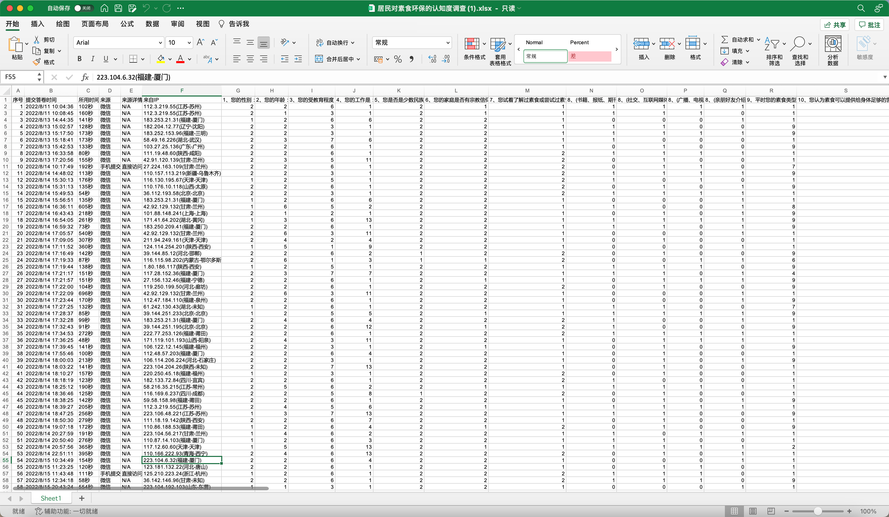
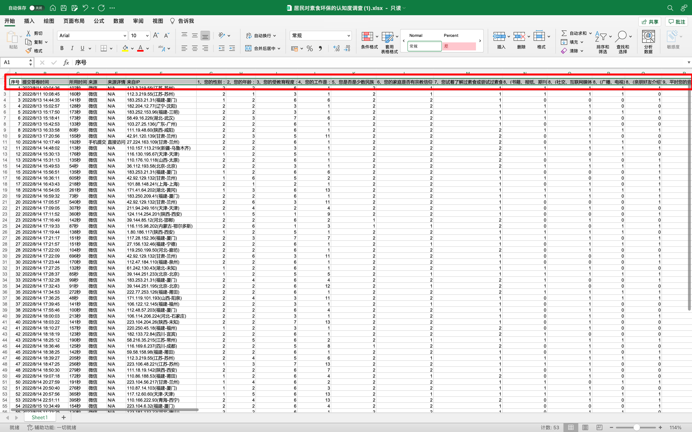

## 问卷调查 Excel 样式



<button name="button" style="color: black"><a href="https://bornforthis.cn/web_runing/blog/2022/06/%E5%B1%85%E6%B0%91%E5%AF%B9%E7%B4%A0%E9%A3%9F%E7%8E%AF%E4%BF%9D%E7%9A%84%E8%AE%A4%E7%9F%A5%E5%BA%A6%E8%B0%83%E6%9F%A5.xlsx" target="_blank">原文件下载</a></button>

## 生成代码

### 序号

直接 range 生成即可。

### 提交答卷时间

```python
import time

time_str = time.strftime('%Y/%m/%d %H:%M:%S', time.localtime(time.time()))  # 打印按指定格式排版的时间
print(time_str)
```

### 所用时间

```python
import random
print(str(random.randint(80, 600)) + "秒")
```

### 来源

直接微信即可

### 来源详情

直接 N/A

### 来自 IP

```python
from faker import Faker

faker = Faker("zh-CN")

template = "{ipv4}({province}-{city_name})"

for i in range(100):
    r = template.format(ipv4=faker.ipv4(), province=faker.province(), city_name=faker.city_name())
    print(r)
```

### Excel 头部生成

直接选中 Excel 头部：



复制出如下：

```python
1、您的性别：	2、您的年龄：	3、您的受教育程度：	4、您的工作是：	5、您是否是少数民族：	6、您的家庭是否有宗教信仰：	7、您试着了解过素食或尝试过素食：	8、(书籍、报纸、期刊)	8、(社交、互联网媒体)	8、(广播、电视)	8、(亲朋好友介绍)	9、平时您的素食类型：	10、您认为素食可以提供给身体足够的营养吗？	11、如果路过一家素食店，您会去品尝吗？	12、您会成为一个素食主义者吗？	13、您认为素食主义者比那些非素食主义者更健康吗？	14、为了环保和健康，需要每周安排一天吃素食，你是否能做到？	15、您觉得吃素对保持健康和幸福有多重要？	16、您觉得吃素对降低碳排放、保护环境有多重要？	17、您对喝牛奶能补钙怎么看？	18、您是否认为肉类产品可以补充人体所需的大多数蛋白质成分	19、您认为女性在怀孕期间是否可以坚持吃素吗？	20、您认为低脂纯素的饮食习惯是慢性疾病的终结者吗？	21、您有吃保健食品吗？	22、(预防疾病、促进健康)	22、(减肥塑身)	22、(提高运动或运动表现)	22、(增强免疫功能)	22、(提高记忆力或注意力)	22、(保护环境，爱护生灵)	22、(宗教信仰的影响)	22、(跟风随众)	22、(其他)	23、(家人朋友不理解、不认可或反对)	23、(每天不知道吃什么)	23、(外出就餐找不到合适的餐厅)	23、(超市和市场里可选择食材太少)	23、(不懂得如何进行营养搭配)	23、(不知道如何烹饪)	23、(聚餐时比较尴尬，因为其他人吃肉)	23、(单位食堂或外卖很难找到合适的饭菜)	24、(家人朋友的认可和理解)	24、(掌握更多烹饪技巧，让食物变得美味和丰富)	24、(需要学习更多营养学及中西医知识)	24、(能买到更多素食专属产品)	24、(其他)	总分
```

改写成 Python 字符串并生成目标数据：

```python
s = "1、您的性别：	2、您的年龄：	3、您的受教育程度：	4、您的工作是：	5、您是否是少数民族：	6、您的家庭是否有宗教信仰：	7、您试着了解过素食或尝试过素食：	8、(书籍、报纸、期刊)	8、(社交、互联网媒体)	8、(广播、电视)	8、(亲朋好友介绍)	9、平时您的素食类型：	10、您认为素食可以提供给身体足够的营养吗？	11、如果路过一家素食店，您会去品尝吗？	12、您会成为一个素食主义者吗？	13、您认为素食主义者比那些非素食主义者更健康吗？	14、为了环保和健康，需要每周安排一天吃素食，你是否能做到？	15、您觉得吃素对保持健康和幸福有多重要？	16、您觉得吃素对降低碳排放、保护环境有多重要？	17、您对喝牛奶能补钙怎么看？	18、您是否认为肉类产品可以补充人体所需的大多数蛋白质成分	19、您认为女性在怀孕期间是否可以坚持吃素吗？	20、您认为低脂纯素的饮食习惯是慢性疾病的终结者吗？	21、您有吃保健食品吗？	22、(预防疾病、促进健康)	22、(减肥塑身)	22、(提高运动或运动表现)	22、(增强免疫功能)	22、(提高记忆力或注意力)	22、(保护环境，爱护生灵)	22、(宗教信仰的影响)	22、(跟风随众)	22、(其他)	23、(家人朋友不理解、不认可或反对)	23、(每天不知道吃什么)	23、(外出就餐找不到合适的餐厅)	23、(超市和市场里可选择食材太少)	23、(不懂得如何进行营养搭配)	23、(不知道如何烹饪)	23、(聚餐时比较尴尬，因为其他人吃肉)	23、(单位食堂或外卖很难找到合适的饭菜)	24、(家人朋友的认可和理解)	24、(掌握更多烹饪技巧，让食物变得美味和丰富)	24、(需要学习更多营养学及中西医知识)	24、(能买到更多素食专属产品)	24、(其他)	总分"
s = s.replace("\t", " ")
s = s.replace("：", "")
r = s.split(" ")
print(r)
```

输出：

```python
['1、您的性别', '2、您的年龄', '3、您的受教育程度', '4、您的工作是', '5、您是否是少数民族', '6、您的家庭是否有宗教信仰', '7、您试着了解过素食或尝试过素食', '8、(书籍、报纸、期刊)', '8、(社交、互联网媒体)', '8、(广播、电视)', '8、(亲朋好友介绍)', '9、平时您的素食类型', '10、您认为素食可以提供给身体足够的营养吗？', '11、如果路过一家素食店，您会去品尝吗？', '12、您会成为一个素食主义者吗？', '13、您认为素食主义者比那些非素食主义者更健康吗？', '14、为了环保和健康，需要每周安排一天吃素食，你是否能做到？', '15、您觉得吃素对保持健康和幸福有多重要？', '16、您觉得吃素对降低碳排放、保护环境有多重要？', '17、您对喝牛奶能补钙怎么看？', '18、您是否认为肉类产品可以补充人体所需的大多数蛋白质成分', '19、您认为女性在怀孕期间是否可以坚持吃素吗？', '20、您认为低脂纯素的饮食习惯是慢性疾病的终结者吗？', '21、您有吃保健食品吗？', '22、(预防疾病、促进健康)', '22、(减肥塑身)', '22、(提高运动或运动表现)', '22、(增强免疫功能)', '22、(提高记忆力或注意力)', '22、(保护环境，爱护生灵)', '22、(宗教信仰的影响)', '22、(跟风随众)', '22、(其他)', '23、(家人朋友不理解、不认可或反对)', '23、(每天不知道吃什么)', '23、(外出就餐找不到合适的餐厅)', '23、(超市和市场里可选择食材太少)', '23、(不懂得如何进行营养搭配)', '23、(不知道如何烹饪)', '23、(聚餐时比较尴尬，因为其他人吃肉)', '23、(单位食堂或外卖很难找到合适的饭菜)', '24、(家人朋友的认可和理解)', '24、(掌握更多烹饪技巧，让食物变得美味和丰富)', '24、(需要学习更多营养学及中西医知识)', '24、(能买到更多素食专属产品)', '24、(其他)', '总分']
```

### 各个选项列表数据

对数据进行编码

```python
sex = [1, 2]
age = [1, 2, 3, 4, 5, 6]
education = [1, 2, 3, 4, 5, 6, 7, 8]
job = [i for i in range(1, 14)]
ethnic_minorities = [1, 2]  # 少数民族 ethnic minorities
religion = [1, 2]  # 宗教信仰
vegetarian_diet = [1, 2]  # 素食
book_newspaper_magazine = [0, 1]  # (书籍、报纸、期刊)
social_connection_internet_media = [0, 1]  # (社交、互联网媒体)
broadcast_tv = [0, 1]  # (广播、电视)
family_and_friends = [0, 1]  # (亲朋好友介绍)
vegetarian_diet_type = [1, 2, 3, 4, 5, 6, 7, 8, 9]
nutrition = [1, 2]  # 营养
vegetarian_diet_store = [1, 2]  # 素食店
vegetarian = [1, 2]  # 素食主义者
healthy = [1, 2]  # 健康
one_day_eat_vegetarian_diet = [1, 2]  # 一天吃素食
important = [1, 2, 3, 4, 5]  # 重要
environment_important = [1, 2, 3, 4, 5]  # 保护环境有多重要
milk = [1, 2, 3, 4]  # 牛奶
meat = [1, 2, 3]  # 肉类
pregnancy = [1, 2, 3, 4]  # 怀孕
lowe_fat = [1, 2, 3]
health_food = [1, 2, 3, 4, 5, 6]  # 保健食品
health = [0, 1]  # (预防疾病、促进健康)
keep_diet = [0, 1]  # (减肥塑身)
exercise = [0, 1]  # (提高运动或运动表现)
immune = [0, 1]  # (增强免疫功能)
memory = [0, 1]  # (提高记忆力或注意力)
protection = [0, 1]  # (保护环境，爱护生灵)
religione_influence = [0, 1]  # 宗教信仰的影响
follow = [0, 1]  # 跟风随众
other = [0, 1]  # 其他
incomprehension = [0, 1]  # 家人朋友不理解、不认可或反对
no_eat = [0, 1]  # 每天不知道吃什么
right_restaurant = [0, 1]  # 外出就餐找不到合适的餐厅
less = [0, 1]  # 超市和市场里可选择食材太少
match = [0, 1]  # 不懂得如何进行营养搭配
cook = [0, 1]  # 不知道如何烹饪
awkward = [0, 1]  # 聚餐时比较尴尬，因为其他人吃肉
take_out = [0, 1]  # 外卖
accept = [0, 1]  # 家人朋友的认可和理解
technical = [0, 1]  # 技巧
knowledge = [0, 1]  # 知识
product = [0, 1]  # 产品
```


## 生成

开始汇总上面的代码：

```python
import random
import time  # 引入time模块
import faker
import xlwt

sex = [1, 2]
age = [1, 2, 3, 4, 5, 6]
education = [1, 2, 3, 4, 5, 6, 7, 8]
job = [i for i in range(1, 14)]
ethnic_minorities = [1, 2]  # 少数民族 ethnic minorities
religion = [1, 2]  # 宗教信仰
vegetarian_diet = [1, 2]  # 素食
book_newspaper_magazine = [0, 1]  # (书籍、报纸、期刊)
social_connection_internet_media = [0, 1]  # (社交、互联网媒体)
broadcast_tv = [0, 1]  # (广播、电视)
family_and_friends = [0, 1]  # (亲朋好友介绍)
vegetarian_diet_type = [1, 2, 3, 4, 5, 6, 7, 8, 9]
nutrition = [1, 2]  # 营养
vegetarian_diet_store = [1, 2]  # 素食店
vegetarian = [1, 2]  # 素食主义者
healthy = [1, 2]  # 健康
one_day_eat_vegetarian_diet = [1, 2]  # 一天吃素食
important = [1, 2, 3, 4, 5]  # 重要
environment_important = [1, 2, 3, 4, 5]  # 保护环境有多重要
milk = [1, 2, 3, 4]  # 牛奶
meat = [1, 2, 3]  # 肉类
pregnancy = [1, 2, 3, 4]  # 怀孕
lowe_fat = [1, 2, 3]
health_food = [1, 2, 3, 4, 5, 6]  # 保健食品
health = [0, 1]  # (预防疾病、促进健康)
keep_diet = [0, 1]  # (减肥塑身)
exercise = [0, 1]  # (提高运动或运动表现)
immune = [0, 1]  # (增强免疫功能)
memory = [0, 1]  # (提高记忆力或注意力)
protection = [0, 1]  # (保护环境，爱护生灵)
religione_influence = [0, 1]  # 宗教信仰的影响
follow = [0, 1]  # 跟风随众
other = [0, 1]  # 其他
incomprehension = [0, 1]  # 家人朋友不理解、不认可或反对
no_eat = [0, 1]  # 每天不知道吃什么
right_restaurant = [0, 1]  # 外出就餐找不到合适的餐厅
less = [0, 1]  # 超市和市场里可选择食材太少
match = [0, 1]  # 不懂得如何进行营养搭配
cook = [0, 1]  # 不知道如何烹饪
awkward = [0, 1]  # 聚餐时比较尴尬，因为其他人吃肉
take_out = [0, 1]  # 外卖
accept = [0, 1]  # 家人朋友的认可和理解
technical = [0, 1]  # 技巧
knowledge = [0, 1]  # 知识
product = [0, 1]  # 产品

head_data = ['序号', '提交答卷时间', '所用时间', '来源', '来源详情', '来自IP',
             '1、您的性别', '2、您的年龄', '3、您的受教育程度', '4、您的工作是', '5、您是否是少数民族',
             '6、您的家庭是否有宗教信仰', '7、您试着了解过素食或尝试过素食', '8、(书籍、报纸、期刊)', '8、(社交、互联网媒体)',
             '8、(广播、电视)', '8、(亲朋好友介绍)', '9、平时您的素食类型', '10、您认为素食可以提供给身体足够的营养吗？',
             '11、如果路过一家素食店，您会去品尝吗？', '12、您会成为一个素食主义者吗？',
             '13、您认为素食主义者比那些非素食主义者更健康吗？', '14、为了环保和健康，需要每周安排一天吃素食，你是否能做到？',
             '15、您觉得吃素对保持健康和幸福有多重要？', '16、您觉得吃素对降低碳排放、保护环境有多重要？',
             '17、您对喝牛奶能补钙怎么看？', '18、您是否认为肉类产品可以补充人体所需的大多数蛋白质成分',
             '19、您认为女性在怀孕期间是否可以坚持吃素吗？', '20、您认为低脂纯素的饮食习惯是慢性疾病的终结者吗？',
             '21、您有吃保健食品吗？', '22、(预防疾病、促进健康)', '22、(减肥塑身)', '22、(提高运动或运动表现)',
             '22、(增强免疫功能)', '22、(提高记忆力或注意力)', '22、(保护环境，爱护生灵)', '22、(宗教信仰的影响)',
             '22、(跟风随众)', '22、(其他)', '23、(家人朋友不理解、不认可或反对)', '23、(每天不知道吃什么)',
             '23、(外出就餐找不到合适的餐厅)', '23、(超市和市场里可选择食材太少)', '23、(不懂得如何进行营养搭配)',
             '23、(不知道如何烹饪)', '23、(聚餐时比较尴尬，因为其他人吃肉)', '23、(单位食堂或外卖很难找到合适的饭菜)',
             '24、(家人朋友的认可和理解)', '24、(掌握更多烹饪技巧，让食物变得美味和丰富)',
             '24、(需要学习更多营养学及中西医知识)', '24、(能买到更多素食专属产品)', '24、(其他)', '总分']
# time_str = time.strftime('%Y/%m/%d %H:%M:%S', time.localtime(time.time()))  # 打印按指定格式排版的时间
wb = xlwt.Workbook()  # 新建一个 workbook 对象
sheet = wb.add_sheet('sheet')

for head in head_data:
    sheet.write(0, head_data.index(head), head)
    # sheet.write(行, 列, 写入数据)

faker = faker.Faker("zh-CN")
template = "{ipv4}({province}-{city_name})"
for row in range(1, 200):
    sheet.write(row, 0, row)  # 序号
    sheet.write(row, 1, time.strftime('%Y/%m/%d %H:%M:%S', time.localtime(time.time())))  # 提交答卷时间
    sheet.write(row, 2, str(random.randint(80, 600)) + "秒")  # 所用时间
    sheet.write(row, 3, random.choice(["微信", "QQ"]))  # 所用时间
    sheet.write(row, 4, "N/A")
    sheet.write(row, 5, template.format(ipv4=faker.ipv4(), province=faker.province(), city_name=faker.city_name()))
    sheet.write(row, 6, random.choice(sex))  # 性别
    sheet.write(row, 7, random.choice(age))  # 年龄
    sheet.write(row, 8, random.choice(education))
    sheet.write(row, 9, random.choice(job))
    sheet.write(row, 10, random.choice(ethnic_minorities))
    sheet.write(row, 11, random.choice(religion))
    sheet.write(row, 12, random.choice(vegetarian_diet))
    sheet.write(row, 13, random.choice(book_newspaper_magazine))
    sheet.write(row, 14, random.choice(social_connection_internet_media))
    sheet.write(row, 15, random.choice(broadcast_tv))
    sheet.write(row, 16, random.choice(family_and_friends))
    sheet.write(row, 17, random.choice(vegetarian_diet_type))
    sheet.write(row, 18, random.choice(nutrition))
    sheet.write(row, 19, random.choice(vegetarian_diet_store))
    sheet.write(row, 20, random.choice(vegetarian))
    sheet.write(row, 21, random.choice(healthy))
    sheet.write(row, 22, random.choice(one_day_eat_vegetarian_diet))
    sheet.write(row, 23, random.choice(important))
    sheet.write(row, 24, random.choice(environment_important))
    sheet.write(row, 25, random.choice(milk))
    sheet.write(row, 26, random.choice(meat))
    sheet.write(row, 27, random.choice(pregnancy))
    sheet.write(row, 28, random.choice(lowe_fat))
    sheet.write(row, 29, random.choice(health_food))
    sheet.write(row, 30, random.choice(health))
    sheet.write(row, 31, random.choice(keep_diet))
    sheet.write(row, 32, random.choice(exercise))
    sheet.write(row, 33, random.choice(immune))
    sheet.write(row, 34, random.choice(memory))
    sheet.write(row, 35, random.choice(protection))
    sheet.write(row, 36, random.choice(religione_influence))
    sheet.write(row, 37, random.choice(follow))
    sheet.write(row, 38, random.choice(other))
    sheet.write(row, 39, random.choice(incomprehension))
    sheet.write(row, 40, random.choice(no_eat))
    sheet.write(row, 41, random.choice(right_restaurant))
    sheet.write(row, 42, random.choice(less))
    sheet.write(row, 43, random.choice(match))
    sheet.write(row, 44, random.choice(cook))
    sheet.write(row, 45, random.choice(awkward))
    sheet.write(row, 46, random.choice(take_out))
    sheet.write(row, 47, random.choice(accept))
    sheet.write(row, 48, random.choice(technical))
    sheet.write(row, 49, random.choice(knowledge))
    sheet.write(row, 50, random.choice(product))
    sheet.write(row, 51, random.choice(other))

wb.save("demo200.xls")
```

```python
import random
import time  # 引入time模块
import faker
import xlwt

sex = [1, 2]
age = [1, 2, 3, 4, 5, 6]
education = [1, 2, 3, 4, 5, 6, 7, 8]
job = [i for i in range(1, 14)]
ethnic_minorities = [1, 2]  # 少数民族 ethnic minorities
religion = [1, 2]  # 宗教信仰
vegetarian_diet = [1, 2]  # 素食
book_newspaper_magazine = [0, 1]  # (书籍、报纸、期刊)
social_connection_internet_media = [0, 1]  # (社交、互联网媒体)
broadcast_tv = [0, 1]  # (广播、电视)
family_and_friends = [0, 1]  # (亲朋好友介绍)
vegetarian_diet_type = [1, 2, 3, 4, 5, 6, 7, 8, 9]
nutrition = [1, 2]  # 营养
vegetarian_diet_store = [1, 2]  # 素食店
vegetarian = [1, 2]  # 素食主义者
healthy = [1, 2]  # 健康
one_day_eat_vegetarian_diet = [1, 2]  # 一天吃素食
important = [1, 2, 3, 4, 5]  # 重要
environment_important = [1, 2, 3, 4, 5]  # 保护环境有多重要
milk = [1, 2, 3, 4]  # 牛奶
meat = [1, 2, 3]  # 肉类
pregnancy = [1, 2, 3, 4]  # 怀孕
lowe_fat = [1, 2, 3]
health_food = [1, 2, 3, 4, 5, 6]  # 保健食品
health = [0, 1]  # (预防疾病、促进健康)
keep_diet = [0, 1]  # (减肥塑身)
exercise = [0, 1]  # (提高运动或运动表现)
immune = [0, 1]  # (增强免疫功能)
memory = [0, 1]  # (提高记忆力或注意力)
protection = [0, 1]  # (保护环境，爱护生灵)
religione_influence = [0, 1]  # 宗教信仰的影响
follow = [0, 1]  # 跟风随众
other = [0, 1]  # 其他
incomprehension = [0, 1]  # 家人朋友不理解、不认可或反对
no_eat = [0, 1]  # 每天不知道吃什么
right_restaurant = [0, 1]  # 外出就餐找不到合适的餐厅
less = [0, 1]  # 超市和市场里可选择食材太少
match = [0, 1]  # 不懂得如何进行营养搭配
cook = [0, 1]  # 不知道如何烹饪
awkward = [0, 1]  # 聚餐时比较尴尬，因为其他人吃肉
take_out = [0, 1]  # 外卖
accept = [0, 1]  # 家人朋友的认可和理解
technical = [0, 1]  # 技巧
knowledge = [0, 1]  # 知识
product = [0, 1]  # 产品

head_data = ['序号', '提交答卷时间', '所用时间', '来源', '来源详情', '来自IP',
             '1、您的性别', '2、您的年龄', '3、您的受教育程度', '4、您的工作是', '5、您是否是少数民族',
             '6、您的家庭是否有宗教信仰', '7、您试着了解过素食或尝试过素食', '8、(书籍、报纸、期刊)', '8、(社交、互联网媒体)',
             '8、(广播、电视)', '8、(亲朋好友介绍)', '9、平时您的素食类型', '10、您认为素食可以提供给身体足够的营养吗？',
             '11、如果路过一家素食店，您会去品尝吗？', '12、您会成为一个素食主义者吗？',
             '13、您认为素食主义者比那些非素食主义者更健康吗？', '14、为了环保和健康，需要每周安排一天吃素食，你是否能做到？',
             '15、您觉得吃素对保持健康和幸福有多重要？', '16、您觉得吃素对降低碳排放、保护环境有多重要？',
             '17、您对喝牛奶能补钙怎么看？', '18、您是否认为肉类产品可以补充人体所需的大多数蛋白质成分',
             '19、您认为女性在怀孕期间是否可以坚持吃素吗？', '20、您认为低脂纯素的饮食习惯是慢性疾病的终结者吗？',
             '21、您有吃保健食品吗？', '22、(预防疾病、促进健康)', '22、(减肥塑身)', '22、(提高运动或运动表现)',
             '22、(增强免疫功能)', '22、(提高记忆力或注意力)', '22、(保护环境，爱护生灵)', '22、(宗教信仰的影响)',
             '22、(跟风随众)', '22、(其他)', '23、(家人朋友不理解、不认可或反对)', '23、(每天不知道吃什么)',
             '23、(外出就餐找不到合适的餐厅)', '23、(超市和市场里可选择食材太少)', '23、(不懂得如何进行营养搭配)',
             '23、(不知道如何烹饪)', '23、(聚餐时比较尴尬，因为其他人吃肉)', '23、(单位食堂或外卖很难找到合适的饭菜)',
             '24、(家人朋友的认可和理解)', '24、(掌握更多烹饪技巧，让食物变得美味和丰富)',
             '24、(需要学习更多营养学及中西医知识)', '24、(能买到更多素食专属产品)', '24、(其他)', '总分']
# time_str = time.strftime('%Y/%m/%d %H:%M:%S', time.localtime(time.time()))  # 打印按指定格式排版的时间
wb = xlwt.Workbook()  # 新建一个 workbook 对象
sheet = wb.add_sheet('sheet')

for head in head_data:
    sheet.write(0, head_data.index(head), head)
    # sheet.write(行, 列, 写入数据)

faker = faker.Faker("zh-CN")
template = "{ipv4}({province}-{city_name})"
for row in range(1, 200):
    sheet.write(row, 0, row)  # 序号
    sheet.write(row, 1, time.strftime('%Y/%m/%d %H:%M:%S', time.localtime(time.time())))  # 提交答卷时间
    sheet.write(row, 2, str(random.randint(80, 600)) + "秒")  # 所用时间
    sheet.write(row, 3, random.choice(["微信", "QQ"]))  # 所用时间
    sheet.write(row, 4, "N/A")
    sheet.write(row, 5, template.format(ipv4=faker.ipv4(), province=faker.province(), city_name=faker.city_name()))
    sheet.write(row, 6, random.choice(sex))  # 性别
    sheet.write(row, 7, random.choice(age))  # 年龄
    sheet.write(row, 8, random.choice(education))
    sheet.write(row, 9, random.choice(job))
    sheet.write(row, 10, random.choice(ethnic_minorities))
    sheet.write(row, 11, random.choice(religion))
    sheet.write(row, 12, random.choice(vegetarian_diet))
    sheet.write(row, 13, random.choice(book_newspaper_magazine))
    sheet.write(row, 14, random.choice(social_connection_internet_media))
    sheet.write(row, 15, random.choice(broadcast_tv))
    sheet.write(row, 16, random.choice(family_and_friends))
    sheet.write(row, 17, random.choice(vegetarian_diet_type))
    sheet.write(row, 18, random.choice(nutrition))
    sheet.write(row, 19, random.choice(vegetarian_diet_store))
    sheet.write(row, 20, random.choice(vegetarian))
    sheet.write(row, 21, random.choice(healthy))
    sheet.write(row, 22, random.choice(one_day_eat_vegetarian_diet))
    im23 = random.choice(important)
    sheet.write(row, 23, im23)
    im24 = random.choice(environment_important)
    sheet.write(row, 24, im24)
    sheet.write(row, 25, random.choice(milk))
    sheet.write(row, 26, random.choice(meat))
    sheet.write(row, 27, random.choice(pregnancy))
    sheet.write(row, 28, random.choice(lowe_fat))
    sheet.write(row, 29, random.choice(health_food))
    sheet.write(row, 30, random.choice(health))
    sheet.write(row, 31, random.choice(keep_diet))
    sheet.write(row, 32, random.choice(exercise))
    sheet.write(row, 33, random.choice(immune))
    sheet.write(row, 34, random.choice(memory))
    sheet.write(row, 35, random.choice(protection))
    sheet.write(row, 36, random.choice(religione_influence))
    sheet.write(row, 37, random.choice(follow))
    sheet.write(row, 38, random.choice(other))
    sheet.write(row, 39, random.choice(incomprehension))
    sheet.write(row, 40, random.choice(no_eat))
    sheet.write(row, 41, random.choice(right_restaurant))
    sheet.write(row, 42, random.choice(less))
    sheet.write(row, 43, random.choice(match))
    sheet.write(row, 44, random.choice(cook))
    sheet.write(row, 45, random.choice(awkward))
    sheet.write(row, 46, random.choice(take_out))
    sheet.write(row, 47, random.choice(accept))
    sheet.write(row, 48, random.choice(technical))
    sheet.write(row, 49, random.choice(knowledge))
    sheet.write(row, 50, random.choice(product))
    sheet.write(row, 51, random.choice(other))
    sheet.write(row, 52, im23 + im24)

wb.save("demo300.xls")
```

欢迎关注我公众号：AI悦创，有更多更好玩的等你发现！

::: details 公众号：AI悦创【二维码】


:::

::: info AI悦创·编程一对一

AI悦创·推出辅导班啦，包括「Python 语言辅导班、C++ 辅导班、java 辅导班、算法/数据结构辅导班、少儿编程、pygame 游戏开发」，全部都是一对一教学：一对一辅导 + 一对一答疑 + 布置作业 + 项目实践等。当然，还有线下线上摄影课程、Photoshop、Premiere 一对一教学、QQ、微信在线，随时响应！微信：Jiabcdefh

C++ 信息奥赛题解，长期更新！长期招收一对一中小学信息奥赛集训，莆田、厦门地区有机会线下上门，其他地区线上。微信：Jiabcdefh

方法一：[QQ](http://wpa.qq.com/msgrd?v=3&uin=1432803776&site=qq&menu=yes)

方法二：微信：Jiabcdefh

:::


