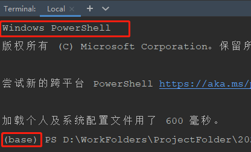
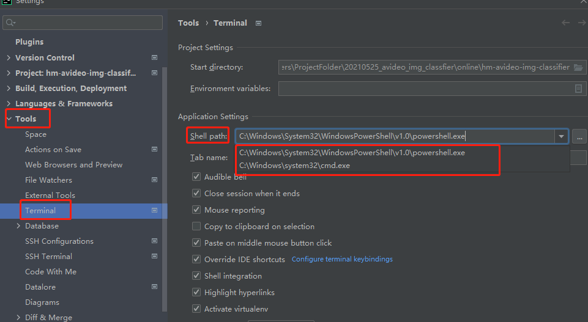
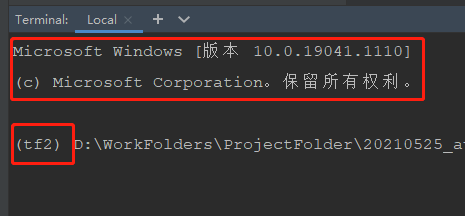

你好，我是悦创。

本来一直打开 terminal，会直接进入对应的虚拟环境，直到有一天更新  pycharm 后，发现打开 terminal 后直接进入了 base 环境，每次都要手动 activate 一下，比较麻烦仔细观察才发现，terminal 使用了 windows 的powershell，如下图所示：

## 解决办法：

Settings --> Tools --> Terminal --> Shell Path，`将 powershell 修改为 cmd.exe`，如下图所示：

修改 shell 过后，可以看到使用的是 windows 的 cmd shell ，并且会自动跳转到虚拟环境

欢迎关注我公众号：AI悦创，有更多更好玩的等你发现！

::: details 公众号：AI悦创【二维码】

:::

::: info AI悦创·编程一对一

AI悦创·推出辅导班啦，包括「Python 语言辅导班、C++ 辅导班、java 辅导班、算法/数据结构辅导班、少儿编程、pygame 游戏开发」，全部都是一对一教学：一对一辅导 + 一对一答疑 + 布置作业 + 项目实践等。当然，还有线下线上摄影课程、Photoshop、Premiere 一对一教学、QQ、微信在线，随时响应！微信：Jiabcdefh

C++ 信息奥赛题解，长期更新！长期招收一对一中小学信息奥赛集训，莆田、厦门地区有机会线下上门，其他地区线上。微信：Jiabcdefh

方法一：[QQ](http://wpa.qq.com/msgrd?v=3&uin=1432803776&site=qq&menu=yes)

方法二：微信：Jiabcdefh

:::

