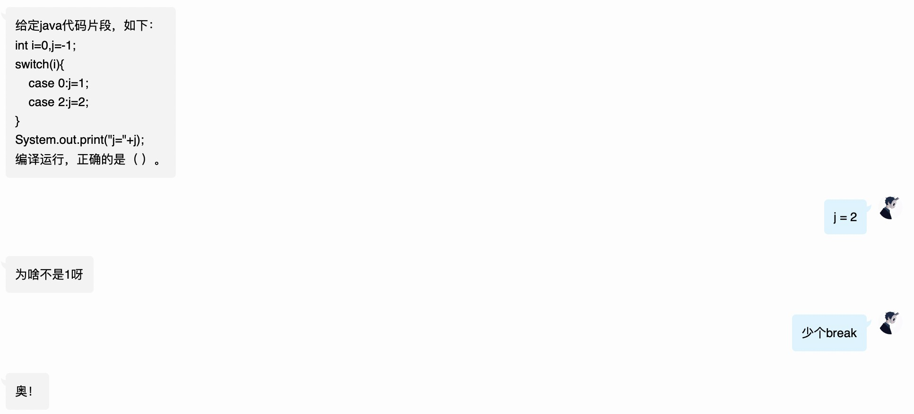
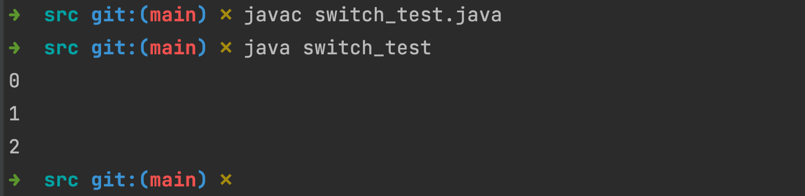
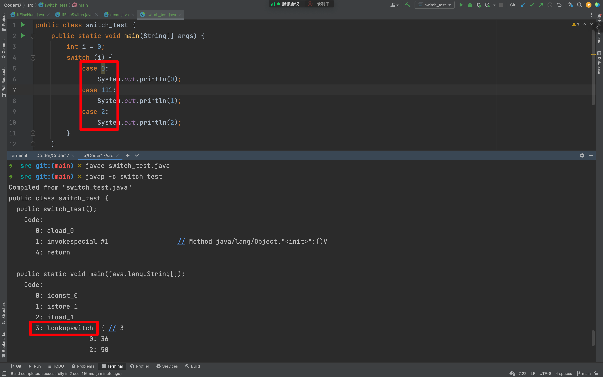

## 前言

你好，我是悦创。

一个小姐姐拿着一个 switch 的选择题来问我。



之所以这么笃定地回答这个问题，并不是我知道其中原理，而是之前在一个群里，有人问了同类型的问题，我瞥了一眼记住了答案，所以才依葫芦画瓢。

小姐姐接着问我为什么，我说少个 break，但凡再问一句：为什么少个 break 结果就不一样，我就回答不出来了。所以，为了将尴尬扼杀于摇篮，还是研究一下 break 在 switch 的作用。

## 从[字节码](#)出发

按照惯例，先写 demo 表述问题。

```java
public class switch_test {
    public static void main(String[] args) {
        int i = 0;
        switch (i) {
            case 0:
                System.out.println(0);
            case 1:
                System.out.println(1);
            case 2:
                System.out.println(2);
        }
    }
}
```

运行代码，结果如下：



明明只匹配了 case 0，为什么 1 和 2 也执行了？很费解！按照惯用套路，看看字节码能不能给个答案。

## javac 编译和 javap 查看

javap 是 JDK 自带的反汇编器，可以查看 java 编译器为我们生成的字节码。通过它，我们可以对照源代码和字节码，从而了解很多编译器内部的工作。

**语法：**

```java
➜  ~ javap -help
用法: javap <options> <classes>
其中, 可能的选项包括:
  -? -h --help -help               输出此帮助消息
  -version                         版本信息
  -v  -verbose                     输出附加信息
  -l                               输出行号和本地变量表
  -public                          仅显示公共类和成员
  -protected                       显示受保护的/公共类和成员
  -package                         显示程序包/受保护的/公共类
                                   和成员 (默认)
  -p  -private                     显示所有类和成员
  -c                               对代码进行反汇编
  -s                               输出内部类型签名
  -sysinfo                         显示正在处理的类的
                                   系统信息 (路径, 大小, 日期, MD5 散列)
  -constants                       显示最终常量
  --module <模块>, -m <模块>       指定包含要反汇编的类的模块
  --module-path <路径>             指定查找应用程序模块的位置
  --system <jdk>                   指定查找系统模块的位置
  --class-path <路径>              指定查找用户类文件的位置
  -classpath <路径>                指定查找用户类文件的位置
  -cp <路径>                       指定查找用户类文件的位置
  -bootclasspath <路径>            覆盖引导类文件的位置

GNU 样式的选项可使用 = (而非空白) 来分隔选项名称
及其值。

每个类可由其文件名, URL 或其
全限定类名指定。示例:
   path/to/MyClass.class
   jar:file:///path/to/MyJar.jar!/mypkg/MyClass.class
   java.lang.Object
```

## 实现反编译

```java
➜  src git:(main) ✗ javac switch_test.java
➜  src git:(main) ✗ javap -c switch_test 
Compiled from "switch_test.java"
public class switch_test {
  public switch_test();
    Code:
       0: aload_0
       1: invokespecial #1                  // Method java/lang/Object."<init>":()V
       4: return

  public static void main(java.lang.String[]);
    Code:
       0: iconst_0
       1: istore_1
       2: iload_1
       3: tableswitch   { // 0 to 2
                     0: 28
                     1: 35
                     2: 42
               default: 49
          }
      28: getstatic     #2                  // Field java/lang/System.out:Ljava/io/PrintStream;
      31: iconst_0
      32: invokevirtual #3                  // Method java/io/PrintStream.println:(I)V
      35: getstatic     #2                  // Field java/lang/System.out:Ljava/io/PrintStream;
      38: iconst_1
      39: invokevirtual #3                  // Method java/io/PrintStream.println:(I)V
      42: getstatic     #2                  // Field java/lang/System.out:Ljava/io/PrintStream;
      45: iconst_2
      46: invokevirtual #3                  // Method java/io/PrintStream.println:(I)V
      49: return
}
```

tableswitch 和 lookupswitch 都用于 switch 条件跳转。

- tableswitch：用于 case 值连续，例如上面代码中的 0、1、2；
- lookupswitch：用于 case 值不连续。



从字节码可以看出：switch 中的 case 条件和对应代码块是分开的。

```java
➜  src git:(main) ✗ javac switch_test.java
➜  src git:(main) ✗ javap -c switch_test 
Compiled from "switch_test.java"
public class switch_test {
  public switch_test();
    Code:
       0: aload_0
       1: invokespecial #1                  // Method java/lang/Object."<init>":()V
       4: return

  public static void main(java.lang.String[]);
    Code:
       0: iconst_0
       1: istore_1
       2: iload_1
       3: tableswitch   { // 0 to 2
                     0: 28
                     1: 35
                     2: 42
               default: 49
          }
      28: getstatic     #2                  // Field java/lang/System.out:Ljava/io/PrintStream;
      31: iconst_0
      32: invokevirtual #3                  // Method java/io/PrintStream.println:(I)V
      35: getstatic     #2                  // Field java/lang/System.out:Ljava/io/PrintStream;
      38: iconst_1
      39: invokevirtual #3                  // Method java/io/PrintStream.println:(I)V
      42: getstatic     #2                  // Field java/lang/System.out:Ljava/io/PrintStream;
      45: iconst_2
      46: invokevirtual #3                  // Method java/io/PrintStream.println:(I)V
      49: return
}
```

如上代码：

- case 为 0 时，跳转到标号 28 代码处；
- 为 1 时跳转到标号 35 代码处；
- 为 2 时跳转到标号 43 代码处；
- default 则跳转到标号 49 代码处。

这不，答案就出来了，当 case 0 匹配了之后，直接跳转到标号 28 代码处开始执行，输出 0，然后策马奔腾，一路小下坡，顺序执行完后面所有代码，直到标号 49 return，方法完执行完成，程序结束。

**如果按照正常的思维，是不是 case 0 匹配之后，跳到 28，执行完 28、31、32 输出 0 之后，就应该直接跳走，直接执行 49。那么，这个"跳走”用字节码应该怎么表示？**

用 return？那不行，因为 return 会结束方法，这样 switch 后代码也无法执行。

```java
public class switch_test {
    public static void main(String[] args) {
        int i = 0;
        switch (i) {
            case 0:
                System.out.println(0);
            case 111:
                System.out.println(1);
            case 2:
                System.out.println(2);
        }
        System.out.println("无 return");
    }
}
```

```java
0
1
2
无 return
```

```java
public class switch_test {
    public static void main(String[] args) {
        int i = 0;
        switch (i) {
            case 0:
                System.out.println(0);
                break;
            case 111:
                System.out.println(1);
                break;
            case 2:
                System.out.println(2);
                break;
        }
        System.out.println("无 return");
    }
}
```

```java
0
无 return
```

```java
public class switch_test {
    public static void main(String[] args) {
        int i = 0;
        switch (i) {
            case 0:
                System.out.println(0);
//                break;
                return;
            case 111:
                System.out.println(1);
//                break;
                return;
            case 2:
                System.out.println(2);
//                break;
                return;
        }
        System.out.println("无 return");
    }
}
```

```java
0
```

可以看见，原本的 `无 return` 没有再输出了。

那怎么办嘞....


## 关于 goto

> goto：无条件跳转，goto 1 表示跳转到标号 1 的代码处。

再写代码样例，这次在代码中给每个 case 都加上 break。

```java
public class switch_test {
    public static void main(String[] args) {
        int i = 0;
        switch (i) {
            case 0:
                System.out.println(0);
                break;
            case 1:
                System.out.println(1);
                break;
            case 2:
                System.out.println(2);
                break;
        }
    }
}
// 输出
0
```

还是进行使用命令行编译和反编译：

```java
➜  src git:(main) ✗ javac switch_test.java
➜  src git:(main) ✗ javap -c switch_test  
Compiled from "switch_test.java"
public class switch_test {
  public switch_test();
    Code:
       0: aload_0
       1: invokespecial #1                  // Method java/lang/Object."<init>":()V
       4: return

  public static void main(java.lang.String[]);
    Code:
       0: iconst_0
       1: istore_1
       2: iload_1
       3: tableswitch   { // 0 to 2
                     0: 28
                     1: 38
                     2: 48
               default: 55
          }
      28: getstatic     #2                  // Field java/lang/System.out:Ljava/io/PrintStream;
      31: iconst_0
      32: invokevirtual #3                  // Method java/io/PrintStream.println:(I)V
      35: goto          55
      38: getstatic     #2                  // Field java/lang/System.out:Ljava/io/PrintStream;
      41: iconst_1
      42: invokevirtual #3                  // Method java/io/PrintStream.println:(I)V
      45: goto          55
      48: getstatic     #2                  // Field java/lang/System.out:Ljava/io/PrintStream;
      51: iconst_2
      52: invokevirtual #3                  // Method java/io/PrintStream.println:(I)V
      55: return
}
```

如图，与第一次的字节码相比，在标号 35、45 都有了 goto 指令。

如果 case 0 匹配成功，则跳到标号 28 执行，执行完代码块对应的 31、32 指令之后，执行 35 的 goto 指令跳转到标号 55，这样就跳出了 switch 作用范围，case 1 和 2 也不会被执行。

等等，怎么少了一个 goto，在标号 55 的上方应该还有一个 goto 才对！其实这就涉及到了编译器优化技术，最后一个 goto 也是跳转到标号 55 的指令，但没有 goto 下一步也一样顺序执行此行指令，所以这个 goto 被编译器视为无用代码进行了消除。

## switch 和 if 区别

先用 if 实现上面 switch 逻辑。

```java
public class if_test {
    public static void main(String[] args) {
        int i = 0;
        if (i == 0) {
            System.out.println(0);
        } else if (i == 1) {
            System.out.println(1);
        } else if (i == 2) {
            System.out.println(2);
        }
    }
}
```

编译成字节码：

```java
➜  src git:(main) ✗ javac if_test.java 
➜  src git:(main) ✗ javap -c if_test 
Compiled from "if_test.java"
public class if_test {
  public if_test();
    Code:
       0: aload_0
       1: invokespecial #1                  // Method java/lang/Object."<init>":()V
       4: return

  public static void main(java.lang.String[]);
    Code:
       0: iconst_0
       1: istore_1
       2: iload_1
       3: ifne          16
       6: getstatic     #2                  // Field java/lang/System.out:Ljava/io/PrintStream;
       9: iconst_0
      10: invokevirtual #3                  // Method java/io/PrintStream.println:(I)V
      13: goto          43
      16: iload_1
      17: iconst_1
      18: if_icmpne     31
      21: getstatic     #2                  // Field java/lang/System.out:Ljava/io/PrintStream;
      24: iconst_1
      25: invokevirtual #3                  // Method java/io/PrintStream.println:(I)V
      28: goto          43
      31: iload_1
      32: iconst_2
      33: if_icmpne     43
      36: getstatic     #2                  // Field java/lang/System.out:Ljava/io/PrintStream;
      39: iconst_2
      40: invokevirtual #3                  // Method java/io/PrintStream.println:(I)V
      43: return
}
```

if_icmpne 用于比较两个 int 数。

**从字节码也可以看出 if 和 switch 的区别：**

- if 条件和代码块的字节码是顺序的，switch 条件和代码块是分开的；
- if 自动生成 goto 指令，switch 只有加了break才生成goto指令。

结语
case中的break告诉前端编译器：给每个case对应代码块的最后加上goto。这样，执行完匹配上的代码之后，就可以略过后面的case代码块了。


假设我们有如下这样一个 switch 语句：

```java
public class demo {
    public static void main(String[] args) {
        int n = 1;
        switch (n) {
            case 1:
                System.out.println(1);
            case 2:
                System.out.println(2);
            case 3:
                System.out.println(3);
            default:
                System.out.println("Default");
        }
    }
}
```

输出：

```java
1
2
3
Default
```

当我们在执行上面的方法时，如果我们传入的参数是 1，那么会输出 1、2、3 和 default，如果传入的参数是 2，那么会输出 2、3 和default，这是为什么呢？

这是因为 switch 的 case 语句是用来根据满足条件从确定的行开始执行的，如果不加入 break 语句跳出 switch 逻辑，则会一直往下执行，这也是为什么上面的测试代码会出现传入参数为 2 时会输出 2、3 和 default。

为此，我们也可以看一下上面的代码编译后的 class 文件，我们可以看到如下内容：

```java
public static void main();  
   0  iload_0 [n]  
   1  tableswitch default: 49  
        case 1: 28  
        case 2: 35  
        case 3: 42  
  28  getstatic java.lang.System.out : java.io.PrintStream [22]  
  31  iconst_1  
  32  invokevirtual java.io.PrintStream.println(int) : void [28]  
  35  getstatic java.lang.System.out : java.io.PrintStream [22]  
  38  iconst_2  
  39  invokevirtual java.io.PrintStream.println(int) : void [28]  
  42  getstatic java.lang.System.out : java.io.PrintStream [22]  
  45  iconst_3  
  46  invokevirtual java.io.PrintStream.println(int) : void [28]  
  49  getstatic java.lang.System.out : java.io.PrintStream [22]  
  52  ldc <String "Default"> [33]  
  54  invokevirtual java.io.PrintStream.println(java.lang.String) : void [35]
```

上面编译后的语句每行前面的数字是程序的指定序号，我们可以把它简单的理解为行号，我们可以看到数字为 1 的那行定义了一个  switch 指定，其默认会跳到 49 行，如果传入的参数是 1 则跳到 28 行执行，如果是 2 则跳到 35 行执行，如果是 3 则跳到 42 行执行。

那么我们先来看程序的第 28 行到 32 行，其对应的就是调用 `System.out.println` 输出 1，完了后没有特殊的指令，程序是会继续顺序执行的，也就是会依次执行 35、38、直到 57 行结束。

如果我们把源程序的 case 语句末端都加上 break 语句，如下这样：

```java
public class demo {
    public static void main(String[] args) {
        int n = 2;
        switch (n) {
            case 1:
                System.out.println(1);
                break;
            case 2:
                System.out.println(2);
                break;
            case 3:
                System.out.println(3);
                break;
            default:
                System.out.println("Default");
                break;
        }
    }
}
```

 那么对应的编译的 class 文件通过，编辑器打开后可以看到如下内容：

```java
public static void main();  
   0  iload_0 [n]  
   1  tableswitch default: 58  
        case 1: 28  
        case 2: 38  
        case 3: 48  
  28  getstatic java.lang.System.out : java.io.PrintStream [22]  
  31  iconst_1  
  32  invokevirtual java.io.PrintStream.println(int) : void [28]  
  35  goto 66  
  38  getstatic java.lang.System.out : java.io.PrintStream [22]  
  41  iconst_2  
  42  invokevirtual java.io.PrintStream.println(int) : void [28]  
  45  goto 66  
  48  getstatic java.lang.System.out : java.io.PrintStream [22]  
  51  iconst_3  
  52  invokevirtual java.io.PrintStream.println(int) : void [28]  
  55  goto 66  
  58  getstatic java.lang.System.out : java.io.PrintStream [22]  
  61  ldc <String "Default"> [33]  
  63  invokevirtual java.io.PrintStream.println(java.lang.String) : void [35]  
  66  return
```

我们可以看到 switch 语句默认会执行 58 行，如果传入的参数是 1 则会执行 28 行，如果是 2 则会从 38 行开始执行，接着我们可以看到 28 行开始是执行的 `System.out.println(1)` 的逻辑，完了后会顺序执行到 35 行，35 行的指令是会引导程序执行到第 66 行，也就是跳出了 switch 逻辑，对应我们的测试代码就是程序结束了。这也是为什么我们在使用 switch 语句时通常需要在每个 case 语句结束时加入 break 指令的原因。

欢迎关注我公众号：AI悦创，有更多更好玩的等你发现！

::: details 公众号：AI悦创【二维码】


:::

::: info AI悦创·编程一对一

AI悦创·推出辅导班啦，包括「Python 语言辅导班、C++ 辅导班、java 辅导班、算法/数据结构辅导班、少儿编程、pygame 游戏开发」，全部都是一对一教学：一对一辅导 + 一对一答疑 + 布置作业 + 项目实践等。当然，还有线下线上摄影课程、Photoshop、Premiere 一对一教学、QQ、微信在线，随时响应！微信：Jiabcdefh

C++ 信息奥赛题解，长期更新！长期招收一对一中小学信息奥赛集训，莆田、厦门地区有机会线下上门，其他地区线上。微信：Jiabcdefh

方法一：[QQ](http://wpa.qq.com/msgrd?v=3&uin=1432803776&site=qq&menu=yes)

方法二：微信：Jiabcdefh

:::


