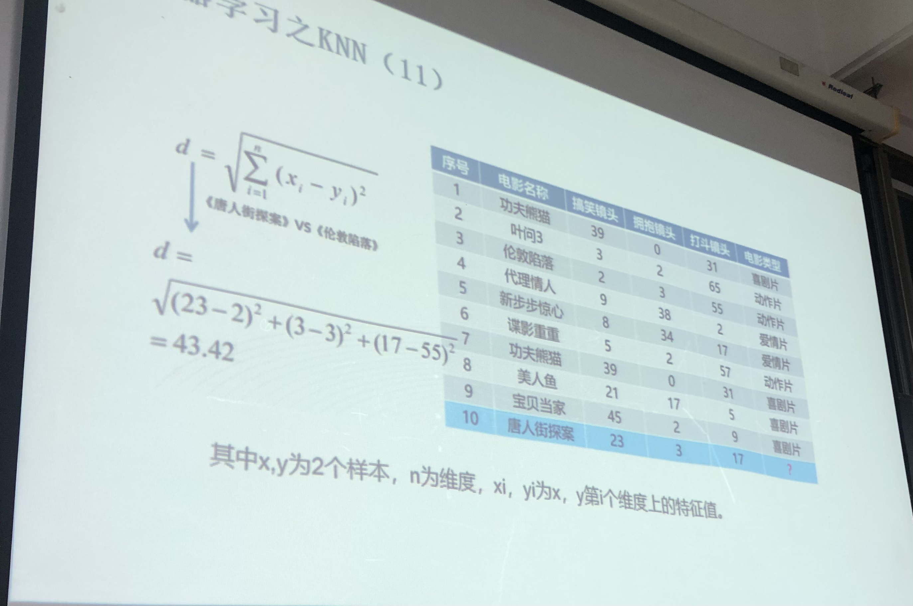

## 一、介绍

k-近邻算法（K-Nearest Neighbour algorithm），又称 KNN 算法，是数据挖掘技术中原理最简单的算法。

工作原理：给定一个已知标签类别的训练数据集，输入没有标签的新数据后，在训练数据集中找到与新数据最邻近的 k 个实例，如果这 k 个实例的多数属于某个类别，那么新数据就属于这个类别。简单理解为：由那些离 X 最近的 k 个点来投票决定 X 归为哪一类。

## 二、k-近邻算法的步骤
（1）计算已知类别数据集中的点与当前点之间的距离；

（2）按照距离递增次序排序；

（3）选取与当前点距离最小的 k 个点；

（4）确定前k个点所在类别的出现频率；

（5）返回前 k 个点出现频率最高的类别作为当前点的预测类别。

## 三、Python 实现

判断一个电影是爱情片还是动作片。

| 电影名称 |   搞笑镜头 | 拥抱镜头 | 打斗镜头 | 电影类型 |        |
| -------: | ---------: | -------: | -------: | -------: | ------ |
|        0 |   功夫熊猫 |       39 |        0 |       31 | 喜剧片 |
|        1 |      叶问3 |        3 |        2 |       65 | 动作片 |
|        2 |   伦敦陷落 |        2 |        3 |       55 | 动作片 |
|        3 |   代理情人 |        9 |       38 |        2 | 爱情片 |
|        4 | 新步步惊心 |        8 |       34 |       17 | 爱情片 |
|        5 |   谍影重重 |        5 |        2 |       57 | 动作片 |
|        6 |   功夫熊猫 |       39 |        0 |       31 | 喜剧片 |
|        7 |     美人鱼 |       21 |       17 |        5 | 喜剧片 |
|        8 |   宝贝当家 |       45 |        2 |        9 | 喜剧片 |
|        9 | 唐人街探案 |       23 |        3 |       17 | ？     |

欢迎关注我公众号：AI悦创，有更多更好玩的等你发现！

::: details 公众号：AI悦创【二维码】

:::

::: info AI悦创·编程一对一

AI悦创·推出辅导班啦，包括「Python 语言辅导班、C++ 辅导班、java 辅导班、算法/数据结构辅导班、少儿编程、pygame 游戏开发」，全部都是一对一教学：一对一辅导 + 一对一答疑 + 布置作业 + 项目实践等。当然，还有线下线上摄影课程、Photoshop、Premiere 一对一教学、QQ、微信在线，随时响应！微信：Jiabcdefh

C++ 信息奥赛题解，长期更新！长期招收一对一中小学信息奥赛集训，莆田、厦门地区有机会线下上门，其他地区线上。微信：Jiabcdefh

方法一：[QQ](http://wpa.qq.com/msgrd?v=3&uin=1432803776&site=qq&menu=yes)

方法二：微信：Jiabcdefh

:::

