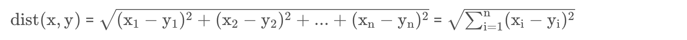

## 一、介绍

你好，我是悦创。

本文是由给私教学员 cava 讲解时编写，主要逻辑没有错误。

k-近邻算法（K-Nearest Neighbour algorithm），又称 KNN 算法，是数据挖掘技术中原理最简单的算法。

工作原理：给定一个已知标签类别的训练数据集，输入没有标签的新数据后，在训练数据集中找到与新数据最邻近的 k 个实例，如果这 k 个实例的多数属于某个类别，那么新数据就属于这个类别。简单理解为：由那些离 X 最近的 k 个点来投票决定 X 归为哪一类。

## 二、k-近邻算法的步骤
（1）计算已知类别数据集中的点与当前点之间的距离；

（2）按照距离递增次序排序；

（3）选取与当前点距离最小的 k 个点；

（4）确定前k个点所在类别的出现频率；

（5）返回前 k 个点出现频率最高的类别作为当前点的预测类别。

## 三、Python 实现

判断一个电影是爱情片还是动作片。


| 电影名称 |   搞笑镜头 | 拥抱镜头 | 打斗镜头 | 电影类型 |        |
| -------: | ---------: | -------: | -------: | -------: | ------ |
|        0 |   功夫熊猫 |       39 |        0 |       31 | 喜剧片 |
|        1 |      叶问3 |        3 |        2 |       65 | 动作片 |
|        2 |   伦敦陷落 |        2 |        3 |       55 | 动作片 |
|        3 |   代理情人 |        9 |       38 |        2 | 爱情片 |
|        4 | 新步步惊心 |        8 |       34 |       17 | 爱情片 |
|        5 |   谍影重重 |        5 |        2 |       57 | 动作片 |
|        6 |   功夫熊猫 |       39 |        0 |       31 | 喜剧片 |
|        7 |     美人鱼 |       21 |       17 |        5 | 喜剧片 |
|        8 |   宝贝当家 |       45 |        2 |        9 | 喜剧片 |
|        9 | 唐人街探案 |       23 |        3 |       17 | ？     |

**欧氏距离**



### 构建数据集

```python
rowdata = {
    "电影名称": ['功夫熊猫', '叶问3', '伦敦陷落', '代理情人', '新步步惊心', '谍影重重', '功夫熊猫', '美人鱼', '宝贝当家'],
    "搞笑镜头": [39,3,2,9,8,5,39,21,45],
    "拥抱镜头": [0,2,3,38,34,2,0,17,2],
    "打斗镜头": [31,65,55,2,17,57,31,5,9],
    "电影类型": ["喜剧片", "动作片", "动作片", "爱情片", "爱情片", "动作片", "喜剧片", "喜剧片", "喜剧片"]
}
```

### 计算已知类别数据集中的点与当前点之间的距离

```python
new_data = [24,67]
dist = list((((movie_data.iloc[:6,1:3]-new_data)**2).sum(1))**0.5)
```

### 将距离升序排列，然后选取距离最小的 k 个点「容易拟合·以后专栏再论」

```python
k = 4
dist_l = pd.DataFrame({'dist': dist, 'labels': (movie_data.iloc[:6, 3])}) 
dr = dist_l.sort_values(by='dist')[:k]
```

### 确定前 k 个点的类别的出现概率

```python
re = dr.loc[:,'labels'].value_counts()
re.index[0]
```

### 选择频率最高的类别作为当前点的预测类别

```python
result = []
result.append(re.index[0])
result
```

## 四、约会网站配对效果判定

```python
# 导入数据集
datingTest = pd.read_table('datingTestSet.txt',header=None)
datingTest.head()

# 分析数据
%matplotlib inline
import matplotlib as mpl
import matplotlib.pyplot as plt

#把不同标签用颜色区分
Colors = []
for i in range(datingTest.shape[0]):
    m = datingTest.iloc[i,-1]  # 标签
    if m=='didntLike':
        Colors.append('black')
    if m=='smallDoses':
        Colors.append('orange')
    if m=='largeDoses':
        Colors.append('red')

#绘制两两特征之间的散点图
plt.rcParams['font.sans-serif']=['Simhei'] #图中字体设置为黑体
pl=plt.figure(figsize=(12,8))  # 建立一个画布

fig1=pl.add_subplot(221)  # 建立两行两列画布，放在第一个里面
plt.scatter(datingTest.iloc[:,1],datingTest.iloc[:,2],marker='.',c=Colors)
plt.xlabel('玩游戏视频所占时间比')
plt.ylabel('每周消费冰淇淋公升数')

fig2=pl.add_subplot(222)
plt.scatter(datingTest.iloc[:,0],datingTest.iloc[:,1],marker='.',c=Colors)
plt.xlabel('每年飞行常客里程')
plt.ylabel('玩游戏视频所占时间比')

fig3=pl.add_subplot(223)
plt.scatter(datingTest.iloc[:,0],datingTest.iloc[:,2],marker='.',c=Colors)
plt.xlabel('每年飞行常客里程')
plt.ylabel('每周消费冰淇淋公升数')
plt.show()


# 数据归一化
def minmax(dataSet):
    minDf = dataSet.min()
    maxDf = dataSet.max()
    normSet = (dataSet - minDf )/(maxDf - minDf)
    return normSet

datingT = pd.concat([minmax(datingTest.iloc[:, :3]), datingTest.iloc[:,3]], axis=1)
datingT.head()

# 切分训练集和测试集
def randSplit(dataSet,rate=0.9):
    n = dataSet.shape[0] 
    m = int(n*rate)
    train = dataSet.iloc[:m,:]
    test = dataSet.iloc[m:,:]
    test.index = range(test.shape[0])
    return train,test

train,test = randSplit(datingT)


# 分类器针对约会网站的测试代码
def datingClass(train,test,k):
    n = train.shape[1] - 1  # 将标签列减掉
    m = test.shape[0]  # 行数
    result = []
    for i in range(m):
        dist = list((((train.iloc[:, :n] - test.iloc[i, :n]) ** 2).sum(1))**5)
        dist_l = pd.DataFrame({'dist': dist, 'labels': (train.iloc[:, n])})
        dr = dist_l.sort_values(by = 'dist')[: k]
        re = dr.loc[:, 'labels'].value_counts()
        result.append(re.index[0])
    result = pd.Series(result)  
    test['predict'] = result  # 增加一列
    acc = (test.iloc[:,-1]==test.iloc[:,-2]).mean()
    print(f'模型预测准确率为{acc}')
    return test


datingClass(train,test,5)  # 95%
```

## 五、手写数字识别

```python
import os


#得到标记好的训练集
def get_train():
    path = 'digits/trainingDigits'
    trainingFileList = os.listdir(path)
    train = pd.DataFrame()
    img = []  # 第一列原来的图像转换为图片里面0和1，一行
    labels = []  # 第二列原来的标签
    for i in range(len(trainingFileList)):
        filename = trainingFileList[i]
        txt = pd.read_csv(f'digits/trainingDigits/{filename}', header = None) #32行
        num = ''
        # 将32行转变为1行
        for i in range(txt.shape[0]):
            num += txt.iloc[i,:]
        img.append(num[0])
        filelable = filename.split('_')[0]
        labels.append(filelable)
    train['img'] = img
    train['labels'] = labels
    return train
    
train = get_train()   


# 得到标记好的测试集
def get_test():
    path = 'digits/testDigits'
    testFileList = os.listdir(path)
    test = pd.DataFrame()
    img = []  # 第一列原来的图像转换为图片里面0和1，一行
    labels = []  # 第二列原来的标签
    for i in range(len(testFileList)):
        filename = testFileList[i]
        txt = pd.read_csv(f'digits/testDigits/{filename}', header = None) #32行
        num = ''
        # 将32行转变为1行
        for i in range(txt.shape[0]):
            num += txt.iloc[i,:]
        img.append(num[0])
        filelable = filename.split('_')[0]
        labels.append(filelable)
    test['img'] = img
    test['labels'] = labels
    return test

test = get_test()

# 分类器针对手写数字的测试代码
from Levenshtein import hamming

def handwritingClass(train, test, k):
    n = train.shape[0]
    m = test.shape[0]
    result = []
    for i in range(m):
        dist = []
        for j in range(n):
            d = str(hamming(train.iloc[j,0], test.iloc[i,0]))
            dist.append(d)
        dist_l = pd.DataFrame({'dist':dist, 'labels':(train.iloc[:,1])})
        dr = dist_l.sort_values(by='dist')[:k]
        re = dr.loc[:,'labels'].value_counts()
        result.append(re.index[0])
    result = pd.Series(result)
    test['predict'] = result
    acc = (test.iloc[:,-1] == test.iloc[:,-2]).mean()
    print(f'模型预测准确率为{acc}')
    return test

handwritingClass(train, test, 3)  # 97.8%
```

## 六、算法优缺点
### 优点
（1）简单好用，容易理解，精度高，理论成熟，既可以用来做分类也可以用来做回归；

（2）可用于数值型数据和离散型数据；

（3）无数据输入假定；

（4）适合对稀有事件进行分类。

### 缺点
（1）计算复杂性高；空间复杂性高；

（2）计算量大，所以一般数值很大的适合不用这个，但是单个样本又不能太少，否则容易发生误分；

（3）样本不平衡问题（即有些类别的样本数量很多，而其他样本的数量很少）；

（4）可理解性比较差，无法给出数据的内在含义

欢迎关注我公众号：AI悦创，有更多更好玩的等你发现！

::: details 公众号：AI悦创【二维码】


:::

::: info AI悦创·编程一对一

AI悦创·推出辅导班啦，包括「Python 语言辅导班、C++ 辅导班、java 辅导班、算法/数据结构辅导班、少儿编程、pygame 游戏开发」，全部都是一对一教学：一对一辅导 + 一对一答疑 + 布置作业 + 项目实践等。当然，还有线下线上摄影课程、Photoshop、Premiere 一对一教学、QQ、微信在线，随时响应！微信：Jiabcdefh

C++ 信息奥赛题解，长期更新！长期招收一对一中小学信息奥赛集训，莆田、厦门地区有机会线下上门，其他地区线上。微信：Jiabcdefh

方法一：[QQ](http://wpa.qq.com/msgrd?v=3&uin=1432803776&site=qq&menu=yes)

方法二：微信：Jiabcdefh

:::

