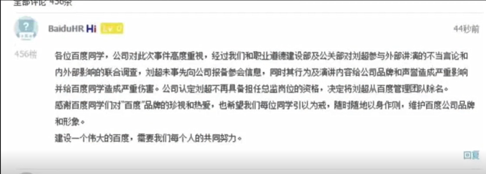
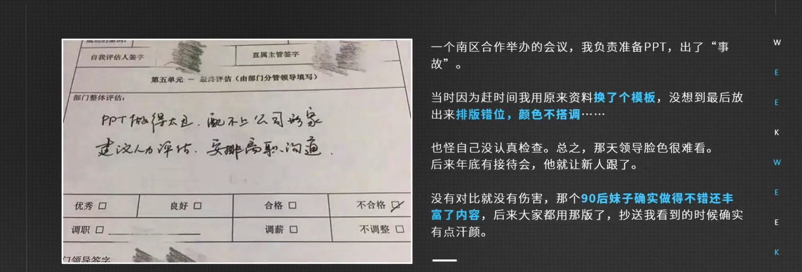
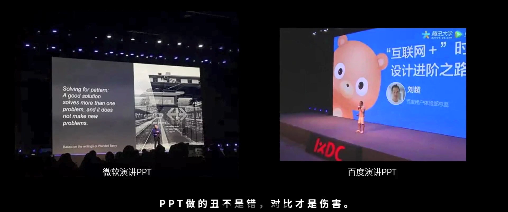
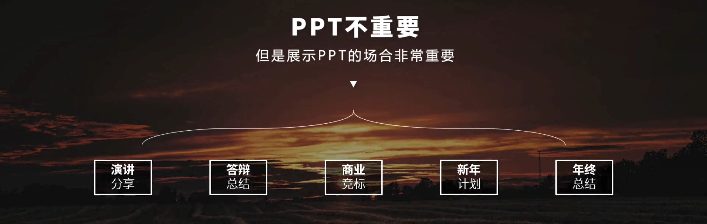
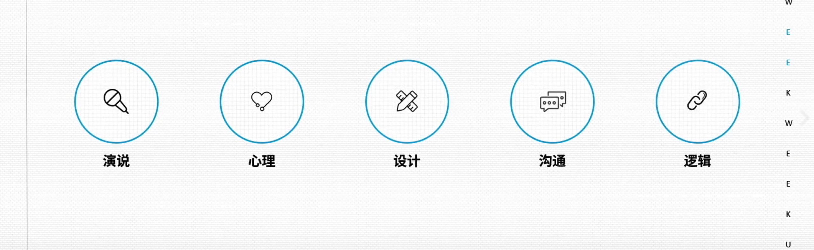
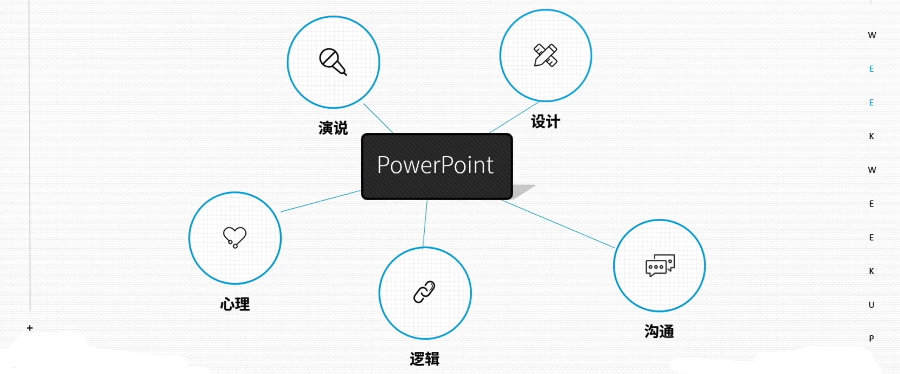
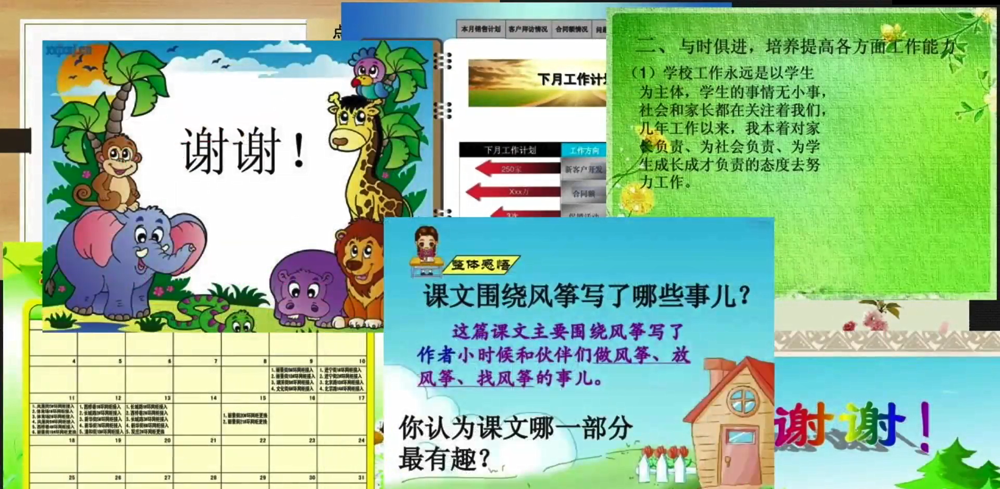
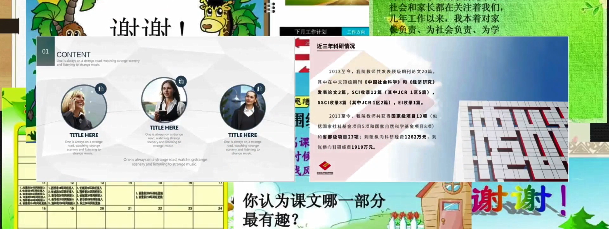
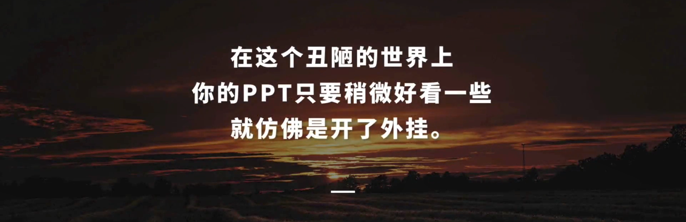

## 1. PPT 凭什么很重要？

### 1.1 PPT 应用场景

你好，我是悦创。

我们先来列举一下，什么时候需要 PPT：

- 演讲分享
- 答辩总结
- 商业竞标
- 新年计划
- 年终总结

> 面对数百观众的演讲（分享）
>
> 你要毕业了，做毕业答辩（总结）
>
> 那之后你工作了，需要独自面对一个项目。那这个叫做 **商业竞标** 
>
> 放完年假之后呢，你有可能要和大家介绍一个新的一年的工作安排。———**新年计划**
>
> 辛苦劳作一年之后，我们可能得做——**年终总结**

你会发现，这些时刻都是会影响你前途未来命运和未来形象的重要时刻。

你还会发现，PPT 本身并不会很重要。但是展示 PPT 的场合是很重要的。稍不小心，你就有可能命途多舛。

### 1.2 百度刘总监的故事

百度刘超设计总监，多么好的年轻人啊。未来很可能成为百度的副总裁，但就是在 **IXDC（2018云栖大会）（2016国际体验设计大会峰会演讲）** 断送了，刘超的前程。

百度 HR 在内部发表的帖子

### 1.3 国企老王的故事

那无独有偶，这个国企老王在单位差不多也混了八年，在回到办公桌的时候，桌子上放有人事发来的函件，我们可以看一下上面写的理由是：PPT 做得太丑，配不上公司形象。

### 1.4 解析

其实，我是蛮能理解刘超和老王的点为什么会点这么背阿。刘超作为设计总监，在那样的大会上做出那样的 PPT ，那是不是给我们的百度公司的形象受损呀。那公司形象受损了，那他也自然不好过了。

老王我们得到的信息有限，但在国企也是兢兢业业工作了八年。PPT 是一直的丑，那偏偏今年就被开除了呢？

我们来仔细看一下文字信息阿，我会发现是不是有个新来的员工，90后的妹子，估计 PPT 做得比他好多了，态度呢？我猜也比老王积极，这样一来公司心理就有数了。

说到这里，相信大家对 PPT 的重要性已经有点数了。

::: tip 说句实话：

PPT 不重要，但是展示 PPT 的场合非常重要

:::

好，那这时候会有人问老师，老师我知道 PPT 的重要性了，那你告诉我：PPT 学起来到底难还是不难？

## 2. PPT 学起来困难么？

那我可以负责人的告诉大家，**PPT 学起来，难的要死。**

因为，PPT 是一个非常综合类的学科。

它涉及到 **演说、心理、设计、沟通、逻辑** 五大学科交叉。

其中，五个都是非常磅礴复杂，更何况是组合在一起的呢？

当然，这些是涉及到专业级的选手。

除非你想做一个专业级的演说大师，成为一个专业的设计师。对于我们这种普通人来说，大家可以尽可能的放轻松。

其实，对于我们普通人来说，PPT 学起来，**可简单了。因为对手实在是太弱。**

我们生活中见到的 PPT 呢，90% 是这样子的：

那如果在这一堆丑陋的 PPT 当中，突然出现两张漂亮的 PPT。

这也是说，在工作中其实也是一样的。

如果你的 PPT 明显比大多数员工能力稍微要强一些，要漂亮一些。领导的眼中就只有你啦。

在工作中被领导欣赏、重视有多么重要，其实这种重要性我就不言而喻了。

其实，对于你来说我们只要稍微把 PPT 做的稍微好看一些，你的人生其实就跟开了外挂是一样的。

而做得好看，其实是 PPT 里面所有的知识点最简单、最容易的。

这也是我们本系列课程中最终要的任务。

我会通过一系列非常直观的例子，人人都能学会、学好的 PPT 设计的规律和方法。

最终教会你做出一套好看又好用的 PPT。

下节课再见，下课。

