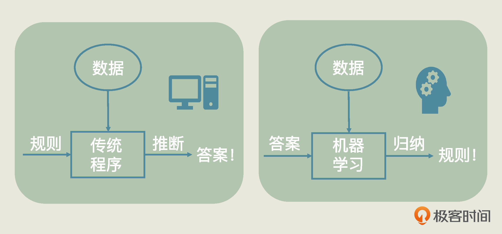
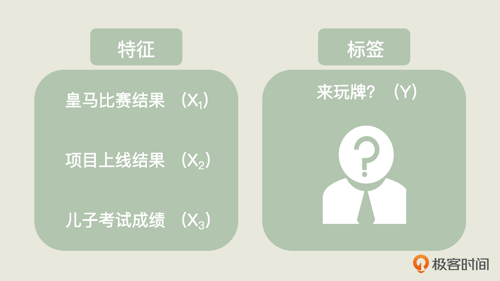

<audio id="audio" controls="" preload="none">
      <source id="mp3" src="/零基础实战机器学习/01.mp3">
</audio>

你好，我是黄佳。

欢迎来到《零基础实战机器学习》！在开篇词里面，我说过学机器学习的秘诀是“做中学”。不过呢，即使上来就想要上手做，最最最基础的知识你还是得懂点。

说是基础知识，其实你也不用怕。我们这一讲里要讲的知识点不多、也不难，主要是想讲讲什么是机器学习和一些最常见的概念。你不知道这些的话，肯定是没法开始实战的。

除此之外，我想讲讲机器学习的分类。我讲这些，是想让你在实战之前对机器学习的大类心中有数，方便你一边实战，一边构建自己的知识图谱。同时，也可以让你提前了解下我们的实战项目，对我们将来要闯的关卡有个预期。而至于更多的基础知识，我会带你边做项目边学习。

在开始之前，我们先给这一讲设一个小目标，就是你在学完之后，当别人问你什么是机器学习的时候，你要能够给他解释明白。真能把这个说清楚了，你这节课也就没白学了。

## 什么是机器学习

这个问题其实不好回答，因为机器学习涵盖的内容太多了。

- 机器学习之父 Arthur Samuel 对机器学习的定义是： **在没有明确设置的情况下，使计算机具有学习能力的研究领域。** 
- 国际机器学习大会的创始人之一 Tom Mitchell 对机器学习的定义是： **计算机程序从经验 E 中学习，解决某一任务 T，进行某一性能度量 P，通过 P 测定在 T 上的表现因经验 E 而提高。**

这两个定义你看了之后可能瞬间就懵了，没关系，这里我用“人话”来和你解释一下。

现在，请你想象这样一个场景：你周日约了小李、老王打牌，小李先来了，老王没来。你想打电话叫老王过来。小李说：“你别打电话啦，昨天老王喜欢的球队皇马输球了，他的项目在上个礼拜也没成功上线，再加上他儿子期末考试不及格，他肯定没心情来。”

这种情况下，你觉得老王会来吗？

一般情况下，我们都会觉得老王大概率不会来了。不过，你有想过我们是怎么得出这个结论的吗？

实际上我们运用了“推理”。我们人类的大脑做这样的推理似乎是自然而然的事儿。但是，对于计算机来说，如果它也像小李那样有老王的“历史数据”，知道他看皇马，知道他的项目情况，知道他儿子的成绩，那计算机能推出这个结论吗？对于长期以来只能按照人类预设规则解决问题的机器来说，这可并不是件容易的事。

而机器学习的厉害之处就在于，它能 **利用计算机的运算能力，从大量的数据中发现一个“函数”或“模型”，并通过它来模拟现实世界事物间的关系，从而实现预测、判断等目的。** 这个过程的关键是建立一个合适的模型，并能主动地根据这个模型进行“推理”，而这个建模的过程就是机器的“学习”过程。

那么机器学习和我们传统的程序有什么区别呢？实际上，传统程序是程序员把已知的规则定义好后输入给机器的，而机器学习则从已知数据中，通过不断试错、自我优化、自身总结，归纳出规则来。下面这张图，直观地阐述了机器学习和传统程序的区别，你可以看一下。

这张图中展示了机器学习的本质特征， **就是从数据中发现规则。**

**虽然说我们希望机器最终能主动地去预测，但在此之前，机器具体选什么模型、如何训练、怎么调参，我们人类还是要在这个过程中给机器很多指导的，这就是我这门课要教你的。**

不过，机器到底怎样建立新的模型呢？我们继续以刚才的场景为例，不过，现在我想请你从函数的角度想一想刚才发生了什么？

要预测老王的状况，我们就需要建立一个“ **预测老王会不会来** ”的函数，而“皇马输赢”、“项目情况”、“儿子成绩”都是输入到这个函数的自变量，我们设为 x1, x2, x3。这些自变量每一个发生变化，都会影响到函数的结果，也就是因变量 y。

在机器学习中，这些自变量，就叫做 **特征（feature）**，因变量 y 叫做 **标签（label）**。而一批历史特征和一批历史标签的集合，就是机器学习的数据集。

理解了这些，我们就可以更加“精准”地定义机器是怎么“学习”的了，就是在已知数据集的基础上，通过反复的计算，选择最贴切的函数去描述数据集中自变量 x1, x2, x3, …, xn 和因变量 y 之间的因果关系。这个过程，就叫做机器学习的训练，也叫 **拟合**。

基于这一点，我们可以说： **传统程序是程序员来定义函数，而在机器学习中是机器训练出函数。**

最初用来训练的**数据集**，就是**训练数据集（training dataset）**。

当机器通过训练找到了一个函数，我们还需要**验证**和**评估**，也就是说，这时候我们要给机器另一批同类数据特征，看机器能不能用这个函数推出这批**数据的标签**。这一过程就是在验证模型是否能够被推广、泛化，而此时我们用到的数据集，就叫**验证数据集（validation dataset）**。

简单来说，在验证、评估的过程里，我们就是要验证这个函数到底好不好。如果这个函数通过了评估，那就可以在 **测试数据集（test dataset）** 上做最终的测试；如果通过不了，就需要继续找新的模型。

讲到这里，我想你已经对机器学习有了一定的了解。不知道你有没有发现，标签似乎对于机器学习模型有很重要的指导性意义，因为机器必须根据已有的数据来找到特征和标签之间的关系。那么，你可能会问了，机器在训练过程中一定要有标签吗？

其实，机器学习不一定要有标签，具体我们可以分三种情况来看：

- 训练数据集全部有标签，叫监督学习（supervised learning）；
- 训练数据集没有标签，叫做无监督学习（unsupervised learning）；
- 在训练数据集中，有的数据有标签，有的数据没有标签，我们叫做半监督学习（semi-supervised learning）。

目前，监督学习是应用最广泛的主流机器学习算法，所以，我们这个课程的重点会放在监督学习上。当然，对于剩下两种，我也会做个简单的介绍。我们先来着重了解一下什么是监督学习。

## 什么是监督学习

在监督学习中，我们需要重点关注的是监督学习问题的分类。你可能会想问，佳哥，我为什么要知道它的分类？这是因为，明确要解决的问题是机器学习项目的第一步，也是非常重要的一步。如果我们不了解问题的类型，就无法选择合适的算法。

欢迎关注我公众号：AI悦创，有更多更好玩的等你发现！

::: details 公众号：AI悦创【二维码】

:::

::: info AI悦创·编程一对一

AI悦创·推出辅导班啦，包括「Python 语言辅导班、C++ 辅导班、java 辅导班、算法/数据结构辅导班、少儿编程、pygame 游戏开发」，全部都是一对一教学：一对一辅导 + 一对一答疑 + 布置作业 + 项目实践等。当然，还有线下线上摄影课程、Photoshop、Premiere 一对一教学、QQ、微信在线，随时响应！微信：Jiabcdefh

C++ 信息奥赛题解，长期更新！长期招收一对一中小学信息奥赛集训，莆田、厦门地区有机会线下上门，其他地区线上。微信：Jiabcdefh

方法一：[QQ](http://wpa.qq.com/msgrd?v=3&uin=1432803776&site=qq&menu=yes)

方法二：微信：Jiabcdefh

:::

