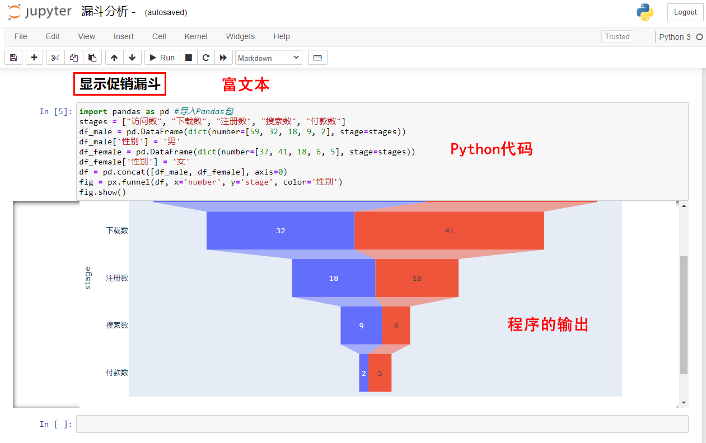
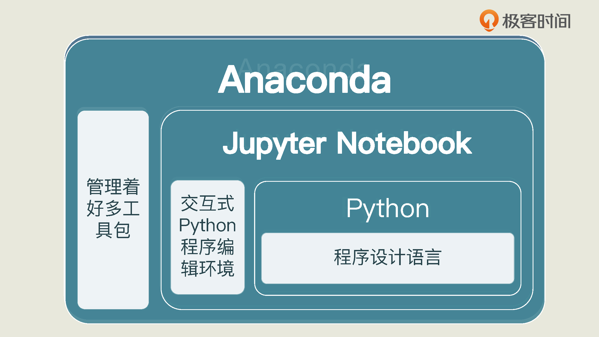
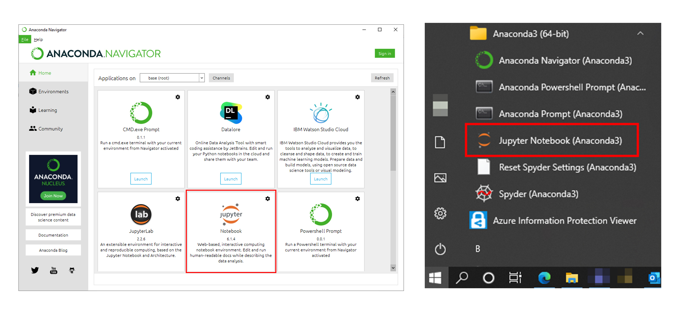
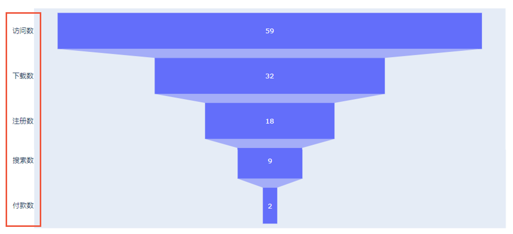
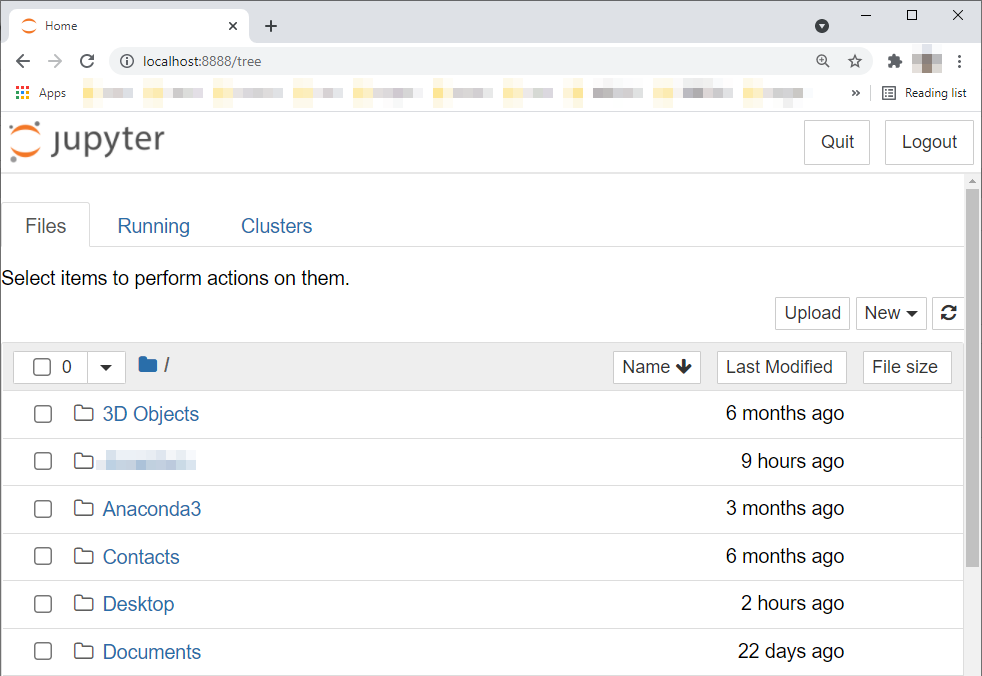

<audio id="audio" controls="" preload="none">
      <source id="mp3" src="/零基础实战机器学习/02.mp3">
</audio>

你好，我是黄佳。

欢迎来到零基础实战机器学习。工欲善其事，必先利其器，好的环境让我们事半功倍。今天我要讲的就是怎么来搭建机器学习运行的环境。

你也许听说过机器学习项目对配置要求高，硬件上需要带 GPU 的显卡，软件上面需要在 Server 中搭建 PyTorch 和 TensorFlow 2.0 什么的。这些东西是不是听起来就挺麻烦的。

其实没有那么复杂。我觉得对于初学者来说，你不必过于纠结上面的工具。我们只是要进行一些简单的实战项目。而这些简单的项目，在本机上完全可以跑通。所以我建议你就用你手头上的笔记本电脑，装个 Jupyter Notebook 就足够了。

你听到这可能会想问什么是 Jupyter Notebook 呀？你可以把它想象成一个类似于网页的多媒体文档，但是，比普通网页更高一筹的是，它还能直接通过浏览器运行代码块，在代码块下方展示运行结果，就像下图中这样：

Jupyter Notebook 可以交互式开发，再加上拥有富文本格式，可以显示图文，非常直观，所以它能迅速地展现数据分析师的想法，是我们上手机器学习的最佳工具。

选好了工具之后，我们还得确定要用什么语言。我们课程选的是 Python，所有源代码都是用 Python 实现的。之所以选 Python 是因为 Python 在 AI 开发中是最常用的语言了，而且 Python 非常简单，只要你稍微有些编程方面的基础知识，就能看懂我们的代码。而我们推荐使用的工具 Jupyter Notebook 可以支持多种语言，其中就包括 Python。

在这一讲，我会带着你把 Jupyter Notebook 安装好，并把其中的 Python 程序跑起来。这个 Python 程序，我不会带着你跑 Hello World，那个太过于简单了，我会带着你画个图，让你了解一下 Jupyter Notebook 的运行过程，方便你之后上手用它。

## 安装和启动 Jupyter Notebook

要在本机搭建 Jupyter Notebook 平台进行机器学习项目，有一种最简单的方法，就是下载并安装 Anaconda。Anaconda 是一个免费的开发环境，能帮你管理众多的 Python 库，并支持 Jupyter Notebook、JupyterLab、Spyder 等工具。

Python + Anaconda + Jupyter Notebook 这三样东西加在一起，基本上就是机器学习工程师的标配。如果你还是对这哥仨的关系不太明白，可以看看下面的图：

虽然我说了我们需要的是这哥仨，但是别紧张，其实你只需要安装 Anaconda 就行啦，剩下的两样是 Anaconda 打包自带的。

Anaconda 的安装其实非常简单。首先，我们到 [Anaconda](https://www.anaconda.com/products/distribution) 官网下载最新的个人版本。对于我们初学者来说，个人版本就够用了。选择好适合本机电脑系统的版本下载后，我们直接选择所有的默认选项就行了。Anaconda 是跨平台的，Windows，Linux，Mac OS 上都可以装。

成功安装之后，我们就可以在 Anaconda 中启动 Jupyter Notebook 了。启动 Jupyter Notebook 有两种方法：你可以直接 Anaconda 初始界面里启动它；也可以在开始菜单栏的 Anaconda3 目录中找到 Jupyter Notebook 来启动它。这两种启动如下图所示：

在上面这两种启动方式中，我推荐第二种方法。因为直接启动 Jupyter Notebook 可以占用较少系统资源，因此启动起来也比较快。

Jupyter Notebook 是我们课程的主要编辑工具。你初次接触它，可能对它还比较陌生。没关系，接下来，我会通过画一个图，来给你讲讲 Jupyter Notebook 是怎么运行的。其中涉及的一些操作和工具，我们会在后续的项目中频繁使用。

## 实战 Jupyter Notebook

我想带你画的图是这样一个漏斗图：

“漏斗图”听起来好像有点专业，但它其实就是一个呈现用户流失情况的图。上面这个图的最上面一层，展现的是有多少人浏览这个网页，接下来的几层分别展示的是有多少人下载这个 App、注册 App、搜索商品、下单购买鲜花。每层的人数是我们早就统计好的。

如果你没听懂漏斗图是做什么的，其实没关系。我们是想通过画这个图来学习怎么使用 Jupyter Notebook 的，所以你只要知道我们是要通过一些已知数据来画这个图的就行了。

**那么怎么画出这个漏斗？**

你可能会觉得我们需要写很复杂的代码，去定义这个漏斗绘图的规则。其实是不用的。因为我们用的是 Python，而 Python 的一大特点就是可以通过 import 语句导入各种各样的包和模块，来帮助我们用他人已经整理好的函数、方法和算法解决问题。Python 里已经有画图的包了，我们直接调用就好了。

所以画漏斗图听起来很复杂，但总结起来就三步：先安装一个可以画漏斗图的包，然后导入它，最后把数据放到这个包里运行就行啦。而在这个过程中，我想教你的是怎么安装包，调用包。这些都是我们未来会常常用到的操作。

当然了，在做任何项目之前，你都需要新建一个 Notebook（这里我们就把 Jupyter Notebook 文件简称为 Notebook 吧）。所以我们先来看看怎么新建 Notebook。

新建 Notebook 很简单，启动 Jupyter Notebook 后，在你的默认浏览器（我用的是 Chrome）中就会显示本机默认目录页面，就像下图中这样，选择任意一个你想放 Notebook 的目录，就可以新建了。

除了新建自己的 Notebook，你也可以把我在创建的 [Notebook](/零基础实战机器学习/data/漏斗分析.ipynb)，也就是后缀名为 ipynb 的文件下载下来，直接修改它。

欢迎关注我公众号：AI悦创，有更多更好玩的等你发现！

::: details 公众号：AI悦创【二维码】

:::

::: info AI悦创·编程一对一

AI悦创·推出辅导班啦，包括「Python 语言辅导班、C++ 辅导班、java 辅导班、算法/数据结构辅导班、少儿编程、pygame 游戏开发」，全部都是一对一教学：一对一辅导 + 一对一答疑 + 布置作业 + 项目实践等。当然，还有线下线上摄影课程、Photoshop、Premiere 一对一教学、QQ、微信在线，随时响应！微信：Jiabcdefh

C++ 信息奥赛题解，长期更新！长期招收一对一中小学信息奥赛集训，莆田、厦门地区有机会线下上门，其他地区线上。微信：Jiabcdefh

方法一：[QQ](http://wpa.qq.com/msgrd?v=3&uin=1432803776&site=qq&menu=yes)

方法二：微信：Jiabcdefh

:::

