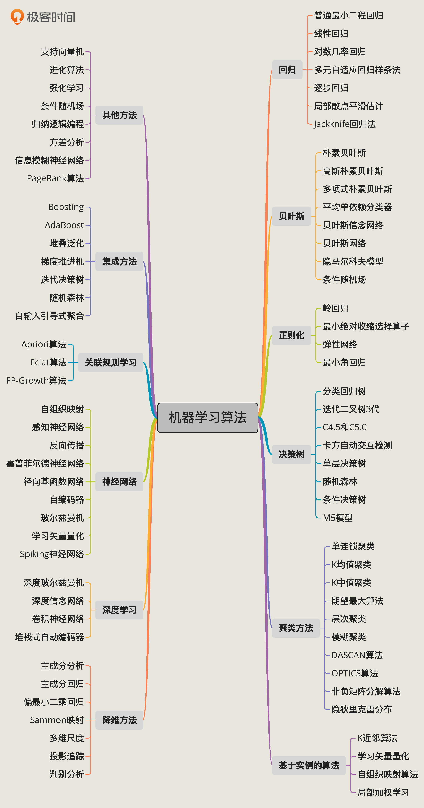
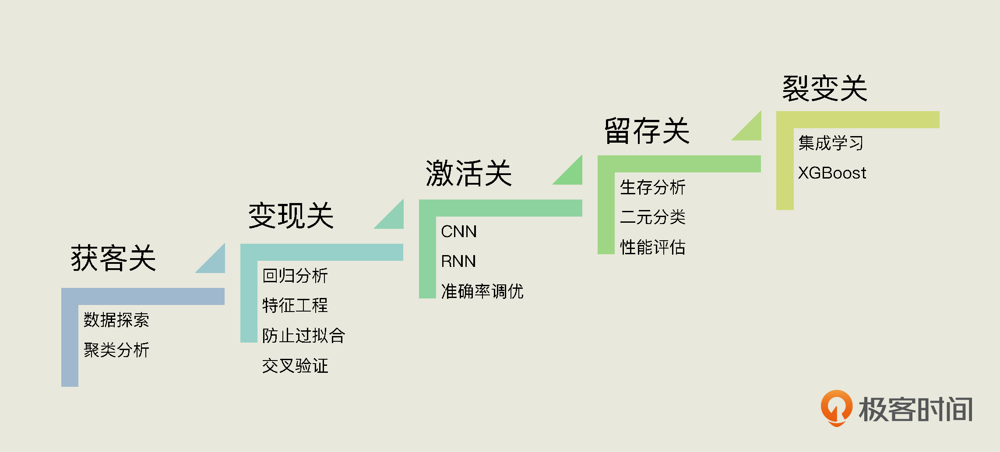

<audio id="audio" controls="" preload="none">
      <source id="mp3" src="/零基础实战机器学习/01.mp3">
</audio>

你好，我是黄佳。

去年，我写了一本书，叫《零基础学机器学习》。很多人都挺喜欢这本书，就问我我是怎么入行机器学习的。要说这事儿，得从十几年前开始说起喽。

## IT 老兵和“寒冬”的故事

我是一个 IT 老兵。早在 2005 年，我就写了本书叫《SAP 程序设计》，这个是国内第一本讲 SAP 的书。后来我还写了很多 SAP 进阶的书。所以，我算得上是 SAP 这方面的资深顾问吧。

可是呢我就发现啊，人他不可能只靠着一种技术就吃一辈子的饭。所以啊，这日子过着过着，我突然发现，曾经那么火爆的、20 年前就号称年薪百万的 SAP 顾问市场变得越来越冷清了。而我所在公司的大客户们的兴趣点，都纷纷转移到了 AI、大数据、上云这些新领域上了。所以我只好开始关注数据科学、机器学习和云计算这些技术，关注如何帮他们从数据中挖掘出价值。

我知道，你也许还没有像我一样，遭遇行业的“寒冬”。可是互联网行业日新月异，我们稍不留神就会被后浪打在沙滩上，所以你可能也会担心自己的未来，也想在自己的主技能之外，学一些新的“保命”技能。

而机器学习是现在的热点，聊天机器人、人脸识别、自动驾驶以及所有大型电商的精准推荐系统背后都是机器学习。不仅如此，机器学习还能解决很多工作上的问题：

- 比如说公众号的阅读量一旦超过 10 万，你就看不到具体数量的统计了。这时候，机器学习就能通过“点赞”量和“朋友在看”量估算出阅读量；
- 还有公众号的自动留言回复，机器学习可以为不同类型的留言，选择不同类型的回复，甚至过滤掉恶意的评价；
- 又比如说做网络电商，机器学习可以找到我们最需要关注的那一批高价值的用户；
- ……

除此之外，机器学习也还能解决生活中的很多实际问题，比如预测你的女朋友今天开不开心呀，预测明年白菜会不会涨价之类的。考虑到这些优点，你可能也想学点机器学习的知识。可是机器学习的算法又多又难，让你望而却步。

就比如下面这张机器学习算法图，它还只是机器学习领域的冰山一角。是个人看到这里，都会发出疑问：这怎么学！

在行业的“寒冬”，面对机器学习这样的“高山”，我开始转型的时候，也和你一样惶恐、不知如何下手。不过，我凭借自己 20 多年的从业经验，终究还是越过了这座“高山”。我成为了公司的机器学习专家，还写了这本《零基础学机器学习》。而且，在摸索着入了门以后，我只花了几个月的时间，就总结出了一套属于自己的学习秘诀。

听到这里，你肯定很想知道这个秘诀是啥吧。别着急，我接下来会倾囊相授的。不过，比这个秘诀更重要的是，你要想清楚一个问题：为什么要学机器学习呢？

你的答案可能有很多，但是不外乎有两大类：一是，我要研究机器学习算法；二是，我要使用机器学习技术。

如果你的答案是第一类，我的建议是打好数学基础，硬啃机器学习的经典教材，深入研究机器学习的算法，并研读最前沿的论文。而如果你的答案是要使用机器学习的技术，那我觉得对你来说，**最简单的学习方法就是“做中学”。**

因为我工作的主要内容，就是把机器学习技术用起来，从数据中挖掘出新的价值。所以，我是典型的第二类人，“做中学”的方法就可以让我快速入门机器学习，掌握它的精髓。

但说实话，我一开始学习的时候，却和第一类人一样，一上手就开始硬啃经典教程。在我刚研究了两个月机器学习的各类图书、论文的时候，公司就来了个项目：客户希望我们用新的 AI 算法，来帮他提高垃圾邮件分类器的效率。

怎么办呢？

那时候我看不懂很多的算法，但项目来了不能不做。所以，我就一边继续研究各种算法，一边收集大量的邮件数据；然后就把那些算法运用到这些数据里，来训练模型；有了模型以后再比较它们的效率。就这样鼓捣了几个月之后，我还真就调出来了个不错的模型。用户一试，分类效率提升近 20%！

做完了这个项目，我也就了解了机器学习从建模到部署的全部流程，也用了深度学习解决了实际的问题。再回过头去看看这个过程，对我来说，了解算法中每一步的实现细节真的那么重要吗？

其实，对于我们这些机器学习的应用者来说，我们的价值在于，结合每一个业务的实际需要，把算法模型灵活地运用到一个一个的具体场景之中去。

所以算法原理要了解，但算法的推导细节就没那么重要了。而算法的原理，你只要在“做中学”就好了，而且带着问题去学，更有利于加深你对概念和理论的理解。所以，如果你也希望自己快速上手机器学习的话，我建议你一定要从动手做实际项目开始。

## 怎么才能从实际项目开始呢？

不过，你可能仍然会有下面这些想法：

- 佳哥，你是在工作中学的，那我在工作中接触不到这样的项目怎么办？
- 我是个 Java 或者其它技术栈的程序员，也没接触过机器学习或者 Python，能直接上手实战吗？
- 我连机器学习的算法有啥都不知道，怎么找到、选择适合我的项目的算法呢？
- 就算找到了算法，Python 里有这么多包，我该用哪个呢？

总而言之，就是我做都不会做，我还能从“做中学”吗？我的答案是：当然能。而且这门课正是为你准备的。

其实，当初我入门机器学习的时候，就发现现在的机器学习教程，特别不利于我们这种抱着“学点实用技能”的想法，去学习机器学习的人。

- 有些资料里充斥着大量算法的解析。这对于研究者来说是必备的，但对于只是想把机器学习当做工具的普通程序员和数据分析人员来说，就没啥必要了。
- 还有些教程过于简单，它们很多是用“日漫”风格的文字和插画解释机器学习算法的。你看完这些图，好像明白了什么，但一实践就会发现根本不知道这些算法到底该怎么用。
- 还有些资料中理论和实践内容搭配得很合理，但问题在于缺少真实的业务场景。比如，它们大多数用的还是“预测加州的房价”、“给鸢尾花分类”这样的教学型案例，很难给我们更多实用性的启发，遇到实际问题了仍不知怎么去做。

因此，基于我入门机器学习的痛点问题，我设计的这门课程，就是希望给你一个尽可能接近真实业务场景的项目，让你通过闯业务场景关来学习机器学习。这个过程中，我会手把手教你针对项目，怎么搜寻合适的算法，怎么找到最合适的包来完成项目。

如果你认认真真地把课程学完、把所有的项目做完，你就能获得一个从具体问题到合适的算法再到所需工具的完整知识图谱。

同时，为了避免你吃不透这些算法的原理和具体用法，我对步骤的描述是非常详细的。每一步都有代码、有注释、有输出、有结果，只要你有点编程经验，学习起来都是毫无压力的。

## 闯关业务场景玩转机器学习

具体来说，我把整个课程划分成了 3 个核心模块。

### 第一个模块：准备篇

在这个模块，我先会讲清楚机器学习究竟是什么；然后，手把手带你部署一个机器学习项目的开发环境；最后，我会通过一次简单的机器学习线性回归实战，也就是估计软文点击率，来教你机器学习的实战 5 步。

### 第二个模块：业务场景闯关篇

我结合电商“易速鲜花”的运营场景，设置了五大关卡。我会在实战中引导你如何去理解，去利用机器学习基础知识和算法解决实际问题。

你可以把这个模块当作一个闯关游戏。闯关结束后，你就能灵活地运用机器学习的 80% 算法了。

这五大关卡分别是：

**获客关：** 获客的本质是找到潜在用户。我会教你如何用机器学习了解你的用户，如何计算他们的 RFM 值，如何用聚类分析给他们做价值分组画像等。

**变现关：** 变现的目标是赚钱和赚更多的钱。我们的具体项目，包括如何预测 App 用户的生命周期价值，以及如何提升 LTV 预测准确率。这里你将学到回归算法、决策树算法和随机森林算法，以及一些特征工程和模型性能优化的知识。

**激活关：** 激活指的是让潜在用户从“知道”某个产品到“用上”某个产品，并且“爱上”它的过程。我会通过如何给鲜花图片分类来讲一下什么是深度学习，然后教你如何用深度学习预测激活率、如何提高预测准确率。通过这一关，你可以学会使用深度学习中的卷积神经网络 CNN 和循环神经网络 RNN 算法。

**留存关：** 留存是增加用户的黏性，防止用户的流失。我们会学习如何找出影响用户留存的因子、如何找出高流失风险的用户、预测他们是否会流失。这里你将学到逻辑回归和深度学习在分类问题中的实战应用。

**裂变关：** 裂变是让现有用户去自发推广产品。我们会通过 XGBoost 选择最佳的裂变方案，让你的用户变身为你的推销员。

你也许会在想，我没接触过运营场景怎么办？其实你完全不用担心，我要讲的这些场景，你零基础也完全能够理解。而且我还会介绍相关的知识，在学机器学习的同时，你还能学到运营的技巧，可谓一举两得。

而且，虽然我们是借着运营场景来讲解机器学习的，但是我同样会告诉你在别的场景下怎么运用它们，让你能够融会贯通。

### 第三个模块：持续赋能篇

你可能会觉得机器学习的发展日新月异，如果这门课里讲的这 9 大算法，以后不流行了怎么办呢？一方面，我会把一些机器学习算法的实用知识和学习技巧放到这个模块中；另一方面，我也会不定期地讲解一些最新的落地的算法，持续为你赋能。

最后，我想说的是，诸多优秀的机器学习算法都已经被封装在各个 Python 库中了，只等你来调用了。而我也会把项目代码放在 GitHub 上给你下载。**真正在工作中最有用的东西，其实没有你想象得那么多。**我已经帮你把它们摘出来了，你只要肯动手，就能轻松把它拿下。

准备好了吗？一起出发吧！

欢迎关注我公众号：AI悦创，有更多更好玩的等你发现！

::: details 公众号：AI悦创【二维码】

:::

::: info AI悦创·编程一对一

AI悦创·推出辅导班啦，包括「Python 语言辅导班、C++ 辅导班、java 辅导班、算法/数据结构辅导班、少儿编程、pygame 游戏开发」，全部都是一对一教学：一对一辅导 + 一对一答疑 + 布置作业 + 项目实践等。当然，还有线下线上摄影课程、Photoshop、Premiere 一对一教学、QQ、微信在线，随时响应！微信：Jiabcdefh

C++ 信息奥赛题解，长期更新！长期招收一对一中小学信息奥赛集训，莆田、厦门地区有机会线下上门，其他地区线上。微信：Jiabcdefh

方法一：[QQ](http://wpa.qq.com/msgrd?v=3&uin=1432803776&site=qq&menu=yes)

方法二：微信：Jiabcdefh

:::

