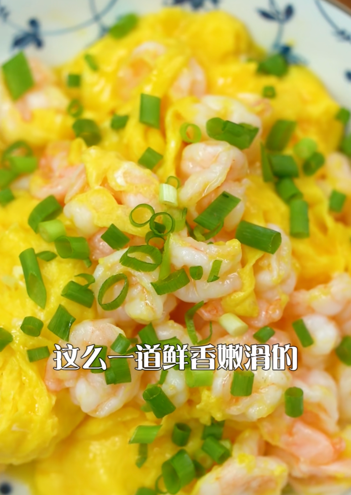
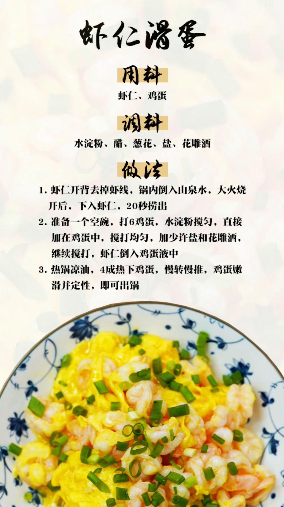

## 健康功效

牛肉:补脾胃、强筋骨、益气血
洋葱:解毒
姜:降逆止呕、化痰止咳、散寒解表

## 用料

1. 虾仁
2. 水
3. 六个鸡蛋
4. 小葱
5. 花雕酒

## 步骤

1. 虾仁开背、去虾线
2. 锅里倒入水，烧开下虾仁
3. 保持大火状态，20s 的时间，直接把虾捞出来降温。
4. 准备一个空碗，打上 6 个鸡蛋
5. 水淀粉搅匀，直接加入鸡蛋里，搅打均匀
6. 鸡蛋：加盐、加花雕酒，继续搅拌 20下
7. 虾仁放入鸡蛋
8. 热锅凉油
9. 四成热左右，下入鸡蛋「虾仁」
10. 慢慢的推、转——鸡蛋保持嫩嫩的定住形了，咱们就可以出锅装盘
11. 做好了这个虾仁滑蛋，咱们撒上小葱沫

欢迎关注我公众号：AI悦创，有更多更好玩的等你发现！

::: details 公众号：AI悦创【二维码】

:::

::: info AI悦创·编程一对一

AI悦创·推出辅导班啦，包括「Python 语言辅导班、C++ 辅导班、java 辅导班、算法/数据结构辅导班、少儿编程、pygame 游戏开发」，全部都是一对一教学：一对一辅导 + 一对一答疑 + 布置作业 + 项目实践等。当然，还有线下线上摄影课程、Photoshop、Premiere 一对一教学、QQ、微信在线，随时响应！微信：Jiabcdefh

C++ 信息奥赛题解，长期更新！长期招收一对一中小学信息奥赛集训，莆田、厦门地区有机会线下上门，其他地区线上。微信：Jiabcdefh

方法一：[QQ](http://wpa.qq.com/msgrd?v=3&uin=1432803776&site=qq&menu=yes)

方法二：微信：Jiabcdefh

:::

