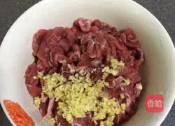
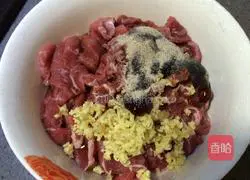
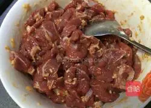
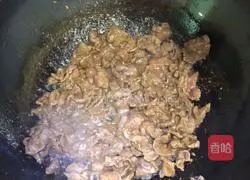
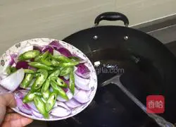
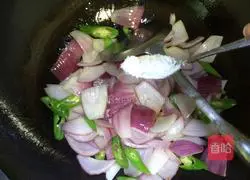
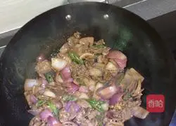
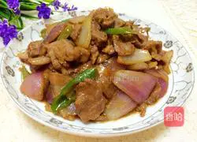

## 健康功效

- 牛肉:补脾胃、强筋骨、益气血
- 洋葱: 解毒
- 姜: 降逆止呕、化痰止咳、散寒解表

## 食材用料

| 牛肉 300克  | 洋葱 200克 |
| ----------- | ---------- |
| 姜 适量     | 生抽 适量  |
| 蚝油 适量   | 盐 适量    |
| 胡椒粉 适量 | 生粉 适量  |
| 青椒 一个   | 料酒 少许  |

## 洋葱炒牛肉的做法

| 图片                                                         | 文字                                                         |
| ------------------------------------------------------------ | ------------------------------------------------------------ |
|  | 1. 把牛肉切薄片，洋葱切块，青椒切块备用。                    |
|  | 2. 切好的牛肉，放入适量姜末。                                |
|  | 3. 再加入生抽，蚝油，料酒、胡椒粉，盐，拌匀。                |
|  | 4. 再加入少许生粉拌匀，最后加入适量食用油拌匀腌制15左右分钟以上。 |
|  | 5. 锅中倒入适量油烧热，油要比平时多一点，倒入腌制好的牛肉迅速滑炒至变色，盛出装入碗中备用。 |
|  | 6. 锅中再加少许油，把洋葱青椒块倒入锅中翻炒。                |
|  | 7. 加少许盐调味，                                            |
|  | 8. 洋葱快熟时，倒入牛肉下锅翻炒均匀，继续炒片刻，再滴入少许生抽提鲜既可。 |
|  | 9. 成品图                                                    |

## 小贴士

牛肉事先腌制一下，不但会使牛肉去腥入味，还会使牛肉变得很嫩。

欢迎关注我公众号：AI悦创，有更多更好玩的等你发现！

::: details 公众号：AI悦创【二维码】

:::

::: info AI悦创·编程一对一

AI悦创·推出辅导班啦，包括「Python 语言辅导班、C++ 辅导班、java 辅导班、算法/数据结构辅导班、少儿编程、pygame 游戏开发」，全部都是一对一教学：一对一辅导 + 一对一答疑 + 布置作业 + 项目实践等。当然，还有线下线上摄影课程、Photoshop、Premiere 一对一教学、QQ、微信在线，随时响应！微信：Jiabcdefh

C++ 信息奥赛题解，长期更新！长期招收一对一中小学信息奥赛集训，莆田、厦门地区有机会线下上门，其他地区线上。微信：Jiabcdefh

方法一：[QQ](http://wpa.qq.com/msgrd?v=3&uin=1432803776&site=qq&menu=yes)

方法二：微信：Jiabcdefh

:::

