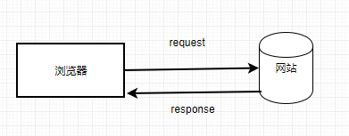
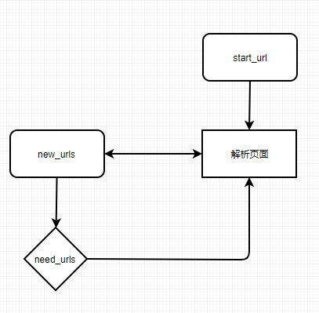

## 1.1 网络爬虫的定义

当今最大的网络是互联网，最大的爬虫就是各类搜索引擎，包括谷歌丶百度等。网络爬虫就是按照一定规则去爬去人类所需要的信息的程序，主要通过对 URL 的请求来实现。一般来说，从搜索引擎这类爬虫搜索到的信息是非常宽泛的，而且夹杂着各种广告，信息是不纯粹的，也有可能不是我们需要的。这种时候，就需要一些聚焦于某一方面信息的爬虫来为我们服务，比方说，专门爬取某一类书的信息，在网站上浏览的时候，可能会有形形色色的图片和一些其他信息干扰我们，如果编写网络爬虫的话，就可以单单把自己想要的信息存储下来，以便数据分析，提取有用的信息。

## 1.2 网络爬虫的类型

现在的网络爬虫大体可以分为四类：全网爬虫，主题爬虫，增量式爬虫和深层爬虫。

全网爬虫：也就是谷歌百度等搜索引擎，这类爬虫会从一些非常基础的URl出发，一直延伸到整个网站，这类爬虫庞大臃肿，需要很大的存储空间以及极高的爬行速度。

主题爬虫：满足特定人的特定需求，不同于全网爬虫，它是有选择地爬行与需求相关的信息。

增量式爬虫：对已经下载的页面采取增量式更新的爬虫，只爬取新产生的或者发生变化的网页，一定程度上可以保证爬取得页面是最新的，减少了空间的浪费，但是复杂度较高。

深层网络爬虫：不能通过静态 URL 访问，隐藏在表单后，只有用户提交一些关键词才能得到的页面。

## 1.3 网络爬虫的原理

如果正确返回了网页 response，就构成了了一次爬虫行为，接下来我们要做的就是解析页面，获取我们需要的信息了。

一般流程如图所示：

1）从基础URL开始爬行

2）从初始页面抓取到我们需要的 URL

3）对新的URL继续解析，再次抓取新的 URL

## 1.4 网络爬虫的搜索策略

网络爬虫过的搜搜策略一般分为三种

1）深度优先

深度优先指的是当某个页面的 URL 被选择后，对被选择的 URL 进行深度优先搜索，搜索后得到新的页面，再从新的页面继续选择  URL，循环往复，直到新的请求页面没有URL为止。

2）广度优先

广度优先指的是爬取完一个页面的全部 URL 之后，再选择一个 URL 进行深入，当把新的URL请求的页面的 URL 全部爬取完毕，再继续深入。

3）聚焦爬虫

聚焦爬虫会通过给下载好的页面打分的形式，根据得分把页面插入队列中，这样就有可能优先追踪那些最有价值的页面。

## 1.5常见反爬虫技术与解决方案

1）用户请求headers

从用户请求过来的 request headers 中查看是否存在 `User-Agent` ，如果不存在会在中间件中将请求过滤，不会返回正常 response。还有一些网站会通过请求头里边的 Referer 进行检测，一些资源网站的防止盗链技术就是通过这个来实现。对于这种反爬虫机制，我们只需要在 headers 中添加 `user-agent` 与 referer 就可以解决。

2）用户访问频率

有些网站通过用户请求网站的频率来判断请求者是用户还是爬虫，比如豆瓣会对访问频率过高的爬虫进行封禁，这就需要我们控制请求网站的速度，或者是建立IP代理池来解决。

3）字体反爬虫

实习僧等网站会把常用字和数字自己建立一套关系映射，通过前端渲染，得不到字体映射关系只会看到乱码。

4）网站目录数据加载

上述反爬虫技术是在静态网站，还有一些网站会通过 Ajax 交互，遇到这种情况，需要我们找到Ajax访问接口，分析具体的参数和结构，在爬虫中模拟 Ajax，就可以获得所需数据。

5）通过数据加密

有些网站会通过 JavaScripts 对一些参数加密，这些加密代码可以在 js 文件中找到，分析代码需要掌握前端技术，但是耗费时间较多，难度大。另一种解决方案是通过 selenium，调用浏览器模拟人类行为，slelenium 可以完美触发网页的 js，基本上解决这类问题，不过爬取速度较慢。一般只有在迫不得已的时候才会使用。

6）基于验证码识别

早期的验证码主要是数字验证码，可以调用第三方平台或者 OCR 识别技术解决。不过现在出现了图片验证码，目前仍然需要人类去操作；滑块验证码的破解已经有了成熟的技术，就是利用 PIL 模块与 selenium 来实现，比如 B 站登陆时候的滑块验证码。

欢迎关注我公众号：AI悦创，有更多更好玩的等你发现！

::: details 公众号：AI悦创【二维码】

:::

::: info AI悦创·编程一对一

AI悦创·推出辅导班啦，包括「Python 语言辅导班、C++ 辅导班、java 辅导班、算法/数据结构辅导班、少儿编程、pygame 游戏开发」，全部都是一对一教学：一对一辅导 + 一对一答疑 + 布置作业 + 项目实践等。当然，还有线下线上摄影课程、Photoshop、Premiere 一对一教学、QQ、微信在线，随时响应！微信：Jiabcdefh

C++ 信息奥赛题解，长期更新！长期招收一对一中小学信息奥赛集训，莆田、厦门地区有机会线下上门，其他地区线上。微信：Jiabcdefh

方法一：[QQ](http://wpa.qq.com/msgrd?v=3&uin=1432803776&site=qq&menu=yes)

方法二：微信：Jiabcdefh

:::

