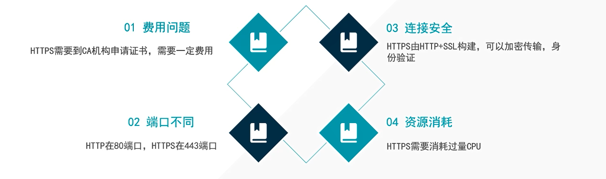

你好，我是悦创。

本课时我们会详细讲解 HTTP 的基本原理，以及了解在浏览器中输入 URL 到获取网页内容之间发生了什么。了解了这些内容，有助于我们进一步掌握爬虫的基本原理。

# URI 和 URL

首先，我们来了解一下 URI 和 URL，URI 的全称为 Uniform Resource Identifier，即统一资源标志符，URL 的全称为 Universal Resource Locator，即统一资源定位符。

举例来说，[https://github.com/favicon.ico](https://github.com/favicon.ico)，它是一个 URL，也是一个 URI。即有这样的一个图标资源，我们用 `URL/URI` 来唯一指定了它的访问方式，这其中包括了访问协议 HTTPS、访问路径（即根目录）和资源名称 `favicon.ico`。通过这样一个链接，我们便可以从互联网上找到这个资源，这就是 URL/URI。

URL 是 URI 的子集，也就是说每个 URL 都是 URI，但不是每个 URI 都是 URL。那么，什么样的 URI 不是 URL 呢？URI 还包括一个子类叫作 URN，它的全称为 Universal Resource Name，即统一资源名称。

URN 只命名资源而不指定如何定位资源，比如 `urn:isbn:0451450523` 指定了一本书的 ISBN，可以唯一标识这本书，但是没有指定到哪里定位这本书，这就是 URN。URL、URN 和 URI 的关系可以用图表示。

但是在目前的互联网，URN 的使用非常少，几乎所有的 URI 都是 URL，所以一般的网页链接我们可以称之为 URL，也可以称之为 URI，我个人习惯称之为 URL。

# 超文本

接下来，我们再了解一个概念 —— 超文本，其英文名称叫作 `Hypertext`，我们在浏览器里看到的网页就是超文本解析而成的，其网页源代码是一系列 HTML 代码，里面包含了一系列标签，比如 img 显示图片，p 指定显示段落等。浏览器解析这些标签后，便形成了我们平常看到的网页，而网页的源代码 HTML 就可以称作超文本。

例如，我们在 Chrome 浏览器里面打开任意一个页面，如淘宝首页，右击任一地方并选择 “检查” 项（或者直接按快捷键 F12），即可打开浏览器的开发者工具，这时在 Elements 选项卡即可看到当前网页的源代码，这些源代码都是超文本，如图所示。

# HTTP 和 HTTPS

也就是在 **TCP/IP** 四层模型中添加了一层 **SSL 层（或者叫 TLS）** ，并且，根据加密程度不同，所需要的费用不同。

**04 资源消耗：**如果大家访问HTTPS网站呢，对我们的CPU来说需要更高程度的计算。上面我们讲到了，对于HTTPS来说，连接安全的同时它需要 **加密传输和身份验证** ，其实这是基于CPU的运算，需要我们电脑的CPU不断进行加密解密的运算，这样就会对我们电脑的CPU和占用一些资源。大家访问 HTTP、HTTPS，访问不同的网站，对我们电脑的CPU的消耗是不一样的，HTTPS需要很多很多的计算，才能进行加密验证。这些都是在我们电脑本地完成的。

在淘宝的首页 [https://www.taobao.com/](https://www.taobao.com/) 中，URL 的开头会有 http 或 https，这个就是访问资源需要的协议类型，有时我们还会看到 ftp、sftp、smb 开头的 URL，那么这里的 ftp、sftp、smb 都是指的协议类型。在爬虫中，我们抓取的页面通常就是 http 或 https 协议的，我们在这里首先来了解一下这两个协议的含义。

HTTP 的全称是 Hyper Text Transfer Protocol，中文名叫作超文本传输协议，HTTP 协议是用于从网络传输超文本数据到本地浏览器的传送协议，它能保证高效而准确地传送超文本文档。HTTP 由万维网协会（World Wide Web Consortium）和 Internet 工作小组 IETF（Internet Engineering Task Force）共同合作制定的规范，目前广泛使用的是 HTTP 1.1 版本。

HTTPS 的全称是 Hyper Text Transfer Protocol over Secure Socket Layer，是以安全为目标的 HTTP 通道，简单讲是 HTTP 的安全版，即 HTTP 下加入 SSL 层，简称为 HTTPS。

HTTPS 的安全基础是 SSL，因此通过它传输的内容都是经过 SSL 加密的，它的主要作用可以分为两种：
