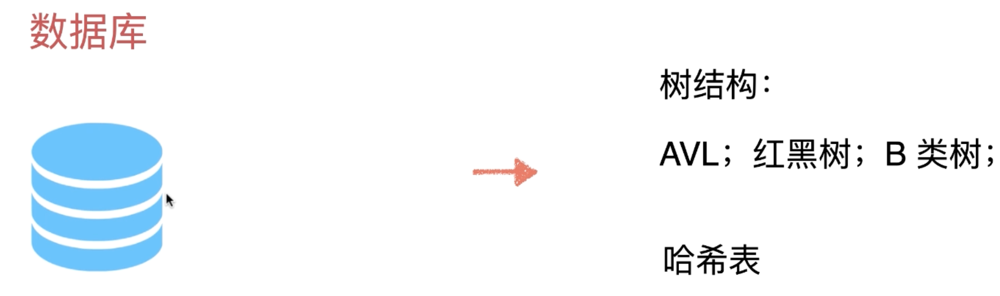
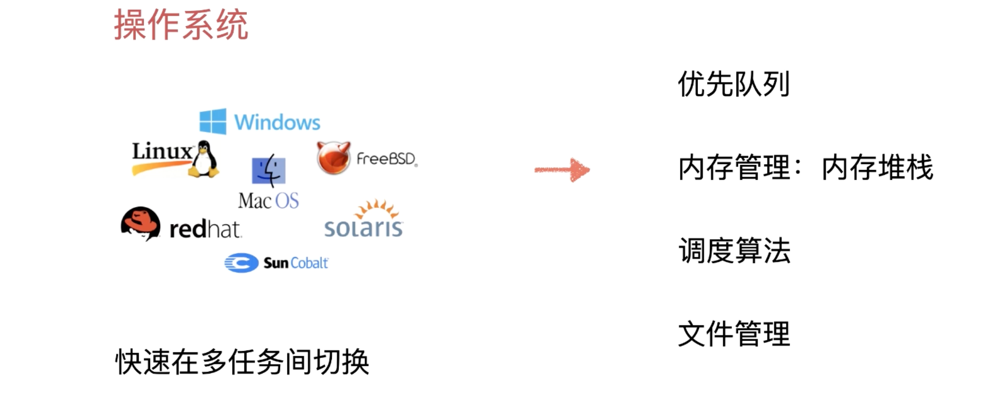
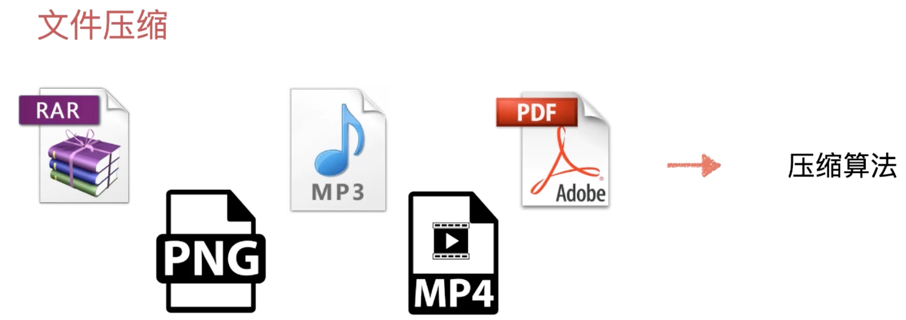
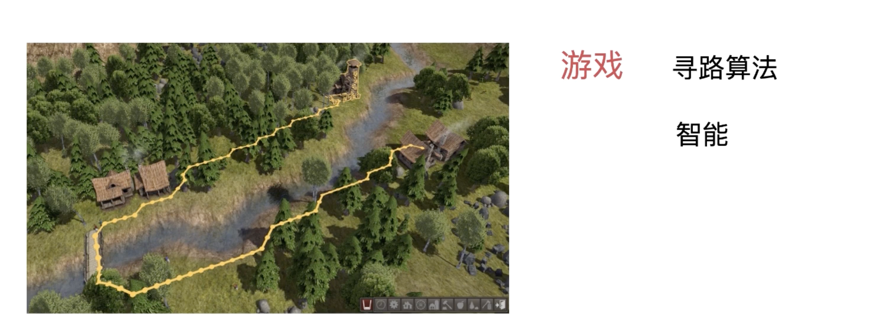
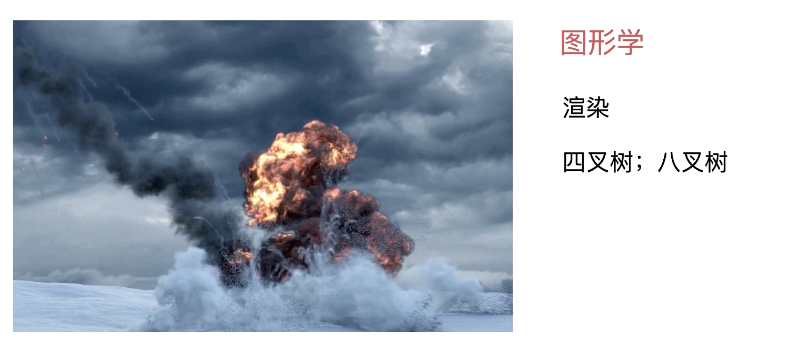

## 学习算法和数据结构到底有没有用？

- 数据结构 + 算法 = 程序



我们在学习数据库的时候，肯定也是学过数据库语言的：

```mysql
select * from AI悦创 where title = "数据结构与算法"
```

那数据库底层就是数据结构与算法实现，只不过现在是站在巨人的肩膀上。哪一天需要探究底层，还是需要这些的。

再或者一个简单的 Java 代码：

```java
public class Main {
    public static void main(String[] args) {
        System.out.println("Hello AndersonHJB.");
    }
}
```

这个 Java 底层经历了什么？这其中就涉及了数据结构与算法。

而这些语句其实都是“字符串”所以也就是：解析字符串算法。











算法和数据结构肯定是有用的！

为什么我在工作中，用不到算法和数据结构？

实话实说，业务层面用的确实不多

操作系统，编译器，数据库，文件压缩，渲染，图像识别

如果真要做这个领域的底层开发，势必要用到算法和数据结构


很多大厂其实做的不就是底层的服务。


就算你的部门不涉及底层开发，但是大厂面对的业务场景和用户群是巨大的，所以需要你会。数据量也是巨大的，有可能现有的解决方法不能很好解决现有的业务需求，这个时候就需要你了解底层，走到底层。

算法和数据结构决定了大家的上限

最功利的讲：为了通过面试关，也要学好算法和数据结构

不仅仅是算法和数据结构，操作系统、网络基础、编译、组成原理等，也很重要。

欢迎关注我公众号：AI悦创，有更多更好玩的等你发现！

::: details 公众号：AI悦创【二维码】


:::

::: info AI悦创·编程一对一

AI悦创·推出辅导班啦，包括「Python 语言辅导班、C++ 辅导班、java 辅导班、算法/数据结构辅导班、少儿编程、pygame 游戏开发」，全部都是一对一教学：一对一辅导 + 一对一答疑 + 布置作业 + 项目实践等。当然，还有线下线上摄影课程、Photoshop、Premiere 一对一教学、QQ、微信在线，随时响应！微信：Jiabcdefh

C++ 信息奥赛题解，长期更新！长期招收一对一中小学信息奥赛集训，莆田、厦门地区有机会线下上门，其他地区线上。微信：Jiabcdefh

方法一：[QQ](http://wpa.qq.com/msgrd?v=3&uin=1432803776&site=qq&menu=yes)

方法二：微信：Jiabcdefh

:::


