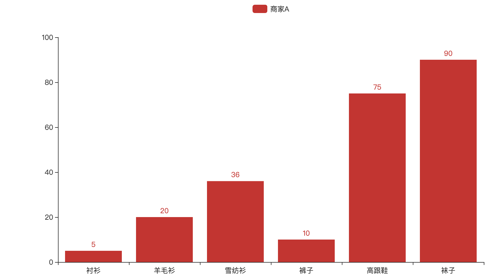

> pyecharts.org 不做版本管理，您所看到的当前文档为最新版文档，若文档与您使用的版本出现不一致情况，请及时更新 pyecharts。

如何查看使用的 pyecharts 版本？

```python
import pyecharts

print(pyecharts.__version__)
```

## [如何安装]()

**pip 安装**

```shell
$ pip(3) install pyecharts
```

**源码安装**

```shell
$ git clone https://github.com/pyecharts/pyecharts.git
$ cd pyecharts
$ pip install -r requirements.txt
$ python setup.py install
# 或者执行 python install.py
```

## [5 分钟上手]()

> 首先开始来绘制你的第一个图表

```python
from pyecharts.charts import Bar

bar = Bar()
bar.add_xaxis(["衬衫", "羊毛衫", "雪纺衫", "裤子", "高跟鞋", "袜子"])
bar.add_yaxis("商家A", [5, 20, 36, 10, 75, 90])
# render 会生成本地 HTML 文件，默认会在当前目录生成 render.html 文件
# 也可以传入路径参数，如 bar.render("mycharts.html")
bar.render()
```



<button name="button" style="color: black"><a href="https://bornforthis.cn/web_runing/pyechars/02/render.html" target="_blank">在线预览</a></button>


欢迎关注我公众号：AI悦创，有更多更好玩的等你发现！

::: details 公众号：AI悦创【二维码】


:::

::: info AI悦创·编程一对一

AI悦创·推出辅导班啦，包括「Python 语言辅导班、C++ 辅导班、java 辅导班、算法/数据结构辅导班、少儿编程、pygame 游戏开发」，全部都是一对一教学：一对一辅导 + 一对一答疑 + 布置作业 + 项目实践等。当然，还有线下线上摄影课程、Photoshop、Premiere 一对一教学、QQ、微信在线，随时响应！微信：Jiabcdefh

C++ 信息奥赛题解，长期更新！长期招收一对一中小学信息奥赛集训，莆田、厦门地区有机会线下上门，其他地区线上。微信：Jiabcdefh

方法一：[QQ](http://wpa.qq.com/msgrd?v=3&uin=1432803776&site=qq&menu=yes)

方法二：微信：Jiabcdefh

:::

