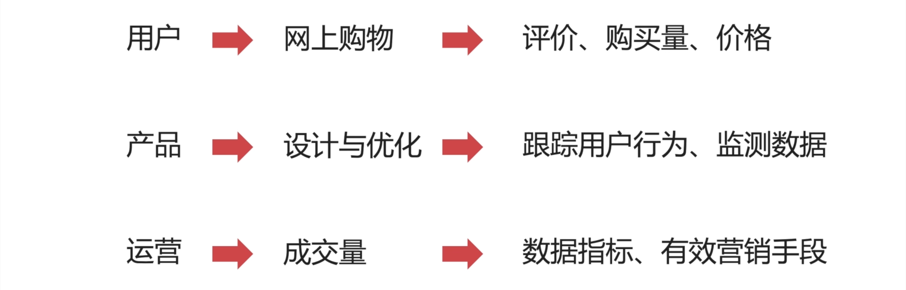
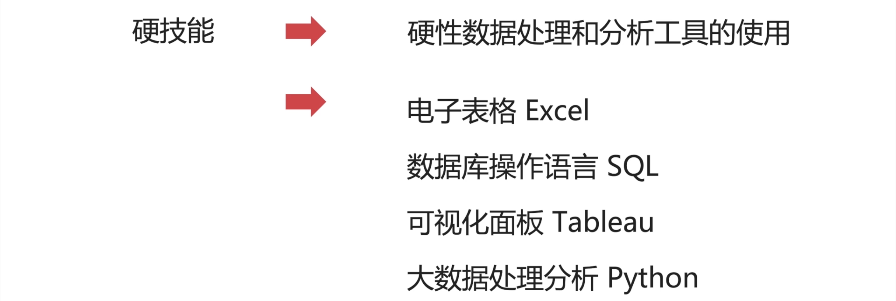
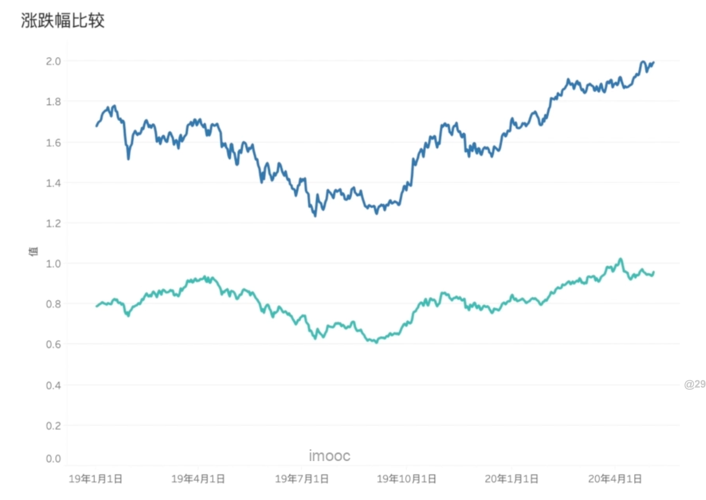
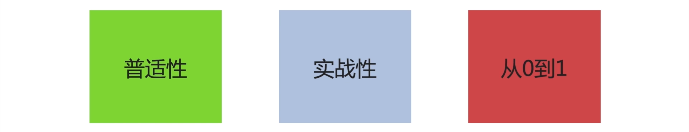

## 随着互联网的发展，任何岗位都离不开数据分析

事实上，不管你做什么工作， 从事什么行业，数据是你一定会接触到的内容。

随着互联网的不断发展，我们每天都在产生大量数据，这些数据又反向的产生价值。——数据分析，就是发现数据的价值。

- 作为用户，我们网上购物的时候，会根据评价，购买量，价格——去挑选一件商品。当然，商家也会反向的分析，我们这些用户行为，进一步决定：挑选什么样的商品、如何定价、如何宣传文案等；
- 那作为产品经理，在进行设计和优化的时候，也会跟踪用户行为路径，根据监测到的数据制定方案、设计产品。
- 作为运营，为了提升成交量，每天都需要关注和销售量相关的数据指标，比如：拉新数、转化数等等，明确有效的运营方案。

我可以很直接的告诉你，在未来对于任何岗位，数据的处理和分析能力，都一定会成为工作中，必备的能力之一。那具体而言，你需要掌握哪些数据分析必备的技能呢？

## 数据分析师，必须掌握的技能

数据分析技能主要分两类：

- 硬技能
- 软技能

**什么是硬技能呢？**

——硬性的数据处理和分析工具的使用。

比如：

- 电子表格 Excel
- 数据库操作语言 Sql
- 可视化面板 Tableau
- 大数据处理分析 Python

那这些工具，你会就是会，不会就是不会。很容易识别。所以，经常作为数据分析的硬性门槛，是你必须要掌握的技能。

**那什么是软技能呢？**

——对事物的认知方式，以及经验积累

 

比如：给你一组股票价格的走势图， 深蓝色的代表股票 A，浅蓝色的代表股票 B。

那对于不太了解股票的人（小猿），你能做出的判断就是：**A 的价格比 B 要高** ；

但对于有投资经验的（小悦），会分析出：**股票 A 的市值比 B 高，所以价格才会对应的高**；

还可以通过它们的波动程度，分析出：**A 的波动率是大于 B 的，而波动率也意味着风险程度，也就是说  A 的风险大于 B 的。**

那显然 小悦的软技能，也就是认知水平，思维水平，是高于 小猿 的。这个是由他的经验决定。

再来一个人 Austin，Austin 和 小悦一样，都是有投资经验的，Austin 知道每一个节点产生的背景，也就是说：**行情下跌，它是由于某个事件，或者某一个政策导致的；上涨，它又是由于某一个事件或者政策导致的。**

那么，Austin 的软技能会比 小悦、小猿更高。因为，他具有更宏观的思维方式与框架，而以上所有提到的硬技能、软技能我都将会交给你。

## 课程优势

- 普适性：只要你需要数据，进行数据分析的，都可以跟我学。如果说，你是运营、产品、市场或者销售，这门课不仅仅是带你掌握数据分析的硬技能，还会帮你补充互联网行业经验。哪些经验呢：比如互联网的细分行业有哪些、对应的龙头企业有哪些、商业模式如何。以及针对整个用户周期，如何利用数据分析技能，提升数据表现。比如有哪些运营策略，思维模型，如何拆分业务指标等等。
- 实战性：实战性强指的是，在我这门课程中，所有的数据都是真实的，可以追溯的。

欢迎关注我公众号：AI悦创，有更多更好玩的等你发现！

::: details 公众号：AI悦创【二维码】

:::

::: info AI悦创·编程一对一

AI悦创·推出辅导班啦，包括「Python 语言辅导班、C++ 辅导班、java 辅导班、算法/数据结构辅导班、少儿编程、pygame 游戏开发」，全部都是一对一教学：一对一辅导 + 一对一答疑 + 布置作业 + 项目实践等。当然，还有线下线上摄影课程、Photoshop、Premiere 一对一教学、QQ、微信在线，随时响应！微信：Jiabcdefh

C++ 信息奥赛题解，长期更新！长期招收一对一中小学信息奥赛集训，莆田、厦门地区有机会线下上门，其他地区线上。微信：Jiabcdefh

方法一：[QQ](http://wpa.qq.com/msgrd?v=3&uin=1432803776&site=qq&menu=yes)

方法二：微信：Jiabcdefh

:::

