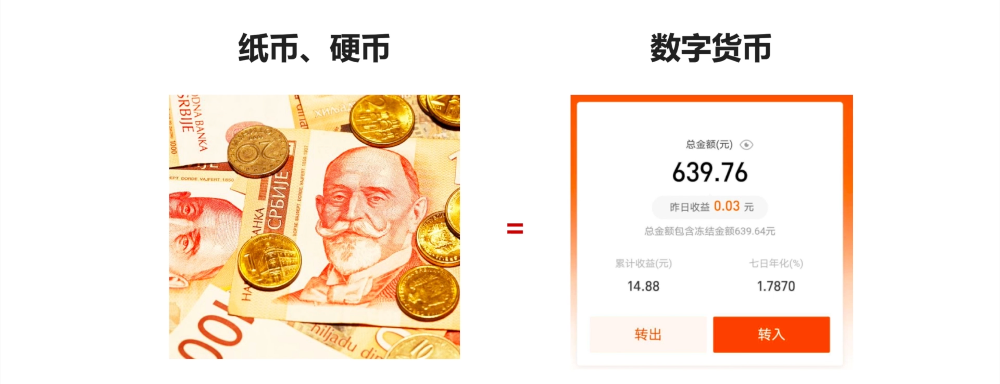
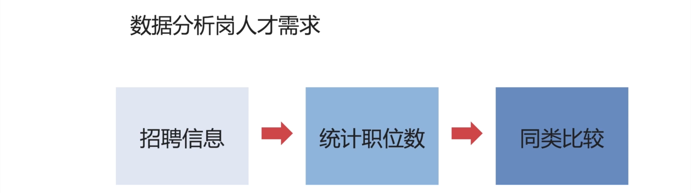

## 什么是互联网数据分析？

- 互联网指的是信息传输的一种载体，这种载体是线上的，通过电子化的方式留存信息，与我们传统线下基于实物的传输方式相对应；

举个简单的例子，纸币「硬币」和数字货币，它们都是货币，可以用来交易，只是交易的方式不同。一个是线下的，实物的，可以看到摸到的。一个是线上的，相对虚拟的形式。但是两者，大部分情况下是等值的。

 那么，数据分析前面加了 **互联网** 又是什么含义呢？

- 数据分析，我们知道，就是通过数据的规律进行总结、提炼。来帮组我们，做出决策。
- 举个例子：我想要了解数据分析岗位人才需求的总体情况：
    - 首先，我得拿到招聘信息的数据——招聘信息
    - 接着，在基于我拿到的数据，统计数据分析岗位的职位数——统计职位数「等相关指标」
    - 那同时为了比较，我还需要统计其它类似岗位的招聘数，比如：大数据开发，产品，运营，销售，市场等等，来明确数据分析岗的需求，是否旺盛——同类比较

那我如果在数据分析前面加上互联网，什么意思呢？

**互联网数据分析岗位人才需求**——就是说：这些信息是基于互联网平台存在的，也就说：线上存在的。比如：我从某某招聘网站上面抓取的数据，这个就叫互联网数据分析。

那如果是线下，比如调研，用户调研得来的

## 期待你和我一起，用数据解析世界

欢迎关注我公众号：AI悦创，有更多更好玩的等你发现！

::: details 公众号：AI悦创【二维码】

:::

::: info AI悦创·编程一对一

AI悦创·推出辅导班啦，包括「Python 语言辅导班、C++ 辅导班、java 辅导班、算法/数据结构辅导班、少儿编程、pygame 游戏开发」，全部都是一对一教学：一对一辅导 + 一对一答疑 + 布置作业 + 项目实践等。当然，还有线下线上摄影课程、Photoshop、Premiere 一对一教学、QQ、微信在线，随时响应！微信：Jiabcdefh

C++ 信息奥赛题解，长期更新！长期招收一对一中小学信息奥赛集训，莆田、厦门地区有机会线下上门，其他地区线上。微信：Jiabcdefh

方法一：[QQ](http://wpa.qq.com/msgrd?v=3&uin=1432803776&site=qq&menu=yes)

方法二：微信：Jiabcdefh

:::

