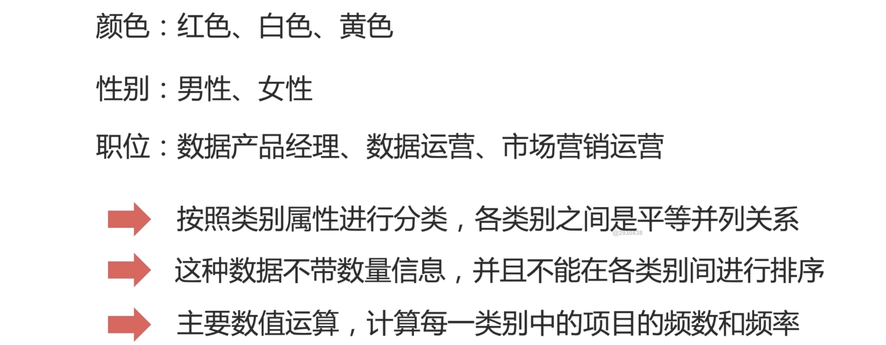

## 从认识数据开始

- 数据分类
- 统计指标
- 分布形态
- 数据分析流程
- 常用数据分析工具

对于数据分析来说，这是非常基础也很重要的一章。就好比我们学习写作之前，你需要学习基本的遣词造句一样，后续的数据分析内，都用到本文讲到的知识点。

## 什么是数据

**数据是对事物的描述和记录。**

其实，我们思考一下，我们日常生活中，到处都充斥着数据。我们在描述的过程中，也无法离开数据。

我们上网，看到的这些网站、网页，它上面都布满了数据。

我们用的报表，文档，甚至看到的菜单等等，都是由数据所组成的

## 数据的特性

根据数据的计量层次，进一步对数据进行分类；

根据数据的计量层次，我可以从低到高的，对数据进行进一步的分类；

那什么是计量层次呢？我来带大家理解一下。

- 黄瓜，番茄，森林，书本，无法计算比较，计量层次低
- 1，2，3， 4，5，这些数据可以计算比较，那么计量层次就高

首先，我们观察第一组数据，黄瓜，番茄，森林，书本，你会发现这样的数据会有一个特点，他是文字描述型的数据。你没有办法对他进行一定顺序的排序，或者是大小的比较。那对于这样的数据来说：我无法进行计算比较的数据，我们就说这是计量层次比较低的数据类型。

那对于数值型的，1，2，3， 4，5，这样的数据，它们很明显可以进行排序，计算差异，做加减乘除，做比较。那么我们就会说，这样的数据，它的计量层次是比较高的。

## 定类数据

- 颜色：红色、白色、黄色
- 性别：男性、女性
- 职位：数据产品经理、数据运营、市场营销运营

观察一下，上面的数据有什么特点？

你会发现，给的这几组数据，它们之间会按照：

- 按照数据的类别进行分类的，各类之间是平等并列的；
- 比如：红色、白色、黄色，红色是否优于白色，或者劣于黄色，你是没有办法进行这样的排序吧。
- 这一类的数据，我们叫做定类数据。
- 这种数据没有数量信息，并且不能在各类别间，进行排序。
- 针对于这些数据，我们通常想要去计算的话，就是统计每一个类别它们的频数「次」和频率。

## 定序数据

- 受教育程度：小学，初中，高中，大学，硕士，博士
- 季度：春，夏，秋，冬
- 等级：合格、良好、优秀

你可以观察到，这几组数据。受教育程度，季度，等级，你可以观察到，这几组数据和我们的**定类数据**，有个共同点，都是文字描述型的数据。

但是，又有些不同。

- 你会发现，这些数据之间是可以进行排序的，可以去比较优劣的。
- 比如受教育程度：小学，初中，高中，大学，硕士，博士，它是按照受教育的程度「先后」来进行排序的。
- 季度上按照时间的标准去排序的；
- 等级是按照成绩的大小去排序的「合格、良好、优秀」；
- 这也是说，在实际的使用过程中，我们不但能文字描述，进行基础的排序。我们也可以通过对文字进行对应的 **数字编码** 进行一个默认的大小排序。
- 比如说：小学我分配的编码是 0、1

 

## 期待你和我一起，用数据解析世界

欢迎关注我公众号：AI悦创，有更多更好玩的等你发现！

::: details 公众号：AI悦创【二维码】

:::

::: info AI悦创·编程一对一

AI悦创·推出辅导班啦，包括「Python 语言辅导班、C++ 辅导班、java 辅导班、算法/数据结构辅导班、少儿编程、pygame 游戏开发」，全部都是一对一教学：一对一辅导 + 一对一答疑 + 布置作业 + 项目实践等。当然，还有线下线上摄影课程、Photoshop、Premiere 一对一教学、QQ、微信在线，随时响应！微信：Jiabcdefh

C++ 信息奥赛题解，长期更新！长期招收一对一中小学信息奥赛集训，莆田、厦门地区有机会线下上门，其他地区线上。微信：Jiabcdefh

方法一：[QQ](http://wpa.qq.com/msgrd?v=3&uin=1432803776&site=qq&menu=yes)

方法二：微信：Jiabcdefh

:::

