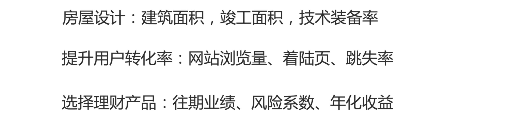
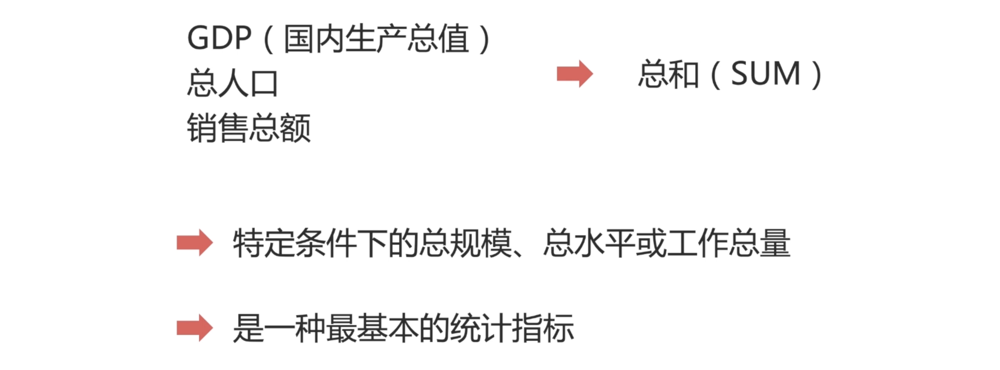
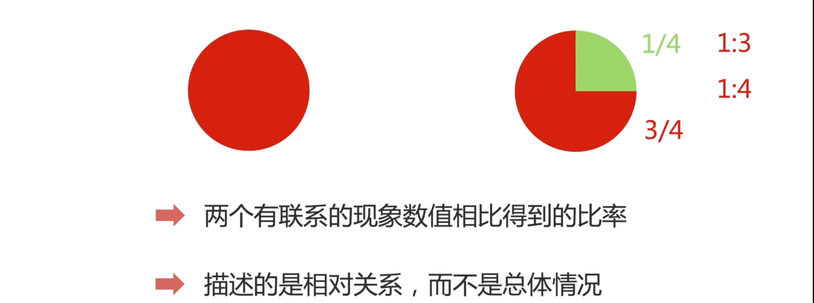
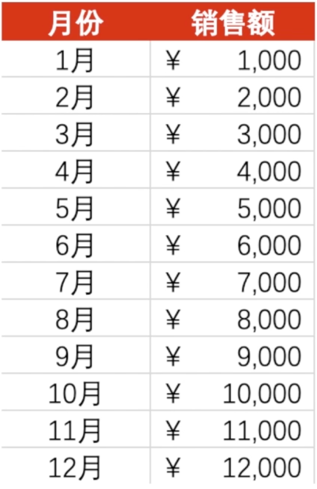
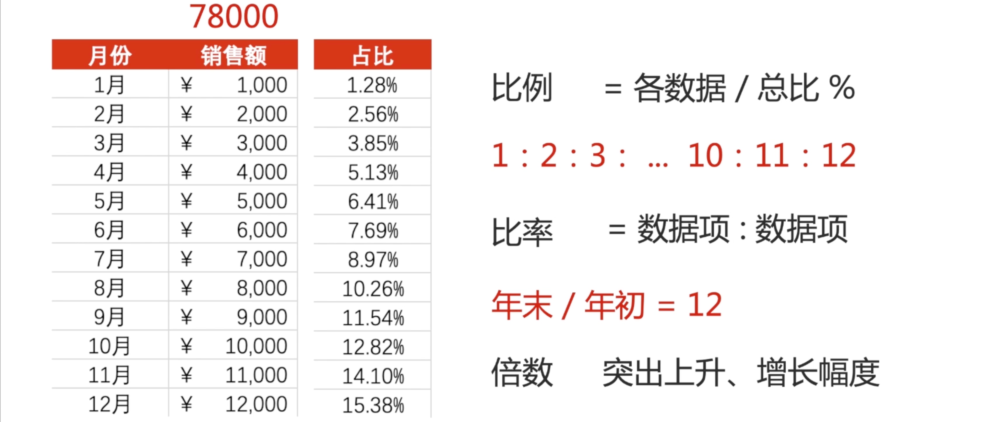
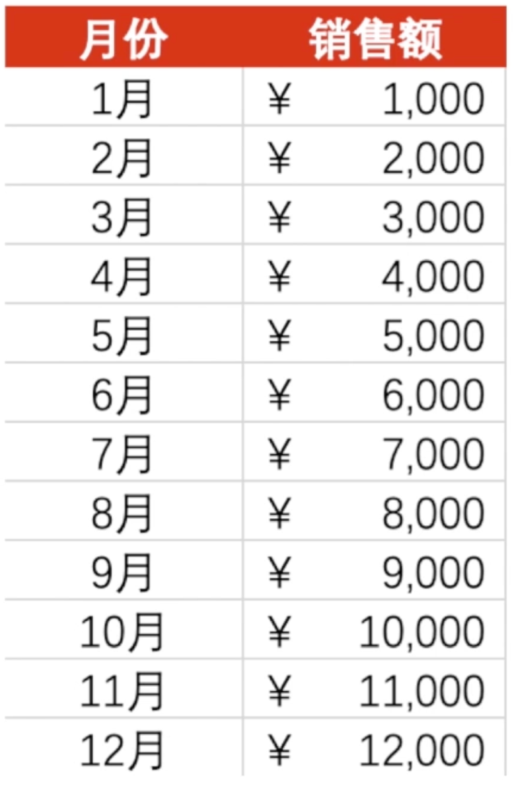
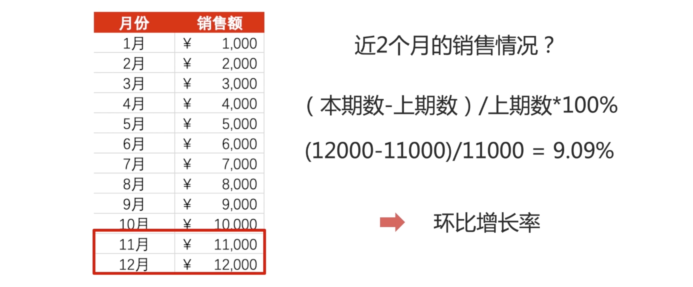

## 什么是统计指标

如果把数据分析比喻成找工作的过程，招聘网站发布的职位信息，就是我们要分析的职位对象。我们想要通过职位信息，分析出：它对应岗位需要的技能有哪些、它的整体薪酬水平和我能力溢价水平是否相符、它对工作年限是否有要求、它对业务背景是否有偏好？——这些问题，我们需要什么依据，才能回答这些问题呢？

首先我们需要寻找大量的职位信息，通过观察这些信息，提取有用的部分。比如：薪酬数据、地点数据、工作年限、教育背景、技能数据等。那通过对这些关键信息的汇总、处理、计算得到初步的结论。

那这个过程就是在计算统计指标，帮助我们去回答，我们要解决的问题。

统计指标，简单说就是体现总体数量特征的一个概念和数值。

根据分析目的不同，统计指标也会一直在变化。

比如，在做房屋设计的时候，我们统计对象是建筑面积，竣工面积，技术装备率；

在分析用户转化率的业务问题上，我们需要对网站浏览量，着陆页，跳失率等等环节，去进行统计计算。——找到最薄弱的环节，分析原因。以此，提出解决方案。从而提升我们的用户转化率。

在选择理财产品的时候，我们需要去考察它往期的业绩是否优秀，它的风险系数是否符合我自己的需求，如果是保守的，那么风险系数应该在什么范畴。如果是激进的，又在什么范畴。那它的年化收益，是否是正的、是否跑赢通胀、是否满足我自己的需求等等。

通过这样的方式去选择适合自己的理财产品，那统计指标可以通过它体现的内容，可以分为：总体和相对两大类。

## 总量指标

那当我们想计算 GDP（国内生产总值）、总人口、销售总额，这种体现总体规模，总体水平或者工作总量的时候，我们就需要总量指标。那也是我们通常意义上的所说的总和（SUM）。「也就是累加和」这也是一种最基本的统计指标。

## 平均指标「集中趋势指标」

那当我们想要描述一组数据的平均水平的时候，我们会使用平均指标。——用一个数字，去显示总体的其一般水平。那我们常说的平均值，就是平均指标的一种。平均指标又叫：集中趋势指标。那这一章节的内容，我们会在下一节课具体说。

## 相对指标

那总体指标是体现总体情况的，这样一个指标，我以一个完整的圆来表示。那相对指标就是体现相对情况的指标。

相对指标是通过两个有联系的现象数值，相比较得到的比率。

它描述的是相对关系，而不是总体的情况。

我以上图右边的圆为例，绿色部分占总体部分的 1/4。红色面积占总体的 3/4，那绿色与红色部分，相对应得到的比例是 1:3，这个是它们相对关系的值。而绿色相对于整个圆的面积，得到的比例是 1:4，那这就是部分与整体的相对关系。

## 比例、比率、倍数

那我们以销售额的数据为例：

上面的数据是 1 到 12 月，一整年销售额数据，通过计算总和「也就是：总量指标」我们一年销售额数据是 78000，那用每个月销售额数据去除以我们的总量指标，我们就可以得到每个月相对于总体的占比数。——那这个占比数据，就是我们俗称的比例。`比例 = 各数据 / 总比 %` 它指的的是总体中，各数据占总体的比重，反应的是总体的构成和比例，体现的是部分与整体的关系。

那么如果我们想要观察每个月相对的关系，我们可以把每个月的数据拿出来，除以它们的公约数 1000。——像这样体现部分与部分之间关系的，我们叫做比率。

我们还可以通过年末数据和年初数据，进行相除。`年末除以年初得到倍数`。看倍数是突出上升、增长的幅度。

可以发现，比例、比率、倍数更多体现的是数值与数值之间的大小关系、相对关系。

在分析销售额数据的时候，我们更多关注的是增长率。

## 环比、同比

就是我们想知道，每个月的业务是增长的趋势还是下跌的趋势。

 比如：我想知道近两个月的销售情况是怎么样的？

是增长的，还是下跌的。

那以 12月和 11月的数据为例，可以通过公式计算环比、增长率。`(本期数 - 上期数) / 上期数 * 100%` 。我们12月的数据 12000，11月 的数据 11000。带入公式：`(12000 - 11000) / 11000 * 100% = 9.09%` 这个 9.09% 就是环比增长率。

代表的是我们当前 12月的周期和上一个周期的增长速率是什么样的「也就是短期的增长速率是怎么样的」

那如果我们要了解长期的增长速率，

## 期待你和我一起，用数据解析世界

欢迎关注我公众号：AI悦创，有更多更好玩的等你发现！

::: details 公众号：AI悦创【二维码】

:::

::: info AI悦创·编程一对一

AI悦创·推出辅导班啦，包括「Python 语言辅导班、C++ 辅导班、java 辅导班、算法/数据结构辅导班、少儿编程、pygame 游戏开发」，全部都是一对一教学：一对一辅导 + 一对一答疑 + 布置作业 + 项目实践等。当然，还有线下线上摄影课程、Photoshop、Premiere 一对一教学、QQ、微信在线，随时响应！微信：Jiabcdefh

C++ 信息奥赛题解，长期更新！长期招收一对一中小学信息奥赛集训，莆田、厦门地区有机会线下上门，其他地区线上。微信：Jiabcdefh

方法一：[QQ](http://wpa.qq.com/msgrd?v=3&uin=1432803776&site=qq&menu=yes)

方法二：微信：Jiabcdefh

:::

