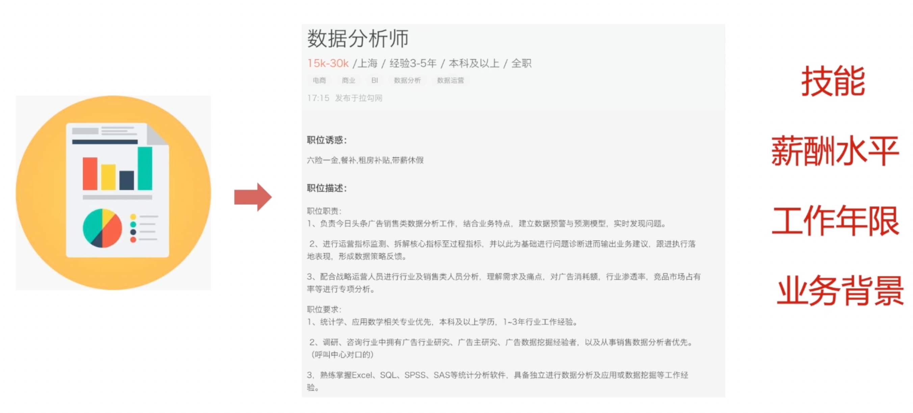
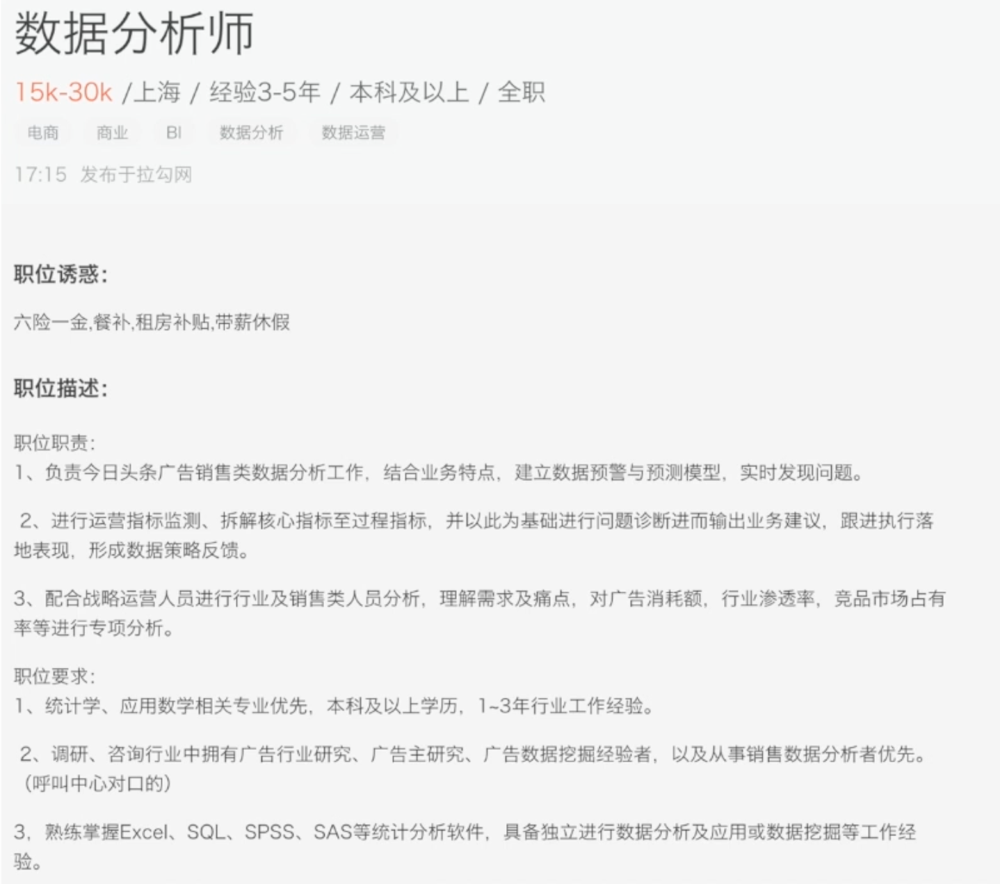
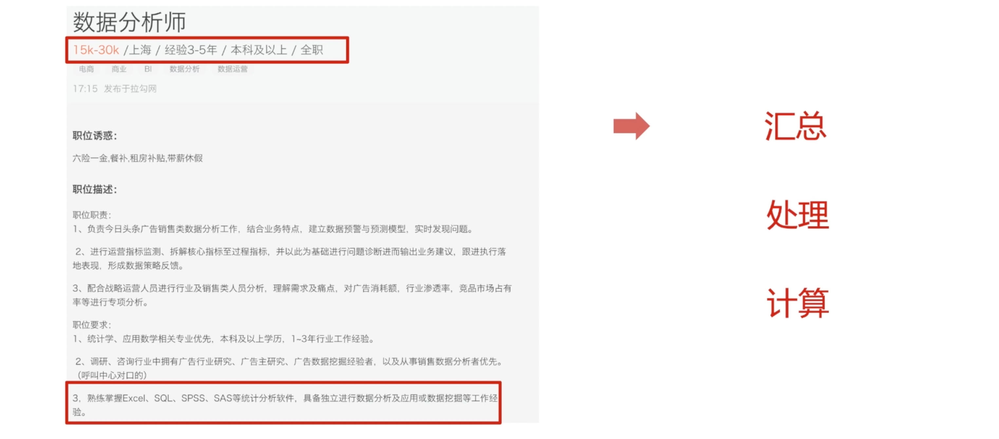

## 什么是统计指标

如果把数据分析比喻成找工作的过程，招聘网站发布的职位信息，就是我们要分析的职位对象。我们想要通过职位信息，分析出：它对应岗位需要的技能有哪些、它的整体薪酬水平和我能力溢价水平是否相符、它对工作年限是否有要求、它对业务背景是否有偏好？——这些问题，我们需要什么依据，才能回答这些问题呢？

首先我们需要寻找大量的职位信息，通过观察这些信息，提取有用的部分。比如：薪酬数据、地点数据、工作年限、教育背景、技能数据等。那通过对这些关键信息的汇总、处理、计算得到初步的结论。

那这个过程就是在计算统计指标，帮助我们去回答，我们要解决的问题。

统计指标，简单说就是体现总体数量特征的一个概念和数值。

根据分析目的不同，统计指标也会一直在变化。

比如，在做

## 期待你和我一起，用数据解析世界

欢迎关注我公众号：AI悦创，有更多更好玩的等你发现！

::: details 公众号：AI悦创【二维码】

:::

::: info AI悦创·编程一对一

AI悦创·推出辅导班啦，包括「Python 语言辅导班、C++ 辅导班、java 辅导班、算法/数据结构辅导班、少儿编程、pygame 游戏开发」，全部都是一对一教学：一对一辅导 + 一对一答疑 + 布置作业 + 项目实践等。当然，还有线下线上摄影课程、Photoshop、Premiere 一对一教学、QQ、微信在线，随时响应！微信：Jiabcdefh

C++ 信息奥赛题解，长期更新！长期招收一对一中小学信息奥赛集训，莆田、厦门地区有机会线下上门，其他地区线上。微信：Jiabcdefh

方法一：[QQ](http://wpa.qq.com/msgrd?v=3&uin=1432803776&site=qq&menu=yes)

方法二：微信：Jiabcdefh

:::

