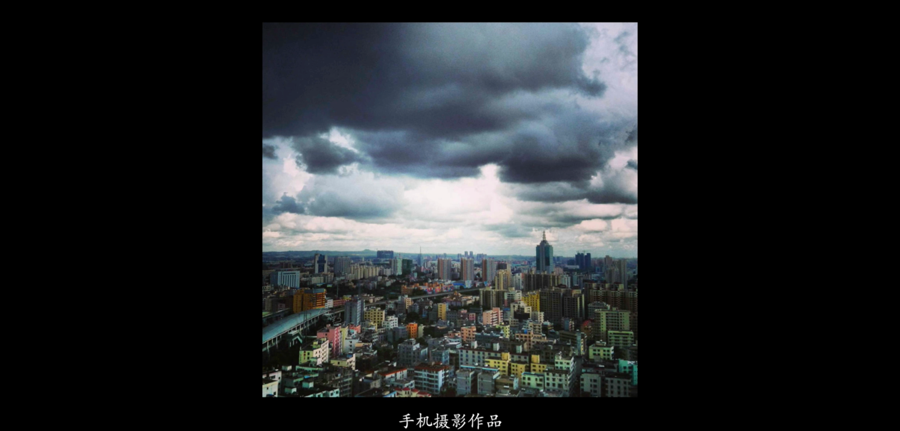
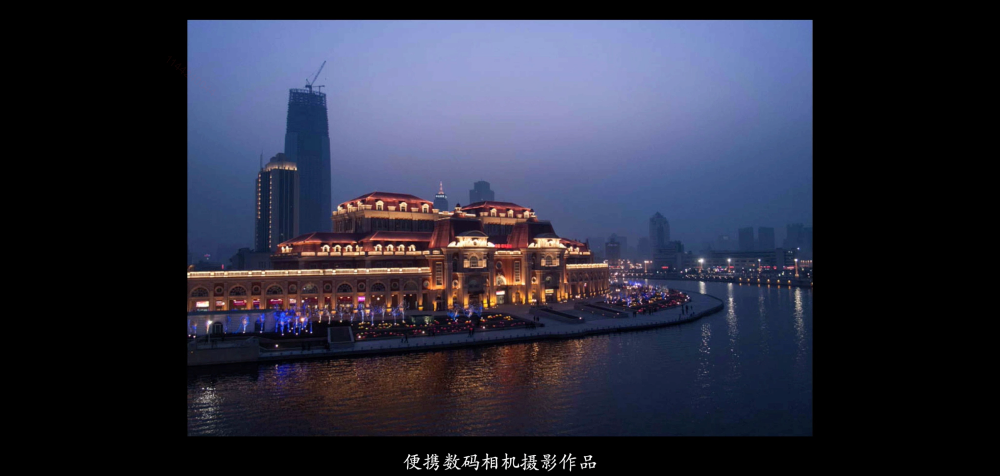
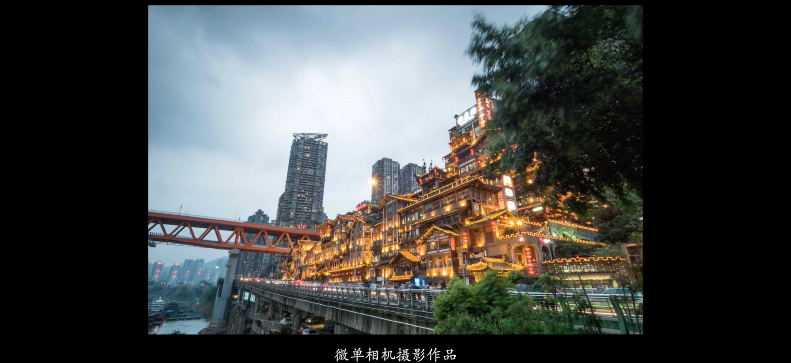
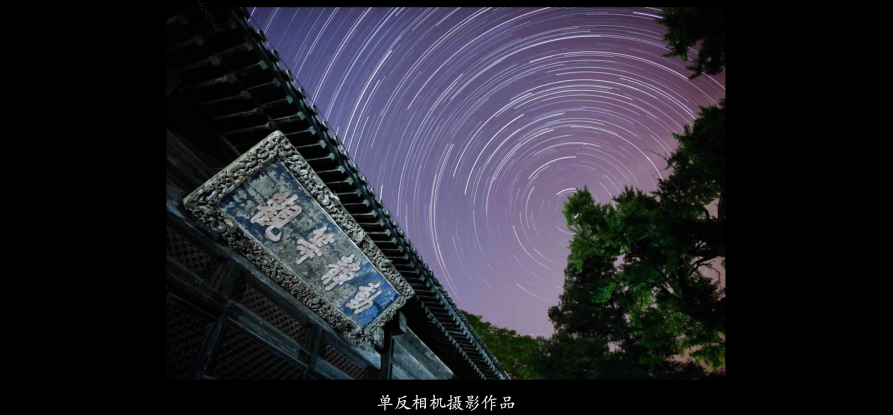
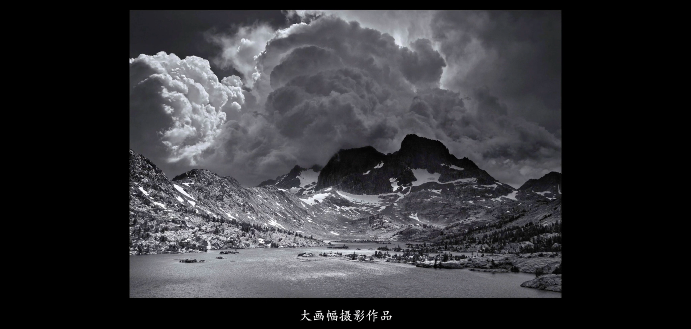
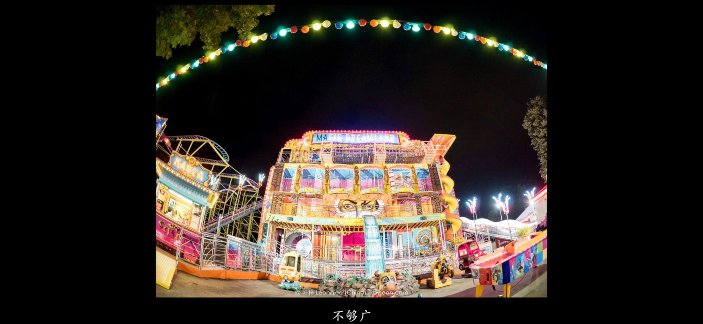
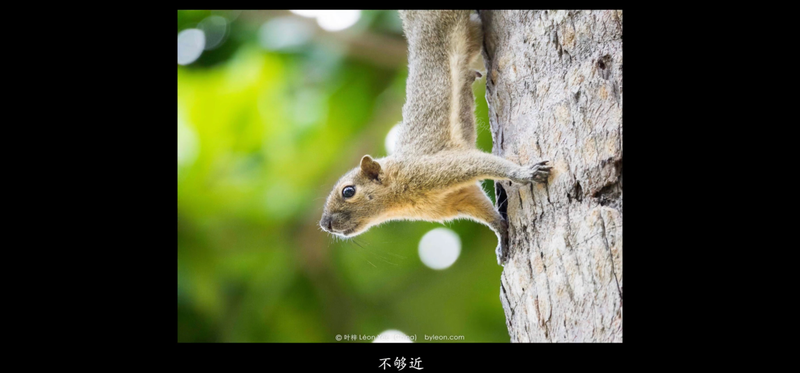

## 视频

播单：[Bornforthis - 播单 - 优酷视频 (youku.com)](https://list.youku.com/albumlist/show/id_68857050)

[https://v.youku.com/v_show/id_XNTg4MjY2MTM2OA==.html](https://v.youku.com/v_show/id_XNTg4MjY2MTM2OA==.html)

如需观看视频，请添加微信：Jiabcdefh，备注来意。一个视频播放密码：5元。整套 699元。

## 笔记

你好，我是悦创。

如果，你已经是买了相机的。有三种情况：

1. 卡片机
2. 微单相机
3. 单反相机

**用好你手中的相机。**

**全画幅相机，尺寸再扩大 4 倍，才是我们的中画幅相机的尺寸。**

## 什么时候升级我的器材

首先，在没有十足的必要下，如果不是因为对焦速度实在是不够快或者是在弱光环境下成像实在是不够好，处了这两种情况下，我们一般不会升级我们的机身，我们会花更多的钱升级镜头。而升级镜头有几个原则。

### 1. 镜头不够广

我的镜头不够广了，拍不下我想拍的东西。

### 2. 我拍的东西不够大

拍的小东西，拍的不够大，微距效果不够强，这个时候，就可能需要增加微距镜头。

### 3. 不够近

就是拍远方的东西，或者想把一些立体的东西拍成平面化，可能你需要添置长焦镜头。

