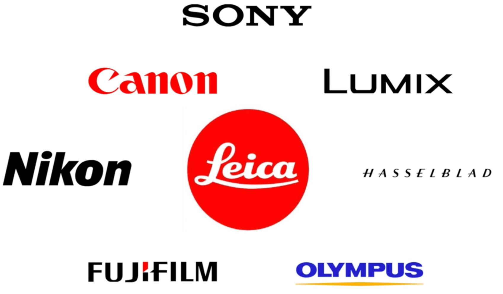

## 1. 如何选择相机品牌

你好，我是悦创。

我们现在所面对的品牌很多，我最喜欢徕卡。

## 2. 根据相机种类来筛选

### 2.1 单反相机

在单反相机中，你不是选佳能，就是选尼康。

这两个是单反相机中的，最常见的品牌。

佳能广告多，尼康广告少。

两个机型，在同一档次机型下，差别非常小，比如说：你都准备花一万块钱买相机，这个差异几乎肉眼无法辨别的。

你如果，以前用过哪个品牌的相机，就买哪种相机，**换门** 我不是非常建议的。

> 换门：就是说你从尼康这个门，进到佳能这个门，这叫换门。所以，如果你换门的话，意味的你不仅仅是换机身，还要换镜头和配件，所以有网友称：灭门。

### 2.2 微单相机

#### 2.2.1 奥林巴斯

画幅比较小，比全画幅感光元件小1/2——半幅。但是这种半幅，把优势发挥到了极致，它的防抖极为强悍，可以说是目前所有相机中，防抖最为强悍的相机。

除此之外，它还有每秒 11 张的连拍，和诸多非常智能的功能。

它的拨轮、按钮特别多。我们在选择相机的时候，更喜欢拨轮和按钮长在外面的，因为数码相机的功能都是非常多的，如果每一个功能都要你进去找，那是非常不方便的，操作会更慢。

#### 2.2.2 富士

特点，色彩非常漂亮。

欢迎关注我公众号：AI悦创，有更多更好玩的等你发现！

::: details 公众号：AI悦创【二维码】

:::

::: info AI悦创·编程一对一

AI悦创·推出辅导班啦，包括「Python 语言辅导班、C++ 辅导班、java 辅导班、算法/数据结构辅导班、少儿编程、pygame 游戏开发」，全部都是一对一教学：一对一辅导 + 一对一答疑 + 布置作业 + 项目实践等。当然，还有线下线上摄影课程、Photoshop、Premiere 一对一教学、QQ、微信在线，随时响应！微信：Jiabcdefh

C++ 信息奥赛题解，长期更新！长期招收一对一中小学信息奥赛集训，莆田、厦门地区有机会线下上门，其他地区线上。微信：Jiabcdefh

方法一：[QQ](http://wpa.qq.com/msgrd?v=3&uin=1432803776&site=qq&menu=yes)

方法二：微信：Jiabcdefh

:::

