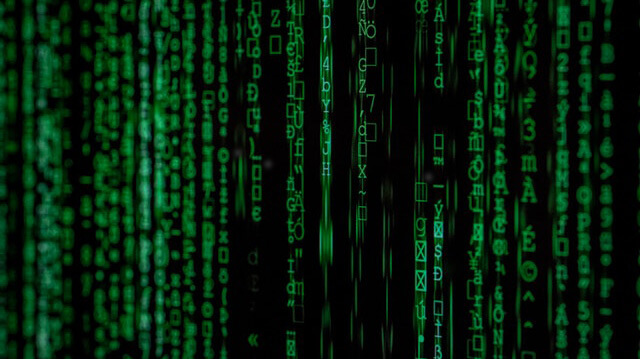

> 不经一翻彻骨寒，怎得梅花扑鼻香。——宋帆

## 初探数据种类

在正式开始学习这个小节之前你要明白，现在我们是在学习写程序。那么在写程序之前你要知道程序的作用是什么？

程序的主要作用是处理数据。数据的种类有很多，我们在手机和电脑上看到的那些文字、数字、图片、视频、页面样式等等都是数据。这些数据都是由程序来处理并显示到屏幕上的。

虽然数据的种类形形色色，并且有些看起来比较复杂，但是在编程时它们实际上都是由一些非常基本的数据形式（或经过组合）来表示。这些基本数据形式有哪些呢？比如有常用到的数字和字符，以及其它的诸如数组、字节序列等形式。

以数字和字符为例，为大家介绍下在代码中它们是怎么表示的。

对于数字，数字在代码中的表示形式和平时的电脑输入一样，直接书写即可：

```python
123
```

```python
3.14159
```

对于字符，和平时的书写稍有不同，Python 代码中表示字符时一定要给字符括上单引号或双引号：

```python
'How are you?'
```

```python
'嗨！'
```

这些不同的数据表示（书写）形式，对应着不同的数据种类，而不同的数据种类又具有不同的功能或者作用。

我们将代码中的数据种类称为**数据类型**，也就是数据的类型。


## 数据类型

代码中的所有数据都是有类型的。

数字所对应的数据类型有**整数型**以及**浮点型**。整数型表示整数数字，比如：`0`，`-59`，`100`。浮点型表示小数数字，如 `-3.5`，`0.25`，`0.0`。

字符所对应的数据类型叫**字符串**，所谓字符串就是一串字符。它里面可以是任意语言的字符，比如 `'哼哼哈嘿'`，`'Good Good Study'`。当然字符串里也可以只有一个字符，比如 `'a'`。

有一种表示「是」或「否」的类型，叫做**布尔型**。它的值叫布尔值，只有 `True` 和 `False` 两种取值。这就好比考试时的判断题，结果只能二选一，要么「是」要么「否」。

另外还有一种很特别的类型：**None 型**，表示什么都没有，它就一个取值 `None`。

> 说明：为了不增加大家的记忆负担，这里只介绍这五种基本数据类型，后续的我们慢慢掌握。

考大家一个问题，在代码中 `1000` 和 `'1000'` 是相同的东西吗？答案是不同，一个是数字，一个是字符串，数据类型不同。


## 数值运算

对于整数型和浮点型，因为它们都被用来表示数值，理所应当这二者可以做数值运算，也就是加减乘除等操作。

我们进入 Python 解释器交互模式中，输入代码试验一下这些数值运算：

- 加法


欢迎关注我公众号：AI悦创，有更多更好玩的等你发现！

::: details 公众号：AI悦创【二维码】


:::

::: info AI悦创·编程一对一

AI悦创·推出辅导班啦，包括「Python 语言辅导班、C++ 辅导班、java 辅导班、算法/数据结构辅导班、少儿编程、pygame 游戏开发」，全部都是一对一教学：一对一辅导 + 一对一答疑 + 布置作业 + 项目实践等。当然，还有线下线上摄影课程、Photoshop、Premiere 一对一教学、QQ、微信在线，随时响应！微信：Jiabcdefh

C++ 信息奥赛题解，长期更新！长期招收一对一中小学信息奥赛集训，莆田、厦门地区有机会线下上门，其他地区线上。微信：Jiabcdefh

方法一：[QQ](http://wpa.qq.com/msgrd?v=3&uin=1432803776&site=qq&menu=yes)

方法二：微信：Jiabcdefh

:::


