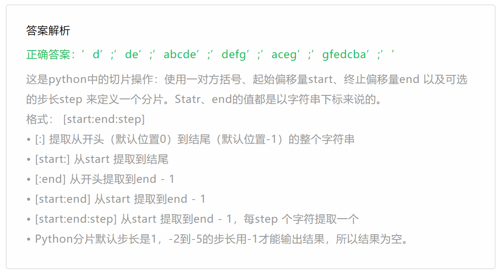

1. 数字型和字符串类型的变量完全可以互相转换。 A. 正确 B. 错误

::: tip 答案解析

正确答案：B 

易错项：A 数字型转字符串类型可以使用 `str()` 函数，字符串类型转数字型可使用 `int()` 和 `float()` 函数

:::

2. 加法运算符可以用来连接字符串并生成新字符串。 A. 正确 B. 错误

::: tip 答案解析

正确答案：A 

易错项：B

:::

3.不管输入什么，Python 3.x 中 input() 函数的返回值总是字符串。 A. 正确 B. 错误

::: tip 答案解析

正确答案：A 

易错项：B 记忆性知识点

:::

4.Python 字符串方法 replace() 对字符串进行原地修改。 A. 正确 B. 错误

::: tip 答案解析

正确答案：B 

易错项：A 

在 Python 中，字符串属于不可变对象，不支持原地修改，如果需要修改其中的值，只能重新创建一个新的字符串对象。

:::

5.此题无需在线作答，请在纸上作答后查看答案解析 7//3的值为\_\_\_\_\_\_\_\_\_；7%3的值为\_\_\_\_\_\_\_\_\_\_。

::: tip 答案解析

2；1

:::

6.此题无需在线作答，请在纸上作答后查看答案解析 y 变量初始赋值为 10，有代码为：y \*= 2，则运算过后 y 的值为\_\_\_\_\_\_\_\_\_\_。

::: tip 答案解析

20

:::

7.此题无需在线作答，请在纸上作答后查看答案解析 可以使用\_\_\_\_\_\_\_\_函数将数字型的变量转换成字符串。

::: tip 答案解析

str()

:::

8.下列哪个表达式在 Python 中是非法的？ 

A. x = y = z = 1 

B. x = (y = z + 1) 

C. x, y = y, x 

D. x += y

::: tip 答案解析

正确答案：B 

易错项：C 

B 中的 `y=z+1` 是一个完整的赋值语句，不能放在等号的右边用来再次给x赋值。

A 是同时赋值，C 是变量的值交换，D 等价于 `x=x+y`。

:::

9.字符串是 Python 的\_\_\_\_\_\_\_\_\_序列。 A. 有序 B. 无序

::: tip 答案解析

正确答案：A 

易错项：B 记忆性知识点

:::

10.此题无需在线作答，请在纸上作答后查看答案解析 当在字符串前加上小写字母\_\_\_\_\_\_\_\_\_\_\_\_\_\_\_或大写字母\_\_\_\_\_\_表示原始字符串，不对其中的任何字符进行转义。

::: tip 答案解析

正确答案：r、R 记忆性知识点

:::

11.此题无需在线作答，请在纸上作答后查看答案解析 已知字符串 x = 'hello world'，那么执行语句 x.replace('hello', 'hi') 之后，x 的值为\_\_\_\_\_\_\_\_\_\_\_\_。

::: tip 答案解析

正确答案：'hello world' 

x 自身的值不会被 `replace()` 影响。具体理解可以参考 [https://blog.csdn.net/qq_33254766/article/details/124834439](https://blog.csdn.net/qq_33254766/article/details/124834439)

:::

1.  此题无需在线作答，请在纸上作答后查看答案解析

设 s="abcdefg"，则：

- s\[3\] 的值为\_\_\_\__\_\_\_，_
- s[3:5] 的值为\_\__\_；_
- s[:5] 的值为\_\_\_\__\_；_
- s[3:] 的值为_\_\_\___；
- s[::2] 的值为\_\_\_\_\_\_\_\_；
- s[::-1] 的值为_____\_\_\_\__；
- s[-2:-5] 的值为___\_\_\_\_\_。

::: tip 答案解析

正确答案：'d';'de';'abcde';'defg';'aceg';'gfedcba';''

这是 Python 中的切片操作：使用一对方括号、起始偏移量 start、终止偏移量 end 以及可选的步长 step 来定义一个分片。Statr、end 的值都是以字符串下标来说的。 格式： \[start:end:step\]

- [:] 提取从开头（默认位置0）到结尾（默认位置-1）的整个字符串 
- [start:] 从start 提取到结尾
- [:end\] 从开头提取到 end - 1
- [start:end\] 从start 提取到end - 1
- [start:end:step\] 从start 提取到end - 1，每step 个字符提取一个
- Python 分片默认步长是 1，-2 到 -5 的步长用 -1才能输出结果，所以结果为空。

:::

::: details 图片版答案： 



:::


13. 此题无需在线作答，请在纸上作答后查看答案解析。

有变量 `name = ' Alex '，请按照要求实现每个功能： 

1. 移除 name 变量对应的值两边的空格，并输出移除后的内容； 
2. 判断 name 变量对应的值是否以 "al" 开头和以 "X" 结尾，并输出结果； 
3. 将 name 变量对应的值中的 "l" 替换为 "p"，并输出结果； 
4. 将 name 变量对应的值根据 "l" 分割，并输出结果； 
5. 将 name 变量对应的值分别变大写和小写，并输出结果。

::: info 答案

```
1.
v=name.strip()  #.strip()移除指定字符串，空白，/t，/n等转义字符
print(v)
2.
v1=name.startswith("al")   #判断以什么开头
v2=name.endswith("X")     #判断以什么结尾
print(v1)
print(v2)
3.
v3=name.replace("l","p")   
print(v3)
4.
name='Alex'
print(name.split('l'))
5.
v5=name.casefold()      #全部变成小写
v6=name.upper()           #变成全部变成大写，对应的有lower()
print(v5)             #swapcase()大小写互相转换
print(v6)
```

:::

::: info AI悦创·编程一对一

AI悦创·推出辅导班啦，包括「Python 语言辅导班、C++ 辅导班、java 辅导班、算法/数据结构辅导班、少儿编程、pygame 游戏开发」，全部都是一对一教学：一对一辅导 + 一对一答疑 + 布置作业 + 项目实践等。当然，还有线下线上摄影课程、Photoshop、Premiere 一对一教学、QQ、微信在线，随时响应！微信：Jiabcdefh

C++ 信息奥赛题解，长期更新！长期招收一对一中小学信息奥赛集训，莆田、厦门地区有机会线下上门，其他地区线上。微信：Jiabcdefh

方法一：[QQ](http://wpa.qq.com/msgrd?v=3&uin=1432803776&site=qq&menu=yes)

方法二：微信：Jiabcdefh

:::


