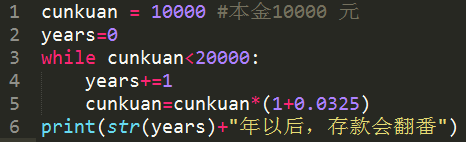
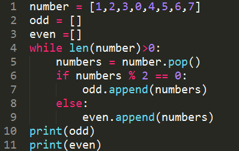

1.  此题无需在线作答，请在纸上作答后查看答案解析 while循环，只要while后面的条件为\_\_\_\_\_时才能不断循环，条件不满足时退出循环。
    

::: tip 答案解析

正确答案：真/True 记忆性知识点

:::    

2.  此题无需在线作答，请在纸上作答后查看答案解析 （拓展）在循环语句中，\_\_\_\_\_\_\_语句的作用是提前进入下一次循环。
    

::: tip 答案解析

正确答案：continue 记忆性知识点

:::    

3.  若 k 为整型，下述 while 循环一共执行\_\_\_\_\_\_次后，输出数值为\_\_\_\_\_。
    
    ```python
    k = 1000
    while k >1:
        k = k/2
    
    print(k)
    ```
    
    A. 10 1.953 
    
    B. 10 0.9765625 
    
    C. 11 0.9765625 
    
    D. 11 1.953

::: tip 答案解析

正确答案：B 

易错项：C 

一共执行了 10 次循环，k 依次变化为 1000，500.0，250.0，125.0，62.5，31.25，15.625，7.8125，3.90625，1.953125，0.9765625。

最后一次执行完循环，k 已小于 1，,即不满足循环条件，跳出循环。输出数值为最后一次执行 `k=k/2` 之后的k值，即 `k=0.9765625` 。

:::    

4.  有代码如下，请判断最后一个输出的数字是\_\_\_\_\_。
    
    ```python
    n = 1
    while n <= 100 :
        if n > 10 :
            break
        print(n)
        n = n+1
    ```
    
    A. 100 
    
    B. 10 
    
    C. 11 
    
    D. 99

::: tip 答案解析

正确答案：B 

易错项：C while 循环条件是在 `1-100` 之内进行循环，并在大于 10 时在 break 处跳出整个循环，即当 `n=1` 1时满足跳出整个循环的条件，即停止循环。
::: 

5. 用 Python 编程，假设一年期定期利率为 `3.25%` ，计算一下需要过多少年，一万元的一年定期存款连本带息能翻番？ 

    

6.  （拓展）使用 while 循环将列表内的奇数和偶数分开



欢迎关注我公众号：AI悦创，有更多更好玩的等你发现！

::: details 公众号：AI悦创【二维码】


:::

::: info AI悦创·编程一对一

AI悦创·推出辅导班啦，包括「Python 语言辅导班、C++ 辅导班、java 辅导班、算法/数据结构辅导班、少儿编程、pygame 游戏开发」，全部都是一对一教学：一对一辅导 + 一对一答疑 + 布置作业 + 项目实践等。当然，还有线下线上摄影课程、Photoshop、Premiere 一对一教学、QQ、微信在线，随时响应！微信：Jiabcdefh

C++ 信息奥赛题解，长期更新！长期招收一对一中小学信息奥赛集训，莆田、厦门地区有机会线下上门，其他地区线上。微信：Jiabcdefh

方法一：[QQ](http://wpa.qq.com/msgrd?v=3&uin=1432803776&site=qq&menu=yes)

方法二：微信：Jiabcdefh

:::


