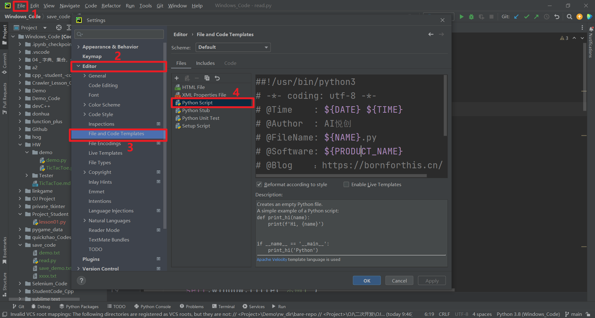

## 1. 按照下面路径以此打开



## 2. 设置相关代码

```python
##!/usr/bin/python3
# -*- coding: utf-8 -*-
# @Time    : ${DATE} ${TIME}
# @Author  : AI悦创
# @FileName: ${NAME}.py
# @Software: ${PRODUCT_NAME}
# @Blog    ：https://bornforthis.cn/
```

设定的规则说明如下：

```python
（a）shebang行

#!/usr/bin/python3

（b）预定义的变量要扩展为格式为$ {<variable_name>}的相应值。

可用的预定义文件模板变量为：

$ {PROJECT_NAME} - 当前项目的名称。

$ {NAME} - 在文件创建过程中在“新建文件”对话框中指定的新文件的名称。

$ {USER} - 当前用户的登录名。

$ {DATE} - 当前的系统日期。

$ {TIME} - 当前系统时间。

$ {YEAR} - 今年。

$ {MONTH} - 当月。

$ {DAY} - 当月的当天。

$ {HOUR} - 目前的小时。

$ {MINUTE} - 当前分钟。

$ {PRODUCT_NAME} - 将在其中创建文件的IDE的名称。

$ {MONTH_NAME_SHORT} - 月份名称的前3个字母。 示例：1月，2月等

$ {MONTH_NAME_FULL} - 一个月的全名。 示例：1月，2月等
```

欢迎关注我公众号：AI悦创，有更多更好玩的等你发现！

::: details 公众号：AI悦创【二维码】


:::

::: info AI悦创·编程一对一

AI悦创·推出辅导班啦，包括「Python 语言辅导班、C++ 辅导班、java 辅导班、算法/数据结构辅导班、少儿编程、pygame 游戏开发」，全部都是一对一教学：一对一辅导 + 一对一答疑 + 布置作业 + 项目实践等。当然，还有线下线上摄影课程、Photoshop、Premiere 一对一教学、QQ、微信在线，随时响应！微信：Jiabcdefh

C++ 信息奥赛题解，长期更新！长期招收一对一中小学信息奥赛集训，莆田、厦门地区有机会线下上门，其他地区线上。微信：Jiabcdefh

方法一：[QQ](http://wpa.qq.com/msgrd?v=3&uin=1432803776&site=qq&menu=yes)

方法二：微信：Jiabcdefh

:::


