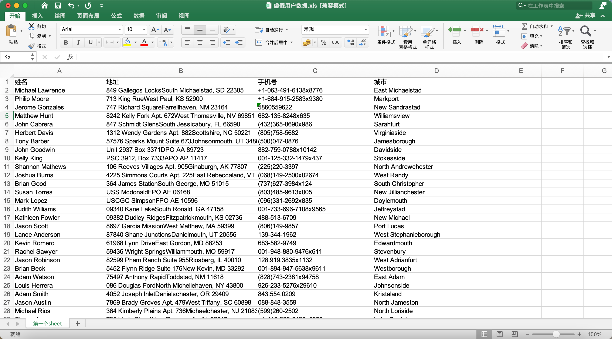
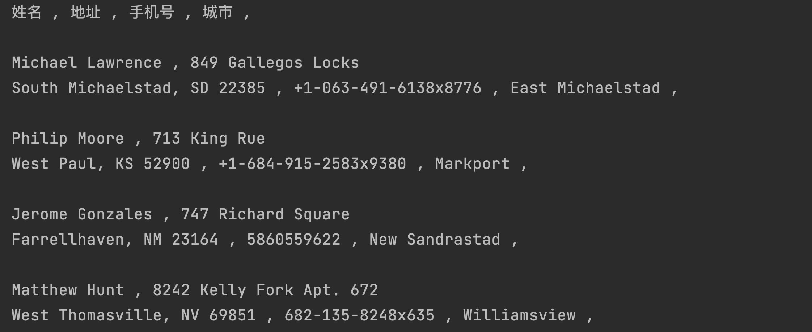

你好，我是悦创。

## 写入 Excel 文件 

本节课，我们来熟悉下 Excel 的读和写操作。

首先来学习下，随机生成数据，写入一个Excel文件并保存，所使用到的库，是 xlwt，安装命令 `pip install xlwt` ，安装简单方便，无依赖，很快。

```cmd
pip install xlwt
```

新建 Python 文件，第一个代码块，先导入 xlwt 这个库，并新建一个 WorkBook 对象。

```python
import xlwt

wb = xlwt.Workbook()  # 新建一个 workbook 对象
```

Excel 的每个文件，里面可以有很多 sheet，所以有了 workbook，还需要新建 sheet：

```python
sheet = wb.add_sheet('第一个sheet')
```

有了 sheet，就可以开始写入数据了。sheet 里面是一个二维的表格，并且索引是从 0 开始的，所以第一步，先写头部数据。

```python
head_data = ['姓名', '地址', '手机号', '城市']
for head in head_data:
	sheet.write(0, head_data.index(head), head)
	# sheet.write(行, 列, 写入数据)
```

write 函数写入，分别是 `x 行, x 列, 数据`，头部数据永远是第一行，所以第 0 行。数据的列，则是当前数据所在列表的索引，直接使用index 函数即可。

有了头部数据，现在就开始写入内容了，分别是：随机姓名、随机地址、随机号码、随机城市，数据的来源都是 faker 库，一个专门创建虚假数据用来测试的库，安装命令：`pip install faker`。

```cmd
pip install faker
```

因为头部信息已经写好，所以接下来是从第 1 行开始写数据，每行四个数据，准备写 99 个用户数据，所以用循环，循环 99 次，代码如下：

```python
import faker

fake = faker.Faker()
for i in range(1, 100):
	sheet.write(i, 0, fake.first_name() + ' ' + fake.last_name())
	sheet.write(i, 1, fake.address())
	sheet.write(i, 2, fake.phone_number())
	sheet.write(i, 3, fake.city())
```

数据全部写好了，但是此时数据保存在 wb 这个对象中，wb 就是最开始的 Workbook。

**但是 wb 中的数据，不是永久的；保存成文件，才是永久的。**

Workbook 对象，提供 save 函数，可以直接保存成 xls 文件，代码如下：

```
wb.save('虚假用户数据.xls')
```

然后找到文件，文件的位置就是你 Python 代码文件的旁边。使用 office 或者 wps 打开这个 xls 文件，如下截图：



一共有 100 行，其中头部一行，虚假用户信息 99 行。


## 读取 Excel 文件

写文件已经搞定，接下来就要学习下 Excel 的读操作。

- 写入 Excel 的库是 xlwt，对应 write；
- 读取 Excel 的库是 xlrd，对应 read；

xlrd 的安装命令：`pip install xlrd`

```cmd
pip install xlrd
```

首先导入 xlrd，然后打开前面写好的 “**虚假用户数据.xls**”，代码如下：

```python
import xlrd

wb = xlrd.open_workbook('虚假用户数据.xls')
```

打开了文件之后，wb 代表当前文件。读取数据，需要指定具体的 sheet，有两种方式，分别是通过索引和名称，如下代码：

```python
sheets = wb.sheets()  # 获取文件中全部的 sheet，返回结构是 list。
# print(sheets)  # [Sheet  0:<第一个sheet>]
sheet = sheets[0]  # 通过索引顺序获取。

sheet = wb.sheet_by_index(0)  # 直接通过索引顺序获取。

sheet = wb.sheet_by_name('第一个sheet')  # 通过名称获取。
```

此时获取到了 sheet 对象，然后从这里取出数据就可以。

sheet 的内容是二维表格，取数据全靠行数和列数，定位具体的格子，然后拿到格子里面的内容。

**如果我们要取出全部的内容咋办？**——获取 sheet 的总行数和列数，然后循环就行。

取出总行数和列数的代码如下：

```python
rows = sheet.nrows  # 行
cols = sheet.ncols  # 列
```

rows 就是总行数，cols 是总列数。有这两值，然后两层循环，取数据就行，如下代码：

```python
for row in range(rows):
	for col in range(cols):
		print(sheet.cell(row, col).value, end=' , ')
	print('\n')
```

效果图【只截图头部】：



读数据，指定某行某列，定位到具体方格，取出里面的值即可，代码是 `sheet.cell(row, col).value` 。

欢迎关注我公众号：AI悦创，有更多更好玩的等你发现！

::: details 公众号：AI悦创【二维码】


:::

::: info AI悦创·编程一对一

AI悦创·推出辅导班啦，包括「Python 语言辅导班、C++ 辅导班、java 辅导班、算法/数据结构辅导班、少儿编程、pygame 游戏开发」，全部都是一对一教学：一对一辅导 + 一对一答疑 + 布置作业 + 项目实践等。当然，还有线下线上摄影课程、Photoshop、Premiere 一对一教学、QQ、微信在线，随时响应！微信：Jiabcdefh

C++ 信息奥赛题解，长期更新！长期招收一对一中小学信息奥赛集训，莆田、厦门地区有机会线下上门，其他地区线上。微信：Jiabcdefh

方法一：[QQ](http://wpa.qq.com/msgrd?v=3&uin=1432803776&site=qq&menu=yes)

方法二：微信：Jiabcdefh

:::


