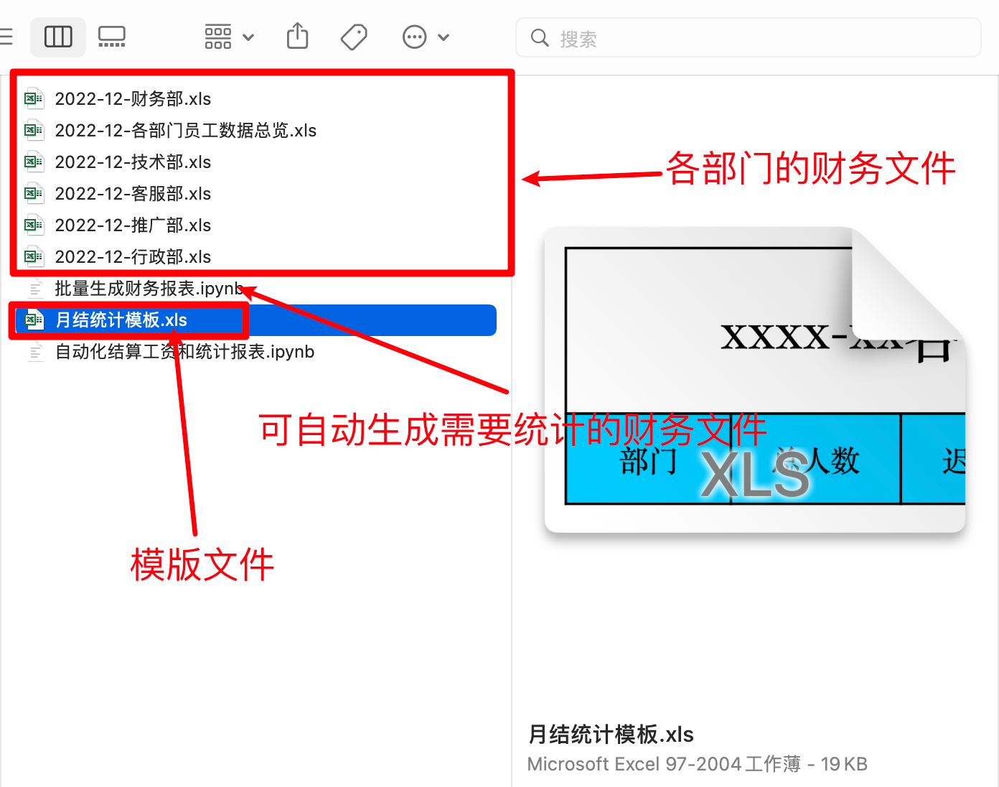
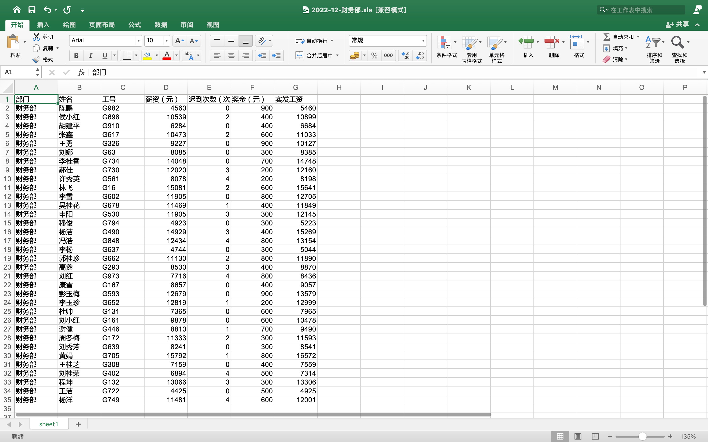
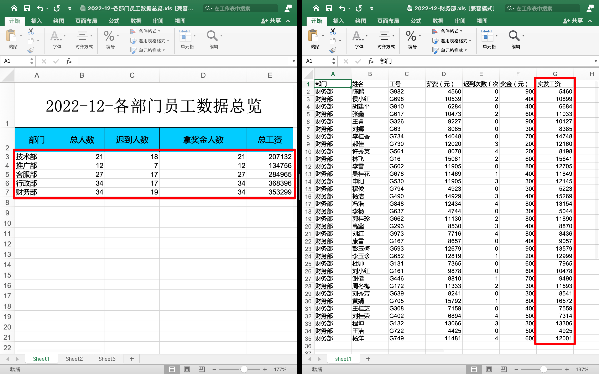

## 实例需求说明

学习了 Excel 文件的写入、读取和追加内容，那现在来做个案例。

需求描述并整理，如下：

- 每个月的 2 号，你会收到一个 Excel 文件；
- 文件中包含了 各个部门的员工信息；
- 你需要一天之内完成这些报表的整理和统计，然后交给领导检查和发放工资；
- 时间要快，工资发晚了，同事会抱怨你；
- 工作量还是比较大的，你需要解放双手，让程序去处理问题
- 让程序快速的计算出每个人的工资，并将统计信息结合模板，生成“`xxxx年xx月各部门员工数据总览`”；
- 薪资计算规定：迟到一次扣 20，一个月最多扣 200；

简单的财务自动化结算需求，并且给出了各部门的工资表格文件和统计报表的模板文件。

## 需求说明图示

简单的财务自动化结算需求，并且给出了各部门的工资表格文件和统计报表的模板文件，截图如下：



“`批量生成财务报表.ipynb`”这个文件里面有可执行代码，执行后会自动的生成 5 个部门的财务文件。你也可以自己使用下面代码自动生成：

```python
# -*- coding: utf-8 -*-
# @Time    : 2022/7/15 21:48
# @Author  : AI悦创
# @FileName: demo2.py
# @Software: PyCharm
# @Blog    ：http://www.aiyc.top
# @公众号   ：AI悦创
import xlwt
import faker
import random
import datetime


def create_excel_file(filename, department):
	wb = xlwt.Workbook(filename)
	sheet = wb.add_sheet('sheet1')
	fake = faker.Faker("zh_CN")
	head_data = ['部门', '姓名', '工号', '薪资（元）', '迟到次数（次）', '奖金（元）', '实发工资']
	for head in head_data:
		sheet.write(0, head_data.index(head), head)
	for i in range(1, random.randint(5, 100)):
		sheet.write(i, 0, department)
		sheet.write(i, 1, fake.last_name() + fake.first_name())
		sheet.write(i, 2, "G{}".format(random.randint(1, 1000)))
		sheet.write(i, 3, random.randint(4000, 16000))
		sheet.write(i, 4, random.choice([0, 0, 0, 1, 2, 3, 4]))
		sheet.write(i, 5, random.choice([200, 300, 400, 500, 600, 700, 800, 900]))
	wb.save(filename)


department_name = ['技术部', '推广部', '客服部', '行政部', '财务部']
for dep in department_name:
	xls_name = "{}-{}.xls".format(datetime.datetime.now().strftime("%Y-%m"), dep)
	create_excel_file(xls_name, dep)
	print(xls_name, " 新建完成")
```

下面是财务文件和模板文件的截图：




财务文件中，每个用户数据，都是缺少应发工资的，需要用程序计算和填写；

模板文件的使用，需要将本月的部门财务文件全部计算并统计出来，然后填充到模板文件中，生成一个本月的数据总览表格，如下截图：



选中的部分是需要使用程序自动填写。

一共有5个财务文件，每个文件有不固定个数的员工信息。

那接下来就开始写代码，实现自动化工资结算和统计报表的任务。

## 库的导入和准备代码

首先第一步，导入需要的库，生成时间对象。还有就是文件夹中，放着很多文件，有 `xls`、`ipynb` 等格式，所以还需指定要操作的文件名，如下代码：


欢迎关注我公众号：AI悦创，有更多更好玩的等你发现！

::: details 公众号：AI悦创【二维码】


:::

::: info AI悦创·编程一对一

AI悦创·推出辅导班啦，包括「Python 语言辅导班、C++ 辅导班、java 辅导班、算法/数据结构辅导班、少儿编程、pygame 游戏开发」，全部都是一对一教学：一对一辅导 + 一对一答疑 + 布置作业 + 项目实践等。当然，还有线下线上摄影课程、Photoshop、Premiere 一对一教学、QQ、微信在线，随时响应！微信：Jiabcdefh

C++ 信息奥赛题解，长期更新！长期招收一对一中小学信息奥赛集训，莆田、厦门地区有机会线下上门，其他地区线上。微信：Jiabcdefh

方法一：[QQ](http://wpa.qq.com/msgrd?v=3&uin=1432803776&site=qq&menu=yes)

方法二：微信：Jiabcdefh

:::


