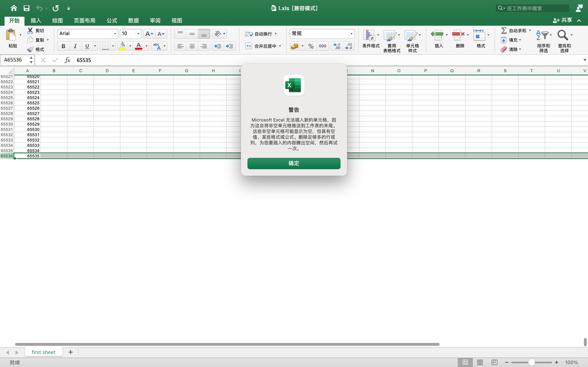
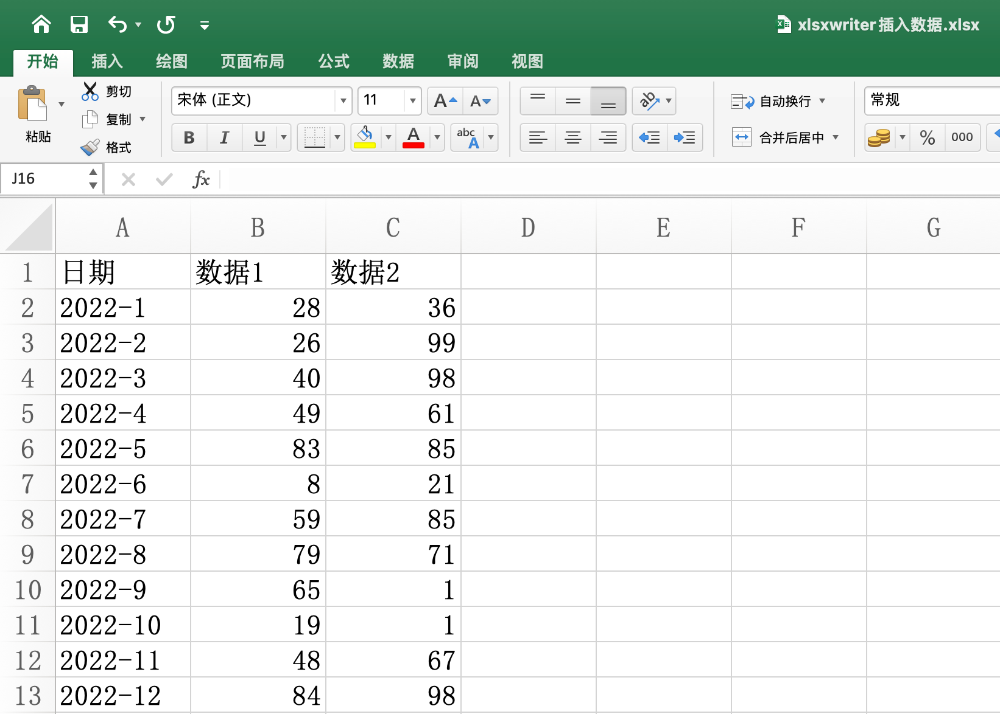
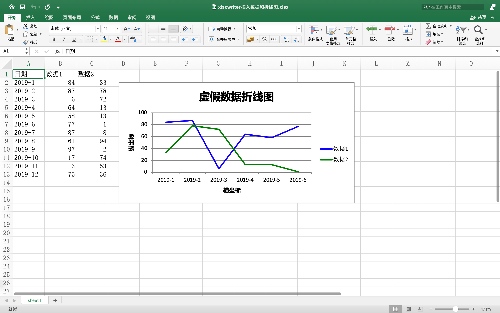

## 为什么需要掌握新的库

#### 操作xls 

xlrd 和 xlwt，以及 xlutils 足以满足对xls文件的读、写、追加功能。

但是办公文件的格式，不是 xls，还有 xlsx，还有我们很少见的 xlsm 等。

#### 操作xlsx 

xlsx 是 xls 的升级版，xls 是老版本的办公软件所支持的文件格式，且劣势也比较明显，当文件数据超过 65536 行和 256 列，使用 xls 则会导致数据截断。



xlsx 的支持则更好，同样多的数据，xlsx 格式的文件体积小，支持的操作更多，软件打开和动作执行的速度会更快。

本次介绍的库是 xlsxwriter 和 openpyxl，这两个库均支持操作 xlsx 文件格式。

掌握 xlsx 的读写操作，也是大势所趋。

## 写入头部标题

首先是学习 xlsxwriter 库，安装命令：`pip install xlsxwriter`。

第一步先导入库，以及打开一个 xlsx 文件：

```python
import xlsxwriter, random  # 导入模块

wb = xlsxwriter.Workbook('xlsxwriter插入数据.xlsx')
```

xlsx 和 xls 的操作都是一致的，单个文件，里面可以添加多个 sheet。打开文件后，需要新建第一个 sheet。

```python
worksheet1 = wb.add_worksheet('代码操作记录')
```

有了 sheet，开始准备标题和数据并写入文件。首先是头部标题：

```python
headings = ['日期', '数据1', '数据2']
worksheet1.write_row('A1', headings)
```

标题保存在 headings 中，列表格式，然后逐个写入到 sheet 中。

但是这里的写入操作，不是行数、列数、数据格式的单个数据写入操作，而是直接写入一行或者一列。这里用的是写入 `wtier_row`，写入一行，从 A1 开始，然后 A2、A3，一直往后写。

## 写入数据内容

接下来写入数据，首先是创造数据，结构也是列表格式，然后使用写入列的操作，将数据整行的写入。

```python
data = [
    ['2022-1', '2022-2', '2022-3', '2022-4', '2022-5', '2022-6', '2022-7', '2022-8', '2022-9', '2022-10', '2022-11',
     '2022-12', ],
    [random.randint(1, 100) for i in range(12)],
    [random.randint(1, 100) for i in range(12)],
]
worksheet1.write_column('A2', data[0])
worksheet1.write_column('B2', data[1])
worksheet1.write_column('C2', data[2])
```

这里的数据使用了random 库随机设置，所以第一块代码中，有 random 的导入。

data 是列表，里面有三个列表，分别是日期和两类数据，结合头部标题，写入的数据，是三列，所以用的是 `write_column` 函数。

写完之后，直接关闭即可。

```python
wb.close()
```

用 Office 打开文件，如下图：



数据写入完毕。

## 新建图表对象

数据写好了，但是 Excel 不仅仅只是存放数据的，也可以生成图表。下面我们就学习下如何生成图表。

图表的数据，直接使用**数据1**和**数据2**的内容，并且前半部分，数据的写入就是上面的代码。

数据写入之后，不关闭，然后继续操作，生成一个图表信息。我先把上一部分的代码 copy 在下面：

```python
import xlsxwriter, random  # 导入模块

wb = xlsxwriter.Workbook('xlsxwriter插入数据和折线图.xlsx')  # 创建新的excel

worksheet = wb.add_worksheet('sheet1')  # 创建新的sheet

headings = ['日期', '数据1', '数据2']  # 创建表头

data = [
    ['2022-1', '2022-2', '2022-3', '2022-4', '2022-5', '2022-6', '2022-7', '2022-8', '2022-9', '2022-10', '2022-11',
     '2022-12', ],
    [random.randint(1, 100) for i in range(12)],
    [random.randint(1, 100) for i in range(12)],
]

worksheet.write_row('A1', headings)

worksheet.write_column('A2', data[0])
worksheet.write_column('B2', data[1])
worksheet.write_column('C2', data[2])  # 将数据插入到表格中
```

第一部分，折线图表的定义：

```python
chart_col = wb.add_chart({'type':'line'})        #新建图表格式 line 为折线图
```

有了图表对象，下面就是往里加入数据。

## 图表数据配置

这里的数据有两条，一个是数据1，一个是数据2，所以图表添加数据的代码如下：

```python
chart_col.add_series(  # 给图表设置格式，填充内容
    {
        'name': '=sheet1!$B$1',
        'categories': '=sheet1!$A$2:$A$7',
        'values': '=sheet1!$B$2:$B$7',
        'line': {'color': 'blue'},
    }
)
chart_col.add_series(  # 给图表设置格式，填充内容
    {
        'name': '=sheet1!$C$1',
        'categories': '=sheet1!$A$2:$A$7',
        'values': '=sheet1!$C$2:$C$7',
        'line': {'color': 'green'},
    }
)
```

有两条数据，所以添加了两次。

数据有四项，数据名、具体值对应的横坐标 categories、具体值对应的纵坐标 values、折线颜色，其中取值方式，直接是使用 sheet 的坐标形式，例如 name 是 B1 和 B2，categories 都是 A2-A7，值分别是 B2-B7 和 C2-C7。

## 完成图表

数据添加之后，在设置下坐标的相关信息，就是标题、x轴、y轴的名字，以及图表位置和大小，代码如下：

```python
chart_col.set_title({'name': '虚假数据折线图'})
chart_col.set_x_axis({'name': "横坐标"})
chart_col.set_y_axis({'name': '纵坐标'})  # 设置图表表头及坐标轴

worksheet.insert_chart('D2', chart_col, {'x_offset': 25, 'y_offset': 10})  # 放置图表位置

wb.close()
```

图表的位置和大小，是根据左上角的起始表格和 x 和 y 的偏移计算的。

代码中是从 D2 做左上角起始，然后 x 和 y 分别偏移 25 和 10 个单位，得到了图片的最终大小。最后关闭 wb。

下面是最后的 Excel 文件样式：



以上就是 xlsxwriter 的使用示例，有图的加入，比较有趣。但是 xlsxwriter 只能创建新的文件，不能追加和读取。

欢迎关注我公众号：AI悦创，有更多更好玩的等你发现！

::: details 公众号：AI悦创【二维码】


:::

::: info AI悦创·编程一对一

AI悦创·推出辅导班啦，包括「Python 语言辅导班、C++ 辅导班、java 辅导班、算法/数据结构辅导班、少儿编程、pygame 游戏开发」，全部都是一对一教学：一对一辅导 + 一对一答疑 + 布置作业 + 项目实践等。当然，还有线下线上摄影课程、Photoshop、Premiere 一对一教学、QQ、微信在线，随时响应！微信：Jiabcdefh

C++ 信息奥赛题解，长期更新！长期招收一对一中小学信息奥赛集训，莆田、厦门地区有机会线下上门，其他地区线上。微信：Jiabcdefh

方法一：[QQ](http://wpa.qq.com/msgrd?v=3&uin=1432803776&site=qq&menu=yes)

方法二：微信：Jiabcdefh

:::


