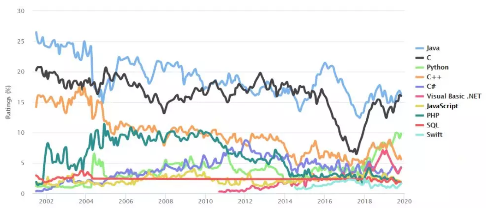
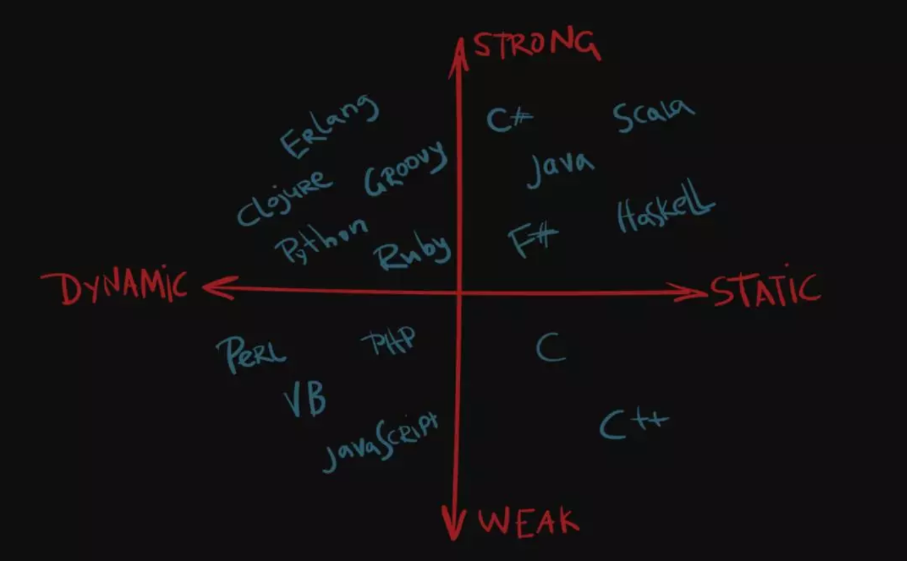

Python 语言使用率越来越高，使用 Python 不仅可以做 GUI 开发、Web 开发，还能进行数据预处理、数据探索性分析（EDA），更是进行数据挖掘、机器学习、深度学习等的首选语言。

基于 Python 的包更是枝繁叶茂，遍地开花，“Tiobe 编程语言排行榜”最新统计显示 Python 是增长最快的语言。




这得益于 Python 语言语法简单、开发效率高，集成系统非常方便。

Python 相关的就业机会也是非常多，待遇也很优厚。

因此，不管从易用性，还是工作机会和待遇来说，Python 都是 IT 从业者需要掌握的语言。

接下来，与大家，还有远在美国做 AI 博士后研究的 Alicia，一起开始我们的 60 天 Python 探索之旅吧。

开始前，先了解下这个专栏的基本使用说明，主要包括如下几点：

- 使用的是 Python 3。
- 被讨论到的每个知识点都配备有小案例，辅助大家快速理解知识点，同时加深印象。
- 为了学习方便，对于小的代码块，尽量使用 IPython 或 Jupyter Notebook 交互工具做演示。
- 对于专栏涉及到的实战项目，相应的代码会按照软件工程和设计模式的思想，去拆分和组织。
- 书写的语言尽量做到通俗易懂，不搞华丽辞藻。

所有的这些考虑，都是为了让大家在短时间内掌握 Python 技术栈，多一个生存的本领。拿到理想的 Offer 后，早日过上自己想要的生活。

让我们开始吧。

**首先问大家一个问题，你知道 Python 是一门什么样的语言吗？**

## Python 语言两大特性

Python 是一门动态的、强类型语言。

### 什么是动态语言？

要了解什么是动态语言，要首先了解“类型检查”。

类型检查是验证类型约束的过程，编译器或解释器通常在编译阶段或运行阶段做类型检查。

类型检查就是查看“变量”和它们的”类型”，然后判断表达式是否合理。例如，不能拿一个 string 类型变量除以浮点数变量。

如果类型检查发生在程序运行阶段（run time），那么它便是“动态类型语言”（dynamically typed languages）。常见的动态语言包括：

- Python
- JavaScrpit
- PHP

类型检查发生在“编译阶段”（compile time）的是“静态类型语言”（statically typed languages）。常见的静态类型语言包括：

- C
- C++
- Java
- C#
- Scala

### 什么是强类型语言？

强类型语言是指：不管是在编译阶段还是运行阶段，一旦某种类型绑定到变量后，此变量便会持有此类型，并且不能同其他类型在计算表达式时，混合使用。

例如，在交互式工具 IPython 中输入如下两行代码：

```python
In [1]: a = 5
In [2]: a = a + 's'
```

程序会抛出 TypeError 异常：

```python
unsupported operand type(s) for +: 'int' and 'str'
```

意思是不支持 int 变量和 str 变量相加。

常见的强类型语言有：

- Python
- Java
- C#
- Scala

与之对应的是弱类型语言，弱类型语言容易与其他类型混合计算。弱类型语言代表 JavaScript。

支持如下操作：

```python
var data = 5
data = data + 'xiaoming' //string 和 int 结合自动转化为 string
```

常见的弱类型语言有：

- C
- C++
- PHP
- Javascript

如下，按照是否为静态/动态语言，弱类型/强类型两个维度，总结常用的语言分类。



## 四大基本语法

分别从变量命名规则、缩进原则、特殊关键字和特殊运算符四个方面，总结 Python 的基本语法。

### 命名规则

Python 的变量命名规则主要包括两条：

- 允许包括英文、数字以及下划线（`_`），不能以数字开头
- 名称区分大小写

特别说明以“下划线”开头的变量是有特殊意义的：

- 类变量若以单下划线（`_`）开头，代表不能直接被访问，类似于 C# 的受保护型变量（protected），表示不能通过 `import module_name` 而导入。
- 类变量若以双下划（`__`）开头，表示为类的私有成员，不能被导入和其他类变量访问。
- 以双下划开头和双下划线结尾的变量是 Python 里的专用标识，有特殊的身份。

如 Python 自定义类中都包括 `__init__` 和 `__add__` 方法，如果不重写 `__add__ ` 去执行两个类加法操作，程序会抛 TypeError 异常。只有重写后，程序才能正常执行加法操作。

Python 变量命名习惯一般遵守蛇形命名法（snake case）：

- 一般变量命名，book_id、book_store_count；
- 类名首字符为大写，如 Python 内置模块 collections.abc 中的 Iterable 类、我们自定义的 Book 类等；
- 类方法名：get_store_count()；
- 其他特殊变量，会全部大写，M_PI、MAX_VEHICLE_SPEED。

这与 Java 命名方法不同，Java 最典型的命名方法——驼峰命名法（camel case）。


欢迎关注我公众号：AI悦创，有更多更好玩的等你发现！

::: details 公众号：AI悦创【二维码】


:::

::: info AI悦创·编程一对一

AI悦创·推出辅导班啦，包括「Python 语言辅导班、C++ 辅导班、java 辅导班、算法/数据结构辅导班、少儿编程、pygame 游戏开发」，全部都是一对一教学：一对一辅导 + 一对一答疑 + 布置作业 + 项目实践等。当然，还有线下线上摄影课程、Photoshop、Premiere 一对一教学、QQ、微信在线，随时响应！微信：Jiabcdefh

C++ 信息奥赛题解，长期更新！长期招收一对一中小学信息奥赛集训，莆田、厦门地区有机会线下上门，其他地区线上。微信：Jiabcdefh

方法一：[QQ](http://wpa.qq.com/msgrd?v=3&uin=1432803776&site=qq&menu=yes)

方法二：微信：Jiabcdefh

:::

