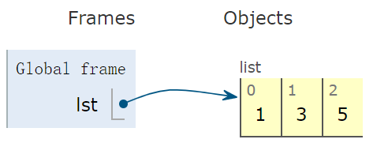
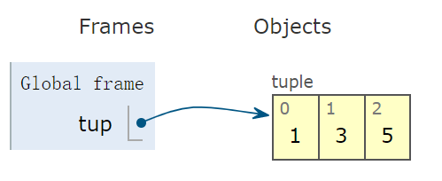
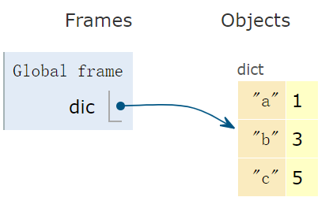
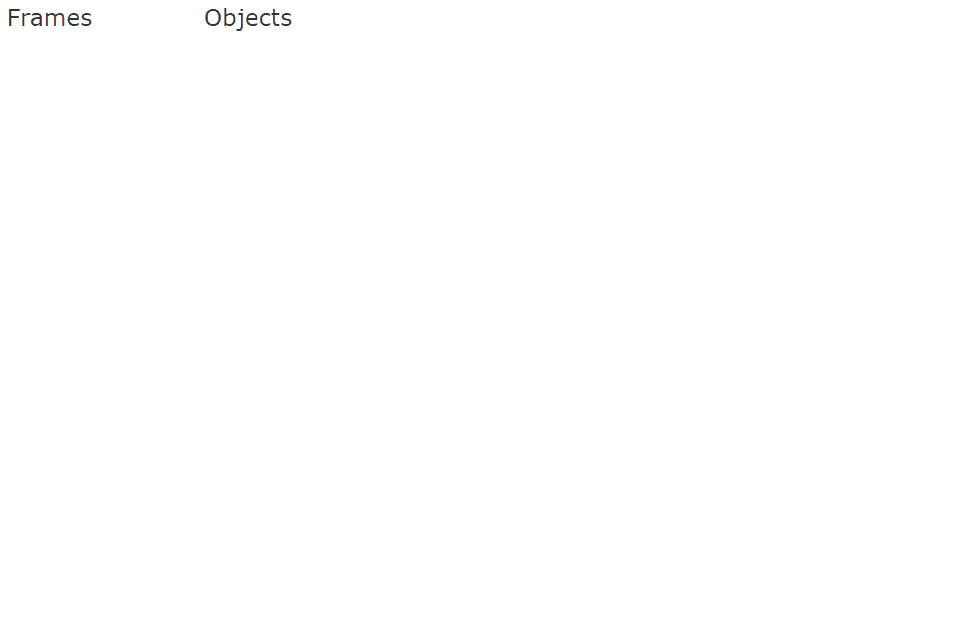

## 基本数据类型

### 数值型

Python 中的数据皆是对象，比如被熟知的 int 整型对象、float 双精度浮点型、bool 逻辑对象，它们都是单个元素。举两个例子。

前缀加 `0x`，创建一个十六进制的整数：

```python
0xa5 # 等于十进制的 165
```

使用 `e` 创建科学计数法表示的浮点数：

```python
1.05e3 # 1050.0
```

### 容器型

可容纳多个元素的容器对象，常用的比如：list 列表对象、 tuple 元组对象、dict 字典对象、set 集合对象。Python 定义这些类型的变量，语法非常简洁。

举例如下。

使用一对中括号 `[]`，创建一个 list 型变量：

```python
lst = [1, 3, 5] # list 变量
```

示意图看出，右侧容器为开环的，意味着可以向容器中增加和删除元素：




使用一对括号 `()`，创建一个 tuple 型对象：

```python
tup = (1, 3, 5) # tuple 变量
```

示意图看出，右侧容器为闭合的，意味着一旦创建元组后，便不能再向容器中增删元素：



但需要注意，含单个元素的元组后面必须保留一个逗号，才被解释为元组。

```python
tup = (1,) # 必须保留逗号
```

否则会被认为元素本身：

```python
In [14]: tup=(1)
    ...: print(type(tup)) 
<class 'int'>
```

使用一对花括号 `{}` 另使用冒号 `:`，创建一个 dict 对象：

```python
dic = {'a':1, 'b':3, 'c':5} # dict变量
```

字典是一个哈希表，下面的示意图形象的表达出字典的 “形”。




仅使用一对花括号 `{}`，创建一个 set 对象：

```python
s = {1, 3, 5} # 集合变量
```

Python 的容器类型，list、dict、tuple、set 等能方便地实现强大的功能，下面给出几个案例。

**1. 去最求平均**

去掉列表中的一个最小值和一个最大值后，计算剩余元素的平均值。

```python
def score_mean(lst):
    lst.sort()
    lst2 = lst[1:-1]
    return round((sum(lst2) / len(lst2)), 1)


lst = [9.1, 9.0, 8.1, 9.7, 19, 8.2, 8.6, 9.8]
score_mean(lst)  # 9.1
```

代码执行过程，动画演示：


**2. 打印 99 乘法表**

打印出如下格式的乘法表：

```python
1*1=1
1*2=2   2*2=4
1*3=3   2*3=6   3*3=9
1*4=4   2*4=8   3*4=12  4*4=16
1*5=5   2*5=10  3*5=15  4*5=20  5*5=25
1*6=6   2*6=12  3*6=18  4*6=24  5*6=30  6*6=36
1*7=7   2*7=14  3*7=21  4*7=28  5*7=35  6*7=42  7*7=49
1*8=8   2*8=16  3*8=24  4*8=32  5*8=40  6*8=48  7*8=56  8*8=64
1*9=9   2*9=18  3*9=27  4*9=36  5*9=45  6*9=54  7*9=63  8*9=72  9*9=81
```

一共有 10 行，第 i 行的第 j 列等于：`j*i`，其中：

- i 取值范围：`1<=i<=9`
- j 取值范围：`1<=j<=i`

根据“例子分析”的语言描述，转化为如下代码：

```python
In [13]: for i in range(1, 10):
    ...:     for j in range(1, i+1):
    ...:         print('%d*%d=%d'%(j,i,j*i), end='\t')
    ...:     print()
```

**3. 样本抽样**

使用 sample 抽样，如下例子从 100 个样本中随机抽样 10 个。

```python
from random import randint, sample

lst = [randint(0, 50) for _ in range(100)]
print(lst[:5])  # [38, 19, 11, 3, 6]
lst_sample = sample(lst, 10)
print(lst_sample)  # [33, 40, 35, 49, 24, 15, 48, 29, 37, 24]
```

### 字符串

注意 Python 中没有像 C++ 表示的字符类型（char），所有的字符或串都被统一为 str 对象。如单个字符 `c` 的类型也为 str。

str 类型会被经常使用，先列举 5 个被高频使用的方法。

strip 用于去除字符串前后的空格：

```python
In [1]: '  I love python\t\n  '.strip()
Out[1]: 'I love python'
```

replace 用于字符串的替换：

```python
In [2]: 'i love python'.replace(' ', '_')
Out[2]: 'i_love_python'
```

join 用于合并字符串：

```python
In [3]: '_'.join(['book', 'store','count'])
Out[3]: 'book_store_count'
```

title 用于单词的首字符大写：

```python
In [4]: 'i love python'.title()
Out[4]: 'I Love Python'
```

find 用于返回匹配字符串的起始位置索引：

```python
In [5]: 'i love python'.find('python')
Out[5]: 7
```

举个应用字符串的案例，判断 str1 是否由 str2 旋转而来。

字符串 stringbook 旋转后得到 bookstring，写一段代码验证 str1 是否为 str2 旋转得到。

转化为判断：str1 是否为 str2+str2 的子串。

下面函数原型中，注明了每个参数的类型、返回值的类型，增强代码的可读性和可维护性。

```python
def is_rotation(s1: str, s2: str) -> bool:
    if s1 is None or s2 is None:
        return False
    if len(s1) != len(s2):
        return False

    def is_substring(s1: str, s2: str) -> bool:
        return s1 in s2

    return is_substring(s1, s2 + s2)
```

测试函数 `is_rotation`：

```python
r = is_rotation('stringbook', 'bookstring')
print(r)  # True

r = is_rotation('greatman', 'maneatgr')
print(r)  # False
```

代码执行过程，动画演示：



字符串的匹配操作除了使用 str 封装的方法外，Python 的 re 正则模块功能更加强大，写法更为简便，广泛适用于爬虫、数据分析等。

下面这个案例实现：密码安全检查，使用正则表达式非常容易实现。

密码安全要求：

- 要求密码为 6 到 20 位；
- 密码只包含英文字母和数字。

```python
import re

pat = re.compile(r'\w{6,20}')  # 这是错误的，因为 \w 通配符匹配的是字母，数字和下划线，题目要求不能含有下划线
# 使用最稳的方法：\da-zA-Z 满足“密码只包含英文字母和数字”
# \d匹配数字 0-9
# a-z 匹配所有小写字符；A-Z 匹配所有大写字符
pat = re.compile(r'[\da-zA-Z]{6,20}')
```

选用最保险的 fullmatch 方法，查看是否整个字符串都匹配。

以下测试例子都返回 None，原因都在解释里。

```python
pat.fullmatch('qaz12') # 返回 None，长度小于 6
pat.fullmatch('qaz12wsxedcrfvtgb67890942234343434') # None 长度大于 22
pat.fullmatch('qaz_231') # None 含有下划线
```

下面这个字符串 `n0passw0Rd` 完全符合：

```python
In [20]: pat.fullmatch('n0passw0Rd')
Out[20]: <re.Match object; span=(0, 10), match='n0passw0Rd'>
```

### 自定义类型

Python 使用关键字 class 定制自己的类，self 表示类实例对象本身。

一个自定义类内包括属性、方法，其中有些方法是自带的。


欢迎关注我公众号：AI悦创，有更多更好玩的等你发现！

::: details 公众号：AI悦创【二维码】


:::

::: info AI悦创·编程一对一

AI悦创·推出辅导班啦，包括「Python 语言辅导班、C++ 辅导班、java 辅导班、算法/数据结构辅导班、少儿编程、pygame 游戏开发」，全部都是一对一教学：一对一辅导 + 一对一答疑 + 布置作业 + 项目实践等。当然，还有线下线上摄影课程、Photoshop、Premiere 一对一教学、QQ、微信在线，随时响应！微信：Jiabcdefh

C++ 信息奥赛题解，长期更新！长期招收一对一中小学信息奥赛集训，莆田、厦门地区有机会线下上门，其他地区线上。微信：Jiabcdefh

方法一：[QQ](http://wpa.qq.com/msgrd?v=3&uin=1432803776&site=qq&menu=yes)

方法二：微信：Jiabcdefh

:::

