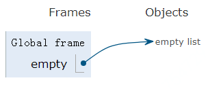
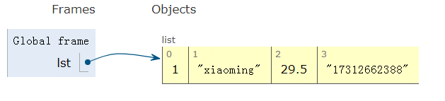
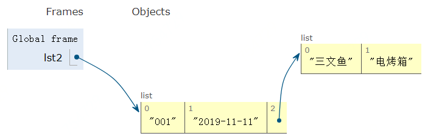

## 列表

列表（list）作为 Python 中最常用的数据类型之一，是一个可增加、删除元素的可变（mutable）容器。

### 基本操作

创建 list 的方法非常简单，只使用一对中括号 `[]`。如下创建三个 list：

```python
empty = []
lst = [1, 'xiaoming', 29.5, '17312662388']
lst2 = ['001', '2019-11-11', ['三文鱼', '电烤箱']]
```

empty 在内存中的示意图：



lst 在内存中的示意图：



lst2 在内存中的示意图：




欢迎关注我公众号：AI悦创，有更多更好玩的等你发现！

::: details 公众号：AI悦创【二维码】


:::

::: info AI悦创·编程一对一

AI悦创·推出辅导班啦，包括「Python 语言辅导班、C++ 辅导班、java 辅导班、算法/数据结构辅导班、少儿编程、pygame 游戏开发」，全部都是一对一教学：一对一辅导 + 一对一答疑 + 布置作业 + 项目实践等。当然，还有线下线上摄影课程、Photoshop、Premiere 一对一教学、QQ、微信在线，随时响应！微信：Jiabcdefh

C++ 信息奥赛题解，长期更新！长期招收一对一中小学信息奥赛集训，莆田、厦门地区有机会线下上门，其他地区线上。微信：Jiabcdefh

方法一：[QQ](http://wpa.qq.com/msgrd?v=3&uin=1432803776&site=qq&menu=yes)

方法二：微信：Jiabcdefh

:::

