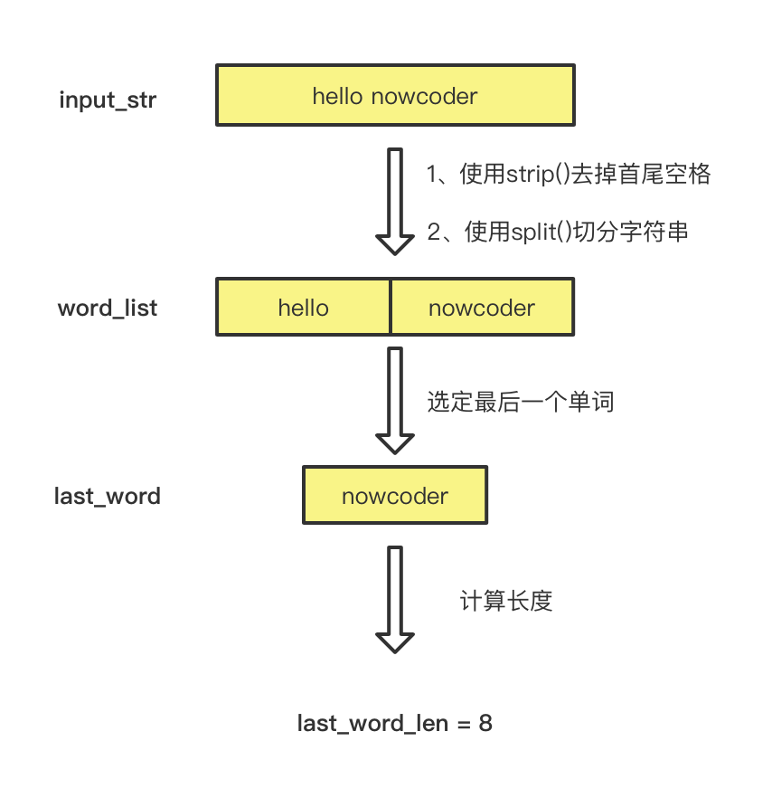

## 描述

计算字符串最后一个单词的长度，单词以空格隔开，字符串长度小于 5000。（注：字符串末尾不以空格为结尾）

### 输入描述：

输入一行，代表要计算的字符串，非空，长度小于 5000。

### 输出描述：

输出一个整数，表示输入字符串最后一个单词的长度。

## 示例1

### 输入：

```python
hello nowcoder
```

### 输出：

```python
8
```

### 说明：

最后一个单词为 nowcoder，长度为 8

## 答案

```python
s = input()        # 输入字符串 s
arr = s.split(" ")  # 以空格分割字符串并将结果存入数组 arr
print(len(arr[-1]))   # 打印最后一个元素 arr[-1] 的长度即为最后一个单词的长度
```

## 题目链接

[https://www.nowcoder.com/practice/8c949ea5f36f422594b306a2300315da](https://www.nowcoder.com/practice/8c949ea5f36f422594b306a2300315da)

## 图解



```python
input_str = input() 
word_list = input_str.strip().split() 
last_word = word_list[-1] 
last_word_len = len(last_word) 
print(last_word_len)
```

欢迎关注我公众号：AI悦创，有更多更好玩的等你发现！

::: details 公众号：AI悦创【二维码】


:::

::: info AI悦创·编程一对一

AI悦创·推出辅导班啦，包括「Python 语言辅导班、C++ 辅导班、java 辅导班、算法/数据结构辅导班、少儿编程、pygame 游戏开发，华为 Python 机试」，全部都是一对一教学：一对一辅导 + 一对一答疑 + 布置作业 + 项目实践等。当然，还有线下线上摄影课程、Photoshop、Premiere 一对一教学、QQ、微信在线，随时响应！微信：Jiabcdefh

C++ 信息奥赛题解，长期更新！长期招收一对一中小学信息奥赛集训，莆田、厦门地区有机会线下上门，其他地区线上。微信：Jiabcdefh

方法一：[QQ](http://wpa.qq.com/msgrd?v=3&uin=1432803776&site=qq&menu=yes)

方法二：微信：Jiabcdefh

:::


