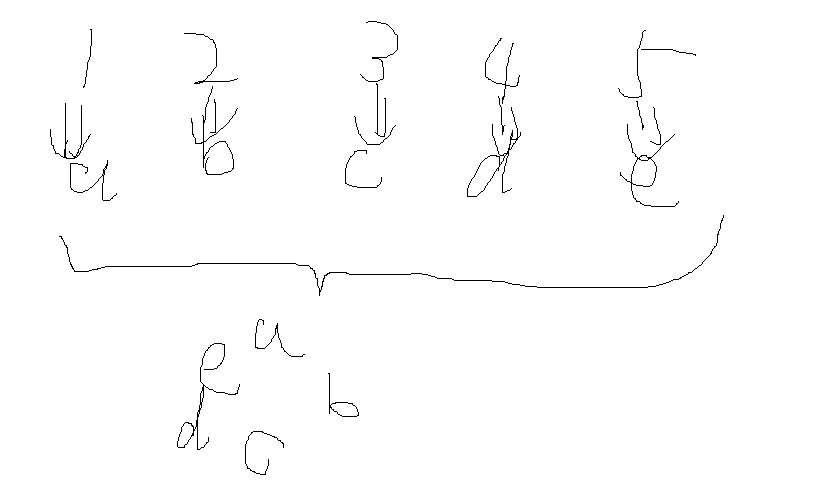

## 【题目描述】

某幼儿园里，有 5 个小朋友编号为 1、2、3、4、5，他们按自己的编号顺序围坐在一张圆桌旁。

他们身上都有若干个糖果(键盘输入)，现在他们做一个分糖果游戏。

从 1 号小朋友开始，将自己的糖果均分三份（如果有多余的糖果，则立即吃掉），自己留一份，其余两份分给他的相邻的两个小朋友。

接着 2 号、3 号、4 号、5 号小朋友同样这么做。问一轮后，每个小朋友手上分别有多少糖果。

### 【输入】

输入 5 个小朋友的糖果数。

### 【输出】

游戏后 5 个小朋友的糖果数。(按5位宽度输出)

### 【输入样例】

```python
8 9 10 11 12
```

### 【输出样例】

```python
    11    7    9   11    6
```

## 【题目解析】

题目中有 5 位小朋友，他们初始时糖果的数目不确定，用 a、b、c、d、e 分别存储五个小朋友的糖果数，初始值由键盘输入。



## 【代码实现】

```python
# 读入一行字符串，split() 将字符串以空格分开
a, b, c, d, e = input().split()
# int(a) 将字符串 a 转化为数字
a, b, c, d, e = int(a), int(b), int(c), int(d), int(e)

# 第一轮
a = int(a / 3)  # 1 号小朋友分糖
b = b + a
e = e + a

b = int(b / 3)  # 2 号小朋友分糖
c = c + b
a = a + b

c = int(c / 3)  # 3 号小朋友分糖
d = d + c
b = b + c

d = int(d / 3)  # 4 号小朋友分糖
e = e + d
c = c + d

e = int(e / 3)  # 5 号小朋友分糖
a = a + e
d = d + e

print("%5d" % a, "%5d" % b, "%5d" % c, "%5d" % d, "%5d" % e, sep="")  # 按五位宽度输出
```

欢迎关注我公众号：AI悦创，有更多更好玩的等你发现！

::: details 公众号：AI悦创【二维码】


:::

::: info AI悦创·编程一对一

AI悦创·推出辅导班啦，包括「Python 语言辅导班、C++ 辅导班、java 辅导班、算法/数据结构辅导班、少儿编程、pygame 游戏开发，华为 Python 机试」，全部都是一对一教学：一对一辅导 + 一对一答疑 + 布置作业 + 项目实践等。当然，还有线下线上摄影课程、Photoshop、Premiere 一对一教学、QQ、微信在线，随时响应！微信：Jiabcdefh

C++ 信息奥赛题解，长期更新！长期招收一对一中小学信息奥赛集训，莆田、厦门地区有机会线下上门，其他地区线上。微信：Jiabcdefh

方法一：[QQ](http://wpa.qq.com/msgrd?v=3&uin=1432803776&site=qq&menu=yes)

方法二：微信：Jiabcdefh

:::


