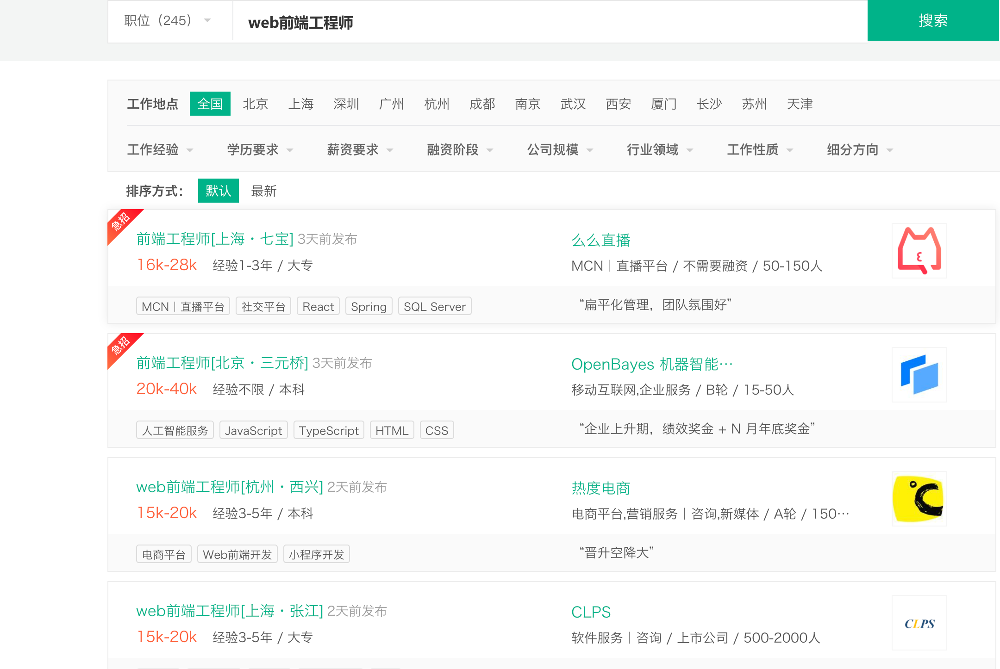
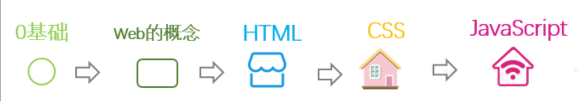
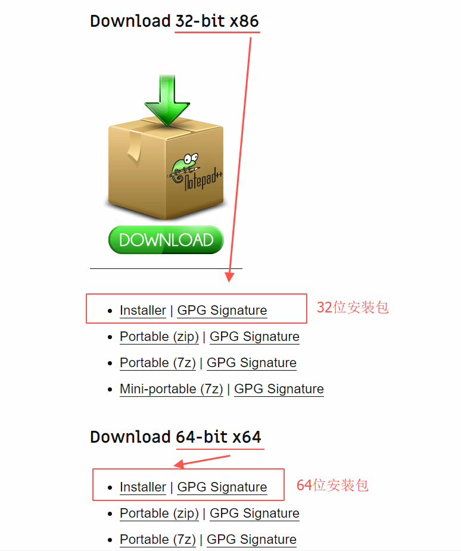
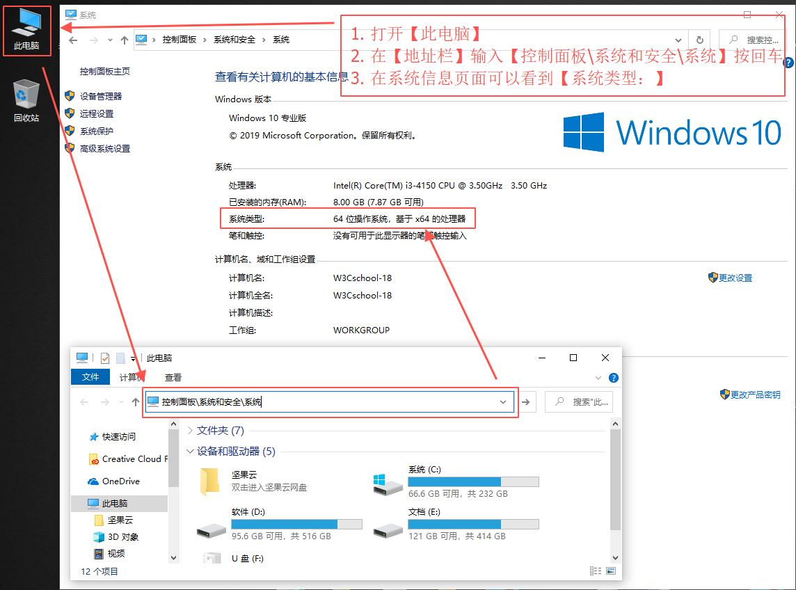
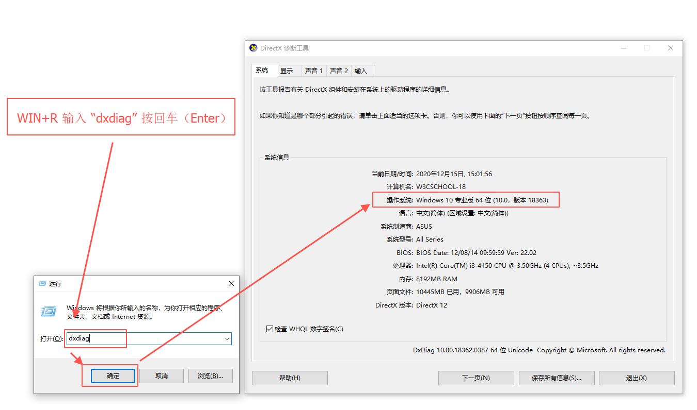
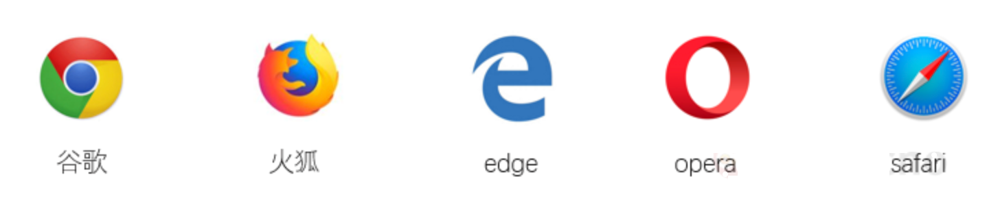

你好，我是悦创。

我们的生活和工作离不开互联网，互联网网页的制作是 Web 技术的成果。也正因为此，学习 Web 技术**不易过时**。

Web 前端技术应用领域广泛，诸多优秀的移动端产品同样有赖于 Web 技术支持。技术市场对学习 Web 前端的**人才需求大，就业机会多。**

如果你入门 Web 后，坚持学习并不断参与项目开发，成为名副其实的 Web 前端工程师将给你带来**不错的薪酬回报。**

（图中数据来自：拉勾招聘）

相较于其它开发语言，Web 前端语言**简单易学。**它是浏览器语言，不需要很强的逻辑思维，也不需要像应用程序一样接受严格的审查。只要你正确地输入代码，网页就会如实地展示你想表达的内容。

如果你想成为更加优秀的 Web 前端工程师，还应具备 **UI 设计能力**和**营销策划力**。只有这样，你的 Web 技术才能发挥得淋漓尽致，你制作的网页才会更具吸引力。

即便你不是技术开发人员也没有兴趣从事此行，了解 Web 技术相关知识也有助于你融入“互联网+”的生活。Web 基本常识能帮助你鉴别钓鱼网站，防止掉入诈骗陷阱；Web 基本常识能帮助你高效收集更多的干货资料；Web 基本常识还能帮助你正确理解网页异常，不至于遇上网页提示 404 时束手无策。

【单选题】以下哪个网址可能是钓鱼网站？

- [x] www.ta0ba0.com
- [ ] www.w3cschool.cn
- [ ] www.khanacademy.org

【多选题】网页显示 404 的原因可能是？

- [x] 输入网址错误，出错网址不存在。
- [x] 网页已被移除。
- [x] 网页已被更改。

## Web 的学习路径

从了解 Web 基础知识起步，再经过几门课程的学习之后，你将能从 Web 小白成长为初级前端工程师：

- **Web 的概念：Web 是 World Wide Web——万维网的简称。** 它是建立在互联网上，为用户使用浏览器浏览信息的可视化界面。
- **HTML：超文本标记语言能够搭建网页内容。** 但使用 HTML 只能搭建毛坯网页。
- **CSS：** 层叠样式表用来添加网页样式。它能使网页上的字号、字体颜色、背景图像等变得更加美观。使用 CSS 相当于给网页装修。 就像我们给毛坯房铺地砖、粉刷墙。
- **JavaScript：一种可添加网站交互效果的编程语言。** 使用它网页就动起来了，就像一套布满智能家具的房子能实现人与家具的互动。 JavaScript 能使网站拥有更多互动效果。

【判断题】World Wide Web 是 Web 的全称。

- [x] 正确
- [ ] 错误

【多选题】Web 前端必修知识包括以下哪几门功课？

- [x] CSS
- [ ] JavaScript
- [ ] HTML

## 学习 Web 的工具准备

开始学习 Web 之前，请先准备以下工具：

1. **一台电脑**。笔记本或是台式机均可。

2. **一款编辑器**。如同作家写作需要纸笔输出文字一样，学习编程需要编辑器编写代码。推荐初学者使用：

- Notepad: [https://notepad-plus-plus.org/download/](https://notepad-plus-plus.org/download/)
- Viso Studio Code： [https://code.visualstudio.com/](https://code.visualstudio.com/)
- WebStorm：[https://www.jetbrains.com/webstorm/](https://www.jetbrains.com/webstorm/)
- SublimeText：[https://www.sublimetext.com/download](https://www.sublimetext.com/download)

Windows 操作系统，安装时注意查看电脑的位数。32 位的电脑下载 `32-bit x86` 的版本；64 位的电脑下载 `64-bit x64` 的版本。

**例如：Notepad 的下载**

**如何知道电脑的位数呢？**

查看 Windows 10 系统版本方法：

**方法1：** 打开桌面【此电脑】，此电脑的地址栏中输入【`控制面板\系统和安全\系统`】按回车进入系统信息页面就能查看当前操作系统版本。如下图：

**方法2：** 键盘上按下  WIN 键（)+R 键 输入 **dxdiag** 点击确定，在弹出的 `DirectX 诊断工具`【系统】>【系统信息】>【操作系统：】中可查看当前操作系统版本。如下图：

3. **两款浏览器**。编写完代码后，需要把代码在浏览器中运行出来，这个步骤叫做：**测试**。不同的浏览器会呈现出不同的网页效果，建议初学者下载两款浏览器用于测试。

常用的现代浏览器有：

推荐使用谷歌浏览器，官方下载地址：[https://www.google.cn/intl/zh-CN/chrome/](https://www.google.cn/intl/zh-CN/chrome/)

【判断题】HTML 不是编程语言，它是超文本标记语言。

- [x] 正确
- [ ] 错误

【多选题】CSS 是层叠样式表单，它可为网站添加样式。这些样式包括：

- [x] 字号
- [x] 文本背景
- [x] 字体颜色

【判断题】JS 是 JavaScript 的简称。

- [x] 正确
- [ ] 错误

【判断题】JS 是一门能够添加网站交互功能的编程语言。

- [x] 正确
- [ ] 错误

## 学习 Web 的思想准备

在开始学习 Web 之前，你还需要注意几个细节：

- **使用英文小写命名文件:** 很多计算机，特别是 Web 服务器对中文、大小写敏感。我们尽量使用英文小写字母命名文件。
- **不使用空格分离文件名：** 因为浏览器、Web服务器、编程语言对“空格”的理解和处理不同，所以为了确保网页链接不被破坏。请在英文输入法下使用下划线 “`_`” 分离文件名中的英文单词。记住是使用下划线，不是横线。

- [ ] my-file.html
- [x] my_file.html

- **提前做好规划：** 你想做什么样的网页？请先画好草图。即便是专业的研发团队，也是先由美工或是产品经理用原型工具规划好网页布局，再由工程师实现的。比如：你想为你的宠物狗制作一个网页，记录它的成长。建议你从手绘一张草图，考虑网页结构开始。

【单选题】以下哪个文件名符合规范？

- [ ] My.file.html
- [x] my_file.html
- [ ] my-file.html
- [ ] My File.html

::: details 公众号：AI悦创【二维码】

:::

::: info AI悦创·编程一对一

AI悦创·推出辅导班啦，包括「Python 语言辅导班、C++ 辅导班、java 辅导班、算法/数据结构辅导班、少儿编程、pygame 游戏开发」，全部都是一对一教学：一对一辅导 + 一对一答疑 + 布置作业 + 项目实践等。当然，还有线下线上摄影课程、Photoshop、Premiere 一对一教学、QQ、微信在线，随时响应！微信：Jiabcdefh

C++ 信息奥赛题解，长期更新！长期招收一对一中小学信息奥赛集训，莆田、厦门地区有机会线下上门，其他地区线上。微信：Jiabcdefh

方法一：[QQ](http://wpa.qq.com/msgrd?v=3&uin=1432803776&site=qq&menu=yes)

方法二：微信：Jiabcdefh

:::

