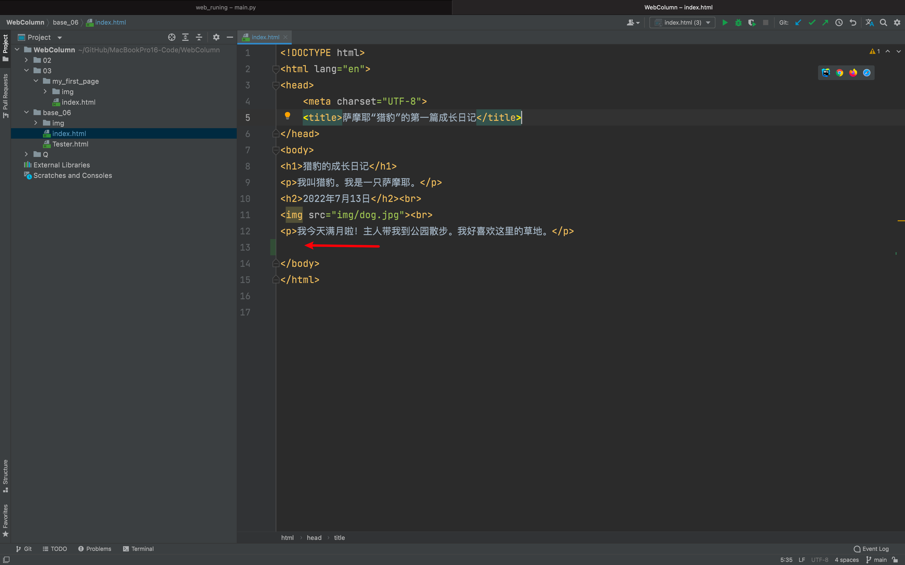
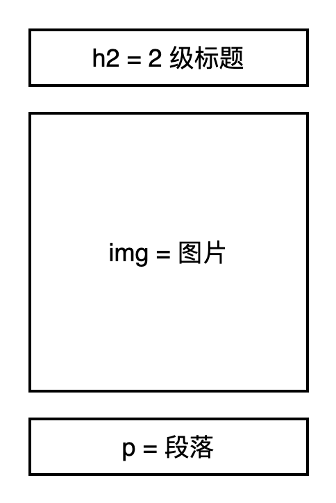

## “猎豹”的第二篇成长日记

嗨，你还记得我吗？我是萨摩耶“猎豹”。今天我的主人 Lisa 亲手做了一份晚餐给我吃。

味道好极了！你能帮我写一篇日记记录这美好的一天吗？

## 第1步 找到文件

请你在编译器中找到在做第一章实战练习时，保存下来的index.html文件并打开它。

找到 body 中的最后一个 `
` 元素的结束标签 `
` ,把光标移动到它后面，然后点击回车，将光标移到新的一行。

## 第 2 步 标题

我们要再为猎豹写一篇日记。就得接在第一篇日记后面写。

日记结构依然由标题、图片、段落 3 个元素组成。

这次，请尝试自己写代码和文本：

写日记首先从写日期开始。我们将日期作为第二篇日记的 **标题** ，采用 `<h2></h2>` 包围文本“ **2019年7月31日** ”。

为什么不使用 `<h1>` 元素包围文本呢？

对于 `index.html` 这个文件来说，我们已有了一级标题—— `<h1>` 猎豹的成长日记 `</h1>` 。

为了使猎豹的网页版成长日记看起来结构清晰，我们将日记中的日期都用 `<h2></h2>` 包围起来。

你也可以理解为文本 **2022年7月13日** 与 **2022年8月02日** 是 **平级关系** 。字号统一。

## 第 3 步 图片

这是 Lisa 为猎豹亲手制作的美味晚餐照片。

这张照片是网页上的第二张图片。我们将它命名为 `pic2.png` 。

将 pic2 保存在 img（专门存放图片的）文件夹中。

还记得图片对应哪个元素吗？

对应 `` 元素。

但光有 `` 元素没用, 我们要为它添加 src 属性：`` 

还记得 `src=""` 中的引号内要填入什么吗?

应填入图片的存储路径。

对于本例来说，pic2 这张图片存储在 img 文件夹中，因此路径是：`img/pic2.jpg` 。

注意：

- **要将图片的文件格式一起写入。** 本例的文件格式是 jpg。HTML 能运行多种格式的图片。比如：`png`, `jpg` ,`svg` 等。
- **` ` 也是空元素。它的作用是折行。**「换行」 它能够使图片和下面的段落文本分离成两行。这样能使网页结构更加清晰，看起来更加美观。

## 第 4 步 列表

接下来，我们要为猎豹的美味晚餐配上文字。

Lisa想这样写：

**猎豹今日晚餐食材：西蓝花5g、胡萝卜5g、土豆5g、苹果5g、三文鱼10g、鸡胸肉10g、牛肉10g、豆腐5g、燕麦2g、鸡蛋黄2个。**

制作步骤：

1. 敲 2 个鸡蛋，只取蛋黄

2. 把西蓝花、胡萝卜、土豆、苹果、三文鱼、鸡胸肉、牛肉、豆腐洗净，切碎。豆腐和成泥装盘独放。再取少许燕麦，将蛋黄和切碎的食材一起（除豆腐外）放入料理机打成泥状。

3. 从料理机中取出食材装盘。将泥状食材与豆腐混合搓成乒乓球大小的泥团。

4. 将泥团放入锅中蒸煮，10分钟即可。

**看完 Lisa 的文字，你是不是有了制作列表的灵感？**

我们可先将内容分为 2 个部分，分别用 2 个段落处理：

`
猎豹今日晚餐食材
`

`
制作步骤
`

我们将具体的食材和用量用 **无序列表** 处理：

我们再将制作步骤用 **有序列表** 处理：

## 第 5 步 超链接

我们还可以考虑使用 `<a>` 元素，为不常见的食材添加百度百科的超链接。比如：为"燕麦”添加超链接。

首先将"燕麦”用 `` 包围。

找到 `<a>` 元素的开始标签，空一格，在空格后添加上 href 属性，补充等号，将燕麦的百度百科地址封装在引号中：

到此，猎豹的第二篇日记就写好了。

记得点击“保存（save）”，确保你的实战成果都保存在编译器的 `index.html` 文件中。

## 附加题

我们可以为猎豹晚餐的重点制作步骤添加强调效果。比如：加粗或是斜体。

- `<strong>` 元素的效果是加粗; 
- `<em>` 元素的效果是斜体。

## 第 6 步 测试

如果你一直跟着我的步骤，在编译器中编写代码，猎豹的第二篇日记已经完工啦！

请将 `index.html` 文件再次拖入浏览器中，测试运行效果。

经过第二章的学习，你已经：

**1. 理解了HTML的定义和作用；**

**2. 理解了HTML的元素和属性、元素的嵌套、块级元素、内联元素和空元素。**

**3. 掌握了HTML的常见元素。**

**4. 为猎豹编写了第二篇成长日记！**

**5. HTML 入门了！**

下一章，我们将带领你入门CSS。CSS将使猎豹的成长日记变得更加美观。

## 优化

<button name="button" style="color: black"><a href="https://bornforthis.cn/web_runing/web_base/base_06/index.html" target="_blank">成品</a></button>

<button name="button" style="color: black"><a href="https://bornforthis.cn/web_runing/web_base/base_06/base_06.html" target="_blank">在线试一试</a></button>

::: details 公众号：AI悦创【二维码】

:::

::: info AI悦创·编程一对一

AI悦创·推出辅导班啦，包括「Python 语言辅导班、C++ 辅导班、java 辅导班、算法/数据结构辅导班、少儿编程、pygame 游戏开发」，全部都是一对一教学：一对一辅导 + 一对一答疑 + 布置作业 + 项目实践等。当然，还有线下线上摄影课程、Photoshop、Premiere 一对一教学、QQ、微信在线，随时响应！微信：Jiabcdefh

C++ 信息奥赛题解，长期更新！长期招收一对一中小学信息奥赛集训，莆田、厦门地区有机会线下上门，其他地区线上。微信：Jiabcdefh

方法一：[QQ](http://wpa.qq.com/msgrd?v=3&uin=1432803776&site=qq&menu=yes)

方法二：微信：Jiabcdefh

:::

