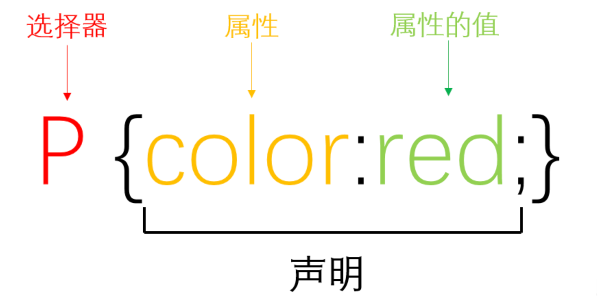
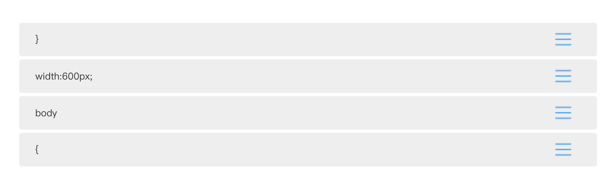
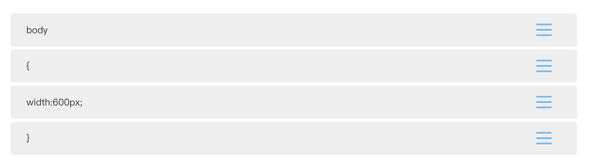
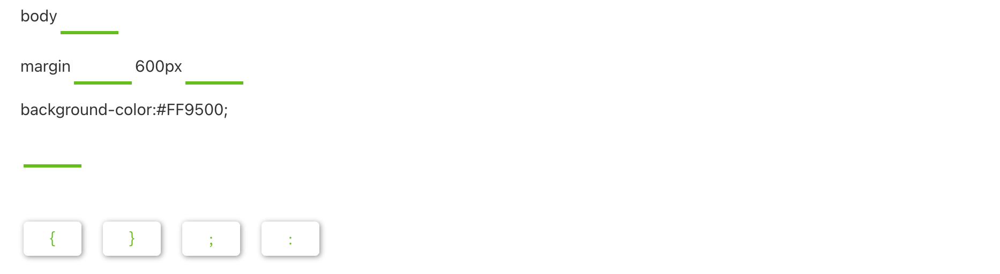
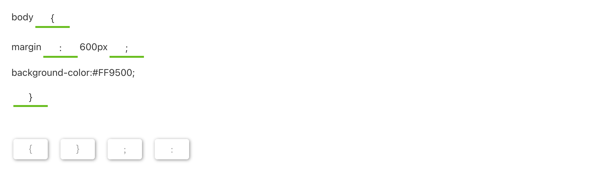

## CSS 是谁？它做什么工作？

与 HTML  一样，CSS 也不是真正的编程语言，甚至连标记语言都不是。

**CSS 是层叠样式列表。** 单纯采用 HTML 制作的网页就像毛坯房一样，不美观；而使用 CSS 能使网页变得更加美观。CSS 不止有美观的作用，它还能与 HTML 分离开来，保存为独立的文件。CSS 的“闹独立”可使代码保持一致性，也使编程人员能更好的控制代码量。


## 学习 CSS 的重点

学习 CSS 注意两个重点：一是 **选择器** 。二是 **样式**。

CSS 的选择器就像化妆盒。它告诉浏览器选择哪个标签美化。

CSS 的样式就像化妆盒中的眼影、腮红、口红等。它告诉浏览器要把网页美化成什么样子。好比女孩儿化妆的效果，烟熏妆、桃花妆、OL 妆等等。

【判断题】CSS 是一门美化网页的编程语言。

- [ ] 正确
- [x] 错误

> CSS 不是真正的编程语言。它是层叠式列表。

【判断题】HTML 和 CSS 的代码不能混在一起写。

- [ ] 正确
- [x] 错误

## CSS 规则集




以上元素是 CSS 的 **规则集**。它由以下几个部分构成：

- **选择器：** HTML 元素的名称位于规则集开始（本例是标签选择器 ）。HTML 元素可选择一个或多个样式添加。给不同元素添加样式只需更改选择器即可。
- **声明：** 表示一个单独的规则。由属性和属性值组成。
- **属性：** 表示改变 HTML 元素样式的途径。本例中 color 就是改变 `<p>` 元素字体颜色的途径。
- **属性的值：** 它从指定属性的众多外观中选择了一个值。本例中，red 就是 color 的值。颜色种类成千上万，除了 red 外，color 的值还可以有 yellow, pink, black 等等。

注意

- 除了选择器的部分，每个规则集都应该包含在一对的 **大括号里：{  }**。
- 在每个声明里要用 **冒号** 将属性与属性值分隔开。
- 在每个规则集里要用 **分号** 将多个声明分隔开;

```css
p {
    color:red; 
    width:500px;
    border:1px solid black;
}
```

我们也可利用 CSS 选择多个元素，将其同时修改成一种样式，不同的选择器用逗号分开。如下面的例子：

```css
p, li, h1 {
    color:red;
}
```

段落、表格、标题元素的样式均修改为红色。

【单选题】以下关于 CSS 选择器说法错误的是：

- [x] CSS 选择器必须被 {  } 包围。
- [ ] CSS 提供了多种方法选择目标。
- [ ] CSS 选择器的作用是选中目标标签。

> CSS 选择器不必被 { } 包围。被 { } 包围的是 CSS 的属性和属性值。

【多选题】以下哪些是 CSS 的部分组成：

- [ ] `<p>` 元素
- [x] 属性值
- [x] 属性
- [x] 选择器

【拖拉排序】请将以下选项组合成一个 CSS 规则集



::: details 答案



:::

【选词填空】请在空格内填上适当的符号




::: details 答案



:::

::: details 公众号：AI悦创【二维码】


:::

::: info AI悦创·编程一对一

AI悦创·推出辅导班啦，包括「Python 语言辅导班、C++ 辅导班、java 辅导班、算法/数据结构辅导班、少儿编程、pygame 游戏开发」，全部都是一对一教学：一对一辅导 + 一对一答疑 + 布置作业 + 项目实践等。当然，还有线下线上摄影课程、Photoshop、Premiere 一对一教学、QQ、微信在线，随时响应！微信：Jiabcdefh

C++ 信息奥赛题解，长期更新！长期招收一对一中小学信息奥赛集训，莆田、厦门地区有机会线下上门，其他地区线上。微信：Jiabcdefh

方法一：[QQ](http://wpa.qq.com/msgrd?v=3&uin=1432803776&site=qq&menu=yes)

方法二：微信：Jiabcdefh

:::


