## 萨摩耶“猎豹”的精修成长日记

昨天 Lisa 带我散步时，向邻居们展示了我的成长日记。

他们对我拥有网页版的成长日记感到非常惊奇，

但是他们觉得成长日记可以变得更加美观，

你愿意帮我装修网页日记吗？

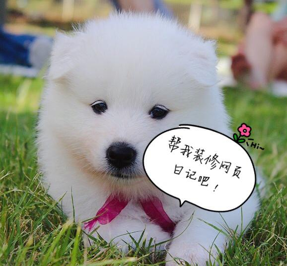

## 第1步 更改段落字体颜色

为了使猎豹的成长日记更加美观，我们需要使用 CSS。

CSS 能达成的美观程度取决于 CSS 的样式。

因此，请**在项目文件中新建一个 styles 文件夹**，专门用于存放 CSS 的各类样式文件。

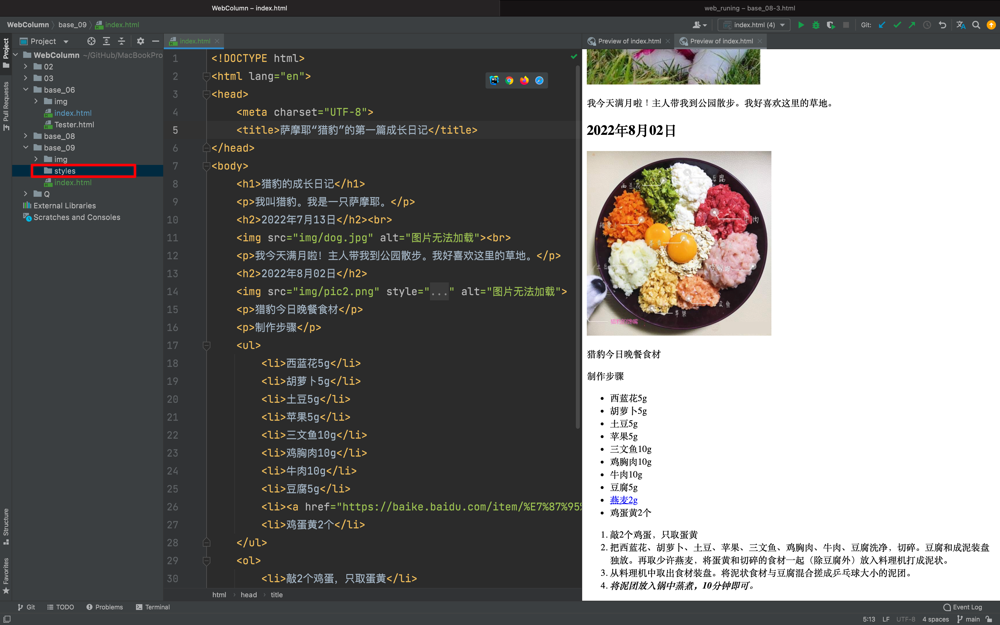

新建一个文件，文件命名为：`css1.css` ：

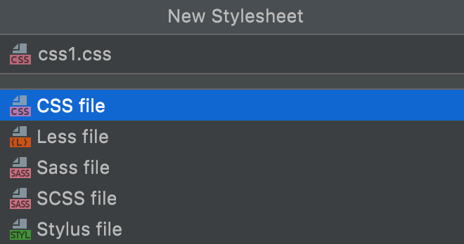

将下面这段代码复制到新的文件里：

```css
p {
    color: blue;
}
```

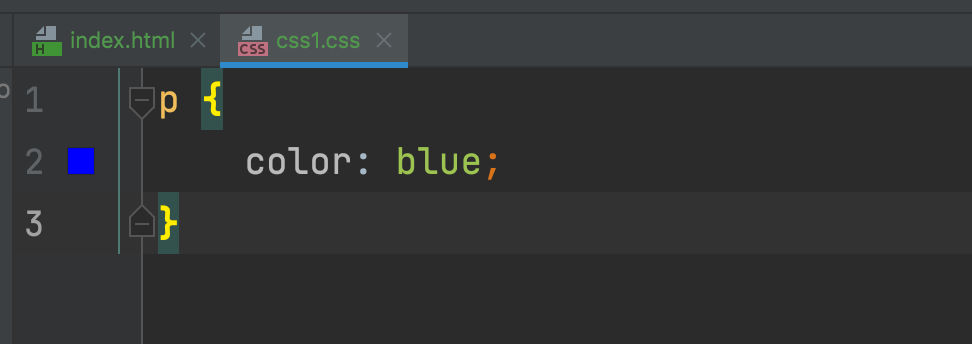

**还记得，这段 CSS 代码的含义吗？**

- P: 选择器。它告诉浏览器选定 P 元素,即段落元素进行更改。

- color：属性。它告诉浏览器要更改的是颜色属性。

- blue: 属性的值。本例中的值是蓝色。

**把当前 CSS 文件保存到新建的 styles 文件夹中。**

这是你的第一个 CSS 文件，不妨把它命名为 `css1`  (关于文件名你也可另起）。

既然是 CSS 文件，它的拓展名也应选择 CSS 格式。

当前，你的编译器里有两个类型的文件。一个是 html 文件，另一个是 css 文件。如果你不在 html 的文件中引用 css 文件，你的网页将不会有任何改变。对本例来说，萨摩耶猎豹的成长日记依然是毛坯网页。

### HTML 引用 CSS

接下来，我们要学着**把 css 文件与 html 文件绑定。**

请你在编译器中打开 `index.html` 文件，将下面的代码复制到 `<head></head>` 之间。

```html
<link href="styles/css1.css" rel="stylesheet" type="text/css">
```

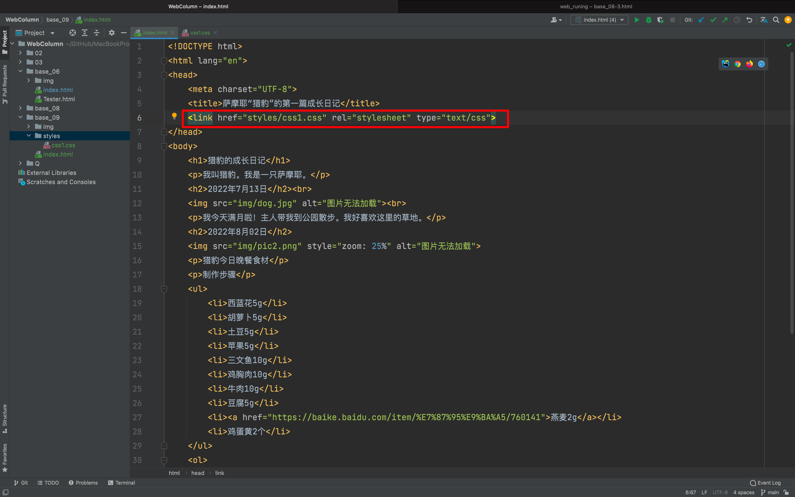

再次把 `index.html` 文件拖入浏览器中，看看发生了什么变化？


###  Before 网页

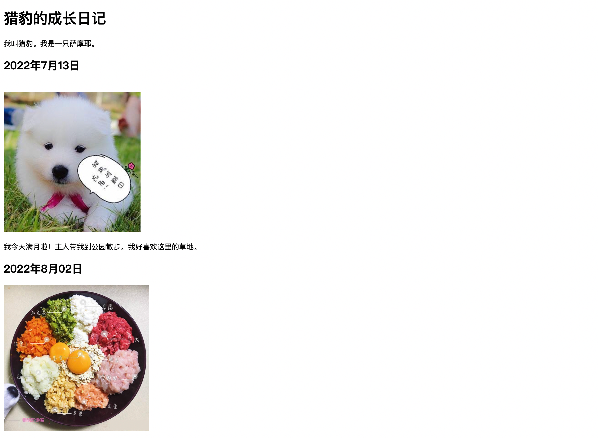

### After 网页

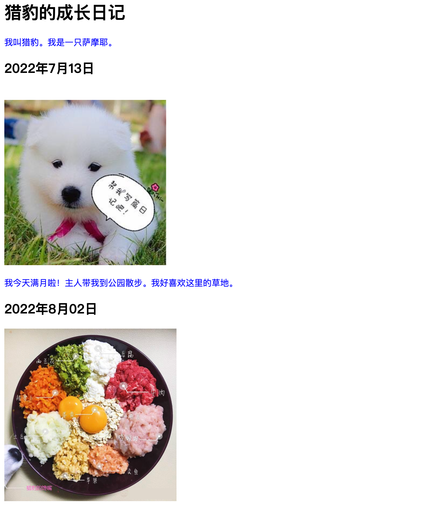

你发现了吗？

CSS 改变了猎豹成长日记的段落字体颜色。它们由黑变蓝了。

## 第2步 更改界面颜色

猎豹成长日记的界面颜色是白色的，字体颜色在没有使用 CSS 之前是黑色的。界面的白色和字体黑色，均是浏览器给元素设置的默认样式。

这样的效果有点儿像白纸黑字的合同书，显得单调。

我们可以通过 CSS 优化这个界面的颜色。直接在 `css1.css` 文件里面进行编写。

```css
html {
    background-color: #E6E6E6;
}
```

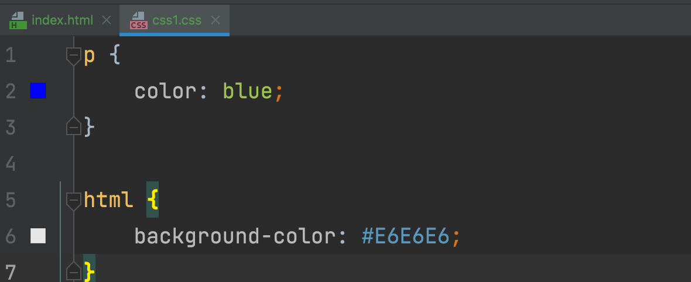

保存当前 html 文件后，请将 `index.html` 文件拖入浏览器，看看变化：

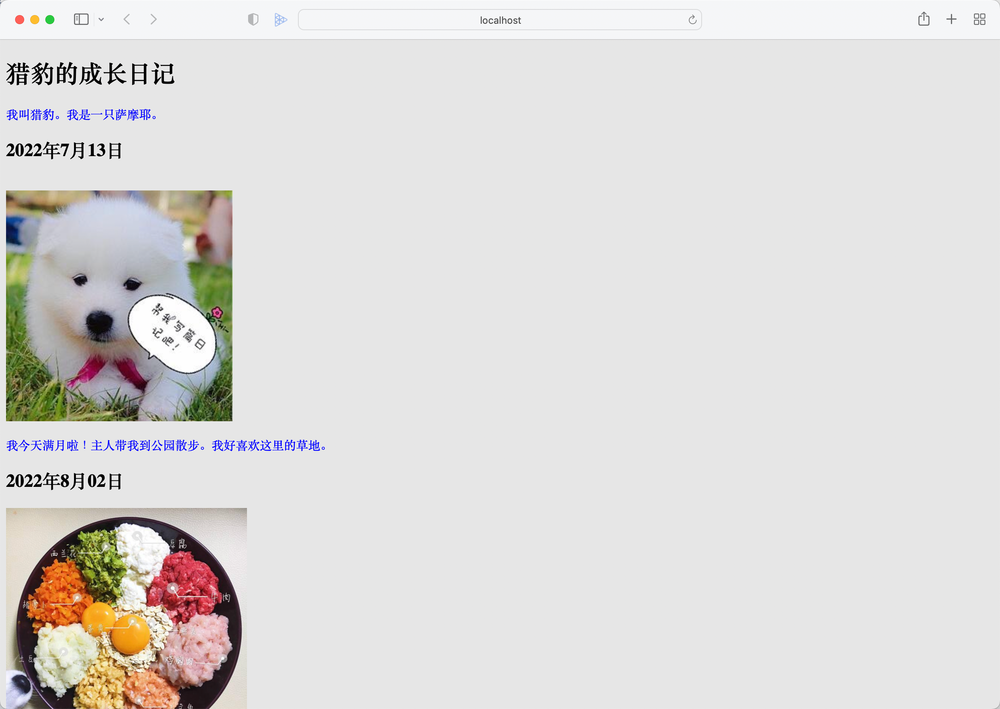

网页的背景颜色由白色变为灰色了！

恭喜你！你又新增了一项 CSS 技能！

## 第3步 更改定位主标题&添加样式

我们将继续在 `index.html` 的文件中引用新的样式以使网页更美观。

观察以下代码：

```css
h1 {
    margin: 0;
    padding: 20px 0; 
    color: #00539F;
    text-shadow: 3px 3px 1px grey;
}
```

还记得其中的要点吗？

- **margin：0;** 它可覆盖浏览器为 `<h1>` 设置的默认样式。
- **text-shadow: 3px 3px 1px grey;** 它能为 `<h1>` 字体添加阴影效果。

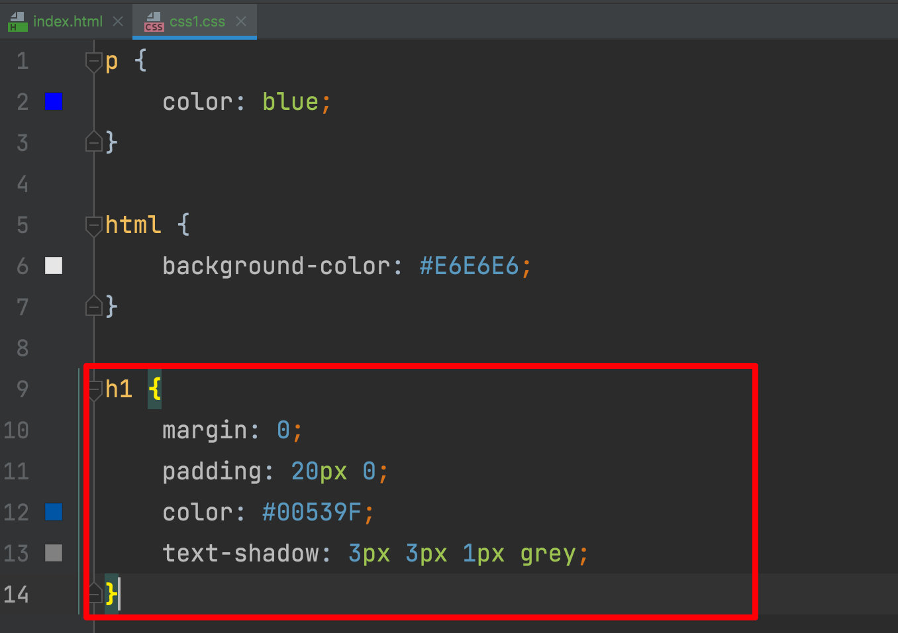

注意：

- 如果 html 引用了 css 文件后，网页仍没有发现变化，请注意检查 `<link>` 元素属性 href 内的地址。比如：我们将更改文档体格式设置的文件命名为css1，请确定其在 href 中被指向正确。

如果你跟着我们的步骤，你的网页已发生了变化：

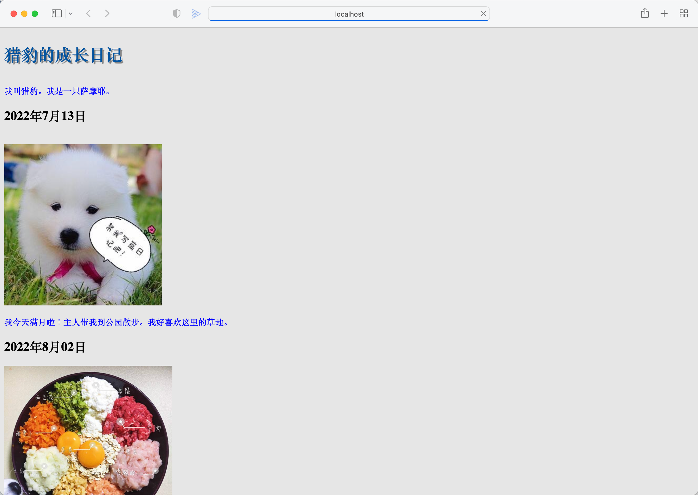

## 第4步 更改文档体格式设置

仅改变标题的样式，网页还是不够美观。

我们可尝试编写下面这段代码，它能使网页更加精致。

```css
body {
    width: 600px;
    margin: 0 auto;
    background-color:#FFCCEB;
    padding: 0 20px 20px 20px;
    border: 3px solid grey;
}
```

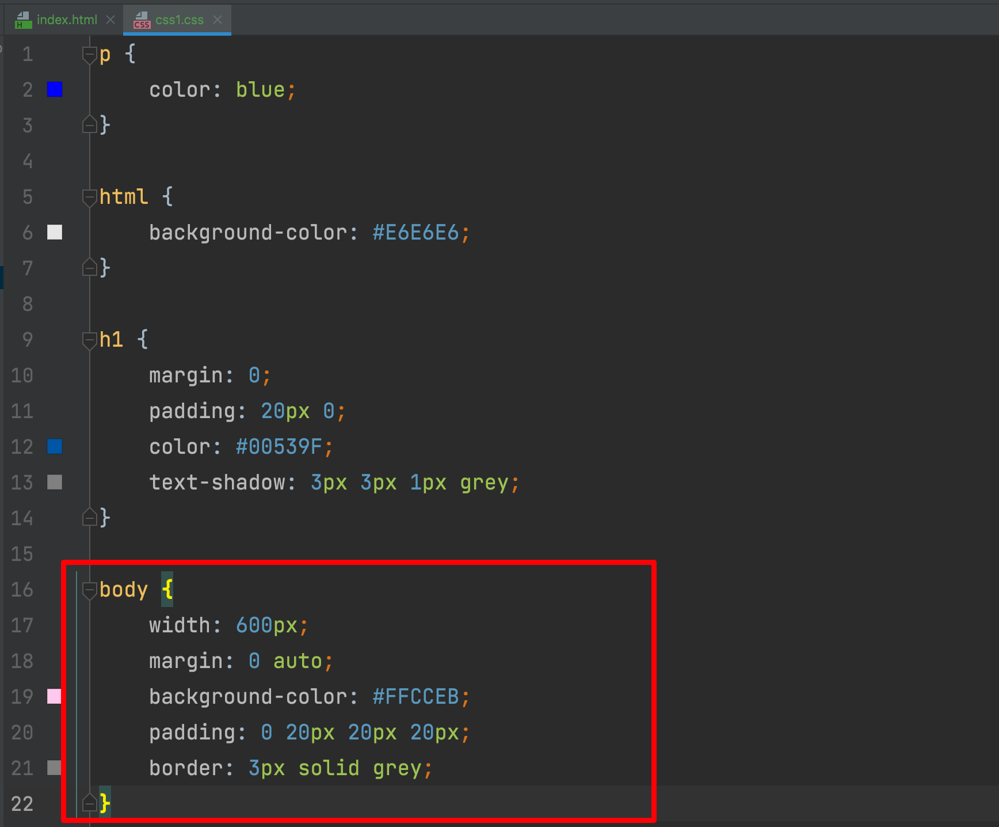

你能理解以上代码的含义吗？

- **body：选择器**。
- **width: 600px;**  说明 body 元素的宽度保持在 600 像素。
- **margin: 0 auto；** 为 margin 或 padding 等属性设置两个值，第一个值代表元素的上、下方向（本例设置为 0）；第二个值代表左、右两边（本例中的 auto 是特殊值，含义是水平方向左右对称）。
- **background-color: #FFCCEB;** 它指定了 body 元素的背景颜色。`#FFCCEB` 是颜色的十六进制编码。你不需要记忆这些编码。需要时，请前往 the color picker 或使用在线取色器，即可获得你想要的颜色的十六进制编码。
- **padding: 0 20px 20px 20px;** 内边距设置的四个值。用于给网页内容的四周制造一些空白空间。这些空间为右边、下方，左边的内边距，像素为20。它们的值按照上、右、下、左的顺序排列。
- **border: 5px solid grey;** 为 body 设置 3 像素的灰色实线边框。

如果你跟着我们的步骤，猎豹的成长日记现在已经是这样的了：

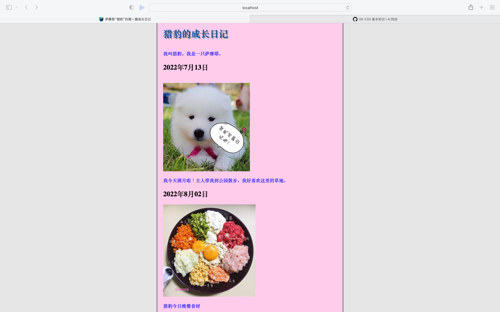

猜你可能并不喜欢粉萌的配色。

我们建议你在 CSS 文件中尝试不同的值。比如：为 `background-color` 添加其它的颜色或是改变 border 的粗细和颜色。

只要敢于尝试，你会发现你的每次更改都会使网页产生变化！

## 第5步 图片居中

网页中的图片向左对齐显得拘谨。

使用以下 CSS 样式，将帮助网页的图片居中显示;

```css
img {
    display: block;
    margin: 0 auto;
}
```

注意:

- `` 是内联元素，为了赋予它也具有块级元素更改外边距和其它间距的值的行为，我们必须使用 `display:block`

如果你在 `index.html` 文件中引用了以上 CSS 的样式, 原本向左对齐的图片都能居中显示了：

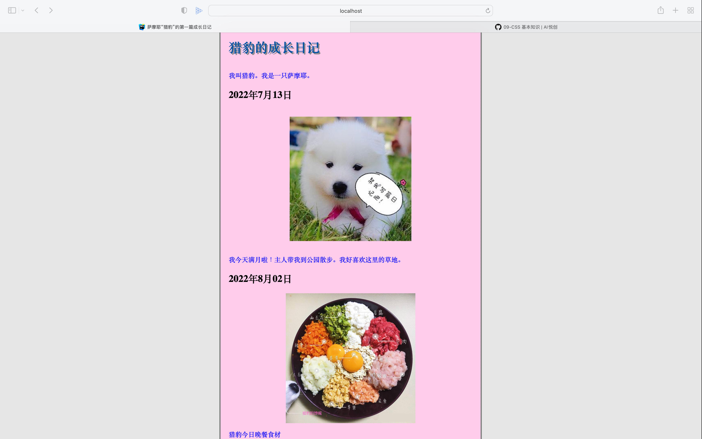

此刻，如果你的编译器中已存有 5 个 css 文件，说明你：

1. 掌握了更改字体颜色、背景颜色、添加文本阴影、文档体格式设置以及图片居中。

2. 已经入门 CSS 了！

尽管入门了 CSS，猎豹的网页看起来还不像那些明星网页那般吸引人，但它已经比仅使用 html 时更加丰富了。

接下来，我们将带领你入门 JS，JS 能使猎豹的成长日记与访问它的用户互动起来。

## 代码下载

<button name="button" style="color: black"><a href="https://bornforthis.cn/web_runing/data/base_09/base_09.zip" target="_blank">代码下载</a></button>


::: details 公众号：AI悦创【二维码】


:::

::: info AI悦创·编程一对一

AI悦创·推出辅导班啦，包括「Python 语言辅导班、C++ 辅导班、java 辅导班、算法/数据结构辅导班、少儿编程、pygame 游戏开发」，全部都是一对一教学：一对一辅导 + 一对一答疑 + 布置作业 + 项目实践等。当然，还有线下线上摄影课程、Photoshop、Premiere 一对一教学、QQ、微信在线，随时响应！微信：Jiabcdefh

C++ 信息奥赛题解，长期更新！长期招收一对一中小学信息奥赛集训，莆田、厦门地区有机会线下上门，其他地区线上。微信：Jiabcdefh

方法一：[QQ](http://wpa.qq.com/msgrd?v=3&uin=1432803776&site=qq&menu=yes)

方法二：微信：Jiabcdefh

:::


