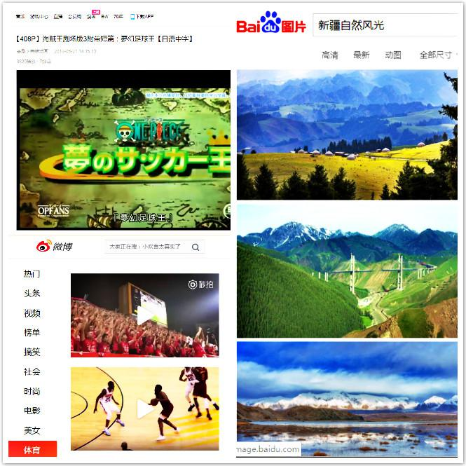
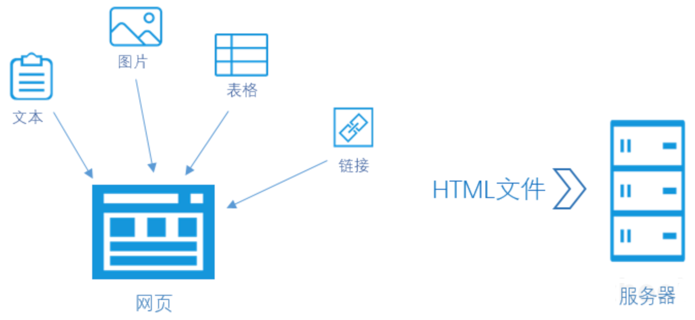
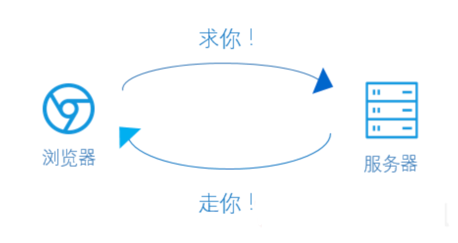

## Web 是谁？它做什么工作？

你好，我是悦创。

**Web 即 World Wide Web，全球广域网也是万维网的简称。**

换句话说，Web 就是通过使用浏览器访问的各种资源。

这些资源包括文本、图片、表格、链接、音频、视频等。

当你上网浏览微博，在百度上搜索图片，上 B 站看海贼王漫画连载......都是 Web 提供的技术支持。

如果 Web 网页编写得足够好，它甚至还能在手机上、网络电视上流畅显示。

【判断题】Web 是万维网的缩写。

- [ ] 正确
- [x] 错误

> Web 不是万维网的缩写，Web 是万维网（World Wide Web）的简称。

【多选题】以下哪些是 Web 的工作？

- [x] Web 为我们浏览网页资源提供了技术支持。
- [ ] Web 是专为个人电脑（PC）浏览器服务。
- [x] Web 为我们用手机查看资源提供了技术支持。

> Web 能为个人电脑浏览器，移动设备浏览器、网络电视浏览器、语音浏览器提供技术支持。

## Web 怎么工作？

**我们在上网时看到的视音频、图文资源是以文件的形式存放在 Web 服务器上的。**

Web 服务器就像一台 7X24 小时持续作业的计算机，它为我们顺利上网而辛勤工作。

Web 服务器上的文件并不是随意堆放的。网页制作人在发布网站前，已把各类资源进行规范分类和命名——图片归入图片文件夹；样式归入样式文件夹；脚本归入脚本文件夹......

**文件夹之间是通过超文本标记语言（HTML）等建立联系的。**

各类资源之间建立了规范而合理的联系后，它们需要与服务器建立联系。

当我们使用浏览器访问网页时，**网页浏览器就会向服务器发出请求。**

**服务器收到请求后**，**只要它能在文件中找得到对应的资源，服务器都会把资源发送给浏览器。**

网页文件的规范联系，浏览器的合理请求，服务器的正常运作使我们能够顺利在网上找到想要的资源。

这就是 Web 的工作。

**Web 的工作过程：**

1. 用户在浏览器点击资源并向服务器发出请求。
2. 服务器收到请求。
3. 服务器查找资源。
4. 服务器返回资源给浏览器。
5. 用户浏览想看的资源。

## Web 文件路径

为了使服务器快速地响应浏览器的请求，**Web 文件需要给服务器提供明确的路径。**

**什么是 Web 文件路径呢？**

举个例子。

你请求室友帮你在衣柜里找一枚黑色领带夹。为了快速的响应你的需求，舍友反问你：那枚领带夹在哪儿？

你说：黑色领带夹在我的衣柜右边的第二个抽屉的蓝色盒子里。

“我的衣柜右边/第二个抽屉/蓝色盒子”是指引舍友帮你找到领带夹的路径。

同理，

当你访问 [bornforthis.cn](bornforthis.cn) 的网页，想查找一张猫头鹰图片。你的浏览器向 Bornforthis 服务器发起了请求。 

如果W3Cschool的网页没有将图片的路径写入文件，服务器就无法响应你的请求。

​          **Before: 没有图片路径**     

::: details 公众号：AI悦创【二维码】

:::

::: info AI悦创·编程一对一

AI悦创·推出辅导班啦，包括「Python 语言辅导班、C++ 辅导班、java 辅导班、算法/数据结构辅导班、少儿编程、pygame 游戏开发」，全部都是一对一教学：一对一辅导 + 一对一答疑 + 布置作业 + 项目实践等。当然，还有线下线上摄影课程、Photoshop、Premiere 一对一教学、QQ、微信在线，随时响应！微信：Jiabcdefh

C++ 信息奥赛题解，长期更新！长期招收一对一中小学信息奥赛集训，莆田、厦门地区有机会线下上门，其他地区线上。微信：Jiabcdefh

方法一：[QQ](http://wpa.qq.com/msgrd?v=3&uin=1432803776&site=qq&menu=yes)

方法二：微信：Jiabcdefh

:::

