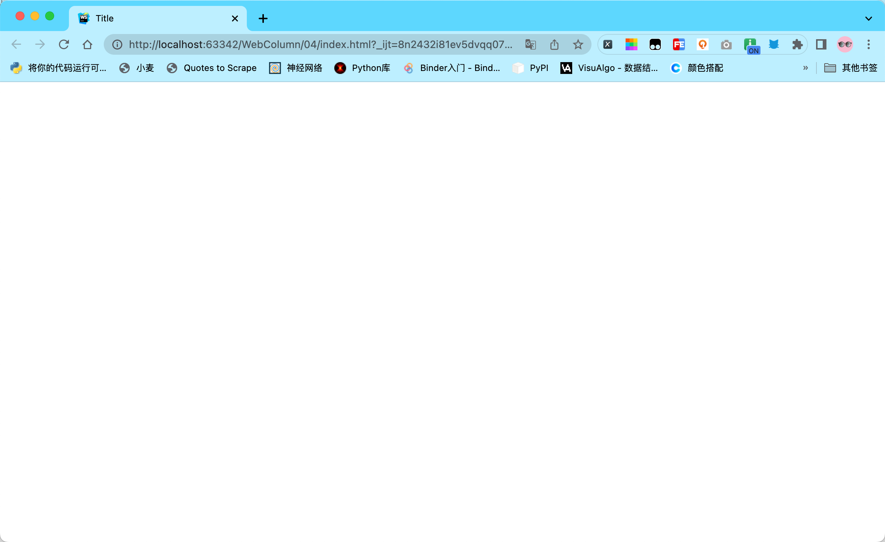

## HTML 是谁？它做什么工作？

HTML 不是一门编程语言，而是一种用来告知浏览器如何组织网页的**标记语言**。

> HTML 称为超文本标记语言，是一种标识性的语言。它包括一系列标签．通过这些标签可以将网络上的文档格式统一，使分散的 Internet 资源连接为一个逻辑整体。HTML 文本是由 HTML 命令组成的描述性文本，HTML 命令可以说明文字，图形、动画、声音、表格、链接等。

HTML **由一系列的元素组成**，这些元素用于组成网页上的模块。如果把网页比喻成房子，网页中使用的元素就像造房子时使用的一块块砖（原材料）。如下面的代码块由 `<head>` 元素，`<title>` 元素共同构成了网页的头部模块。

```html
<!DOCTYPE html>
<html lang="en">
<head>
    <meta charset="UTF-8">
    <title>Title</title>
</head>
<body>

</body>
</html>
```

**注意：** 以上代码块中的 `<meta charset ="utf-8">` 并不会出现在网页的头部。它是编码格式，它告诉告诉浏览器用什么方式打开代码。

头部的效果：



## 学习 HTML 的重点

学习 HTML 把握 2 个重点：**标签和属性。**

HTML 的标签大约几十个。每个标签有几个属性。在初学阶段，你不需要将它全部记下来。你只需记住最常用的十几个即可。

当你在实践中，遇到生疏的标签或属性时，请查阅 `w3cschool.cn` 的手册：[https://www.w3cschool.cn/htmltags/html-reference.html](https://www.w3cschool.cn/htmltags/html-reference.html)

对照列表中的例子用起来就能解决实际的问题了。

【单选题】以下关于 HTML 描述准确的是？

- [ ] HTML 是超文本标记语言，超文本标记语言是入门级的编程语言。
- [x] HTML 是由一系列元素构成的超文本标记语言。
- [ ] HTML是由一系列元素构成的编程语言。

## HTML 的元素构成及属性

HTML 的元素构成如图：


::: details 公众号：AI悦创【二维码】


:::

::: info AI悦创·编程一对一

AI悦创·推出辅导班啦，包括「Python 语言辅导班、C++ 辅导班、java 辅导班、算法/数据结构辅导班、少儿编程、pygame 游戏开发」，全部都是一对一教学：一对一辅导 + 一对一答疑 + 布置作业 + 项目实践等。当然，还有线下线上摄影课程、Photoshop、Premiere 一对一教学、QQ、微信在线，随时响应！微信：Jiabcdefh

C++ 信息奥赛题解，长期更新！长期招收一对一中小学信息奥赛集训，莆田、厦门地区有机会线下上门，其他地区线上。微信：Jiabcdefh

方法一：[QQ](http://wpa.qq.com/msgrd?v=3&uin=1432803776&site=qq&menu=yes)

方法二：微信：Jiabcdefh

:::


